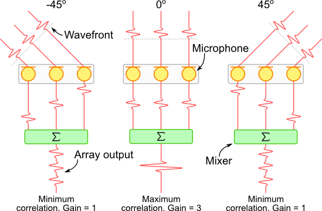

# 基于到达角的定位算法

基于信号到达角度（Angle of Arrival，AoA）的定位算法是一种常见的无线定位算法，在很多前沿的研究工作中也都可以看到。
计算到达角听起来很复杂，很多人都没有直接实践的经历，缺乏一个直接的体会。
AoA的核心思想是通过硬件设备感知其他设备发送信号的到达角度，计算接收节点和发送节点的相对方向，通常来说主要依赖的是多天线阵列（Antenna Array）。基于AoA计算的角度，然后可以利用三角测量法等方式计算出位置未知的节点的位置。雷达技术和最近的物联网前沿定位感知技术等，都用到了AoA算法。

本部分就通过原理和实际代码的实现，展示AoA的基本方法。
在后面的部分中，我们还会展示如何利用实际的声波信号和多麦克风阵列实现AoA算法，真实的计算出角度。


## 获取到达角

获取到达角通常需要使用阵列技术进行。
如下图所示，在多天线阵列中，对于不同的角度进来的信号，各个天线上收到信号的会存在一个时间差，这个时延就对应到了信号的到达角，这也是AoA算法的基本思路。
所以核心问题就是如何计算到达不同天线上信号的时间差。
- 我们可以使用信号时延估计的方法对阵列接收到的信号时延进行确定，结合信号的传播速度及阵列的几何分布即可获取到达角信息。
- 我们也可以使用波束成形技术，对不同方向的信号进行加强，检测不同方向上的信号强度信息来对到达角进行确定。

这些算法大家在平时可能都听得很多，但是不一定实现过。这一章和后面的几章里面我们将会带大家一起实现。

**基于延迟求和的波束成形算法**

对于离散信号而言，通过基于延迟求和的波束成形算法对来波方向进行计算是较为简单直接的方式。

<center>
    
    <br>
    <div style="color:orange; border-bottom: 1px solid #d9d9d9;
    display: inline-block;
    color: #999;
    padding: 2px;">图. 阵列几何形状对于不同方向信号增益的差异性 图片来源:<a href="#refer-1">[1]</a></div>
</center>

对于上图所示的三麦克风阵列系统而言，如果在其三个麦克风的后端添加了一个求和模块，对于来自不同方向的声波，其增益是不同的。从图中所示的例子来看，对于来自-45°和45°的声波，其增益均为1。然而对于来自0°的声波、其信号增益为3。使用这样的原理，我们就可以对每个麦克风接收到的离散的信号添加不同的延时值，使其在不改变阵列物理形状的条件下，对来自特定方向的声波信号进行增强。

<center>
    
    <br>
    <div style="color:orange; border-bottom: 1px solid #d9d9d9;
    display: inline-block;
    color: #999;
    padding: 2px;">图. 延迟求和的波束成形 图片来源:<a href="#refer-1">[1]</a></div>
</center>
**基于SRP的波束成形方法**

可控波束响应（Steered-Response Power,SRP）是一种波束成形算法[[2]](#refer-2)，而通过延迟求和的波束成形器，它可以加强来自任意方向上的信号。在三维定位场景中，SRP算法通过遍历搜索空间中的点，得到该点（潜在的声源点）与麦克风阵列之间的TDoA，再对信号进行延迟求和。遍历空间中的所有点后，SRP算法把输出声音能量最大的点作为估计的声源。

SRP算法的主要原理如下:

假设系统中有$M$个麦克风，序号$m\in \{1,...,M\}$，离散时间信号为$s_m(n)$
，对于空间点$x=[x,y,z]^T$，此处的可控响应功率（SRP）为

$$
P(x) = \frac{1}{2\pi}\sum_{m_1=1}^M \sum_{m_2=1}^M 
\int_{-\pi}^{\pi}
S_{m_1}(e^{j\omega})S_{m_2}^*(e^{j\omega})e^{j\omega\tau_{m1,m2}(x)} d\omega
$$


其中$S_{m}(e^{j\omega})$是经过傅里叶变换的信号，$\tau_{m1,m2}(x)$是点$x$相对$m_1$和$m_2$的TDoA

$$
    \tau_{m1,m2}(x) = \lfloor f_s \frac{|{x-x_{m_1}}|-|{x-x_{m_2}|}}{c} \rceil
$$

与广义互相关算法类似，空间$g$中功率最大的点即为估计的声源位置。
$$
\hat{x}_s = \argmax_{x\in g}P(x)
$$

**经过相位变换的可控波束响应SRP**

SRP算法对于混响和噪声环境的鲁棒性不强，DiBiase等人提出了将相位变换应用到SRP算法上的改进方法SRP-PHAT（Steered-Response Power Phase Transform），较大的提高了其在混响和噪声环境的表现。

其主要思想与之前的GCC-PHAT算法类似，都是在频域上引入加权函数$\Phi_{m_1,m_2}(e^{j\omega})$，对信号的频谱进行白化处理。

$$
P(x) = \frac{1}{2\pi}\sum_{m_1=1}^M \sum_{m_2=1}^M 
\int_{-\pi}^{\pi}
\Phi_{m_1,m_2}(e^{j\omega})S_{m_1}(e^{j\omega})S_{m_2}^*(e^{j\omega})e^{j\omega\tau_{m1,m2}(x)} d\omega
$$

$$
\Phi_{m_1,m_2}(e^{j\omega}) = \frac{1}{|{S_{m_1}(e^{j\omega})S_{m_2}^*(e^{j\omega})|}}
$$

SRP-PHAT在实际应用中仍然存在着一些问题，例如若需要达到较高的精确度，空间中执行波束成形搜索点数是巨大的，需要耗费巨大的计算资源，这导致了在一些设备上通过SRP算法难以达到实时定位的问题。

## 根据到达角进行定位

<center>
    
    <br>
    <div style="color:orange; border-bottom: 1px solid #d9d9d9;
    display: inline-block;
    color: #999;
    padding: 2px;">图. 到达角定位原理</div>
</center>


如上图所示，基站（BS）的位置已知，基站发送的信号到达两个被定位节点的到达角度分别为$\alpha1$和$\alpha 2$。以基站为端点，两个到达角度为方向角的两条射线相交于接收节点，计算两条射线的交点即为被测节点的位置。

将基站BS1的坐标记作$(x_1,y_1)$，BS2的坐标记作$(x_2,y_2)$，被测节点坐标为$(x,y)$。

假设$\alpha_1$和$\alpha_2$均不为$90°$，则两射线的直线方程分别为 $y-y_1=k_1(x-x_1)$，$y-y_2=k_2(x-x_2)$，其中$k_1=\tan(\alpha_1)$，$k_2=\tan(\alpha_2)$

求解两条射线的交点坐标：

$$
\left\{
\begin{aligned}
y-y_1=k_1(x-x_1) \\
y-y_2=k_2(x-x_2)
\end{aligned}
\right.
$$

解得

$$
\left
\{\begin{aligned}
&x=\frac{k_1x_1-k_2x_2-y_1+y_2}{k_1-k_2} \\
&y=\frac{k_1k_2(x_1-x_2)-k_2y_1+k_1y_2}{k_1-k_2}
\end{aligned}
\right.
$$

假设基站BS1的坐标为$(0,0)$，BS2的坐标为$(1,0)$，$\alpha_1=30°$，$\alpha_2=120°$，求被定位节点的代码如下（res\AoA_simulation.m）

```matlab
x1=0;y1=0;x2=1;y2=0;
alpha_1=30;alpha_2=120;
k1=tan(alpha_1/180*pi);k2=tan(alpha_2/180*pi);

x=(k1*x1-k2*x2-y1+y2)/(k1-k2)
y=(k1*k2*(x1-x2)-k2*y1+k1*y2)/(k1-k2)
```

结果为

```matlab
x = 0.7500
y = 0.4330
```

$(x,y)=(0.75,0.433)$即为被定为节点的位置。

若$\alpha_1$或$\alpha_2$为$90°$时，两射线方程为$x=x_1$或$x=x_2$，和另一射线联立即可求得被测节点位置。

## 参考文献
- [1] [Delay Sum Beamforming](http://www.labbookpages.co.uk/audio/beamforming/delaySum.html)<div id="refer-1"></div>
- [2] [Wikipedia: Steered-Response Power Phase Transform](https://en.wikipedia.org/wiki/Steered-Response_Power_Phase_Transform)<div id="refer-2"></div>