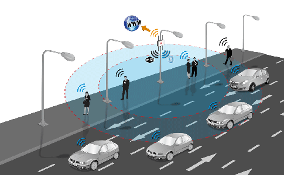

# 可见光无线通信
随着物联网设备的发展，越来越多的设备具备感知光强的能力（如配备了光传感器，或者具备相机等），这些传感器在完成他们基本功能的同时，还能够被用来作为通信的功能。

使用光来进行通信并不是新的事情，光纤通信已经早就广泛应用了。
物联网中的可见光通信更多的是指利用物联网设备上常见的可见光感知设备（传感器、相机）和产生设备（屏幕和LED光源等），实现信息传输的目的。大家可以想一下，我们平时扫二维码的过程就是一个典型的可见光通信的过程，手机相机拍下二维码，然后解析二维码中的信息实现两个手机之间信息传输的目的。很明显这种可见光的传输方式一个最大的优势就是无需双方事先建立任何连接，而且连接的方式是用户可知可直接控制的，所以二维码现在的使用非常广泛。在此基础上，现在也有很多利用屏幕和相机进行通信的研究工作，研究如何利用屏幕和相机实现两个设备间高效的数据传输。

可见光通信中另外一个比较热门的概念是Li-Fi（Light Fidelity），利用可见光来进行通信的方法，这个词跟Wi-Fi类似，知识将Wi（wireless）转化为了Li（Light）。例如可以利用LED光源实现数据传输，由于LED灯可以被高速调制，可通过肉眼不可察的高速明暗闪烁信号传输信息，例如LED开表示1，关表示0，但电子接收器或移动设备可以读取信号，甚至可以把信号返回房间天花板上的信号收发器，这就是LED灯能够在正常照明显示的同时，作为通信光源实现可见光泛在高速通信的根本原因。

图. Li-Fi应用设想

<!-- 图9 Li-Fi应用设想 -->

相比与传统的WiFi技术，Li-Fi技术也有其特点。
人类生产生活区域一直被光源所覆盖。利用无处不在的光源来实现数据传输，让人们可以享受无处不在的网络服务。通过给LED灯泡植入一个微小的芯片形成类似Wi-Fi热点的设备，使该灯泡照亮的区域内的终端设备能够随时接入网络。如果能够将全世界的电灯泡全部改造成Li-Fi热点，那么任何路灯都可以成为互联网接入点。
Li-Fi的产生并不是为了替代Wi-Fi，而是作为有效的补充手段——用于对射频无线通信敏感的场合，比如机舱、矿井、核电站和电磁干扰敏感的医疗设备工作区域。飞机在飞行期间不允许使用手机，因为手机发出的无线信号会干扰飞行员与机场塔台之间的无线电通信。而Li-Fi是可见光通信，并不会出现这样的问题，只要将座位上方的LED阅读灯改造为Li-Fi热点，那么不仅可以在飞机上打电话，还可以上网。

可见光通信还可以应用于智能交通系统，在夜晚行车，驾驶员的视野受限，对于路况观测的不及时就会造成严重的交通事故。而通过路灯、车灯，基于Li-Fi技术可能实现车与车、车与交通灯、车与路灯之间的通信，给驾驶员提供实时的交通路况信息，避免碰撞，保障安全驾驶。

Li-Fi利用可见光进行通信，具有以下优点：

- 丰富的频谱资源：
可见光的频谱宽度可达到射频频谱的1万倍，丰富的频谱资源使Li-Fi能够利用更宽的频谱实现更高的传输数据率，提升网络速度。
- 低成本：
LED灯泡较专用的Wi-Fi热点是非常廉价的，并且是人类生产生活的必需品，具有泛在性，几乎不需要额外的基础设施建设，部署、使用成本非常低。
- 安全性：
Li-Fi由于可见光具有可遮挡性，无法穿墙，因此便于将信号限定在一定区域内，产生物理隔离，具有安全性。
- 无电磁干扰
许多精密仪器对电磁干扰敏感，而Li-Fi并不使用无线电波，所以不会受到电磁干扰的限制，可以广泛应用于不适于射频无线通信的场合。

但是作为一种新兴的无线通信技术，Li-Fi还有一些亟待解决的问题:

- 易被遮挡：
可见光通信非常容易被遮挡，导致信号中断，可靠性有待提升。
- 光源间断问题：
虽然电灯泡在人类生产生活空间普遍存在，但是当有自然光存在时，电灯并不会打开，通信无法进行。
- 移动场景：
单一LED设备覆盖范围有限，当终端设备移动时，需要频繁切换Li-Fi热点，容易导致丢失连接。
- 环境干扰：
环境光源有可能对可见光通信造成影响。
- 用户友好的反向通信：
从Li-Fi热点到终端设备使用可见光是非常自然的。但是如何用户友好地让终端设备与热点通信是值得思考的问题。
相信没有人愿意在使用手机时还要忍受手机LED灯光照射自己的眼睛。

Li-Fi 作为一项前沿技术，其泛在性和频谱丰富性使之具有广泛的发展空间。但作为一种新的无线通信技术，仍旧处在发展初期，还需要更多的研究，催生出更为成熟的技术和产品，为人类带来更加舒适便捷的智能化生活。