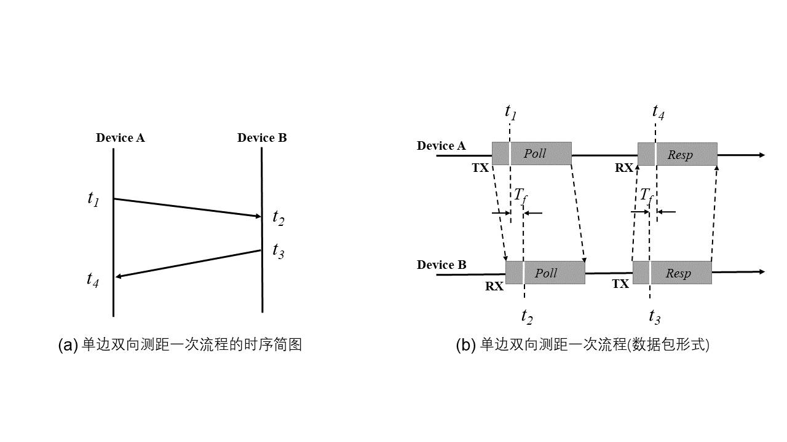
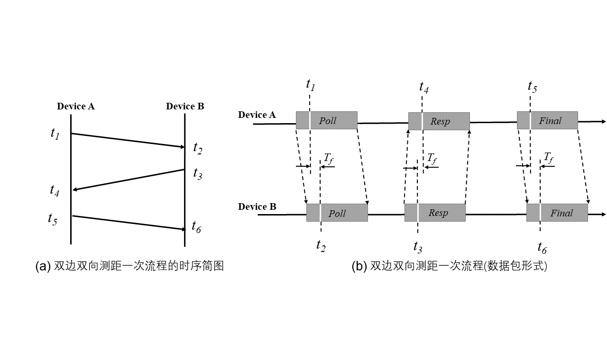

# 基于信号传播时间测距
基于信号强度的测距收到环境的影响很大，一般误差会比较大，也很少在真实系统中使用。在实际系统中，较为常用的时基于信号传播时间来进行测距。

信号传播时间或者叫飞行时间（ToF，Time of Flight），指信号在介质内传播时间。已知信号在介质中传播速度的情况下，使用飞行时间可以估算出信号经过的距离。

## ToF测距原理
这一部分我们来介绍常见的ToF的测量方法，大家在看到论文或者自己需要使用的时候可以作为参考。

### 同步测量方法

如果发送端和接收端的精确时间同步，从发送方发送一个数据包到达接收方，如果能够准确记录发送和接收时间的话，是可以精准测量信号飞行时间的。即在发送端和接收端时间同步的前提下，接收端就可以记录发送端在哪一时刻开始传输；随后，在收到信号的第一时间，接收端记录信号到达时刻的时间戳；最后，利用接收时间戳减去发送时刻即可得到信号飞行时间。
使用$d$表示发送端到接收端的距离，$c$表示信号的传播速度（例如声速），$t$表示测量得到的飞行时间，那么可以得到：

$$
d = c\times t
$$
但是这里面又两个非常重要的问题，第一个是发送端和接收端需要时间同步，第二就是能够准确测量发送和接收的时间，这两个问题是非常有挑战性的。
因此如何解决时钟同步问题，是飞行时间测距工作的一个重点，也是难点。传统网络工作中提出了多种网络时间同步机制，例如网络时间协议（Network Time Protocol, NTP），它也是互联网的时间同步机制。此外，全球定位系统（GPS）技术也能为不同设备提供全局时间同步，它的原理是在GPS卫星上运行一个高精度的铯原子钟，GPS客户机通过接收卫星发送的伪随机序列，实现与卫星时钟的同步。

现有的时间同步方法在实际使用中仍存在较大的局限性。例如NTP协议主要针对静态网络，并且需要频繁交换消息来不断校准时钟频率偏移带来的误差。此外，NTP协议毫秒级的精度无法满足高精度测距等应用场景的需求。GPS能达到纳秒级精度的同步，但GPS受环境遮挡影响大，只适用于室外空旷无遮挡的环境，无法适用于室内低功耗物联网节点。

基于传播时间测距，同步发送端和接收端时间存在困难，因此有方法提出将接收端和发送端整合到同一设备，从而在计算飞行时间时避免收发机的时间同步。

第一种方法是让测距对象作为反射体，直接反射传输的信号。这种方法要求反射体具有一定的体积，并且收发机能在全双工模式工作，即发送信号的同时能接收来自目标对象反射的信号。例如可以利用调频连续波(FMCW)作为发射信号来测量ToF。

第二种方法是利用两个设备分别作为发送端和接收端：发送端于时刻$𝑡_0$发送信号，接收端收到信号后，等待时间$\Delta 𝑡$后返回同样的波，发送端记录收到回复的时刻$𝑡_1$，从而得到距离：$𝑑=(𝑣(t_1-t_0-\Delta t))/2$。这种方法既不要求接收端和发送端时钟同步，也不需要设备具有全双工功能。

换句话说，大家可以仔细想一下，上述的过程中两个设备之间实际上通过了数据交换实现了同步的效果。但实际实现时，由于设备软硬件调度、延迟等不确定因素，接收端很难控制等待时间恰好为$\Delta t$，很难做到精准的时间控制，因此实际测得的距离也存在较大误差。

## 利用反射信号测量距离

调频连续波（Frequency Modulated Continuous Wave，FMCW）是一种在高精度雷达测距中使用的技术,FMCW是频率随着时间线性增长的信号。FMCW技术有很长的使用历史，使用范围非常广泛。近些年来，FMCW在物联网的定位和感知的场景里面使用很多。很多前沿的研究工作都是利用基于电磁波或者声波的FMCW信号来进行定位和感知的应用。
FMCW最直接的一个应用是利用反射信号与发射信号混频得到的频率偏移来进行ToF的测量。

如下图实线所示，FMCW雷达将信号调制为一种特制的FMCW信号（回顾一下在LoRa一章我们学过的技术，以及其中使用到的LoRa chirp信号），其频率周期性地随时间递增（从$f_{min}$到$f_{max}$）或递减（从$f_{max}$到$f_{min}$）。一个频率变换周期为$T$的递增FMCW信号$R(t)$可以表示为：

$$
R(t) = \cos\left(2\pi\left(f_{min} + \frac{B}{2T}t\right)t\right)
$$

其中$B=f_{max}– f_{min}$表示频率变化的带宽。 

图. FMCW信号

FMCW雷达在扫频周期内发射频率变化的连续波，发射出去的信号被物体反射后的回波与发射信号叠加在一起被接收到。实际收到的信号会呈现上图的特点，反射信号与发射信号存在着时间差。这个时间差在实际系统中难以直接精确地测量出来（虽然也有一些研究工作试图这么来做）。为了解决这一问题，这个时间差可以转化为对应的频率差，通过测量频率差可以获得目标与雷达之间的距离信息，这也是FMCW好用的主要原因。

差频信号频率较低，与距离相关，一般为KHz量级，因此硬件处理相对简单、适合数据采集并进行数字信号处理。因此该方法具有容易实现、结构相对简单、尺寸小、重量轻以及成本低等优点，有广泛的应用前景。

由于反射回来的信号和原始信号的频率差值$\Delta f$，和信号的传输时间$\Delta t$有线性变化关系，因此可以将对ToF的测量转换为对信号频率变化的测量。假设接收端和发送端之间的距离为$d$，因为传输时间$\Delta t$是往返的总时间，那么可以得到：

$$
d = \frac{c\Delta t}{2}
$$

同时，根据图中的三角函数关系，可以得到：

$$
\Delta t = \frac{T}{B}\Delta f
$$

结合上面的两个式子，可以计算出距离$d$为：

$$
d = \frac{cT}{2B}\Delta f
$$

那么如何来实现频率差的计算呢？大家可以回忆一下LoRa的解码过程，其中需要计算出信号的起始频率，实际上我们给定一个包含了多个FMCW信号的解码窗口，如果我们能够算出每个信号的起始频率，也就能算出两个信号的频率差了。

？？补充？
有了这个为基础后，我们可以使用手机模拟雷达，达到类似的效果。基于前面学习的知识，我们可以使用手机发送给定的信号，在这里使用手机发送FMCW信号，同时使用手机将反射信号录下来，然后对录下来的声音信号进一步做处理。

## 单边双向测距(Single-Sided Two-Way Ranging)

单边双向测距，即由单边发起的基于往返通信的测距方法。为了便于叙述，我们假定两个设备$A$和$B$。单边双向测距流程的时序简图及其数据包形式如下图所示：

图. 单边单向测距示意

如上图所示，通信由设备$A$发起。在$t_1$时刻，$A$发送$Poll$包给$B$，$B$在$t_2$时刻收到$Poll$包，然后在$t_3$时刻发送$Resp$包给$A$，最后$A$在$t_4$时刻收到$Resp$数据包。

这个方法计算ToF就很直观，也很容易理解，我们将测量到的ToF用$T_f$进行表示：

$$
T_f = \frac{(t_4-t_1)-(t_3-t_2)}{2} \tag{1}
$$

**误差分析**：我们假设误差来自于硬件的时钟漂移，因此我们对设备$A$，$B$的时钟进行如下建模[2]：

$$
\hat{t}_a=(1+e_a)t_a  {\quad} (a=1,4) \tag{2}
$$

$$
\hat{t}_b=(1+e_b)t_b  {\quad} (b=2,3) \tag{3}
$$

其中$e_a$, $e_b$分别为设备$A$，$B$的时钟误差。我们将$\hat{t}_a$, $\hat{t}_b$代入$T_f$，得到考虑时钟偏移后的结果：

$$
\hat{T}_f = \frac{(\hat{t}_4-\hat{t}_1)-(\hat{t}_3-\hat{t}_2)}{2}
$$

因此误差为：

$$
\begin{aligned}
err &= \hat{T}_f - T_f \\
     &= e_aT_f + \frac{t_3-t_2}{2}(e_a-e_b)
\end{aligned}
$$

不妨假设$T_f= 100 ns$, 则$t_3-t_2 \approx 1 ms$，设备的时钟漂移为$20ppm$，那么我们可以计算得到误差约为$20 ns$，对应$6m$的测距误差。从上面分析，我们可以知道单边双向测距方法的主要误差来自于两个设备时钟的漂移。双边双向测距就是在此基础上的一个改进。

## 双边双向测距(Double-Sided Two-way Ranging)
双边双向测距，在单边双向测距的基础上额外增加了一次数据传输。这里使用两个设备$A$和$B$来说明双边双向测距过程：

图. 双边双向测距示意

如图所示，设备$A$在$t_1$时刻向设备$B$发送$Poll$数据包，设备$B$在$t_2$时刻接收到，然后在$t_3$时刻返回$Resp$包，设备$A$在时刻$t_4$收到，这是一次单边双向测距流程。在此基础上，设备$A$再次在$t_5$时刻发送$Final$数据包给$B$，而设备$B$在$t_6$时刻收到$Final$数据。至此，双边双向测距流程结束。

同理，我们可以用如下的公式计算$ToF$：

$$
T_f=\frac{((t_4-t_1)-(t_3-t_2))+((t_6-t_3)-(t_5-t_4))}{4} \tag{4}
$$

**误差分析**：我们来看一下为什么这个方法的性能会比单边双向的测距方法要好。我们假设误差来自于硬件的时钟漂移，我们对设备$A$，$B$的时钟如下建模[2]：
$$
\hat{t}_a=(1+e_a)t_a  {\quad} (a=1,4,5) \tag{5}
$$

$$
\hat{t}_b=(1+e_b)t_b  {\quad} (b=2,3,6) \tag{6}
$$

其中$e_a$, $e_b$分别为设备$A$，$B$的时钟误差。我们将$\hat{t}_a,\hat{t}_b$代入$T_f$，得到考虑时钟偏移后的结果：

$$
\hat{T}_f=\frac{((\hat{t}_4-\hat{t}_1)-(\hat{t}_3-\hat{t}_2))+((\hat{t}_6-\hat{t}_3)-(\hat{t}_5-\hat{t}_4))}{4} \tag{7}
$$

因此误差可以计算得到

$$
\begin{aligned}
err &= \hat{T}_f - T_f \\
     &= \frac{1}{2}T_f(e_a + e_b) + \frac{1}{4}(e_a-e_b)((t_3-t_2)-(t_5-t_4))
\end{aligned}
$$

不妨假设$T_f= 100 ns$, 例如针对Decawave的DW1000芯片，$((t_3-t_2)-(t_5-t_4)) \in (0ns,8ns)$，取最坏的情况$8ns$，设备的时钟漂移为$20ppm$，那么可以计算得到误差约为$2 ps$，对应$0.6mm$的测距误差。可以看到，双边双向测距在理论上的精度远优于单边双向测距的方法。

另外，上面的计算方法依然受两个设备的时钟漂移影响，其实我们可以使用更加优化的算法，消去其中一个设备的时钟影响，这也是为什么我们说双边双向测距相当于在单边双向测距基础上做了时间同步。

### 利用波速差实现

在实际设备上，如果可以使用两种不同的信号的话，利用两种信号之间的波速差也可以进行测距。
例如我们可以令发送端同时发送一道电磁波和声波，然后在接收端记录电磁波的到达时刻$𝑡_𝑟$和声波的到达时刻$𝑡_𝑠$。则根据这两个不同的到达时刻，可以计算出发送端与接收端之间的距离：

$$
d = \frac{v_r\times v_s \times(t_s-t_r)}{v_r-v_s}
$$

由于$𝑣_𝑟=3\times 10^8 m/s$远大于$𝑣_𝑠=340m/s$，因此距离计算式可简化为：$𝑑=𝑣_𝑠\times (𝑡_𝑠-𝑡_𝑟)$

# 测距案例

实际系统中的测距大多数是基于上面的几个思路，在本书后面我们会展示多个系统测距的案例和实际代码，包括[基于声波的BeepBeep测距方法](https://iot-book.github.io/16_声波感知/S1_声波测距/)[1]和[WiFi的FTM(Fine Time Measurement)协议](https://iot-book.github.io/17_WiFi感知/S3_案例：WiFI ToF测距/)[3]。

## 参考文献

[1] Peng, Chunyi & Shen, Guobin & Zhang, Yongguang & Li, Yanlin & Tan, Kun. (2007). BeepBeep: A high accuracy acoustic ranging system using COTS mobile devices. SenSys. 1-14. 10.1145/1322263.1322265. 

[2] Dries Neirynck, Eric Luk, and Michael McLaughlin. 2016. An alternative doublesided
two-way ranging method. In 2016 13th workshop on positioning, navigation
and communications (WPNC). IEEE, 1–4.

[3] "IEEE Standard for Information technology–Telecommunications and information
exchange between systems Local and metropolitan area networks–Specific
requirements - Part 11: Wireless LAN Medium Access Control (MAC) and Physical
Layer (PHY) Specifications". "IEEE Std 802.11-2016 (Revision of IEEE Std
802.11-2012)", pages 1–3534, Dec 2016.

[4] Linsong Cheng, Zhao Wang, Yunting Zhang, Weiyi Wang, Weimin Xu, Jiliang Wang. "Towards Single Source based Acoustic Localization", IEEE INFOCOM 2020.

[5] Yunting Zhang, Jiliang Wang, Weiyi Wang, Zhao Wang, Yunhao Liu. "Vernier: Accurate and Fast Acoustic Motion Tracking Using Mobile Devices", IEEE INFOCOM 2018.