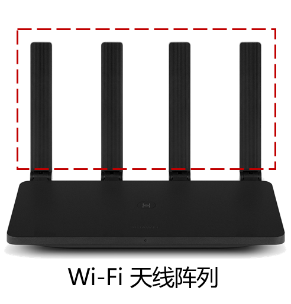
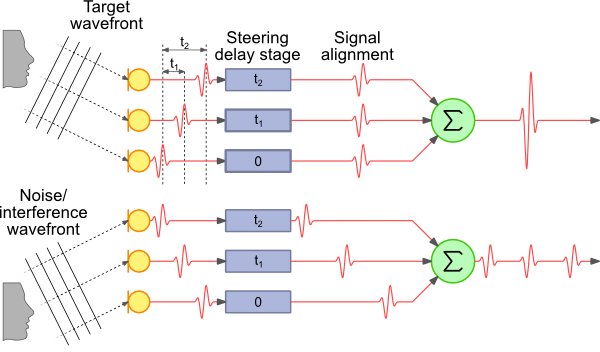

# AOA定位算法

基于信号到达角度（Angle of Arrival，AoA）的定位算法是一种常见的无线定位算法，这也是在实际系统中使用最多的定位算法之一，在很多前沿的研究工作中也都可以看到。计算到达角听起来很复杂，很多人都没有直接实践的经历，缺乏一个直接的体会。核心思想是通过硬件设备感知其他设备发送信号的到达角度，计算接收节点和发送节点的相对方向，通常来说主要依赖的是多天线阵列（Antenna Array）。下图为一个线性的WiFi天线阵列。基于多个AoA角度，然后可以利用三角测量法等方式计算出位置未知的节点的位置。雷达技术和最近的物联网前沿定位感知技术等，很多都使用到了AoA算法。

<center>
    
    <br>
    <div style="color:orange; border-bottom: 1px solid #d9d9d9;
    display: inline-block;
    color: #999;
    padding: 2px;">图. WIFI天线阵列</a></div>
</center>

本部分就通过原理和实际代码的实现展示AoA的基本方法。在后面的[“声波感知”章节](https://iot-book.github.io/16_声波感知/S2_声波定位)，我们还会展示如何利用实际的声波信号和多麦克风阵列实现AoA算法，真实地计算出信道到达角度。

## 获取到达角的方法

获取到达角通常需要使用天线阵列技术进行。如下图所示，在多天线阵列中，对于从不同角度到达天线阵列的信号，各个天线上收到信号的会存在一个时间差，这个时间差就对应到了信号的到达角，这也是AoA算法的基本思路。所以AoA核心问题就是如何计算到达不同天线上信号的时间差。这个问题说复杂也复杂，说简单也简单，基本原理简单，要做好是很不容易的。

常见的计算不同天线上信号到达时间差的方法有：

- 使用信号时延估计例如相关性的方法对阵列接收到的信号时延进行确定，结合信号的传播速度及阵列的几何分布即可获取到达角信息。详见[“声波感知”章节](https://iot-book.github.io/16_声波感知/S2_声波定位)。
- 使用多信号分类（Multiple Signal Classification，**MUSIC**）算法。
- 使用波束成形技术，也就是大家常常听说的 **Beamforming** ，对不同方向的信号进行加强，检测不同方向上的信号强度信息来对到达角进行确定。

这些算法大家在平时可能都听得很多，但是不一定实现过。这一章和后面的几章里面我们将会带大家一起实现。

<center>
    
    <br>
    <div style="color:orange; border-bottom: 1px solid #d9d9d9;
    display: inline-block;
    color: #999;
    padding: 2px;">图. 阵列几何形状对于不同方向信号增益的差异性 图片来源:<a href="#refer-1">[1]</a></div>
</center>
## MUSIC算法

多信号分类算法(Multiple Signal classification, MUSIC) 是一个非常常用的可以实现AoA定位的方法。

？？杨子江分析部分加上。

基本思想为将任意阵列输出数据的协方差矩阵进行特征分解，从而得到与信号分量相对应的信号子空间和信号分量相正交的噪声子空间，然后利用这两个子空间的正交性来估计信号的参数(入射方向、极化信息和信号强度)。MUSIC算法是一种基于子空间分解的算法，它利用信号子空间和噪声子空间的正交性，构建空间谱函数，通过谱峰搜索，估计信号的参数。

假设有一个有$N$个天线的等距线性阵列，天线间距为$d$，信号的波长为$\lambda$，空间中有$r$个信源，接收到的信号可以表示为
$$
X\left(t\right)=\sum_{i=1}^{r}{s_i\left(t\right)a\left(\theta_i\right)}+N\left(t\right)
$$
其中，$s_i(t)$是第$i$个信源的信号，$\theta_i$是空间中第$i$个信号的入射角度，$A(\theta_i)$可表示为
$$
a\left(\theta_i\right)=\left[1,e^\frac{j2\pi dsin\left(\theta_i\right)}{\lambda},\ldots,e^\frac{j2\pi\left(N-1\right)dsin\left(\theta_i\right)}{\lambda}\ \right]^T
$$
接收到的信号可以表示为
$$
X\left(t\right)=AS\left(t\right)+N\left(t\right)
$$
其中$A=[a\left(\theta_1\right),a\left(\theta_2\right),\ldots,a(\theta_r)]$，$S(t)=\left[s_1\left(t\right),s_2\left(t\right),\ldots,s_r\left(t\right)\right]^T$

$X\left(t\right)$的协方差矩阵为
$$
R_X=E\left[XX^H\right]
$$
其中$X^H$表示$X$的共轭转置。假设噪声信号是互不相关且均值为0的白噪声，可以得到
$$
R_X=E\left[\left(AS+N\right)\left(AS+N\right)^H\right]=AE\left[{SS}^H\right]A^H+E\left[NN^H\right]={AR}_SA^H+R_N
$$
其中$R_S=E[SS^H]$为信号相关矩阵，$R_N=\sigma^2I$为噪声相关矩阵，噪声功率为$\sigma^2$。

对阵列的协方差矩阵进行特征值分解，首先考虑无噪声的情况。对于矩阵$A$，只要空间中的$r$个信号的入射角度不同，且$N>r$，则$A$的各列相互独立，$AR_SA^H$的秩为$r$，由于$R_S^H$=$R_S$，且$R_S$正定，因此${AR}_SA^H$半正定，有$r$个正特征值和$N-r$个零特征值。

若存在噪声，$R_X=AR_XA^H+\sigma\ I^2$，由于$\sigma>0$，$R_X$满秩，有$N$个正实特征值，与信号有关的特征值有$r$个，等于${AR}_SA^H$的$r$个特征值与$\sigma^2$的和，另外$N-r$个最小的特征值$\sigma^2$为噪声对应的特征值。

假设噪声对应的特征值为$\lambda_i=\sigma^2$，对应的特征向量为$v_i$，则
$$
R_Xv_i=\lambda_iv_i=\sigma^2v_i=\left(AR_SA^H+\sigma^2I\right)v_i
$$
因此
$$
{AR}_SA^Hv_i=0
$$
等式两边同乘$R_S^{-1}\left(A^HA\right)^{-1}A^H$，有
$$
A^Hv_i=0,\ i=r+1,\ldots,N
$$
因此，选取特征值最小的$N-r$个特征向量，组成噪声矩阵$E_n$
$$
E_n=[v_{r+1},v_{r+2},{\ldots,v}_N]
$$
定义空间谱
$$
P_{mu}\left(\theta\right)=\frac{1}{a^H\left(\theta\right)E_nE_n^Ha(\theta)}=\frac{1}{\left|\left|E_n^Ha\left(\theta\right)\right|\right|^2}
$$
对$\theta$进行搜索，令$P_{mu}\left(\theta\right)$取得峰值的角度即为信源的方向。

## 波束成形算法

使用波束成形方法可以利用天线阵列增强特定方向的信号，从而定向发送或接收信号。

### 基于延迟求和的波束成形算法

对于离散信号而言，通过基于延迟求和的波束成形算法对来波方向进行计算是较为简单直接的方式。

假设第$i$个天线接收到的信号为$x_i\left(t\right)$，对信号的到达角度$\theta$进行遍历，将不同天线接收到的信号添加与到达角度对应的时延$\tau_i(\theta)$后进行求和，得到信号
$$
x\left(\theta\right)=\sum_{i=1}^{n}{x_i(t-\tau_i\left(\theta\right))}
$$
比较求和得到的信号的强度大小，使求和得到的信号强度最大的方向即为信号的到达方向，即
$$
\theta_{AOA}=\text{argmax}_{\theta}{x(\theta)}
$$
对于上图所示的三个麦克风组成的阵列系统而言，如果在其三个麦克风的后端添加了一个求和模块，对于来自不同方向的声波，其增益是不同的。从图中所示的例子来看，对于来自-45°和45°的声波，其增益均为1。然而对于来自0°的声波、其信号增益为3。使用这样的原理，我们就可以对每个麦克风接收到的离散的信号添加不同的延时值，使其在不改变阵列物理形状的条件下，对来自特定方向的声波信号进行增强。

<center>
    
    <br>
    <div style="color:orange; border-bottom: 1px solid #d9d9d9;
    display: inline-block;
    color: #999;
    padding: 2px;">图. 延迟求和的波束成形 图片来源:<a href="#refer-1">[1]</a></div>
</center>

### 基于SRP的波束成形方法

可控波束响应（Steered-Response Power,SRP）是一种波束成形算法[[2]](#refer-2)，而通过延迟求和的波束成形器，它可以加强来自任意方向上的信号。在三维定位场景中，SRP算法通过遍历搜索空间中的点，得到该点（潜在的声源点）与麦克风阵列之间的TDoA，再对信号进行延迟求和。遍历空间中的所有点后，SRP算法把输出声音能量最大的点作为估计的声源。SRP算法的主要原理如下:

假设系统中有$M$个麦克风，序号$m\in \{1,...,M\}$，离散时间信号为$s_m(n)$，对于空间点$x=[x,y,z]^T$，此处的可控响应功率（SRP）为

$$
P(x) = \frac{1}{2\pi}\sum_{m_1=1}^M \sum_{m_2=1}^M 
\int_{-\pi}^{\pi}
S_{m_1}(e^{j\omega})S_{m_2}^*(e^{j\omega})e^{j\omega\tau_{m1,m2}(x)} d\omega
$$

其中$S_{m}(e^{j\omega})$是经过傅里叶变换的信号，$\tau_{m1,m2}(x)$是点$x$相对$m_1$和$m_2$的TDoA

$$
\tau_{m1,m2}(x) = \lfloor f_s \frac{|{x-x_{m_1}}|-|{x-x_{m_2}|}}{c} \rceil
$$

与广义互相关算法类似，空间$g$中功率最大的点即为估计的声源位置。

$$
\hat{x}_s = \text{argmax}_{x\in g}P(x)
$$
如果大家愿意进一步思考，就能够看出来这个计算过程跟计算相关性最大值基本上是差不多相同的。

### 经过相位变换的可控波束响应SRP

SRP算法对于混响和噪声环境的鲁棒性不强，DiBiase等人提出了将相位变换应用到SRP算法上的改进方法SRP-PHAT（Steered-Response Power Phase Transform），提高了其在混响和噪声环境的表现。其主要思想与之前的GCC-PHAT算法类似，都是在频域上引入加权函数$\Phi_{m_1,m_2}(e^{j\omega})$，对信号的频谱进行白化处理。

$$
P(x) = \frac{1}{2\pi}\sum_{m_1=1}^M \sum_{m_2=1}^M 
\int_{-\pi}^{\pi}
\Phi_{m_1,m_2}(e^{j\omega})S_{m_1}(e^{j\omega})S_{m_2}^*(e^{j\omega})e^{j\omega\tau_{m1,m2}(x)} d\omega
$$

$$
\Phi_{m_1,m_2}(e^{j\omega}) = \frac{1}{|{S_{m_1}(e^{j\omega})S_{m_2}^*(e^{j\omega})|}}
$$

SRP-PHAT在实际应用中仍然存在着一些问题，例如若需要达到较高的精确度，空间中执行波束成形搜索点数是巨大的，需要耗费巨大的计算资源，这导致了在一些设备上通过SRP算法难以达到实时定位的问题。

<!-- [TODO 加上一些更加直观的代码，有时间过来加] -->

## 根据到达角进行定位

<center>
    
    <br>
    <div style="color:orange; border-bottom: 1px solid #d9d9d9;
    display: inline-block;
    color: #999;
    padding: 2px;">图13-6. 到达角定位原理</div>
</center>


如图所示，基站（BS）的位置已知，基站发送的信号到达两个被定位节点的到达角度分别为$\alpha1$和$\alpha 2$。以基站为端点，两个到达角度为方向角的两条射线相交于接收节点，计算两条射线的交点即为被测节点的位置。

将基站BS1的坐标记作$(x_1,y_1)$，BS2的坐标记作$(x_2,y_2)$，被测节点坐标为$(x,y)$。

假设$\alpha_1$和$\alpha_2$均不为$90°$，则两射线的直线方程分别为 $y-y_1=k_1(x-x_1)$，$y-y_2=k_2(x-x_2)$，其中$k_1=\tan(\alpha_1)$，$k_2=\tan(\alpha_2)$

求解两条射线的交点坐标：

$$
\left\{
\begin{aligned}
y-y_1=k_1(x-x_1) \\
y-y_2=k_2(x-x_2)
\end{aligned}
\right.
$$

解得

$$
\left
\{\begin{aligned}
&x=\frac{k_1x_1-k_2x_2-y_1+y_2}{k_1-k_2} \\
&y=\frac{k_1k_2(x_1-x_2)-k_2y_1+k_1y_2}{k_1-k_2}
\end{aligned}
\right.
$$

假设基站BS1的坐标为$(0,0)$，BS2的坐标为$(1,0)$，$\alpha_1=30°$，$\alpha_2=120°$，求被定位节点的代码如下（res\AoA_simulation.m）

```matlab
x1=0;y1=0;x2=1;y2=0;
alpha_1=30;alpha_2=120;
k1=tan(alpha_1/180*pi);k2=tan(alpha_2/180*pi);

x=(k1*x1-k2*x2-y1+y2)/(k1-k2)
y=(k1*k2*(x1-x2)-k2*y1+k1*y2)/(k1-k2)
```

结果为

```matlab
x = 0.7500
y = 0.4330
```

$(x,y)=(0.75,0.433)$即为被定为节点的位置。

若$\alpha_1$或$\alpha_2$为$90°$时，两射线方程为$x=x_1$或$x=x_2$，和另一射线联立即可求得被测节点位置。

## 参考文献
- [1] [Delay Sum Beamforming](http://www.labbookpages.co.uk/audio/beamforming/delaySum.html)<div id="refer-1"></div>
- [2] [Wikipedia: Steered-Response Power Phase Transform](https://en.wikipedia.org/wiki/Steered-Response_Power_Phase_Transform)<div id="refer-2"></div>