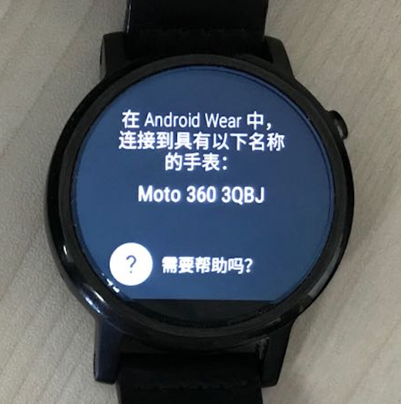
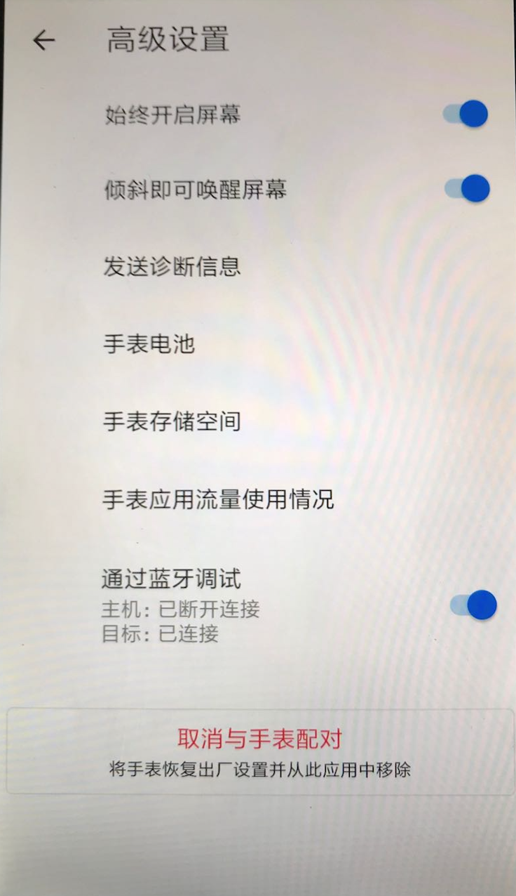
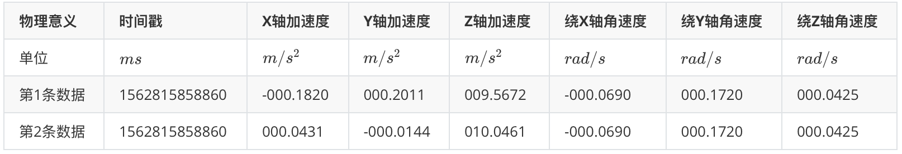

# 智能手表感知

## 智能手表连接教程

​		将 **非苹果系列智能手表** （例如Moto360，LG Sport，HUAWEI手表等）与 **安卓手机** 进行配对连接，并通过 **adb工具** （Android Debug Bridge，安卓调试桥）进一步与电脑连接，以实现下面两个功能：

1. 从智能手表向电脑传输数据（通过adb工具）
2. 从电脑向智能手表安装程序（通过Android Studio）

**工具准备**

1. 非苹果系列智能手表
2. 安卓手机，安装软件 **Wear OS by Google** ，在应用商店或浏览器中均可搜索到
3. adb工具，见`ADB/`文件夹，Windows操作系统的adb位于`ADB/Win`，Mac或Linux系统的adb位于`ADB/Mac`

**智能手表连接到手机**

​		注：以下连接教程以Moto 360手表连接到小米手机(MI 4LTE)为例。一般情况下，智能手表最多只能与一部智能手机连接，如果要与其他手机连接，必须断开与之前手机的连接。

1. 智能手表：如果智能手表之前曾与其他手机连接，则需先断开连接并恢复出厂设置。点击`设置(Settings)->系统(System)->断开连接并重置(Disconnect & reset)`，等待重启完成后，手表会进入匹配手机的页面；如果智能手表之前不曾与其他手机连接，则开机后直接进入匹配手机的页面：

<center>

</center>
<center>
<div style="color:orange; border-bottom: 1px solid #d9d9d9; display: inline-block;color: #999;padding: 2px;">图. 智能手表连接手机</div>
</center>

2. 智能手机：打开WiFi或数据连接以保证能够连接到互联网，打开蓝牙，打开`Wear OS`应用，（点击左上角）打开`添加新手表`，在下方出现的列表中选择待匹配手表并点击，完成匹配，如下图。若无法连接成功，可以采用以下几个方案：重新启动`Wear OS`应用；在手机`设置->蓝牙->已配对设备`中，如果之前曾与该手表进行过配对，则选择该手表并取消配对：

<center>

</center>
<center>
<div style="color:orange; border-bottom: 1px solid #d9d9d9; display: inline-block;color: #999;padding: 2px;">图. 手机匹配界面</div>
</center>

3. 智能手表：点击`设置(Settings)->系统(System)->关于(About)`，连续点击`版本号(Build number)`7次，则会在`设置(Settings)`菜单下出现`开发者选项(Developer options)`，点击`开发者选项(Developer options)`，打开`ADB调试(ADB Debugging)`和`通过蓝牙调试(Debug over Bluetooth)`

4. 智能手机：打开`Wear OS`应用，（在底部）点击`高级设置`，打开`通过蓝牙调试`，此时应该显示`主机：未连接；目标：已连接`，如图3。如果`目标`显示`未连接`，则重新启动`Wear OS`应用再查看：

<center>

</center>
<center>
<div style="color:orange; border-bottom: 1px solid #d9d9d9; display: inline-block;color: #999;padding: 2px;">图. 手机连接成功界面</div>
</center>

**智能手表连接到电脑**

1. 智能手机：通过USB连接线连接到电脑

2. 电脑：在电脑上打开命令行或终端，执行(Windows)`.\connect.ps1`或(Mac, Linux)`./connect`命令，此时智能手机`高级设置`中的`主机`应显示`已连接`，若有以下情况，进行对应操作：

    2.1 若出现`error: more than one device/emulator`，则执行`./adb kill-server`关闭已有的连接

    2.2 若出现`device not found`，在智能手机上，点击`设置->开发者选项->选择USB配置->仅限充电`，此时手机弹出在该电脑上的USB调试权限设定，设定权限后再执行(Windows)`.\connect.ps1`或(Mac, Linux)`./connect`命令

    2.3 若出现`This adb server's $ADB_VENDOR_KEYS is not set`，则找到(Windows)`C：Users/$Name/.android`或(Mac, Linux)`~/.android`文件夹，将文件夹中的`adbkey.pub,adbkey`删除，然后再执行(Windows)`.\connect.ps1`或(Mac, Linux)`./connect`命令

3. 智能手表：主机连接成功后，手表上会出现'是否允许在该PC上进行调试'，选择'总是允许'
4. 电脑：Android Studio可以找到智能手表并可以安装程序
5. 智能手表：点击`设置(Settings)->应用(Apps)->$(安装的应用)->权限(Permissions)`，打开相应的应用权限

## 惯性传感器数据采集

​		我们在Android Studio上开发名为IMU Detector的程序，用以记录一段时间内智能手表的加速度传感器和陀螺仪传感器采集的数据。

​		该程序在智能手表上的使用方法如下：

1. 在智能手表上打开 **IMU Detector** 程序，初始界面为红色

2. 点击手表盘面，此时界面变为白色，可以开始移动手表

3. 再次点击手表盘面，界面变回红色并显示数据采集的时间长度

4. 根据《智能手表连接教程》，通过智能手机，连接智能手表到电脑

5. 在电脑上打开命令行或终端，执行(Windows)`.\pull.ps1 <filename>`或(Mac, Linux)`./pull.sh <filename>`命令，即可将手表记录的文件传输给电脑，命令示例如下：

    (Windows)

    ```sh
    .\pull.ps1 move
    ```

    (Mac, Linux)

    ```
    ./pull.sh move
    ```

    结果为在执行命令的文件夹下出现`move.data`文件

**数据格式**

​		采集数据得到的文件格式如下：

​		一共有$N$行，7列，每行代表一个时刻采集到的数据，7列按照从左到右，每列的含义如下：

​		时间戳（单位：$ms$），X轴加速度（单位：$m/s^2$），Y轴加速度（单位：$m/s^2$），Z轴加速度（单位：$m/s^2$），绕X轴角速度（单位：$rad/s$），绕Y轴角速度（单位：$rad/s$），绕Z轴角速度（单位：$rad/s$）。

## 数据处理与展示

​		当使用智能手表并根据以上方法采集到惯性传感器数据后，使用**matlab**处理并展示数据。

​		代码文件夹包含`main.m`和`move.data`两个文件，其中`main.m`为处理手表数据的**matlab**源文件，`move.data`为从智能手表上采集到的惯性传感器数据文件。

​		首先使用`load`函数将`move.data`的内容提取为一个矩阵：

```matlab
A = load('move.data');
```

​		矩阵$A$共有114行，7列，通过文本编辑器打开`move.data`或者通过**matlab**的变量查询界面可以看到矩阵内容，每行代表一个时刻采集到的数据，列的含义见下表（选取`move.data`前2行作为示例）：

<center>

</center>
<center>
<div style="color:orange; border-bottom: 1px solid #d9d9d9; display: inline-block;color: #999;padding: 2px;">图. 数据文件含义</div>
</center>

​		上表中，时间戳的具体含义为：从1970年1月1日00:00到当前系统时间（智能手表上的系统时间）经历的总毫秒数。手表的三个坐标轴示意图如下：

<center>

</center>
<center>
<div style="color:orange; border-bottom: 1px solid #d9d9d9; display: inline-block;color: #999;padding: 2px;">图. 手表三轴示意图</div>
</center>

​		为了便于处理，把时间戳的开始时间固定为0，以后的时间戳是相对于第一条数据的时间偏移：

```matlab
A(:, 1) = A(:, 1) - A(1, 1);
```

​		本程序中使用的智能手表其加速度计和陀螺仪的采样率是$50Hz$，可以通过查询手表的相关文档或者观察相邻数据时间戳间隔来获取，定义变量如下：

```matlab
samplingRate = 50;
samplingTime = 1000 / samplingRate;
```

​		从上表以及数据文件中都可以看出，有的数据时间戳是相同的，而相邻两条数据的时间戳间隔也不是定值，其中的原因需要从智能手表的惯性测量单元采集数据的原理说起。

​		在$Android$应用开发中，采集加速度计或者陀螺仪的数据是通过监听“数据变化”这一事件来实现的。以加速度计为例，如果加速度计元件在此刻测量到的数据与上一次测量到的数据不同，则会触发“数据变化”这一事件，可以利用该事件携带的参数在程序中进行数据收集或处理。加速度计元件相邻两次测量之间的时间间隔由该元件的采样率决定，两者互为倒数。理论上来说，如果相邻两次测量测得的数据相同，则不会触发“数据变化”事件，导致某一时刻数据缺失，但是由于元件本身的噪声，两次测量数据相同的情况很少见。由于程序运行的时延、元件采样率本身不精确等因素带来的误差，相邻两次数据的时间戳间隔不一定恰好等于元件相邻两次测量之间的时间间隔。两条数据时间戳相同的情况则是由于加速度计和陀螺仪是两个不同的元件，在采集时可能在同一时刻触发了加速度计的“数据变化”事件和陀螺仪的“数据变化”事件，因此在同一时刻会将数据记录2次。

​		既然时间戳间隔不均匀，为了将时间戳处理成均匀的以便根据加速度计算速度和位移，需要对数据进行平滑插值处理：

```matlab
[~, I] = unique(A(:, 1), 'first');
A = A(I, :);

temA = [];
temA(:, 1) = (A(1, 1) : samplingTime : A(end, 1))';
for i = 2 : size(A, 2)
    temA(:, i) = spline(A(:, 1), A(:, i), temA(:, 1));
end
```

​		`unique`函数取出一个向量中所有互不相同的值，即去重，`spline`函数为三次样条插值函数，调用方式为`spline(x,y,xx)`，即先通过参数`x`和`y`拟合一条三次曲线，然后将自变量取值`xx`对应的函数值返回。

​		本程序仅展示2维情况下的数据，`move.data`文件也是手表在表盘所在平面内运动得到的数据，因此在本程序中，$Z$轴的加速度和3轴陀螺仪没有意义，只需要$X$轴和$Y$轴的加速度：

```matlab
T = temA(:, 1);
A = temA(:, 2 : 3);
```

​		有了时间戳均匀的加速度数据，可以据此计算速度和位移了。在这里，采用的运动模型为**分段匀加速运动**，即认为在此次采样和下次采样之间的这段时间，手表保持此次采样值对应的加速度不变，根据此运动模型计算得到不同时刻对应的速度和位移：

```matlab
dt = samplingTime / 1000;
dV = A * dt;
V = cumsum(dV);
dD = V * dt + A * dt ^ 2 / 2;
D = cumsum(dD);
```

​		`cumsum`对一个向量（或矩阵，默认按照第一个维度的方向）进行累加操作，返回所有累加的中间结果拼成的向量（或矩阵）

​		下面可以根据时间戳和2个轴的加速度、速度和位移数据画图展示，第一个图展示的是2个轴、3个物理量对应的6张图的曲线，使用`subplot`函数可以将这6张图画到一起：

```matlab
subplot(3, 2, 1);
plot(T, A(:, 1));
title('X轴加速度');

subplot(3, 2, 2);
plot(T, A(:, 2));
title('Y轴加速度');

subplot(3, 2, 3);
plot(T, V(:, 1));
title('X轴速度');

subplot(3, 2, 4);
plot(T, V(:, 2));
title('Y轴速度');

subplot(3, 2, 5);
plot(T, D(:, 1));
title('X轴位移');

subplot(3, 2, 6);
plot(T, D(:, 2));
title('Y轴位移');
```

​		结果如下图所示：

<center>

</center>
<center>
<div style="color:orange; border-bottom: 1px solid #d9d9d9; display: inline-block;color: #999;padding: 2px;">图. X轴和Y轴的加速度、速度以及位移曲线</div>
</center>

​		为了展示手表运动的动态效果，可以利用`pause`函数进行连续画点以实现动画效果：

```matlab
w = max(max(abs(D))) + 0.05;
figure(2);
axis([-w, w, -w, w]);

for i = 1 : size(D, 1)
    hold on;
    plot(D(i, 1), D(i, 2), 'ro');
    pause(dt);
end
```

​		`axis`函数规定了图像$X$和$Y$轴的取值范围，手表的运动轨迹如下：

<center>

</center>
<center>
<div style="color:orange; border-bottom: 1px solid #d9d9d9; display: inline-block;color: #999;padding: 2px;">图. 手表运动轨迹</div>
</center>

> 思考

> 1. 本程序只展示了在2维平面内手表运动的情况，如何将该场景拓展至3维？此时需要陀螺仪的数据计算手表的旋转情况。注意：手表测量得到的加速度数据，其参照系为手表的加速度计元件，而需要恢复的手表运动轨迹其参照系为世界坐标系，两者需要转换。
> 2. 2维平面的另一个简化之处在于不需要考虑重力的影响（重力全部分布在$Z$轴，在本程序中不予考虑），如果扩展到3维，如何在手表运动的情况下去除重力？注意：由于手表坐标系相对于世界坐标系的变化，重力在手表参照系下不再是常量。
> 3. 在上面惯性测量单元采集数据的原理中提到，加速度计和陀螺仪在采集数据时均有误差，这种误差对于恢复轨迹能带来多大的影响？如何有效地去除这种误差？
>4. 计算速度和位移时，本程序采用的 **分段匀加速运动** 模型是否合理？有没有更能拟合真实速度和位移的运动模型？
>5. 本程序进行手表手势识别的思路是先恢复轨迹，再根据轨迹判断手势。在轨迹恢复不准的情况下，如何根据不准的结果进行不同手势的区分？

## 参考论文
1. Zhipeng Song,Zhichao Cao,Zhenjiang Li,Jiliang Wang,Yunhao Liu. Inertial Motion Tracking on Mobile and Wearable Devices: Recent Advancements and Challenges. Tsinghua Science and Technology, 2021, 26(5): 692-705.
