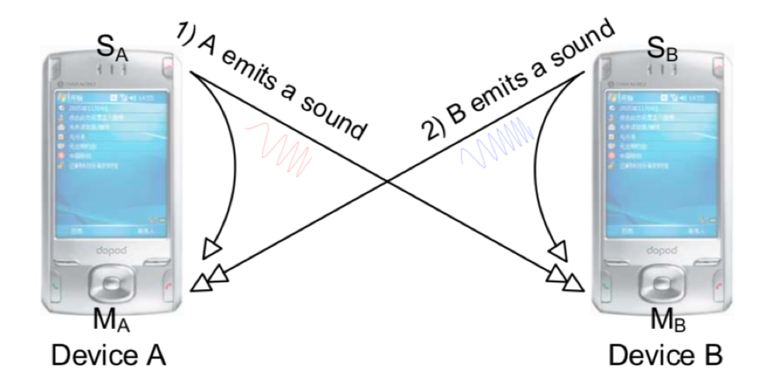

# 声波测距

在前面的无线测距一章中，我们介绍了无线测距的基本原理。本节将介绍利用声波信号进行测距的两个案例，两种测距方式均基于飞行时间(ToF)。第一种基于反射信号，利用调频连续波(FMCW)进行测距；第二种方式基于单边双向测距原理，测量两台设备之间的距离。

## FMCW测距

我们基于声波生成FMCW信号，介绍如何提取接收信号与发送信号的频率差，从而实现测距。

假定声源S静止不动，可录音设备D相对声源S静止，声源发出信号为：

$$
S(t) = cos\bigg(2\pi\big(f_{min} + \frac{B}{2T}\big)t\bigg)
$$

其中，$S$为发射信号，$f_{min}$为FMCW频率的最小值，$B = f_{max} - f_{min}$为 FMCW频率的带宽，$T$为周期，$t$为一个周期内的时间，即$0 < t < T$。因此，接收端接收到的信号为：

$$
L(t) = Acos\bigg( 2\pi \big(f_{min} + \frac{B}{2T}(t-t_d) \big) \big(t-t_d \big) \bigg)
$$

其中，A为衰减因子，$t_d$为信号从发射端到接收端所需要的时间延迟。根据积化和差公式（$cosAcosB = \big(cos(A+B) + cos(A-B)\big)/2$），我们将$S(t)$与$L(t)$相乘，再过滤去高频部分（即只留下$cos(A-B)$的项），得到：

$$
V(t)=\frac{A}{2} \cos \left(2 \pi f_{\min } t_{d}+\frac{\pi B\left(2 t t_{d}-t_{d}^{2}\right)}{T}\right)
$$

假设可录音设备与音响之间距离为R，则有$t_d = \frac{R}{c}$，代入$V(t)$可以得到：

$$
V(t)=\frac{A}{2} \cos \left(2 \pi f_{\min } \frac{R}{c}+\left(\frac{2 \pi B R t}{c T}-\frac{\pi B R^{2}}{c^{2} T}\right)\right)
$$

此时的$V(t)$是个单频信号。对其进行傅里叶变换，在频率 $𝑓=𝐵𝑅/𝑐𝑇$ 处可观察到一个峰值，根据波峰的下标即可最终确定接收信号与发送信号的频率差。

> 这里面我们可能需要使用手机来进行声波发送和接收，实际上就是手机播放声音和录音。

**FMCW测距实现**

直接使用FMCW信号测距时，需要发送设备与接收设备之间进行精准的时钟同步，这样才能保证可以在接收端通过信号相乘提取发送信号与接收信号之间的频率差。在实际系统中，我们可以通过使用同一设备收、发信号以实现上述时钟同步需求。因此，当需要测量设备到某个目标物体的距离时，我们令设备发送FMCW信号，信号达到目标物体并被目标反射后回到测距设备，测量设备收集反射信号并将其与发出信号进行比对以实现测距。上述过程要求测距设备能够运行在全双工模式，即发射信号的同时可以接收信号。

FMCW测距代码实现：
- 目标：使用FMCW声波信号测量设备与目标物体之间的距离。
- 发送信号：多个FMCW信号，每两个FMCW信号之间有与FMCW信号等长的空白间隔。
- 具体步骤：
  - 1. 生成pseudo-transmitted信号。
  - 2. 将pseudo-transmitted信号与接收信号相乘，并做傅里叶变换，得到频率偏移。
  - 3. 得到每个接收到的信号相对起始位置的频率偏移，进而得到每一时刻的距离。

```matlab

%% 发送信号生成
fs = 48000;
T = 0.04;
f0 = 18000; % start freq
f1 = 20500;  % end freq
t = 0:1/fs:T ;
data = chirp(t, f0, T, f1, 'linear');
output = [];
for i = 1:88
    output = [output,data,zeros(1,1921)];
end
 
%% 接收信号读取，并滤波
[mydata,fs] = audioread('fmcw_receive.wav');
mydata = mydata(:,1);
 
hd = design(fdesign.bandpass('N,F3dB1,F3dB2',6,17000,23000,fs),'butter'); % 做一下滤波，想想为什么
mydata=filter(hd,mydata);
% figure;
% plot(mydata);
 
%% 生成pseudo-transmitted信号
pseudo_T = [];
for i = 1:88
    pseudo_T = [pseudo_T,data,zeros(1,T*fs+1)];
end
 
[n,~]=size(mydata);
 
% fmcw信号的起始位置在start处
start = 38750; 
pseudo_T = [zeros(1,start),pseudo_T];
[~,m]=size(pseudo_T);
pseudo_T = [pseudo_T,zeros(1,n-m)];
s=pseudo_T.*mydata';
 
len = (T*fs+1)*2; % chirp信号及其后空白的长度之和
fftlen = 1024*64; %做快速傅里叶变换时补零的长度。在数据后补零可以使的采样点增多，频率分辨率提高。可以自行尝试不同的补零长度对于计算结果的影响。
f = fs*(0:fftlen -1)/(fftlen); %% 快速傅里叶变换补零之后得到的频率采样点

%% 计算每个chirp信号所对应的频率偏移 
for i = start:len:start+len*87
   FFT_out = abs(fft(s(i:i+len/2),fftlen));
   [~, idx] = max(abs(FFT_out(1:round(fftlen/10))));
   idxs(round((i-start)/len)+1) = idx;
end

%% 根据频率偏移delta f计算出距离
start_idx = 0;
delta_distance = (idxs - start_idx) * fs / fftlen * 340 * T / (f1-f0);
 
%% 画出距离
figure;
plot(delta_distance);
xlabel('time(s)', 'FontSize', 18);
ylabel('distance (m)', 'FontSize', 18);
```
<center>

</center>

<center>
<div style="color:orange; border-bottom: 1px solid #d9d9d9;
display: inline-block;
color: #999;
padding: 2px;">图. FMCW测距</div>
</center>

## 声音往返时间测距

基于两个设备之间的声音往返时间，可以做到精准测距。目前也有了很多基于声音往返时间的测距方法[1]。下面我们介绍一种典型的基于声音的测距方法。待测距的两台设备均需要具有扬声器和麦克风，如下图所示：

<center>

</center>

<center>
<div style="color:orange; border-bottom: 1px solid #d9d9d9; display: inline-block;color: #999;padding: 2px;">图. BeepBeep测距示意图</div>
</center>

设备$A$和$B$都需要发送和接收声波。每台设备不仅接收另一台设备发来的声波，同时也接收该设备自身扬声器发送的声波。主要的测距原理如下：

<center>

</center>

<center>
<div style="color:orange; border-bottom: 1px solid #d9d9d9; display: inline-block;color: #999;padding: 2px;">图. 测距原理图</div>
</center>

上图中有表示设备$A$ ($M_A$)和设备$B$($M_B$)的两条箭头，代表两台设备的时间线，从左到右按时间顺序进行对应的操作，步骤如下：

1. $t^*_{A0}$时刻，设备$A$在应用程序中执行播放声音的命令，但由于软硬件调度等因素，设备A真实播放声音的起始时刻为$t_{A0}$，相对于$t^*_{A0}$时刻有一个延迟。

2. 设备$A$会在自身的麦克风上收到自己播放的声音，声音实际到达设备$A$麦克风的时刻为$t_{A1}$，但由于软硬件调度等因素，设备$A$在应用程序中收到声音的时刻会滞后一段时间，在$t^*_{A1}$时刻应用程序才开始接收声音。

3. 设备$B$也会收到设备$A$播放的声音，并且和设备$A$类似，声音实际到达设备$B$麦克风的时刻为$t_{B1}$，而设备$B$的应用程序开始接收声音的时刻为$t^*_{B1}$。

4. 设备$B$接收设备$A$发送的声音后，在$t^∗_{B2}$时刻执行发送声音的指令，和设备A类似，声音实际播放的时刻为$t_{B2}$。

5. 在$t_{B3}$时刻设备$B$发送的声音到达自身的麦克风，但在应用程序中开始收到声音的时刻为$t^∗_{B3}$。

6. 在$t_{A3}$时刻设备B发送的声音到达设备A的麦克风，但在应用程序中设备A开始收到声音的时刻为$t^∗_{A3}$。

有了上述的时刻，我们可以推导出两台设备之间的距离和各个时刻之间的公式。设声速为$c$，定义$d_{X,Y}$为设备$X$的扬声器到设备$Y$麦克风距离，例如$d_{A,B}$为设备$A$的扬声器到设备$B$的麦克风的距离，$d_{A,A}$为设备A的扬声器到自己的麦克风的距离，则有：

$$
d_{A,A}=c(t_{A1}-t_{A0}), d_{A,B}=c(t_{B1}-t_{A0}), d_{B,A}=c(t_{A3}-t_{B2}), d_{B,B}=c(t_{B3}-t_{B2})
$$

设备$A$和$B$的间距$D$可以表示为：

$$
D = \frac{1}{2}(d_{A,B}+d_{B,A})
$$

​		化简后有：

$$
D = \frac{𝑐}{2}[(𝑡_{𝐴3}−𝑡_{𝐴1})-(𝑡_{𝐵3}−𝑡_{𝐵1})]+\frac{𝑑_{𝐴,𝐴}+𝑑_{𝐵,𝐵}}{2}
$$

其中$𝑑_{𝐴,𝐴}$和$𝑑_{𝐵,𝐵}$都和设备本身的设计有关，可以在测距之前提前测量得到。因此测距结果只和两个时间差$𝑡_{𝐴3}−𝑡_{𝐴1}$和$𝑡_{𝐵3}−𝑡_{𝐵1}$有关，并且两个时间差可以分别在设备$A$和设备$B$上测量出来，而不需要设备$A$和设备$B$进行时钟对齐。

以设备$A$为例，设备$A$在测距过程中保持麦克风打开，在接收到的声音信号中，我们需要找到设备$A$自己发送的声音被接收到的时刻$𝑡^*_{𝐴1}$，和设备$B$发送的声音被接收到的时刻$𝑡^*_{𝐴3}$，然后用$t^*_{𝐴3}−𝑡^*_{𝐴1}$来近似$𝑡_{𝐴3}−𝑡_{𝐴1}$。

这样，两台设备之间的测距问题就转化成了测量接收信号起始位置的问题。

**基于声音往返时间的手机测距实现**

在该代码示例中，我们采用两台电脑作为测距设备，使用`Matlab`编写代码。为了能够把设备$B$测量的时间差传回设备$A$以进行距离计算，代码在设备$A$和$B$之间建立了TCP连接，通过局域网进行数据传输。在这里，设备$A$作为TCP连接的服务端，设备$B$作为客户端。

设备$A$：

```matlab
%%
% TCP连接，IP地址和端口可以自己设置，只需保证设备A和设备B一致即可
IP = '0.0.0.0';
PortN = 20000;

%设备A发送调频连续波信号(chirp)，频率从4000Hz变化到6000Hz，持续0.5秒
fs = 48000;
T = 0.5;
f1 = 4000; f2 = 6000; f3 = 8000;
t = linspace(0, T, fs * T);
y = chirp(t, f1, T, f2);
%%
% 启动TCP连接的服务端
Server = tcpip(IP, PortN, 'NetworkRole', 'server');
fopen(Server);
%%
Rec = audiorecorder(fs, 16, 1);
fprintf(Server, 'Server Ready'); 	%服务端发送消息给客户端，设备A准备开始发送声波
rdy = fgetl(Server);							%服务端收到客户端准备就绪的消息
record(Rec, T * 6);								%设备A开始录音
soundsc(y, fs, 16);								%设备A发送声音
pause(T * 6);											%等待录音结束
%%
recvData = getaudiodata(Rec)';
spectrogram(recvData, 128, 120, 128, fs);

%找到信号起始位置
z1 = chirp(t, f1, T, f2); z1 = z1(end : -1 : 1);
z2 = chirp(t, f2, T, f3); z2 = z2(end : -1 : 1);
[~, p1] = max(conv(recvData, z1, 'valid'));
[~, p2] = max(conv(recvData, z2, 'valid'));

%从频谱图中可以比对找到的信号开始位置是否准确
p1 = (p1 - 1) / fs;
p2 = (p2 - 1) / fs;
hold on;
plot([0, fs / 1000 / 2], [p1, p1], 'r-');
plot([0, fs / 1000 / 2], [p2, p2], 'b-');

%从客户端处收到设备B计算的信号起始位置差，转换成时间差
psub = fgetl(Server);
psub = str2double(psub) / fs;

%声速取343m/s，设备A和设备B自身的麦克风与扬声器间距取值20cm
dAA = 0.2;
dBB = 0.2;
fprintf('Result: %f\n', 343 / 2 * (p2 - p1 - psub) + dAA + dBB);

%%
fclose(Server);
```

设备$B$

```matlab
%%
% TCP连接，IP地址和端口可以自己设置，只需保证设备A和设备B一致即可
IP = '0.0.0.0';
PortN = 20000;

%设备B发送调频连续波信号(chirp)，频率从6000Hz变化到8000Hz，持续0.5秒
fs = 48000;
T = 0.5;
f1 = 4000; f2 = 6000; f3 = 8000;
t = linspace(0, T, fs * T);
y = chirp(t, f2, T, f3);
%%
% 启动TCP连接的客户端
Client = tcpip(IP, PortN, 'NetworkRole', 'client');
fopen(Client);
%%
Rec = audiorecorder(fs, 16, 1);
rdy = fgetl(Client);							%客户端收到服务端准备就绪的消息
fprintf(Client, 'Client Ready');	%客户端发送消息给服务端，设备B准备开始发送声波
record(Rec, T * 6);								%设备B开始录音
pause(T * 3);											%接收设备A发送的声音
soundsc(y, fs, 16);								%设备B发送声音
pause(T * 3);											%等待录音结束
%%
recvData = getaudiodata(Rec)';
spectrogram(recvData, 128, 120, 128, fs);

%找到信号起始位置
z1 = chirp(t, f1, T, f2); z1 = z1(end : -1 : 1);
z2 = chirp(t, f2, T, f3); z2 = z2(end : -1 : 1);
[~, p1] = max(conv(recvData, z1, 'valid'));
[~, p2] = max(conv(recvData, z2, 'valid'));

%将计算的信号起始位置差发送给服务端
psub = num2str(p2 - p1);
fprintf(Client, psub);

%从频谱图中可以比对找到的信号开始位置是否准确
p1 = (p1 - 1) / fs;
p2 = (p2 - 1) / fs;
hold on;
plot([0, fs / 1000 / 2], [p1, p1], 'r-');
plot([0, fs / 1000 / 2], [p2, p2], 'b-');
%%
fclose(Client);
```

> **思考**
> 1. 上面的方法设计消除了哪些软/硬件带来的误差？哪些误差还没有消除？
> 2. 如果要缩短一次测距所花费的时间，有哪些可能的改进方向？提示：是否一定要等到接收完设备$A$发送的声波，设备$B$才能播放声波？

## 参考文献
[1] Peng, Chunyi & Shen, Guobin & Zhang, Yongguang & Li, Yanlin & Tan, Kun. (2007). BeepBeep: A high accuracy acoustic ranging system using COTS mobile devices. SenSys. 1-14. 10.1145/1322263.1322265. 
