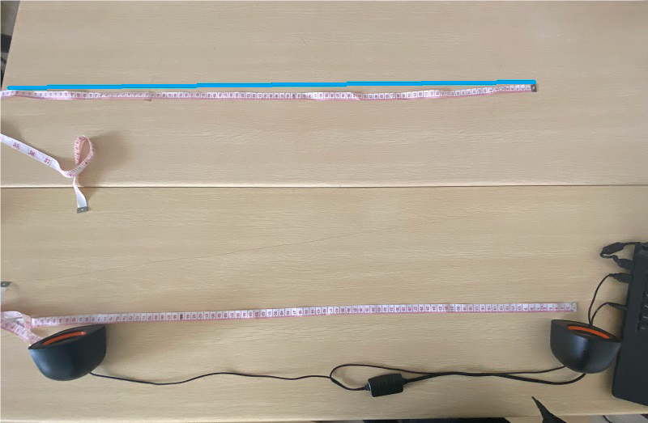
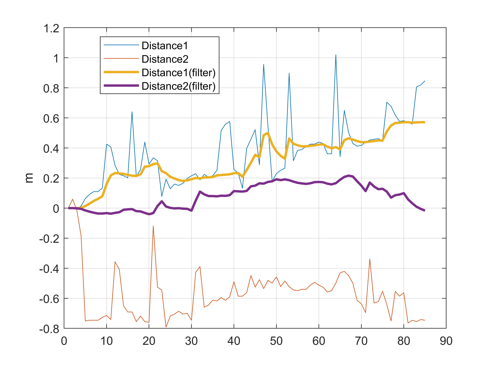
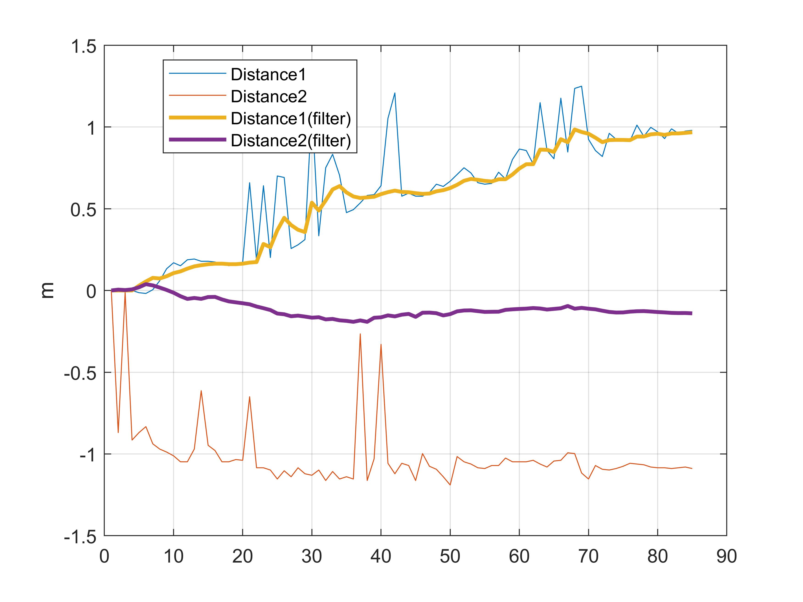
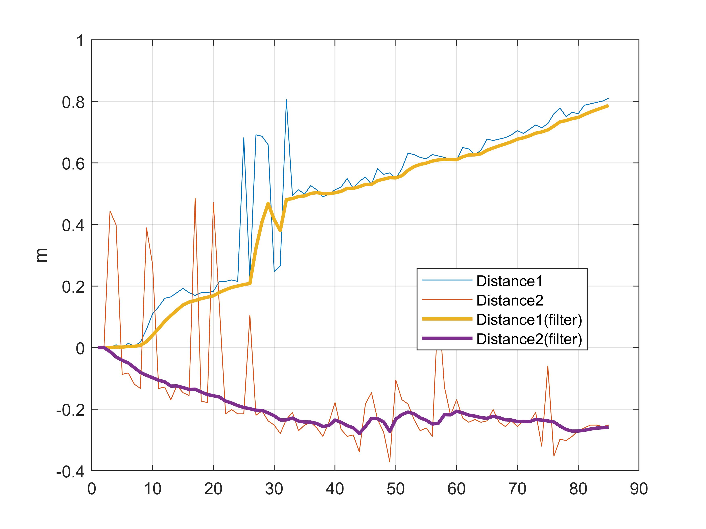
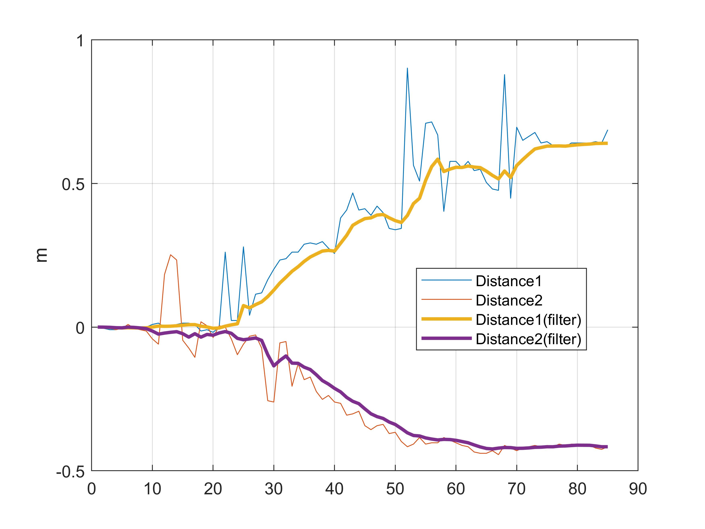
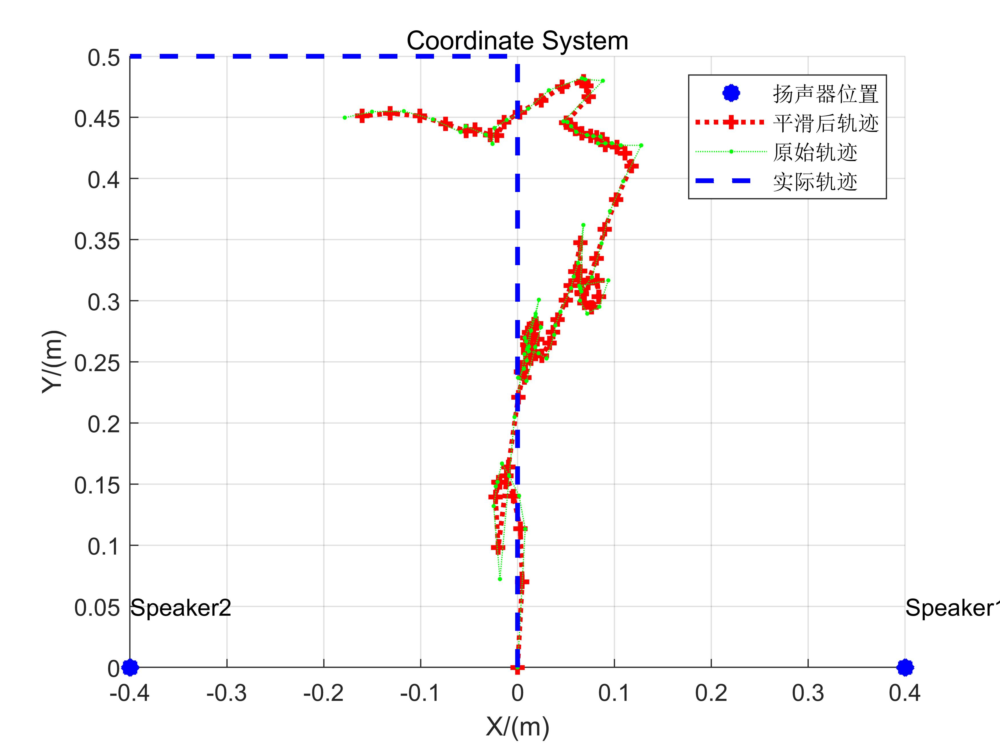
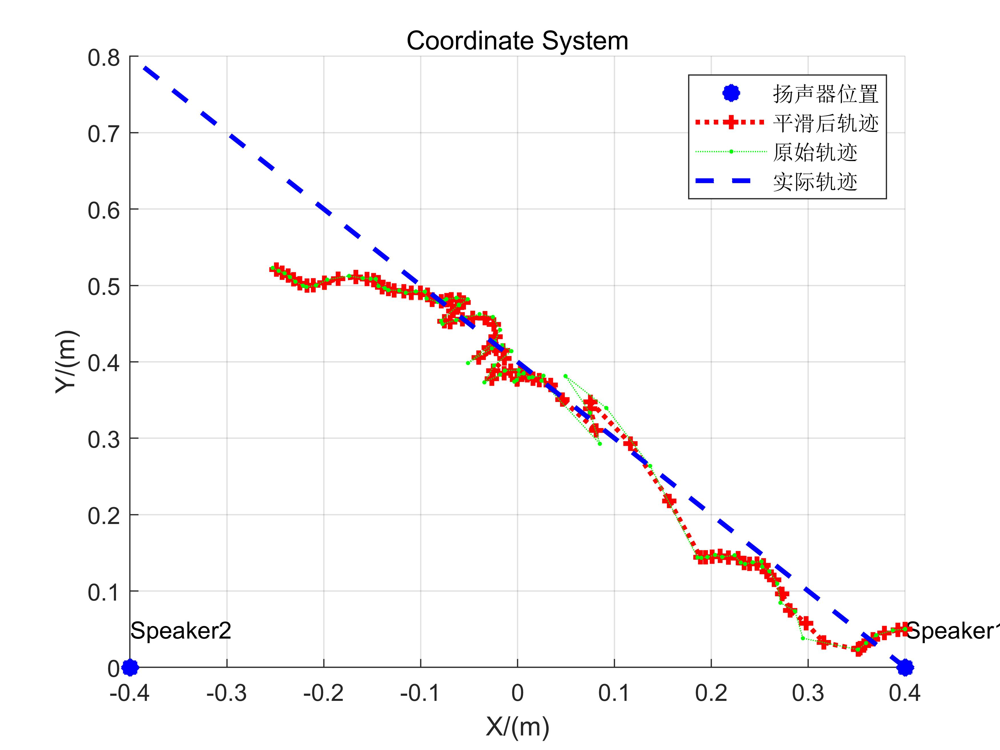
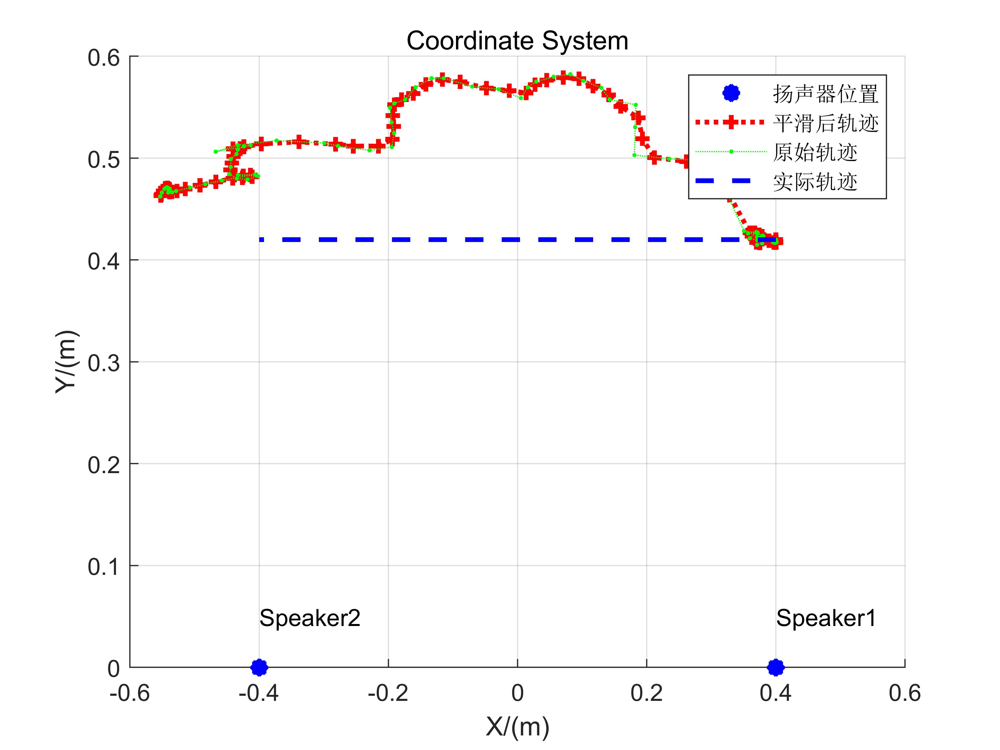

# 声波追踪

利用声波可以对运动中的声源实现高精度的运动追踪，本节将介绍两个有关案例。

## 基于信号相位的高精度设备追踪

基于相位的追踪方法和相关案例代码我们已经在前面无线追踪这一章节介绍过了，大家可以回去再回顾一下。基于信号相位变化的追踪方法，关键在于计算接收信号的相位变化。经典的测定相位变化的方法对相位的计算精度受限于信号的采样率。而声音信号的采样率又受到硬件和软件的双重限制。因此，通常很难通过提高信号采样率来提高追踪的精度。

再这里我们介绍一种新的基于相位的追踪方法，我们在INFOCOM论文Vernier[1]中提出了一种在信号采样率固定不变的前提下，提高基于相位变化的追踪方法精度的方法。

首先，我们考虑一个类似的间接提高分辨率的例子-游标卡尺。游标卡尺是一种用于精确测量长度的工具。一般而言，游标卡尺由两部分构成，一部分是主尺，另一部分是可滑动的游标，可以在主尺上自由滑动。主尺和游标上都有刻度，但是二者的刻度间距稍有不同。主尺的刻度一般都是整毫米的，而游标上的刻度一般与主尺上的刻度往往有微小的差距。

<center>
    
    <br>
    <div style="color:orange; border-bottom: 1px solid #d9d9d9;
    display: inline-block;
    color: #999;
    padding: 2px;">图1. 游标卡尺示意图</div>
</center>


对于常见的游标卡尺，其主尺刻度间隔为1mm，游标上的刻度间隔为0.9mm。如果我们要测量的距离为$r$，那么我们可以得到：

$$
r-r'+0.9x=1.0x
$$

其中，$r’$表示对$r$进行向下取整的结果，$x$表示游标的第多少个刻度，能够与主尺上的刻度互相对齐。经整理，得到：

$$
r-r'=0.1x
$$

由于游标每向右移动了一个刻度，其与主尺上的刻度上的差距就增加了0.1 mm。因此，利用这个原理就可以对长度进行更精确地测量。值得指出的是，游标卡尺的测量精度本质上并不是由游标和主尺上的刻度差值决定的，而是由二者的最大公约数决定的。

### 信号相位变化的测定

接下来，我们介绍一种类似游标卡尺原理的信号相位变化的测定方法。

首先定义以下两个变量：

LMP（Local Max Prefix）：在一个信号采样窗口中，我们规定第一个采样点的LMP为0。从第二个采样点开始，如果某一个点的值（就是该采样点的信号强度），既大于它的前一个值，又大于它的后一个值，那么这个点的LMP值为它的前一个点的LMP值加1，否则该点的LMP值等于其前一个点的LMP值。

LMPS（Local Max Prefix Sum）：LMPS是在一个窗口中，所有采样点的LMP的和。

假定在时间$t_1$和时间$t_2$两个时刻，录音设备取得两个等长时间窗口的音频数据$w_1$和$w_2$。每个窗口中有恰好有$p$个周期的声音信号，这$p$个周期的信号刚好对应着$q$个采样点。$w_1$和$w_2$两个时间窗口的数据的LMPS分别为$L_1$和$L_2$。则这两个窗口所经历的相位变化为 $\Delta \phi = (L_2 - L_1)2\pi /q$。距离变化为 $\Delta d = \lambda \Delta \phi/2\pi$。其中c是声音在空气中的传播速度。

<center>
    
    <br>
    <div style="color:orange; border-bottom: 1px solid #d9d9d9;
    display: inline-block;
    color: #999;
    padding: 2px;">图2. LMP和LMPS示意图</div>
</center>


如图所示，在一个时间窗口内，p = 3，q = 13。则该窗口内信号各采样点的LMP如图所示，信号的LMPS为26。

<center>
    
    <br>
    <div style="color:orange; border-bottom: 1px solid #d9d9d9;
    display: inline-block;
    color: #999;
    padding: 2px;">图3. Vernier测量相位变化示意图</div>
</center>


当信号相位前移 2π / q时，LMPS增加1。

因此，当p = 3，q = 13时，每当LMPS增加1，信号的相位变化了 2π / 13。距离变化（减小）了 λ / 13。

利用上述方法可以实现更高精度的基于相位变化的追踪。

在采样率不变的情况下，我们可以通过调节发射信号的频率来调节 $p$ 与 $q$。例如，在采样率为 $44100 Hz$ 的情况下，如果取声音频率为 $20000 Hz$，那么 $p = 200$，$q = 441$。在这种情况下，此方法的定位精度为 

$$
\frac{340}{20000 \times 441} m = 0.0000385 m = 0.0385 mm
$$

该方法的具体实现代码如下(res\phase_Vernier.m)

```matlab
% 读入音频文件
[data,fs] = audioread('record.wav');
% 提取第一个声道
data=data(:,1);
% 将数据转化为行向量
data=data.';

% 使用带通滤波器滤波去噪
bp_filter = design(fdesign.bandpass('N,F3dB1,F3dB2',6,20800,21200,fs),'butter');
data = filter(bp_filter,data);

%% 计算LMP和LMPS变化
% fs=48000
f0 = 21000;
c = 340;

% fs:f0=16:7
%以16个采样点为窗口，每个含有7个周期的信号
slice_len = 16;
p=7;

slice_num=floor(length(data)/slice_len);
lmps=zeros(1,slice_num);
for i = 0:1:slice_num-1
    lmp=0;
    sum=0;
    for j=2:1:slice_len-1
        if data(i*slice_len+j)>data(i*slice_len+j+1) && data(i*slice_len+j)>data(i*slice_len+j-1)
            lmp=lmp+1;
        end
        sum=sum+lmp;
    end
    sum=sum+lmp;
    lmps(i+1)=sum;
end

%% 修复异常数据
% LMPS的上界和下界分别为60和45
u_bound=60;
l_bound=45;

for i = 2:length(lmps)
    % 将超出界限的数据修复为前一个时间片的数据
    if lmps(i)<l_bound
        lmps(i)=lmps(i-1);
    elseif lmps(i)>u_bound
        lmps(i)=lmps(i-1); 
    end
end

%% 计算相位变化和距离变化
% 对相位跳变进行补偿
bias=0;
phase=lmps;
for i=2:length(phase)
    if lmps(i-1)>u_bound-4 && lmps(i)<l_bound+4
        bias=bias+1;
    elseif lmps(i-1)<l_bound+4 && lmps(i)>u_bound-4
        bias=bias-1;
    end
    phase(i)=lmps(i)+bias*slice_len;
end
phase = phase*2*pi/slice_len;

% 起始点为0
phase = phase-phase(1);

distance = - phase /(2*pi*f0) *c;

delta_t = slice_len/fs;
time = 1:slice_num;
time = time*delta_t;

plot(time,distance)
title('基于相位的追踪(Vernier)');
xlabel('时间(s)');
ylabel('距离(m)');
```

声源发出21kHz的声音信号，移动设备在录制音频的过程中先远离声源移动10cm，然后远离声源移动20cm，最后移动回到初始位置。追踪的结果如下

<center>
    
</center>

从结果可以看出该方法能准确地追踪设备的运动。

### **二维位置追踪**

如下图所示，假设被追踪设备的初始位置为C（$x_0$，$y_0$），在一定时间内移动到D（$x_1$，$y_1$）。因为初始位置的坐标已经给定，因此AC和BC之间的距离就可以求出。只要知道设备相对与A、B两个声源的距离变化 $a_1$ 和 $a_2$，就可以得到AD和BD的长度。由于AB之间的距离可以事先测量，因此在三角形$\Delta$ABD中，三个边都是已知的，那么D点的坐标（$x_1$，$y_1$）就可以求出了。

<center>

</center>


<center>
<div style="color:orange; border-bottom: 1px solid #d9d9d9;
display: inline-block;
color: #999;
padding: 2px;">图. 二维定位方法</div>
</center>


## 基于FMCW的二维追踪

基于无线追踪中FMCW追踪原理，通过比较发送信号与接收信号的频率在移动中的变化，计算出距离的变化情况，进而通过多组基站对待测目标距离的同时测量，对待测目标进行连续的跟踪定位。

同样地，我们使用智能手机平台以及扬声器开展实验。

### 系统设计

**信号设计**

二维定位至少要求获取麦克风到两个扬声器的距离变化情况。因此我们在硬件和信号设计方面都有着与一维测距不同设计。
在硬件方面，我们仍然使用普通的智能手机作为接收端；而在发送端方面，我们使用了两个扬声器作为信号的发送装置。
在信号设计方面，我们利用音响支持双通道播放的特性，通过产生左右两个不同声道的信号在两个喇叭上进行播放。
我们通过信号设计，使得两个扬声器上不会同时播放声音信号，这样避免了处理信号过程中的复杂的滤波和对齐操作。当时即使是两个扬声器同时播放声音也没有问题，在这部分代码中为了方便，我们就分开播放的办法来设计了。

具体来说发送的信号如下:

`用于确定开始点的FMCW + 左右两声道的分时FMCW`，
以100ms为周期的左右两声道的分时FMCW 的构成如下：(`$` 代表FMCW信号，空格则代表空白)

~~~
+------------------------------------+
| 40ms       |10ms| 40ms        |10ms| <- duration: 100ms
+------------------------------------+
|$$$$$$$$$$$$|    |             |    | <- right channel
+------------------------------------+
|                 |$$$$$$$$$$$$$|    | <- left channel
+------------------------------------+
~~~

**定位与追踪步骤**

- 获取信号开始点，为了应对一维测距中“先接近后远离”反而实测距离先增大后减小的情况，我们特意将起始点向前调整100-200 个采样点，这样就可以将距离的起始值增大，可以分辨出一开始距离就变小的情况。
- 由于左右两声道信号是同步的，我们可以直接根据一维测距同样的方法利用时间片拆分的左右两声道信号来判断到两个喇叭的距离情况。但我们也注意到一个周期内测量到两个喇叭的距离的时刻实际上具有50ms的时间差，但考虑到我们测量是在低速情况下进行的，我们目前就忽略了由此会产生的误差，感兴趣的读者可以思考如何改进这一方法达到更好的效果。
- 我们使用不同的滤波器对采集到的数据进行处理，这是定位追踪中很重要的一步，需要大家熟悉使用各种不同的滤波器和数据处理方法等，例如在这一部分，我们使用了hampel滤波和卡尔曼滤波的方法对于测量值进行处理，尽量减少测量中异常值的干扰和随机扰动的影响。
- 对所有距离测量值减去初始值(第一个所测值) 后就得到了距离的变化情况，我们在给定初始出发点的情况下使用两圆求交的算法对二维位置进行确定。

### 实验与分析

我们分别在三种场景下进行了二维定位实验，实验场景如下面的图片所展示：

<center>
    
    <br>
    <div style="color:orange; border-bottom: 1px solid #d9d9d9;
    display: inline-block;
    color: #999;
    padding: 2px;">图. 垂直移动实验场景</div>
</center>


<center>
    
    <br>
    <div style="color:orange; border-bottom: 1px solid #d9d9d9;
    display: inline-block;
    color: #999;
    padding: 2px;">图. 斜线移动实验场景</div>
</center>


<center>
   
    <br>
    <div style="color:orange; border-bottom: 1px solid #d9d9d9;
    display: inline-block;
    color: #999;
    padding: 2px;">图. 水平移动实验场景</div>
</center>


| 序号 | 起始位置     | 喇叭位置           | 移动方式 |
| ---- | ------------ | ------------------ | -------- |
| 1    | (0,0)        | (0.40,0) (-0.40,0) | 垂直移动 |
| 2    | (0,0)        | (0.40,0) (-0.40,0) | 垂直移动 |
| 3    | (0.40, 0.05) | (0.40,0) (-0.40,0) | 斜线移动 |
| 4    | (0.40, 0.05) | (0.40,0) (-0.40,0) | 斜线移动 |
| 5    | (0.40, 0.42) | (0.40,0) (-0.40,0) | 水平移动 |


### 实验结果

**距离测量**

<center>
    
    <br>
    <div style="color:orange; border-bottom: 1px solid #d9d9d9;
    display: inline-block;
    color: #999;
    padding: 2px;">图. 实验1距离测量结果</div>
</center>
<center>
    
    <br>
    <div style="color:orange; border-bottom: 1px solid #d9d9d9;
    display: inline-block;
    color: #999;
    padding: 2px;">图. 实验2距离测量结果</div>
</center>
<center>
    
    <br>
    <div style="color:orange; border-bottom: 1px solid #d9d9d9;
    display: inline-block;
    color: #999;
    padding: 2px;">图. 实验3距离测量结果</div>
</center>
<center>
   
    <br>
    <div style="color:orange; border-bottom: 1px solid #d9d9d9;
    display: inline-block;
    color: #999;
    padding: 2px;">图. 实验4距离测量结果</div>
</center>
<center>
    
    <br>
    <div style="color:orange; border-bottom: 1px solid #d9d9d9;
    display: inline-block;
    color: #999;
    padding: 2px;">图. 实验5距离测量结果</div>
</center>


从实验3、实验4、实验5我们可以看出，应用滤波器后能够得到较为平滑的距离数据，即使有较大的初始误差或者较长的连续偏离片段，也能够比较好的纠正回来。

### 定位结果

<center>
    
    <br>
    <div style="color:orange; border-bottom: 1px solid #d9d9d9;
    display: inline-block;
    color: #999;
    padding: 2px;">图. 实验1追踪效果</div>
</center>


<center>
   
    <br>
    <div style="color:orange; border-bottom: 1px solid #d9d9d9;
    display: inline-block;
    color: #999;
    padding: 2px;">图. 实验2追踪效果</div>
</center>


<center>
    
    <br>
    <div style="color:orange; border-bottom: 1px solid #d9d9d9;
    display: inline-block;
    color: #999;
    padding: 2px;">图. 实验3追踪效果</div>
</center>


<center>
    
    <br>
    <div style="color:orange; border-bottom: 1px solid #d9d9d9;
    display: inline-block;
    color: #999;
    padding: 2px;">图. 实验4追踪效果</div>
</center>


<center>
    
    <br>
    <div style="color:orange; border-bottom: 1px solid #d9d9d9;
    display: inline-block;
    color: #999;
    padding: 2px;">图. 实验5追踪效果</div>
</center>


我们测量的轨迹情况能够大致地反映实际地移动情况，但误差仍然较大。这一方面是使用距离变化量需要较为精确的基准值，一旦初始值有较大偏差就会导致误差积累。另一方面，实验中智能手机的移动需要靠人工控制，人工移动过程中的抖动也导致了许多的偏差。尽管仍然有误差，但是作为大家的一个基础开始代码还是不错的，大家都可以动手尝试一下。


> 大家思考如何改进这一部分的追踪性能，这一部分是可以做到更好的。


### 实验代码与数据

**追踪实验代码**

~~~matlab
%% 发送信号生成部分
fs = 44100;
T = 0.04;
chirp_samples = T *fs;
stop06 = 0.06;
stop05 = 0.05;
stop01 = 0.01;
f0 = 16000; % start freq
f1 = 18000;  % end freq

blank06 = zeros(1,stop06*fs);
blank05 = zeros(1,stop05*fs);
blank01 = zeros(1,stop01*fs);
t = (0:1:T*fs-1)/fs;
data = chirp(t, f0, T, f1, 'linear');
output = [];
bf0 = 8000;
bf1 = 9000;
begin = chirp(t, bf0, T, bf1, 'linear');
repeat = 85;
~~~

~~~matlab
%% 接收信号读取、滤波、寻找起始位置及计算频率偏移
filename = '5.wav'; % 在此更改文件名
[mydata,fs] = audioread(filename);

mydata = mydata(:,1);
[c, lags] = xcorr(mydata, begin); % 这里还有很多其他的方法，大家思考一下。
[~, i] = max(abs(c));
idx = lags(i);

hd = design(fdesign.bandpass('N,F3dB1,F3dB2',6,14000,20000,fs),'butter');
mydata=filter(hd,mydata);

%% 生成pseudo-transmitted信号
pseudo_T = [];
for i = 1:repeat
    pseudo_T = [pseudo_T,data,blank01,data,blank01];
end
 
[n,~]=size(mydata);
 
% fmcw信号的起始位置在start处
start = idx+0.1*fs-100; 
pseudo_T = [zeros(1,start),pseudo_T];
[~,m]=size(pseudo_T);
pseudo_T = [pseudo_T,zeros(1,n-m)];
 
s=pseudo_T.*mydata';
 
len = (0.1*fs); % chirp信号及其后空白的长度之和
fftlen = 1024*64; %做快速傅里叶变换时补零的长度。在数据后补零可以使的采样点增多，频率分辨率提高。可以自行尝试不同的补零长度对于计算结果的影响。
f = fs*(0:fftlen -1)/(fftlen); %% 快速傅里叶变换补零之后得到的频率采样点
% 这里这几个步骤的参数都不是固定的，也未必是最优的，大家可以自己思考调整

%% 计算每个chirp信号所对应的频率偏移
deltaf1 = [];
deltaf2 = [];
for i = start:len:start+len*(repeat-1)
   chunk1 = s(i:i+chirp_samples);
   chunk2 = s(i+length(blank05):i+length(blank05)+chirp_samples);
   FFT_out1 = abs(fft(chunk1,fftlen));
   FFT_out2 = abs(fft(chunk2,fftlen));
   [~, index1] = max(FFT_out1);
   [~, index2] = max(FFT_out2);
   deltaf1 = [deltaf1 f(index1)];
   deltaf2 = [deltaf2 f(index2)];
end
 
%% 计算距离变化量
D1 =  deltaf1 * 340 /(f1-f0) * T;
D2 =  deltaf2 * 340 /(f1-f0) * T;
figure
plot(D1)
hold on
plot(D2)
legend('Distance1', 'Distance2' )

start = 1 % 由于前面的采样点的误差会导致累计偏差，在此舍去前面的一些采样点
D1 = D1(start:end);
D2 = D2(start:end);
~~~

~~~matlab
%% 滤波去噪与轨迹图显示
figure;
plot(D1-D1(1));
hold on;
plot(D2-D2(1));
kd1 = kalman(hampel(D1,15), 5e-4, 0.0068);
kd2 = kalman(hampel(D2,15), 5e-4, 0.0068);
kd1 = kd1 - kd1(1);
kd2 = kd2 - kd2(1);
kd1 = hampel(kd1, 7);
kd2 = hampel(kd2, 7);

%% 显示距离变化
plot(kd1, 'LineWidth',2);
plot(kd2, 'LineWidth',2);
grid on
legend('Distance1', 'Distance2','Distance1(filter)', 'Distance2(filter)' )
legend('Location','best')
ylabel('m')

%% 计算二维位置
if strcmp(filename, '1.wav') ||strcmp(filename, '2.wav')
    start = [0, 0];
end
if strcmp(filename, '3.wav') ||strcmp(filename, '4.wav')
   start = [0.40, 0.05];  
end

if  strcmp(filename, '5.wav')
   start = [0.40, 0.42];  
end
speakers = [0.40 0; -0.40 0];
pd1 = pdist([start; speakers(1,:)]);
pd2 = pdist([start; speakers(2,:)]);

kd1 = kd1 + pd1;
kd2 = kd2 + pd2;
xs = zeros(1,length(kd1));
ys = zeros(1,length(kd1));
figure
scatter([0.40 -0.40], [0 0] ,'b*', 'LineWidth',5,'DisplayName','扬声器位置')
xlabel('X/(m)')
grid on

text(0.40,0.05,'Speaker1')
text(-0.40,0.05,'Speaker2')
ylabel('Y/(m)')
title('Coordinate System')
hold on
xs(1) = start(1);
ys(1) = start(2);
for i= 2:length(kd1)
    [xout,yout] = circcirc(speakers(1,1),speakers(1,2),kd1(i),speakers(2,1),speakers(2,2),kd2(i));
    xs(i) = real(xout(2));
    ys(i) = real(yout(2));
    if isnan(xs(i))
       xs(i) = xs(i-1);
       ys(i) = ys(i-1);
    end
    
end
xs_ = kalman(xs,5e-2, 0.05);
ys_ = kalman(ys, 5e-2, 0.05);

plot(xs_,ys_,':r+', 'LineWidth',2, 'DisplayName','平滑后轨迹');
plot(xs,ys,':g.', 'DisplayName','原始轨迹');

if strcmp(filename, '1.wav') ||strcmp(filename, '2.wav')
    plot([0 0 -0.40],[0 0.5 0.5], '--b','LineWidth',2, 'DisplayName','实际轨迹')
end

if strcmp(filename, '3.wav') ||strcmp(filename, '4.wav')
    plot([0.40  -0.40],[0 0.8], '--b','LineWidth',2, 'DisplayName','实际轨迹')
end

if  strcmp(filename, '5.wav')
    plot([0.40 -0.40],[0.42 0.42], '--b','LineWidth',2, 'DisplayName','实际轨迹')
end
legend
~~~

~~~matlab
%% 卡尔曼滤波器
function xhat =  kalman(D, Q, R)
    sz = [1 length(D)];
    xhat = zeros(sz); 
    P= zeros(sz);
    xhatminus = zeros(sz);
    Pminus = zeros(sz);
    K = zeros(sz);
    xhat(1) = D(1); 
    P(1) =0; % 误差方差为1
    
    for k = 2:length(D)
        % 时间更新（预测）
        % 用上一时刻的最优估计值来作为对当前时刻的预测
        xhatminus(k) = xhat(k-1);
        % 预测的方差为上一时刻最优估计值的方差与过程方差之和
        Pminus(k) = P(k-1)+Q;
        % 测量更新（校正）
        % 计算卡尔曼增益
        K(k) = Pminus(k)/( Pminus(k)+R );
        % 结合当前时刻的测量值，对上一时刻的预测进行校正，得到校正后的最优估计。该估计具有最小均方差
        xhat(k) = xhatminus(k)+K(k)*(D(k)-xhatminus(k));
        % 计算最终估计值的方差
        P(k) = (1-K(k))*Pminus(k);
    end
end
~~~

注意，这一部分代码的信息量还是很大的，大家可以仔细阅读，里面包含了很多技术。同时说明一下，里面的很多参数未必都做到了最优，大家还可以进行改进。

**数据文件**

- [1.wav](./res/1.wav)
- [2.wav](./res/2.wav)
- [3.wav](./res/3.wav)
- [4.wav](./res/4.wav)
- [5.wav](./res/5.wav)


## 参考论文
1. Yunting Zhang, Jiliang Wang, Weiyi Wang, Zhao Wang, Yunhao Liu. "Vernier: Accurate and Fast Acoustic Motion Tracking Using Mobile Devices", IEEE INFOCOM 2018. 
2. Linsong Cheng, Zhao Wang, Yunting Zhang, Weiyi Wang, Weimin Xu, Jiliang Wang. "Towards Single Source based Acoustic Localization", IEEE INFOCOM 2020.
3. Pengjing Xie, Jingchao Feng, Zhichao Cao, Jiliang Wang. "GeneWave: Fast Authentication and Key Agreement on Commodity Mobile Devices", IEEE ICNP 2017
