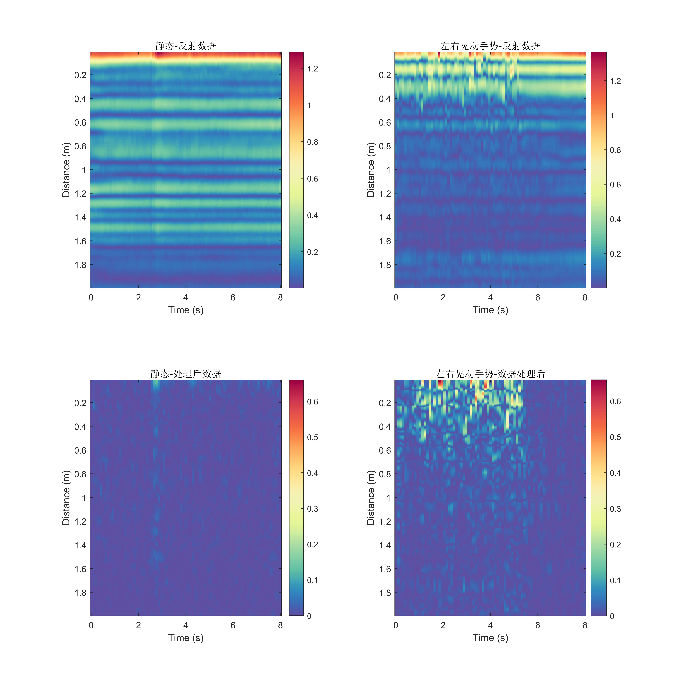

# 声波手势识别？？（这部分需要重新整理）

除了定位追踪以外，利用无线信号进行更加复杂任务（例如动作、手势等）的感知也是物联网领域的研究热点。其主要原理是利用感知目标对信号的影响来进行感知。通过分析信号的变化，进而推断出感知目标的情况（如位置、动作、朝向等）。

为了便于大家的理解，我们这里使用声波信号对手势进行识别，其余场景的思路是类似的。理解了这个对于大家理解基于WiFi CSI或者其他无线信号特征做动作识别等有很大的帮助。大家可以仔细思考一下下面的这个过程。

利用声波进行手势识别的第一个问题是如何获得信号状态信息，在WiFi中我们可以直接获取CSI，大家并不需要思考怎么获取到的（实际上在前面信号那一章节我们已经介绍了CSI的主要原理）。

第一个思路是通过发射FMCW或OFDM子载波，进而通过反射信号计算相位变化来检测手指的运动距离，从而对手势进行识别检测。这一部分基本是基于声波进行定位和追踪了，在前面的章节中我们有详细的介绍。我们在这里就不展开介绍了。
当然这些工作存在着以下问题：
- 手势在运动过程中的反射的变化非常复杂，手掌不能简单建模为单一反射点
- 声波受到多径效应的影响会出现频率选择性衰落
- 静态物体的反射会导致识别困难

在这一部分，我们使用声波信道信息来对手势进行识别。我们尝试利用CIR信息对手势进行识别的工作（如果还不清楚CIR是什么，请回顾信道特征这一章节），这一过程就跟现在很多CSI做感知的工作非常类似了，这一系列的论文已经非常非常多了，现在还在层出不穷，他们的基本的思路都是一样的，建议大家可以以声波感知为出发点来理解无线感知。

手势识别的流程如图所示

手势识别的流程

## 主要原理
1. **信道冲击响应（CIR）提取**
    $$
    r[n] = s[n] * h[n]
    $$
    利用发射一段经过特殊设计的已知声波$s[n]$ ，运动过程中的手势会将其反射，在麦克风端接收到$r[n]$ ，利用信道估计方法即可提取$h[n]$。通过对$h(n)$的分析与处理，我们就可以获取细粒度的反射信息，进而对手势变化过程中导致的反射变化特征进行提取。
2. **消除环境干扰**
   环境中除了存在由于手势运动带来的反射，其他的静态物体也会产生反射
   - 利用相邻时间片的CIR在幅值和相位上做差分的方法提取其变化量，减小静态反射带来的干扰
   - CIR图像的Y轴代表了距离信息，根据手势识别的范围，只提取指定距离范围内的CIR变化量
3. **特征提取与建立分类网络**
   利用上面测量CIR数据数据及处理的方法，可以收集大量实际运动过程中的数据，再将这些数据及对应的手势标签输入到经过设计的机器学习网络中训练分类器。在预测阶段，通过输入实际的运动数据到分类器中，就可以获取到相对应的手势类别（如相对麦克风左右晃动或前后晃动）。

## 示例代码与数据
### 录音端
~~~matlab
fs = 48000;
%% 设置
T = 0.1; % 单个chirp周期
t = linspace(0,T,fs*T);
startFreq = 18000; % chirp起始频率
endFreq = 22000; % chirp终止频率
interval_T = 0.00; % chirp间的间隔时间 设置为0即无间隔
sampleCycles = 80; % chirp重复次数
tt = linspace(0,interval_T,fs*interval_T);
intervalSignal = sin(2*pi*endFreq*tt);

warmUpT = 0.5; % 预热周期用于预热扬声器，避免扬声器的惯性影响起始的信号质量
t_warm = linspace(0,warmUpT,fs*warmUpT);
warmUpSignal = sin(2*pi*startFreq*t_warm);

y = chirp(t, startFreq, T, endFreq); % chirp信号
dy = chirp(t, endFreq, T, startFreq); % 下降的chirp信号，忽略

%% 生成待播放的信号
playData = [];

for i =1:sampleCycles
    playData = [playData, y, intervalSignal];
end
filename = sprintf("fmcw_s%d_e%d_c%d_t%d.wav",startFreq/1000,endFreq/1000,sampleCycles, T*1000);
audiowrite(filename, playData, fs);

%% 选择要播放的设备

info = audiodevinfo;
outputDevID = info.output(2).ID; % *设备ID根据实际情况选择!!*
playData = [warmUpSignal playData];
player1 = audioplayer([playData; zeros(size(playData))],fs,16,outputDevID);

%% 选择要录音的设备
inputDevID = info.input(2).ID;% *设备ID根据实际情况选择!!*
rec1 = audiorecorder(fs,16,2,inputDevID);

play(player1)
record(rec1,sampleCycles*T+1)
pause(sampleCycles*T+1+0.2)
ry = getaudiodata(rec1);
figure
plot(ry)

%% 选择要保存的文件
% save('record_static.mat')
% save('record_dynamic.mat')
~~~

### 数据处理代码
~~~matlab
close all;
load('record_static.mat')
%% 常量
chunk = (T+interval_T)*fs;
chirpLen = T*fs;
B = endFreq - startFreq;
maxRange = 2;
c = 343;
fMax = round(B*(maxRange/c)/T);
N = 8;
CIRData = zeros([sampleCycles,fMax*N]);
channel = 2;

%% chirp对齐

[r, lags] = xcorr(ry(:,channel),y);
figure
plot(ry(:,channel))

[pk, lk] = findpeaks(r,'MinPeakDistance',0.8*fs*T); % 寻找峰值
[~, I] = maxk(pk,sampleCycles);% 寻找最大的sampleCycles个峰值
figure 
plot(lags,r)
hold on
plot(lags(lk),pk,'or')
plot(lags(lk(I)),pk(I),'pg')

asc_indexs = sort(I); % index从小到大排序
indexs = lags(lk(I));
start_index = min(indexs); % 找到开始的

%% 计算

for i = 1:sampleCycles
    offset = (i-1)*chunk;
    sig_up = ry(offset+start_index:offset+chirpLen+start_index-1,channel);
    sig_up = highpass(sig_up, 10000,fs);
    mixSigUp = sig_up .* y'; %% 混合信号，接受到的信号与实际信号相乘
    fmixSigUp = lowpass(mixSigUp,fMax+100,fs); % 低通滤波
    fftOut = abs(fft(fmixSigUp,fs*N)); % fft
    CIRData(i,:) = fftOut(1:fMax*N)/ pk(I(i)); % 除以 pk(I(i))进行幅值补偿 
end

%% 绘图
time = 0:T:T*sampleCycles;
range = (1:1/N:fMax) *T*c/B;

diffCIR = zeros(sampleCycles-1,fMax*N);
for i=2:sampleCycles-1
    diffCIR(i,:) =(abs( CIRData(i,:)-CIRData(i-1,:)));
end

figure(100)
subplot(2,2,1)
imagesc(time,range,CIRData')
colormap(linspecer)
colorbar
title('静态-反射数据')
% c1 = caxis;
subplot(2,2,3)
imagesc(time,range,diffCIR')
colormap(linspecer)
colorbar
c1 = caxis;
title('静态-处理后数据')
% c2 = caxis;
% c3 = [min([c1 c2]), max([c1 c2])];
% caxis(c3)
figure
plot(CIRData(:,1))
hold on
plot(pk(I))

load('record_dynamic.mat')

[r, lags] = xcorr(ry(:,channel),y);
figure
plot(ry(:,channel))

[pk,lk] = findpeaks(abs(r),'MinPeakDistance',0.8*fs*T);
[pv,I] = maxk(pk,sampleCycles);
figure 
plot(lags,r)
hold on
plot(lags(lk),pk,'or')
plot(lags(lk(I)),pk(I),'pg')

asc_indexs = sort(I);
indexs = lags(lk(I));
start_index = min(indexs);

%% 计算

for i = 1:sampleCycles
    offset = (i-1)*chunk;
    sig_up = ry(offset+start_index:offset+chirpLen+start_index-1,channel);
    sig_up = highpass(sig_up, 10000,fs);
    mixSigUp = sig_up .* y';
    fmixSigUp = lowpass(mixSigUp,fMax+100,fs);
    fftOut = abs(fft(fmixSigUp,fs*N));
    CIRData(i,:) = fftOut(1:fMax*N)/ pk(I(i));
end

%% 绘图
time = 0:T:T*sampleCycles;
range = (1:1/N:fMax) *T*c/B;

diffCIR = zeros(sampleCycles-1,fMax*N);
for i = 2:sampleCycles - 1
    diffCIR(i,:) =(abs( CIRData(i,:)-CIRData(i-1,:)));
end

figure(100)
subplot(2,2,2)
imagesc(time,range,CIRData')
colormap(linspecer)
colorbar
title('左右晃动手势-反射数据')
subplot(2,2,4)
imagesc(time,range,diffCIR')
colormap(linspecer)
colorbar
c2 = caxis;
c3 = [min([c1 c2]), max([c1 c2])];
caxis(c3)
title('左右晃动手势-数据处理后')
subplot(2,2,3)
caxis(c3)
~~~

### 数据文件样例
- [record_dynamic.mat](./file/record_dynamic.mat)
- [record_static.mat](./file/record_static.mat)

## 结果展示

数据结果图

收集到CIR特征数据后，就可以利用提取到的不同手势的反射CIR数据特征，训练分类器对手势进行分类。训练分类器这部分的方法很多，特点也不一样，我们就先不再进行介绍。

[TODO 未来有空可以补充，但是这部分可以使用的方法很多，大家可以直接参考经典方法]

## 参考文献
1. Linsong Cheng, Zhao Wang, Yunting Zhang, Weiyi Wang, Weimin Xu, Jiliang Wang. "Towards Single Source based Acoustic Localization", IEEE INFOCOM 2020.
2. Yunting Zhang, Jiliang Wang, Weiyi Wang, Zhao Wang, Yunhao Liu. "Vernier: Accurate and Fast Acoustic Motion Tracking Using Mobile Devices", IEEE INFOCOM 2018. 
3. Pengjing Xie, Jingchao Feng, Zhichao Cao, Jiliang Wang. "GeneWave: Fast Authentication and Key Agreement on Commodity Mobile Devices", IEEE ICNP 2017