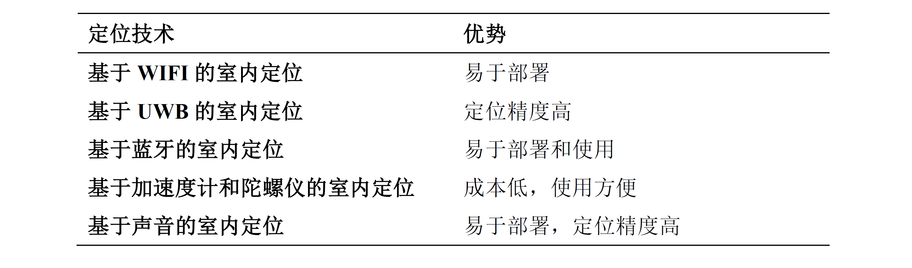
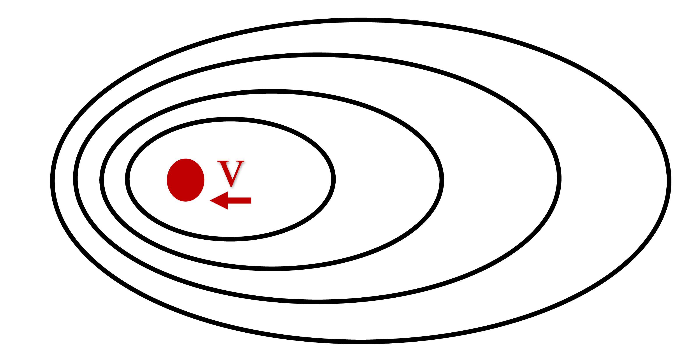

# 声波感知技术简介

## 技术背景

随着移动设备的快速普及，近年来，各式各样基于无线感知的物联网应用如雨后春笋般涌现出来。在这些应用之中，基于声波的感知技术因其精度高、设备要求低等特点，受到了学术界和工业界的广泛关注，将来更有可能被应用在我们日常的生产和生活中。

声波感知与其他无线感知技术比起来有着无可替代的优点。以位置信息的感知为例，基于声音的室内定位技术，是一种比较容易实现比较高精度的室内定位技术。只要场景中有音响和可录音的智能设备，基于声音的室内定位技术就可以使用。因此，这种技术具有成本低的优点。基于声音的室内定位技术的定位精度能够达到毫米级，因此其准确性上也有着一定的优势。下表是声波定位技术和其他几种常见室内定位技术的比较：

图. 几种室内定位技术的比较

**1. 基于信号传播时间的感知方法**

早期的基于声音定位和追踪的工作都是基于到达时间/到达时间差（TOA/ TDOA）实现的，例如K. Liu 等人的工作 [13][14] 能够实现在室内精度为数十厘米的声音定位。Guoguo [15] 也是一项基于声波信号的室内高精度定位工作，该工作利用一个事先设置的beacon去传输经过调制的声音脉冲。手机接受到beacon后根据到达时间来计算手机的距离。BeepBeep[18]通过计算声音信号的传输时间来计算手机的距离。即每一个手机在发出声音信号的同时，记录其他手机发出的声音，通过记录声音信号到达的时间和发出时间的时间差来判断手机之间的距离。BeepBeep的一个优点是不要求手机的时钟同步，而时钟同步是同类工作中常见的难点和挑战。

**2. 基于多普勒效应的感知方法**

近些年出现了很多基于多普勒效应进行测距和定位的系统。使用多普勒效应来实现定位和测距的原理如下。根据多普勒效应，我们可以测量一个移动的目标的速度。速度计算的公式如下：

$$
v=\frac{F_c}{F}c
$$

图. 多普勒效应原理

$F$ 表示原始的信号频率, $F_c$ 表示由于相对运动而产生的频率偏移, $v$ 表示目标运动的速度, $c$ 表示空气中的声速。由于速度对时间的积分等于位移，因此通过计算出速度并进行积分，我们就可以得到一段时间内目标设备运动的距离。在已知目标初始位置的情况下，我们可以计算得目标的最终位置，从而实现对目标的定位追踪。

为了计算物体运动的速度，我们必须得到相对运动而产生的信号频率偏移 $F_c$ 。一般来说，得到 $F_c$ 的方法是将接收到的声音信号做短时离散傅里叶变换（STFT）。这样一来我们就能得到该信号的时频图。如果原始信号的频率是固定的，那么通过计算原始信号频率和在某一时刻接收到的信号频率的差，就能得到频率偏移 $F_c$ 。STFT是一种基于滑动窗口的傅里叶变换方法，它的原理是一个滑动窗口在原信号上移动，对每个窗口内的信号做傅里叶变换，这样就可以得到该窗口时间范围内，信号的频域信息和频率偏移。

假设窗口的长度是 $L_w$, 采样率为 $F_s$, 那么频率精度DF就可以用如下公式计算得出:

$$
D_F = \frac{F_s}{L_w}
$$

如果我们知道了原始信号的频率 $F$ 和声速 $c$，我们就可以计算出基于多普勒效应的追踪方法在速度上的精度。

$$
D_v = \frac{D_F}{F}c
$$

一般来说，越短的窗口在时域上效果越好，而在频域上效果较差。长窗口频域上效果好，但是时域上效果差（时延比较高）。

**3. 基于信号相位信息的感知方法**

在声音信号传播的过程中，信号源的信号相位不断变化，因此通过提取接收信号相对于相对于信号源的相位差异，可以分析信号传播路径的变化。LLAP[32] 提出了一种根据相位进行测距和定位的手段。在物体运动的过程中，反射信号的相位会随着物体与声源之间的距离变化而产生变化。根据这个原理，LLAP使用一个手机同时作为信号源和接受端。它提出了一种高效的算法来计算反射信号的相位，并据此测算出距离。在双麦克风的条件下，LLAP可以实现二维定位。

**声波感知的基本场景**

基于声音的室内定位一般采用扩音器作为声音信号的发射端，使用麦克风作为声音信号的接收端。如果发射端和接收端在同一个设备上，利用对目标的反射信号来进行定位，那我们就认为这种定位是不依赖于设备（Device Free）的。如果发射端和接收端不在同一设备上，发射端或者接收端就是被定位目标的话，那我们就认为这种定位是依赖于设备的（Device Based）。

由于声音信号在反射后衰减较大，因此不依赖于设备的声音定位往往定位距离受限。当然，不依赖于设备的声音定位也有比较灵活，部署方便等优点。不过，依赖于设备的声音定位和不依赖于设备的声音定位，使用的技术和原理都是相通的。本文中讨论的基于声音的室内定位，主要指依赖于设备的基于声音的室内定位。

**声音定位的主要指标**

精确度：精确度是基于声音的室内定位技术的评估中最主要也是最重要的指标之一。精确度越高，那么定位的误差越小，依据此方法搭建系统效果也就越好。

时间延迟：时延是基于声音的室内定位技术中的另一项比较重要的参考依据。在一些对实时性要求比较高的应用中，较低的时间延迟有利于提高应用的使用体验，或者为其他工作节省计算资源。

鲁棒性：在基于声音的室内定位中，鲁棒性也是重要的指标之一。一般而言，声音定位系统的鲁棒性主要指对不同噪声环境的耐受能力。

