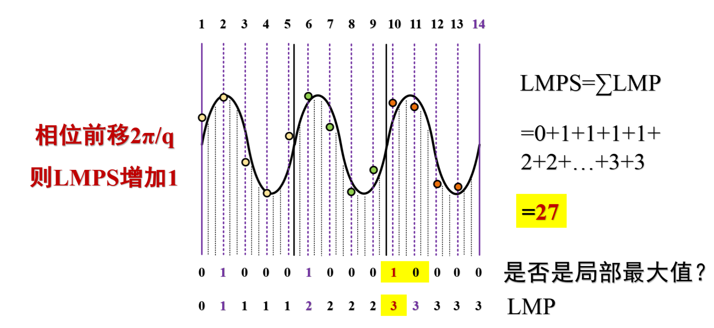

# 主动式声波定位方法

现有的基于声音的测距方法一般是基于相位进行测距，在这种方法中，先计算出声音信号在目标设备移动前后的信号相位变化值 $\Delta\phi_0$ ，再根据 $\Delta d = \lambda \Delta\phi_0$ 求出目标移动的距离。

在这种方法中，为了提取接收信号与信号源之间的相位差，需要用接收到的信号与已知的原始发射信号相乘，然后再使用低通滤波器来进行低通滤波，从而求出声音信号相位。Vernier[1]提出了一种新的方法，能够在不进行滤波的情况下推算出相位，从而通过相位计算进行测距。

在介绍这种方法之前，我们先来定义几个变量，用来简化对方法的说明：

- LMP（Local Max Prefix）：在一个采样序列中，我们规定第一个采样点的LMP为0。从第二个采样点开始，如果某一个点的值（就是该采样点的强度），既大于它的前一个值，又大于它的后一个值，那么这个点的LMP值为它的前一个点的LMP值加1，否则该点的LMP值等于其前一个点的LMP值。

- LMPS（Local Max Prefix Sum）：在一个窗口中，所有采样点的LMP的和。

图. LMP的定义

下面对测距方法进行描述：

假定在时间 $t_1$ 和时间 $t_2$ 两个时刻，录音设备取得两个等长时间窗口的音频数据 $w_1$ 和 $w_2$ 。每个窗口中有恰好有 $p$ 个周期的声音信号，这 $p$ 个周期的信号刚好对应着 $q$ 个采样点。$w_1$ 和 $w_2$ 两个时间窗口内信号的LMPS分别为 $L_1$ 和 $L_2$ 。由于多普勒效应，在相邻的两个窗口内信号的相位变化为 $\Delta\phi = (L_2-L_1)2\pi/q$，在两个窗口的时间长度内，信号源的位置变化为 $\Delta d=\lambda\Delta\phi-c(t_2-t_1)$，其中$c$是声音在空气中的传播速度。

下图给出了一个通过LMP计算信号源距离变化的例子：在一个时间窗口内，$p = 3$ ，$q = 13$ 。当信号相位变化 $2\pi / q$ 时，LMPS增加1。也就是说，每当LMPS增加1，我们就可以说，信号的相位变换增加了 $2\pi / 13$。距离变化了 $\lambda / 13$。

图. 基于声音的测距方法——相位变化时的LMPS

在采样率不变的情况下，我们可以通过调节发射信号的频率来调节 $p$ 与 $q$。例如，在采样率为 $44100 Hz$ 的情况下，如果取声音频率为 $20000 Hz$，那么 $p = 200$，$q = 441$。在这种情况下，此方法的定位精度为 

$$
\frac{340}{20000 \times 441} m = 0.0000385 m = 0.0385 mm
$$

如下图所示，与其他声音定位方法相比，本文中提出的方法既不需要傅里叶变换，也不需要低通滤波。因此其处理速度会比方法的处理速度高，需要消耗的计算资源更少。

图. 各种基于声音定位方法的比较

为了计算被追踪设备在移动过程中的相位变化，我们使用一种基于窗口的相位计算方法，在$t_1$时刻，计算窗口$w_1$中的LMPS，在$t_2$时刻计算窗口$w_2$的LMPS，然后根据二者LMPS的差值计算出这两个时间窗口中的相位变化。

基于窗口的相位计算的算法如下图所示。根据前文的推导，LMPS每增加1，相位变化 $2\pi / q$。

图. 基于窗口的相位计算方法

值得一提的是，声音信号的相位是随着时间增加而线性增加的，其增加的速度等于其角频率：

$$
w=2\pi f
$$

在计算距离的时候，要先把时间对相位的影响去除掉，得到声音信号的初始相位。根据初始相位变化 $\Delta\phi_0$，就可以求出被追踪设备移动的距离。

$$
d=\frac{\lambda\Delta\phi_0}{2\pi}
$$

假设被追踪设备的初始位置为 $x_0$，那么设备当前位置可以表示为：

$$
x=x_0+d
$$

**基于声音的二维定位方法**

如下图所示，假设被追踪设备的初始位置为C（x0，y0），在一定时间内移动到D（x1，y1）。因为初始位置的坐标已经给定，因此AC和BC之间的距离就可以求出。只要知道设备相对与A、B两个声源的距离变化 $a_1$ 和 $a_2$，就可以得到AD和BD的长度。由于AB之间的距离可以事先测量，因此在三角形$\Delta$ABD中，三个边都是已知的，那么D点的坐标（x1，y1）就可以求出了。

图. 二维定位方法

