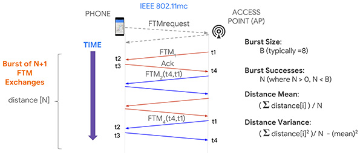

# WiFi ToF的测距方法
这一部分测距工作是在WiFi场景中对前面[无线测距](https://iot-book.github.io/12_无线测距/S2_基于传播时间测距/)部分的直接应用。基本的思路是双边双向测距，实现两个WiFi设备之间的精准ToF测量。
最新的WiFi支持ToF进行测距。WiFi ToF通过测量无线AP (`Responder`)与基站 (`Initiator`)之间的信号的往返时间来对距离进行估计。在IEEE 802.11mc中，WiFi Fine Time Measurement（WiFi FTM）协议被提出，用以实现较高精度定位。

## 协议原理

由于基站与AP之间的时间无法做到纳秒级的时间同步，单程的信号在发射端与接收端之间的时间戳的差并不能够反映准确的信号传播时间。而利用双向单边测距的原理即可在基站与AP之间完成往返时间的测量。测量的具体过程如下：基站首先向AP端发送一个FTM请求（FTM request），接下来AP端会向`Initiator`端回复进行确认，并发送正式的FTM帧，其中FTM帧在AP端的天线上的发送时间为$t_1$，在基站端的接收时间为$t_2$，基站在接收到FTM帧后也会立即回复，并记录发送的时间$t_3$，这次回复在AP端被接收到的时间是$t_4$

<center>
    
    <br>
    <div style="color:orange; border-bottom: 1px solid #d9d9d9;
    display: inline-block;
    color: #999;
    padding: 2px;">FTM测距原理1 图片来源：<a href="#refer-1">[1]</a></div>
</center>

根据双向单边测距的原理，距离$D$可以由以下公式给出，其中$c$是光速。

$$
2*D = ((t_4-t_1)-(t_3-t_2))*c
$$

<center>
    
    <br>
    <div style="color:orange; border-bottom: 1px solid #d9d9d9;
    display: inline-block;
    color: #999;
    padding: 2px;">FTM测距原理2 图片来源：<a href="#refer-1">[1]</a></div>
</center>


在实际的FTM协议中，FTM帧会重复的出现在一个`burst`的周期内，利用多次测量的平均值来对测距误差进行降低。
在FTM协议中，只有`Initiator`端可以获取距离信息，这是因为在一次`burst`请求中，第N+1次FTM帧（由AP发往基站端）中会携带有上一次FTM应答的$t_1$以及$t_4$信息。这就意味着N+1次FTM应答只能获取N个距离值，并且只有在基站端才能获取完整的$t_1$到$t_4$的时间戳信息。

> 思考为什么多次测量能降低误差，能降低多少误差？

## 如何进行FTM测量
目前，已经有很多支持FTM的路由器和相关设备等，在较新的Linux内核(>9.0)的Android系统上，都已经完善了对于FTM协议的支持。

**Android端FTM协议测量**
1. FTM协议必须基于特定的硬件平台实现，目前支持的设备可以参见Google的[开发者文档](https://developer.android.com/guide/topics/connectivity/wifi-rtt#supported-phones)
2. 需要获取以下权限
~~~xml
<uses-permission android:name="android.permission.ACCESS_WIFI_STATE" />
<uses-permission android:name="android.permission.CHANGE_WIFI_STATE" />
<uses-permission android:name="android.permission.ACCESS_FINE_LOCATION" />
~~~
3. 必须从已扫描获取的WiFi列表中构建测距请求

相关样例代码如下
~~~java
/*
* 检测设备是否支持WIFI RTT
*/
if (getPackageManager().hasSystemFeature(PackageManager.FEATURE_WIFI_RTT)) {
    // 设备具有WIFI RTT支持
} else {
    // 设备不具有WIFI RTT支持
}
// 构建测距请求
RangingRequest.Builder builder = new RangingRequest.Builder();
builder.addAccessPoints(ftmAPs);
RangingRequest req = builder.build();
Executor executor = new DirectExecutor();
wifiRttManager.startRanging(req, executor, new RangingResultCallback() {
    @Override
    public void onRangingFailure(int code) {
        Log.d("onRangingFailure", "Fail in ranging:" + Integer.toString(code));
        runOnUiThread(() -> {
            Toast.makeText(MainActivity.this, "测距请求失败", Toast.LENGTH_SHORT).show();
        });

    }

    @Override
    public void onRangingResults(List<RangingResult> results) {
        Log.d("onRangingResults", "Success in ranging:");
        // 处理数据

    }
});

~~~

**Linux端FTM协议测量**

对于Linux Kernel在5.4及以上的系统，直接安装最新版本的`iw`及`hostapd`工具，以及较新的Intel无线网卡（如AX200、AX201），即可搭建测距测试平台。
执行测距需要设置`Responder`端 (AP)与`Initiator`端 (phone)，下面给出如何进行测距的操作说明：

**`Responder`端**

首先创建配置文件`hostapd.conf`。

```bash
# 改成机器上的网卡接口名称
interface=wlp2s0
driver=nl80211
# 改成网卡的MAC地址
bssid=c8:58:c0:a6:67:bf
# 改一个合适的SSID
ssid=FTM-TEST
hw_mode=g
ieee80211n=1
ht_capab=[HT40+][SHORT-GI-40]
channel=2
wmm_enabled=1
wme_enabled=1
ctrl_interface=/var/run/hostapd
ctrl_interface_group=0
ftm_`Responder`=1
ftm_`Initiator`=1
```

启动 AP

```bash
sudo hostapd <配置文件路径>
```

若无法启动，可以尝试重启网卡：

```bash
sudo nmcli radio wifi off
sudo rfkill unblock wlan
sudo ifconfig wlp2s0 up # 改成当前的网卡接口名称
```

**`Initiator`端**

使用`iw`工具扫描 AP列表，获取支持FTM协议的AP：

```bash
sudo iw dev <interface> scan > scan.txt # 输出到文件
```
在扫描结果的文件中搜索 `FTM`，找到支持FTM的 Wifi，记下 `MAC 地址` 和中心频率`freq`。例如（已省略部分信息）：

```
BSS 20:16:b9:70:8a:91(on wlp4s0)
	freq: 2417
	SSID: FTM-TEST-2
	Extended capabilities:
		 * FTM `Responder`
		 * FTM `Initiator`
```


创建配置文件，配置文件中，一行代表一个 `Responder`，其格式如下：

```
<addr> bw=<[20|40|80|80+80|160]> cf=<center_freq> [cf1=<center_freq1>] [cf2=<center_freq2>] [ftms_per_burst=<samples per burst>] [asap] [bursts_exp=<num of bursts exponent>] [burst_period=<burst period>] [retries=<num of retries>] [burst_duration=<burst duration>] [tb]
```

执行测距：
```bash
sudo iw <interface> measurement ftm_request <配置文件路径>
```

从使用的效果来看，现在FTM测量仍然属于不断完善的阶段，另外系统中现在能够拿到的都是直接FTM测量的结果，即上述双边双向测量的直接结果，如果能够拿出来更多的底层测量时间信息，这个结果仍然能被进一步优化。

## 参考文献
1. [How To Achieve 1 Meter Accuracy In Android](http://gpsworld.com/how-to-achieve-1-meter-accuracy-in-android) <div id="refer-1"></div>