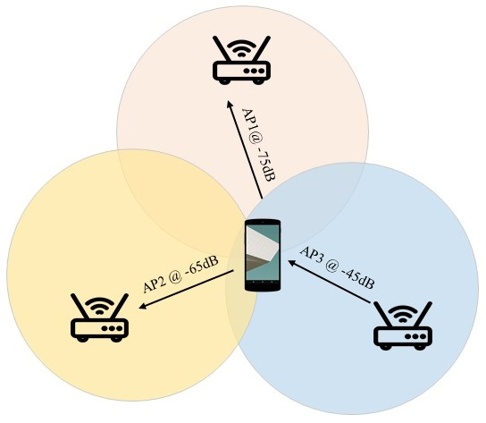

# Wi-Fi指纹定位 ?? WiFi BFI是否需要加进来写一段。

在[第13章 “无线定位”](https://iot-book.github.io/13_无线定位/S4_信号指纹定位算法/)这一部分，我们已经介绍了基于指纹定位的基本思路。
下面我们介绍如何利用Wi-Fi指纹定位。Wi-Fi指纹通常包括两种最常用的信号特征：无线信号多径特征和接收信号强度(Received Signal Strength, RSS)。

电磁波在空间中传播时，可以在光滑的平面（比如建筑物的墙壁、地板）上进行反射，遇到锐利的边缘会发生衍射，遇到小型的物体（比如树叶）会发生散射。发射源发出的信号可以通过多条路径传播到同一位置，因此在一个位置上会接收到多路信号的叠加，每条传播路径有不同的能量强度和时延。如果信号的带宽足够大，那么在接收器上可以分解和处理各个多径分量。不同位置收到信号的强度也各不相同。某个位置上得到的多径特征和接收信号强度取决于实际的环境，是独特的，因此能够被用来作为位置指纹。

如果一个移动设备能接收到来自多个发射源的信号，或者固定的多个基站都能感知到同一个移动设备，那么我们可以使用来自多个发射源或者多个接收器的RSS组成一个RSS向量，作为和位置相联系的指纹。这个就是典型的WiFi位置指纹。大多数WiFi的网卡可以测得来自多个AP的RSS（可能是依次测量）。现在在大多数室内场景，移动设备常常可以检测到多个AP，因此使用来自多个AP的RSS作为位置指纹是有意义的。

图. RSS定位示意

 

在WiFi网络中，AP常常要周期性发送beacon帧，包含了一些网络信息、服务组ID（无线网络的名字）、支持的传输速率，以及一些其它的系统信息。这个beacon帧是用在WiFi中的很多的控制帧之一，它大约100ms发送一次，RSS通常是使用这个beacon帧来测量的。
beacon帧是未加密的，所以即使是一个封闭的网络（移动设备未能连接上）也能用来定位。beacon帧接近于周期性地被发送，但并不是完全周期性的，当检测到传输媒介阻塞的时候需要延迟发送，一旦检测到不阻塞的时候就发送，下一次发送还是会在之前预计的100ms时刻，即使离上一次发送还不足100ms。更进一步，如果AP工作在多个信道上，为了避免冲突，在测量RSS之前，移动设备必须花时间扫描各个信道。

[TODO加上更多内容]

我们自己提出了一个非常简单方便的利用指纹分辨不同用户的方法[1], 另外还有很多复杂的，例如基于CSI的指纹定位方法等，基本思路我们在无线定位这一部分进行过介绍，这里就不再次展开了。

## 参考论文
1. [Linsong Cheng, Jiliang Wang: How can I guard my AP?: non-intrusive user identification for mobile devices using WiFi signals. MobiHoc 2016: 91-100](http://tns.thss.tsinghua.edu.cn/~jiliang/publications/MOBIHOC2016-NiFi.pdf)

