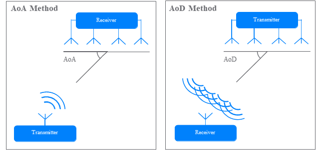

# 蓝牙寻向基本原理

2019 年初，蓝牙 5.1 标准增加了寻向功能，可以用来检测蓝牙信号的方向，理论上可以进一步提高蓝牙定位的精确的。
蓝牙 5.1 寻向功能依靠天线阵列在空间上的不同位置带来时间上的相位偏差。根据被定位设备的上下行模式的不同，可以将寻向功能分成 AoA 到达角度法（Angle of Arrival）和 AoD 出发角度法（Angle of Departure）。

在 AOA 定位场景中，被定位设备，比如贴在被定为物上的便携蓝牙标签，用单根天线广播数据包。接收端拥有一组天线阵列，接收这一个数据包。由于天线阵列中不同天线到发送端的距离不同，这一距离差就会带来相位差，即不同天线在同一时间接收到的信号的相位有一定差异。接收端会快速轮询各个天线，每根天线都会记录若干个采样点的 I/Q 值（见图 2.2），这些 I/Q 值可以算出当前采样时刻的信号相位，从而根据天线间的相位差即可算出入射角 AOA。

图. AoA/AoD 基本模式

图. I/Q 值和相位的关系

AOD定位场景与AoA的方向相反，被定位的物体需要通过天线阵列同时广播定位用数据包，而接收者用单根天线接收。类似地，由于距离不同，接收者在同时接收天线阵列的广播信号时，接收到不同天线的信号相位是不同的。发射者交替使用发射阵列中的各根天线发射，接收者在每次天线切换时就会感知到相位的跳变，据此可算出距离差，从而完成定位。AOA定位只需要两个固定定位节点，而AOD如果不知道阵列的确切朝向，需要3个节点才能完成；除此之外，AOD中被定位者需要拥有天线阵列，而这一点会受到被定位物体的空间和能耗的限制；AoD优势在于其可以提供朝向信息，因此往往用于室内定位系统（Indoor Positioning System：IPS），给用户在体育馆、商场等地形复杂的室内环境（这些环境下由于音响，金属物体等干扰，手机指南针都会时常失灵）提供精确便捷的导航。

在蓝牙5.1中伴随着AOA和AOD的引入，还定义了固定频率扩展信号（Constant Tone Extension：CTE），这是在包尾附带的若干个0或者1，在蓝牙协议中，这一串0或1会被翻译成频率稳定的正弦波发射出来。蓝牙5.1标准规定，无论主从设备都可以发起一个LL_CTE_REQ PDU，要求对方发送CTE信号；其中的 CTETypeReq 字段也描述了请求的定位模式是AOA还是AOD，以及发送时天线的切换间隔。同时，蓝牙 5.1 也对天线阵列接收/发送的时间表做出了明确的规定，见下图。

图. 蓝牙 5.1 规定的 AOA/AOD 时间表

下面以 AOA 为例介绍蓝牙定位的基本原理。
蓝牙定位中计算 AOA 的具体原理如下：
AOA 定位中，发射端用单根天线发送一段正弦波，接收端用天线阵列接收这一信号，计算信号的入射角。先假设定位时天线阵列能同时接收信号。下图绘制了接收端的情况。

图. AOA 定位原理图

发射天线向接收端天线阵列中，相距位d的两根天线阵列接收来自被定位蓝牙设备发出的蓝牙信号，以图中蓝色箭头表示。由于这两根接收天线到发射天线的距离不同，这两根天线收到的信号会出现一个恒定的相位差。而因为发射端到天线的距离远大于 d，发射天线这两个接收天线的路径可以视为平行。在这一假设下，从一根天线向另一根作垂线，截取出的$r$直角边就是路程差。显然，在这个直角三角形中，有：

$$ r = d\sin{\theta} $$

$\theta$表示AoA。另一方面，相位差与路程差的关系为：

$$ \Delta\phi = \frac{2\pi}{\lambda} r $$

其中$\Delta\phi$代表相位差，$\lambda$表示蓝牙波长。根据上述公式，可以推导出AoA：

$$ \theta = arc\sin{\frac{\lambda\Delta\phi}{2\pi d}}$$

在算出方向角后，就可以根据被定位设备到不同定位点的方向角算出其具体位置。
AOA场景下，只要知道接收天线阵列的位置和朝向，只需要两个点即可完成定位。每个定位点感知到的方向角都会将被定位设备约束在一条直线上，而两条直线的交点即为其确切位置，如下图：

图. AOA 两点定位

而AOD场景下，如果不知道发射天线的确切朝向，需要三个接收天线才能锁定其位置。这是因为接收天线的朝向不确定，增加了一个自由度。或者说，被定位点感知到接收天线之间的夹角，两个接收天线阵列能确定？？只能将其定位在一个圆上，而三个接收天线可形成两个夹角，画出两个圆，其交点即为目标位置。

图. AOD 三点定位

三根天线的情形下不止能完成定位，也可以顺带算出当前发射天线的朝向，这是AOA做不到的。这在导航系统等应用中至关重要。在仅有两根接收天线的场景下，可以通过指南针等额外手段获得其朝向，完成定位。由于知道了当前朝向即可推算地球坐标系下接收天线的方位角，这种定位的原理和 AOA 相同。不过，在这种情况下，定位结果对朝向信息较为敏感，在室内定位场景中，指南针往往会有较大的误差，导致在只有两根接收天线时，这种定位方式的误差较大。

[TODO 这一部分硬件如何使用，定位算法开发材料后面整理好了再加上]
