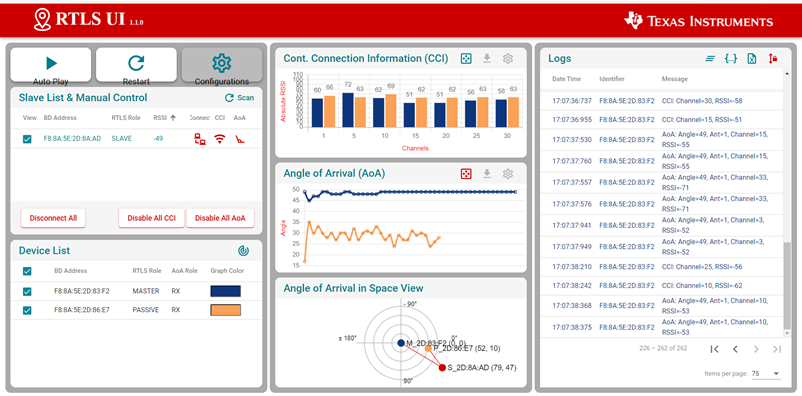
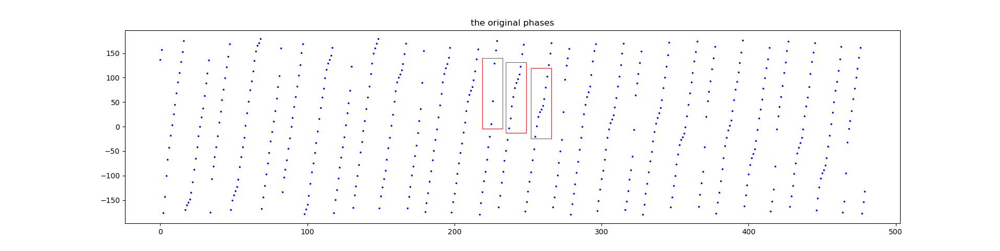
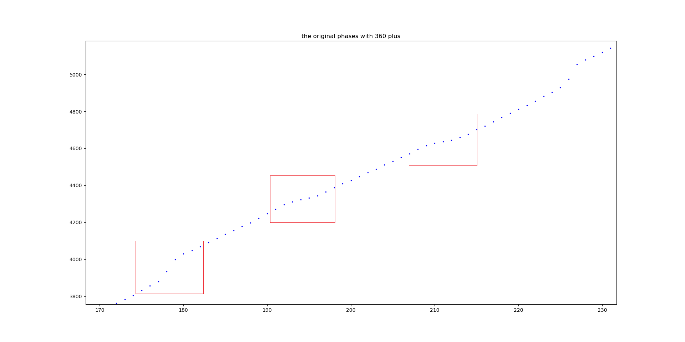
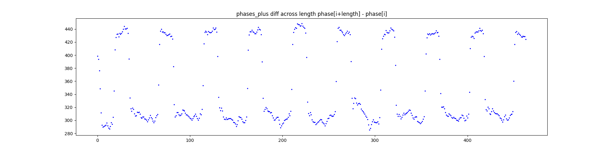

# 定位算法实现和问题

## 设备基本情况
下面介绍基于德州仪器最新的 AoA 定位模组的硬件部分和软件部分。

AoA 定位模组的硬件部分包括 SimpleLink CC26X2R LaunchPad 开发板和 BOOSTXL-AoA 蓝牙天线模组。前者为一长方形可编程开发板，后者为一三角形电路板，两侧各有三根天线，可焊接在开发板上，用于接收蓝牙信号和计算入射角 AoA。一个完整的蓝牙 AoA 定位场景需要至少三片 SimpleLink CC26X2R LaunchPad 设备和至少两片 BOOSTXL-AoA 模组构成。

图. SimpleLink CC26X2R LaunchPad 开发板

图. BOOSTXL-AoA 蓝牙天线

软件部分包括在电脑中运行的控制代码和烧录到LaunchPad 开发板中的固件组成。一共有三种固件，烧录后在蓝牙通信中分别扮演 Master，Passive 和 Slave 的角色；每个定位场景需要一个 Master，一个 Slave 和一个以上的 Passive 节点，其中烧录了 Slave 的开发板固定在被定位的物体上，位置未知，Master 和 Passive 位置固定且已知，并通过 usb 和同一台电脑相连。Master 给 Slave 发送控制信号使 Slave 广播定位信息，而后由 Master 和 Passive 接收这些广播，分别计算 AoA，由两个及以上的 AoA 结果即可算出 Slave 的位置。烧录 Master 和 Passive 的开发板需要装有 BOOSTXL-AoA 模组，以计算 AoA；烧录 Slave 的开发板由于只需要收发信号，不需要计算 AoA，可以通过开发板上自带的单根天线完成，不需要装备 BOOSTXL-AoA 模组。

## 实验环境的配置和搭建
(1) 安装 SDK：从这个网址下载安装 SimpleLink CC13X2-26X2 SDK 。在安装目录下包含了需要用到的所有软件，包括电脑运行的控制代码和烧录用的 Master，Passive 和 Slave 三种固件。
电脑端的控制代码在<SimpleLink CC13X2 / CC26X2 SDK> → tools → ble5stack → rtls_agent 文件夹。使用时需要python3环境。在使用前需要按照该文件夹内Readme的指示，在 rtls_agent 目录下执行

        pip.exe install -r requirements.txt 
安装所需要的 python 包，再执行

        package.bat -c -b -u -i 

将 rtls_agent 文件夹下的库文件安装好。注意，package.bat 中硬编码了 python 的路径，使用时需要编辑该文件的前 8 行，将 PYTHON3 和 PIP3 两个变量值设置为正确的 python.exe 和 pip.exe 的路径。

(2) 烧录固件：烧录的固件在<SimpleLink CC13X2 / CC26X2 SDK> → examples → rtos → CC26X2R1_LAUNCHXL → ble5stack 目录下，有名为 rtls_master, rtls_slave, rtls_passive三个文件夹，分别对应master，slave和passive三种角色的固件。这里rtls是real time localization system的缩写。每个固件都是一个CCS项目，烧录时需要安装Code Composer Studio，打开各个目录下的CCS工程文件，对工程进行编译，然后使用CCS的debug功能将代码载入开发板；如果这一过程受阻，也可以将编译好的二进制文件用其他工具烧录入开发板的flash中。

(3) 安装硬件：图 4.1 与图 4.2 为传统开发板与蓝牙天线示意图，每个开发板配有一套天线用于收发数据。根据 AoA 计算原理，需要使用天线阵列接收蓝牙信号。因此需要将 BOOSTXL_AoA 模组与 CC26X2R1 组件连接起来，使用 BOOSTXL_AoA 中的天线阵列。在使用过程中，烧录了 master 和 passive 的开发板上均可安装 BOOSTXL-AoA 模组用来接收蓝牙信号。由于安装过后需要使用外部天线，因此需要对传统 CC26X2R1 开发板进行修改，具体修改步骤可参照 https://dev.ti.com/tirex/explore/node?node=AHYhhuDNTaRXzkOlahOlvA__pTTHBmu__LATEST

## 数据的获取和定位原理
在定位实验中，我们会将 Master 和 Passive 开发板部署在需要定位的环境中，将他们的天线组水平放置在固定位置，并测量这些天线的中心位置和朝向。受限于 AoA 的原理，使用一组直线排布的天线阵列时，只能完成 180°范围内的定位，而无法判断目标位置在天线的哪一侧；为了达到最高精度，应尽可能将天线放置在场景边缘。Master 和 Passive 都需要通过 USB 和同一台电脑相连，用于传回 AoA 数据等。在部署完毕后，即可定位 Slave 所在位置。Slave 只需要向四周发送信号，因此不需要天线阵列；其行为是 Master 通过蓝牙远程控制的，因此也不需要连接电脑，只要有充电宝等便携能源给其 usb 接口供电即可。 

在布置好实验环境后，只要将 Master 和 Passive 接入电脑，并启动控制代码即可。在<SimpleLink CC13X2 / CC26X2 SDK> → tools → ble5stack → rtls_agent → rtls_ui 文件夹下给出了带有图形界面的控制工具，双击 rtls_ui.exe，等待其加载完成即可在浏览器中看到TI设计的可视化页面。待该应用扫描端口，发现连入usb的SimpleLink开发板后，按照提示选中并连接Master和Passive设备，然后点击auto play按钮即可自动完成整个定位流程，并实时地将AoA结果输出到屏幕上。设备可能会出现问题导致断开连接或无示数等情况，这时点击restart，将设备重新初始化，再点击auto play即可。点击conimagesurations按钮可以设置一些参数，其中比较重要的是connect_interval_mSec，其默认值是100，这虽然能达到较高的定位实时性，但会导致连接不稳定，容易断开。将connect_interval_mSec设置为300，以定位频率降低为代价，使连接更稳定，能满足较长时间的定位。

图. rtls_ui 界面示意图

使用图形界面的控制方法使用便捷，在设置里有少量参数可供调节，也有详尽的 log 文件将一切数据和活动输出，但毕竟缺乏灵活度和可拓展性。TI 还提供了使用 python 代码，通过 rtls_util 库提供的接口进行访问的方法。在<SimpleLink CC13X2 / CC26X2 SDK> → tools → ble5stack → rtls_agent → examples文件夹下有三个python文件，演示了各种通过rtls_util接口进行控制的方法。这些代码都是可以直接运行的，不过代码中硬省去了从usb串口中发现SimpleLink设备的过程，而是直接硬编码了各设备的串口。使用时需要在windows的设备管理器中找到Master和Passive对应的串口名称，并改写python代码再运行。三个python文件分别叫rtls_example_with_rtls_util.py，rtls_aoa_multi_conn_example.py和rtls_aoa_iq_with_rtls_util_export_into_csv.py。其中rtls_example_with_rtls_util.py提供了最简单最直接的定位示例，rtls_aoa_multi_conn_example.py演示了对多个Slave进行连接从而实现多目标定位的例子，而rtls_aoa_iq_with_rtls_util_export_into_csv.py会创建一个名为rtls_example_with_rtls_util_log的文件夹，并在其中存储.log文件和.csv文件，在csv文件中会写入此次定位各个采样点的I/Q值，方便后续分析。

图. python 代码运行示意图

这里 python 代码和图形界面的控制逻辑和执行流程都完全相同。

1) 通过扫描电脑的 usb 串口或硬编码的方式获得 Master 和 Passive 的串口信息，并用 rtlsUtil.set_devices() 接口保存这些信息；

2) 执行 rtlsUtil.reset_devices()，初始化设备；

3) 调用 rtlsUtil.scan() 通过 Master 设备扫描范围内的 Slave 设备，获取其设备信息；

4) 根据上一步扫描结果，调用 rtlsUtil.ble_connect() ，与 Slave 设备建立 BLE 连接；这里需要设置 connect_interval_mSec，按前述所说，默认值是 100，而设置为 300 时定位频率降低但连接更稳定不易断开；

5) 通过 rtlsUtil.aoa_set_params()，将一些 AoA 定位相关的参数，包括采样频率，切换天线的频率和规则等传给 Master 和 Passive，然后调用 rtlsUtil.aoa_start() ，启动定位流程。此后 Master 将不停地发控制信息给 Slave，命令 Slave 广播带有 CTE 的蓝牙包，而每个 Master 和 Passive 设备对每个蓝牙包都能算出一个 AoA 值，这些值将会源源不断地传回电脑，从而实现实时定位。

在获取了各节点收到的实时的 AoA 数据后，即可使用三角定位的方法，根据预先测得的各节点的位置和朝向算出 Slave 的位置。本实验也可以支持多目标定位。Master 可以和多个 Slave 同时建立连接，而每个 Slave 广播的包都带有其 Mac 地址，借此可以区分不同 Slave 的信息。Master 和 Passive 可以同时聆听多个 Slave 的广播包并分别计算 AoA，因此可以同时对所有 Slave 进行定位。

## 4. 数据处理
在常见的由天线阵列计算 AoA 的场景中，多根天线都是同时接收数据的。在同一时刻两根天线之间的相位差乘以波长即得到信号源到这两者之间的距离差，再用三角函数即可算得入射角。而 TI 提供的 SimpleLink 开发板通过依次轮询的方式使用天线阵列。在使用天线 2 接收信号时，根据天线 1 搜集到的采样点，可以推算出天线 1 此时应当收到的相位。具体操作为：

1) 对所有天线在其没有切换时，计算相邻两个采样点之间的相位差，并取平均

2) 如果每根天线采集 16 个采样点，则可以对整个采样序列计算第(i+16)个点减第 i 个点的相位差。这样间距 16 个采样点的两个点一定在不同两根天线上，这 16 个点中间一定会有一个天线切换过程。

3) 第 i 个点加上 16 倍“相邻点平均相位差”即为同一根天线第 i+16 个点应有的相位，和第 i+16 个点的真实值就形成了同一时刻不同天线的相位差对比

4) 第 i+16 点减第 i 点相位得到的差值，再减去 16 倍相邻点平均相位差，即可得到两根天线在同一时刻的相位差值。

5) 由于在轮询时，是对天线按照 1-2-3-1-2-3 的顺序采样的，因此这一相位差在 1-2 和 2-3 时应当比较接近，而在 3-1 时应当是相反数并且幅度变为 2 倍；因此对上述(i+16)-i 的相位差，再对 3-1 的部分乘以-0.5，然后整体取平均即可。伪代码如下：

        phase_diff =  [phase[i+1]-phase[i] for i in range(length - 1) if i%16 != 0 ] 
        avg_phase_diff = average(phase_diff)
        antenna_diff = [phase[i+16]-phase[i]-avg_phase_diff*16 for i in range(length - 16) ]
        antenna_diff_fixed = [ i if floor(i/16)%3 != 2 else -0.5*i for i in antenna_diff ]
        avg_diff = average(antenna_diff_fixed)
        avg_distance = avg_diff / 2 / pi * wavelength
        angle = arcsin(avg_distance / antenna_distance)

这里注意，相位的范围是-180°到 180°，相位增加到 180°时会循环变为负值，而不是每个采样点依次递增的；如下图，是某次实验某个数据包 512 个采样点的相位情况。红框标识了天线 3-1，1-2 和 2-3 的切换处，采样点增幅增加和放缓的例子。

图. 单蓝牙数据包相位变化情况

上图中可以看到，相位沿各采样点递增，每个变化周期中会有两次增速放缓和一次增速提升，这些就是切换天线的时刻。下面将超过 180°的点进行补偿使之不会到-180°，得到下图，可以更加直观地看到这些递增递减关系。

图. 补偿后单蓝牙数据包相位变化情况

图. 补偿后单蓝牙数据包相位变化情况(局部)

如果不进行 360°的补偿，直接计算相位差，直接减去 16 倍相位差似乎有失偏颇；不过由于天线间距不超过半个波长，天线间相位差不会超过 180°，在算出超过±180°的值时只需直接加减 360°即可。

上述是 TI 提供的，内置在烧录入 Master 和 Passive 的固件中的 AoA 计算算法。TI 的实验模组不仅支持将各采样的相位值通过 usb 反馈给电脑，也可以在芯片上自动计算 AoA。

<!-- 然而这一算法过于简单，仍有改进的空间以提高定位的精确度。下面阐述我们在实验中发现的一些现象和改进点：

(1) 实验中发现，天线切换时相位是连续缓慢变化，而非理想情况下的直接跳变。这是因为天线切换的时间表包含 sample slot 时间片和 switch slot 时间片，前者使用单根天线采集数据，后者留给硬件完成天线切换的过程。在 switch slot 中采集到的相位不再准确。因此，我们可以只取 16 个采样点中比较平稳的中间 8 个，舍弃边缘不准确的 8 个点，避免 sample slot 中的不准确的采样点影响相位差均值。

(2) 另外，我们也把“求相邻点相位的平均值”替换为这 8 个点的直线拟合。我们观察到，在每一根天线采样的 16 个点中，中间 8 个点基本都在同一直线上，而这条直线的斜率却不十分稳定，在每个数据包的 512 个点中有轻微的偏移。这样，如果对 512 个点整体取平均相位差，再施加到每一组 8 个点上就会有失偏颇。我们把计算相邻点相位差这一步，从求 512 个点的平均值，变成了求 8 个点拟合直线的斜率，这样能在每一个局部达到最精确的拟合效果，更直观地推算出在切换天线后，当前天线应有的相位值，便于算相位差。

(3) 我们观察到，第(i+16)减第 i 个点的相位差，按理想情况应当是阶梯状，在每根天线的 16 个点内应为保持不变值。然而实验发现每 16 个点内变化很大，而且在这 16 点区间内变化率为一条直线，说明有某种不断积累的误差，在每根天线的第 1 到 16 个点不断累积。并且每根天线都似乎有自己固有的直线斜率，这一累计误差和各天线相关。如图 4.7。

图. 相邻两根天线相对采样点差值变化情况

由于蓝牙信号是稳定的正弦波，我们认为问题只能出在采样点处，采样点可能因为某种原因没有在应有的时刻采样，即采样率不稳定。我们按照信道和正弦波频率信息，可以推算出不切换天线时应有的相位和时间关系，从而计算出当前的采样率；对采样率进行平滑滤波并代入数据中，可以对误差进行适当的修正。 -->

<!-- ### 5. 后续工作
后续的进一步研究方向主要有：

(1) 分析出上述 4.4 (3) 提到的的各天线的累计误差的本质和来源，从而找到合适合理的误差消除方法。这种误差具有极强的规律性，或许可以通过在固定环境下重复测量，或者对不同 AOA 角度进行精确测量，将测得的数据和 ground truth 对比，找出累计误差的分布规律。

(2) 调整采样过程中的各种参数，例如，如果能降低天线切换频率，对每根天线采样 128 个采样点的话，依然可以在 512 个采样点的数据包中完成一轮切换，而这种情况下数据点更多，切换天线的时间占比更小，更容易排除切换天线带来的误差。

(3) 对整套 AOA 设备的性能进行测量。在可消除的误差基本排查干净后，对 AOA 设备在各角度下的精确度进行测量，验证或推翻之前观测到的“在正对天线阵列时更加准确”的观点。可根据结论设计进一步的研究方向和应用场景。 -->
