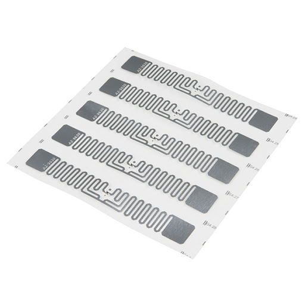
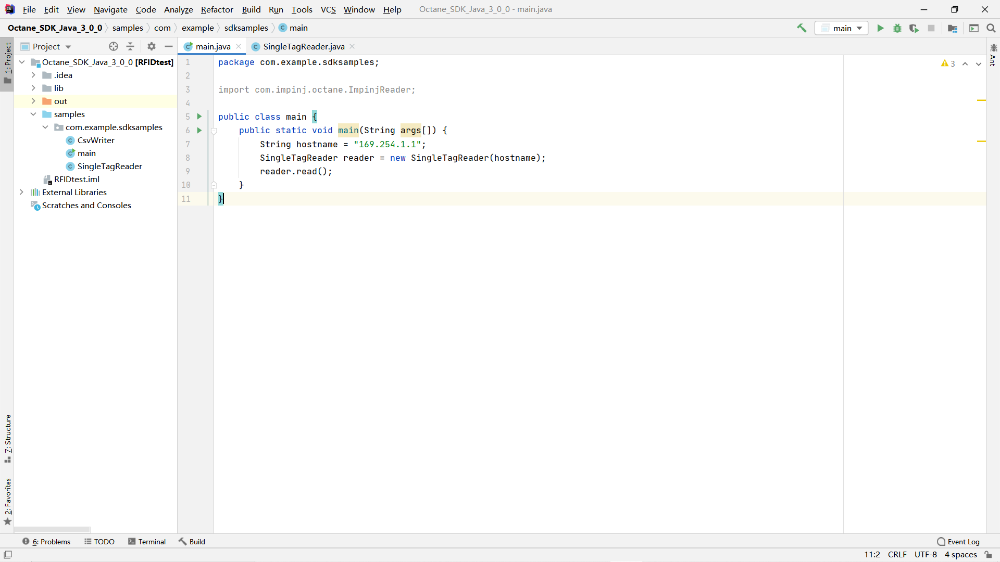

# Backcatter感知
前面介绍了不同的backscatter技术，基于backscatter信号，我们也能够实现不同的感知。？？此处加上我那篇CCCF上的文章。

## RFID 追踪
这里我们以RFID的追踪为例，介绍一个基于RFID技术的一维追踪系统，利用RFID阅读器读取RFID标签的相位，并将追踪结果实时显示在程序界面上。

实验设备：
ImpinJ Speedway R420 阅读器：（[官方网址](https://www.impinj.com/products/readers/impinj-speedway)）

图. RFID阅读器

配套天线：

图. RFID天线

RFID标签：

图. RFID标签

## 编程环境及IDE

IntelliJ IDEA 教育版，openjdk-15 (java version "15.0.1")

Matlab R2020b

## 工程目录

工程文件在目录./code内

./code/Octane_SDK_Java_3_0_0 内为Java端控制阅读器的代码部分，使用IntelliJ IDEA打开该文件夹，如下图：

图. Java端程序

将RFID阅读器连接至电脑后，运行main.java即可将阅读器的信息读取出来，并通过tcp连接（具体代码位于SingleTagReader.java中）发送到本地的Matlab程序

./code/tcpClient.m 为Matlab端显示追踪结果的代码部分，使用Matlab打开该文件，在Java端程序运行后，运行tcpClient文件，即可在图中展示追踪结果，如下图：

图. Matlab端程序及结果展示界面

## LoRa backscatter感知
？？江晋彦补充