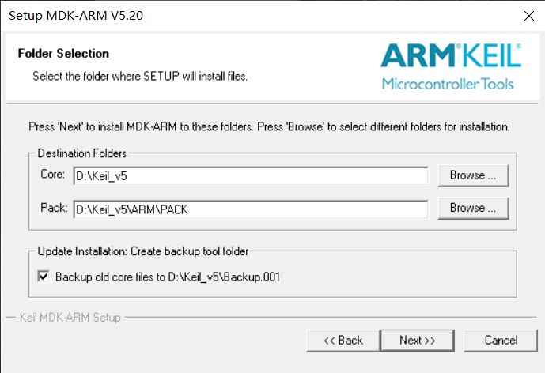
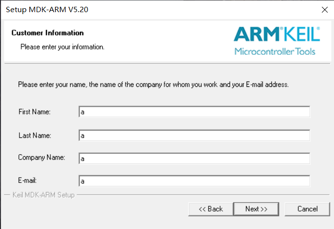
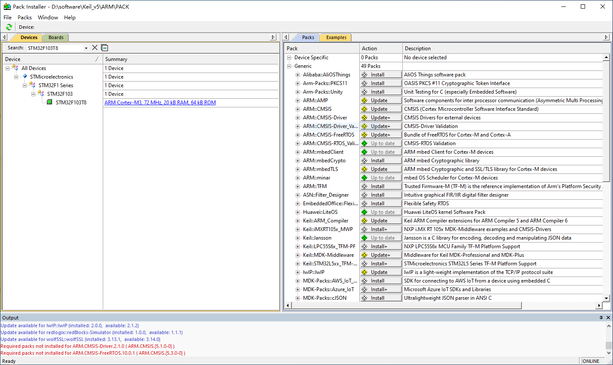
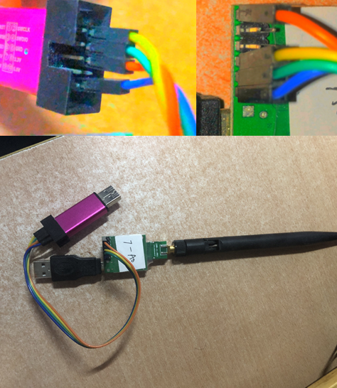
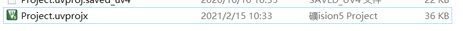
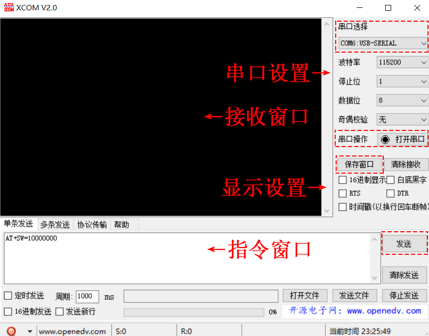

# UWB定位

超宽带（$Ultra Wide Band，UWB$）技术指的是带宽大于$500MHz$或者相对带宽大于$0.2$的无线通信技术。得益于很大的宽带，UWB具有纳秒级的时间分辨率，因此测距定位精度极高($\approx 10cm$)，被广泛应用在室内定位的场景。
下面我们介绍如何利用现有的UWB套件进行定位系统的开发和应用。

图. UWB定义

随着UWB芯片工艺优化和成本降低，越来越多的企业厂商都开始从事UWB的研究和定位系统开发，这其中比较有代表性的是Decawave、Ubisense等等。以Decawave研发的DW1000芯片为例。在收发信号的时候，芯片会打上纳秒级的时间戳，然后我们可以采用之前的TOA或者TDOA算法来测距或者定位。

图. UWB芯片

# 环境配置和套件开发
基于上述硬件，我们接下来进行环境的安装配置和套件开发，分为下面三个步骤：

1. Keil IDE的下载安装。Keil是一个常见的用于硬件开发，调试，代码下载的IDE工具。
2. ST虚拟串口驱动的配置安装。我们套件提供一个USB的接口，因此需要进行驱动安装。
3. UWB程序的烧录。环境配置好之后，我们使用ST-Link工具进行程序的下载烧录。
下面是较为详细的说明。
4. 串口数据的获取。

## 1. Keil IDE的下载安装
打开Keil官网搜索并下载Keil uVision 5(mdk520.exe)，安装Keil5。也可自行通过其他方式安装。Keil5安装过程是“傻瓜式”的，全程点击Next即可。

图. Keil5安装步骤1

这里选择软件的Core和Pack的安装位置，你一般放在有空间且简单的路径下。

图. Keil5安装步骤2

安装结束之后打开Keil，会出现包安装界面。注意右下角会显示加载的进度。

图. Keil5安装步骤3

通常情况下，等待加载结束之后，找到自己板子对应的硬件包，比如"STM32F0xxxx"，点击下载即可。

图. Keil5包安装

如果由于网络问题导致加载和下载过程过慢，用户可以多重复几次加载过程，或者直接去网上下载需要的包，比如"Keil.STM32F1xx_DFP.2.3.0.pack"，下载下来之后，然后点击File中Import按钮导入进来也行。

### 2. ST虚拟串口驱动的配置安装
虚拟串口驱动是由ST公司发布的驱动，请按照操作系统进行选择版本。驱动安装套路也是差不多的。我们提供的有VCP_V1.4.0_Setup.exe和dpinst_amd64.exe两个可执行程序，直接双击，按照安装流程，点击OK或Next，就可以完成虚拟串口驱动文件的安装。

安装完成后，将UWB节点与电脑连接，查看 我的电脑->属性->设备管理器，在“端口（COM和LPT）一栏，可以看到COMx（x为数字），说明ST虚拟串口驱动安装完毕，我们可以开始UWB节点程序的烧录了。如下示意

图. ST安装

### 3. UWB程序的烧录
首先是将UWB节点与ST-Link进行连接，然后最好同时将ST-Link烧录工具和UWB节点连接到电脑上。节点和ST-Link连接示意图如下：

图. ST-Link和UWB节点

主要是四根接线，即GND,5V,DIO和CLK。分别将节点和ST-Link对应的引脚连起来即可。

接下来使用Keil打开对应的节点程序，通常双击.uvprojx的文件即可打开

图. Keil5代码

打开之后，我们首先点击上方菜单栏中的 Project -> Build Target来编译生成项目，完成之后，我们先点击菜单栏中的 Flash -> Erase 擦除芯片，接下来点击菜单栏中的 Flash -> Download，这样就会开始代码的烧录。切记烧录完成后再断开连接。

### 4. 串口数据的获取
识别串口号并且烧录程序之后，我们就可以通过获取UWB硬件输出的串口信息进行调试和处理应用。我们目前使用的是XCOM串口调试工具，将UWB套件接入电脑之后，打开串口工具，找到对应的串口号，点击打开就可以看到硬件输出的串口信息了。

图. XCOM串口工具示例

至此，我们基本就搭建好了UWB套件的开发环境。接下来的任务就是通过UWB硬件代码的编写(Keil IDE)，设计算法来进行定位或追踪。

