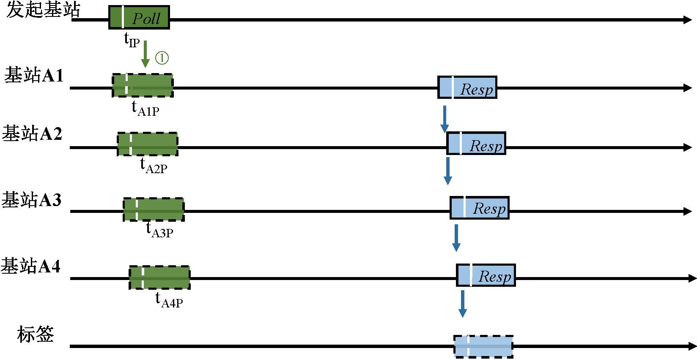
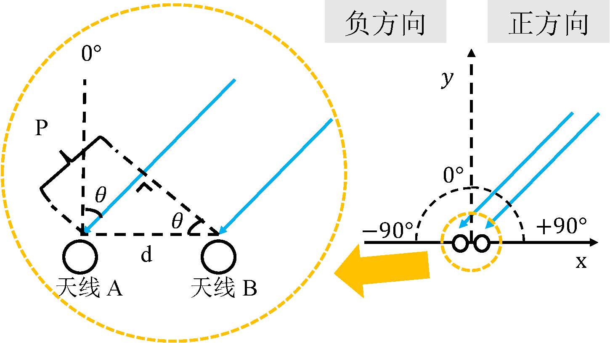
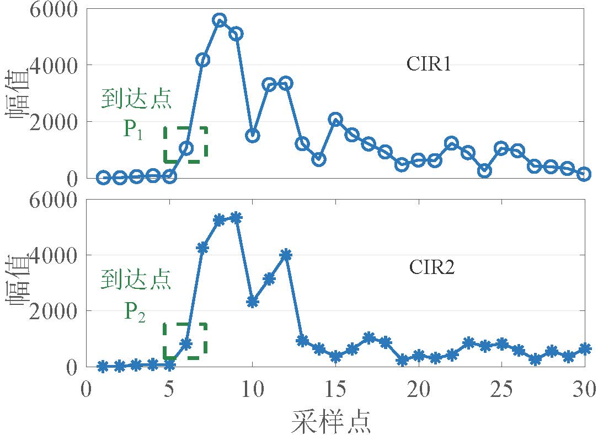

# UWB测距定位算法
常用的UWB测距定位算法包括双向测距算法，TDOA和并发算法，以及AoA算法，我们将在这里进行一一介绍。

## 双向测距算法
在信号到达时间的基础上，IEEE 802.15.4 标准推荐了用于超宽带测距的双向测距方法。
下图展示了两种双向测距方法：单边双向测距（SS-TWR）和双边双向测距（DS-TWR）。
<center>

</center>
单边双向测距要求标签和基站（如$A_1$​）之间来回应答一次数据，两设备间的飞行时间可以采用下面公式计算：

$$ T_f = \frac{1}{2}((t_{TR1}-t_{TP}) - (t_{A1R1}-t_{A1P})) $$

双边双向测距算法在单边双向测距方法的基础上增加了一次数据交换，形成“Poll”-“Resp”-“Final”数据包交换形式，从而得到更准确的测距结果。
设备间的飞行时间可以如下计算：

$$ T_f = \frac{(t_{TR1}-t_{TP})(t_{A1F}-t_{A1R1}) - (t_{TF} - t_{TR2})(t_{A1R1} - t_{A1P})}{(t_{TF} - t_{TP}) + (t_{A1F} - t_{A1P})} $$

这里有两个可以思考的问题，一是为什么双边双向测距算法比单边双向测距算法更加准确？二是为什么双边双向算法采用上述公式那样计算，而不是更加简单的方式，如分别利用前后两段计算结果再平均？
其实我们只要分析这些方法测距的误差就可以解答这些问题，具体可参加[2]。

## TDOA和并发算法
如图所示，典型的TDOA方法过程是这样的：首先是发起基站（通常叫做参考基站，这里的叫法是为了和我们的方法统一）发送一个参考数据包给其他基站，这样所有基站均可以以此数据包为基准进行时间同步。接下来，$A_1$到$A_4$四个基站依次给标签发送数据，标签收到数据之后即可求解出它到不同基站的距离差。
<center>
<figure>


</figure>
</center>

上图右边示意了整个通信过程，我们以基站$A_1$和$A_2$为例解释计算过程。

对发起基站、基站$A_1$、标签来说，标签记录的时间$t_{TR1}$为发起基站发送数据的时间$t_{IP}$，发起基站到基站$A_1$的飞行时间$\frac{d_{IA1}}{c}$，基站$A_1$接收数据到发送数据的间隔$t_{A1R}$-$t_{A1P}$，基站$A_1$到标签的飞行时间$\frac{d_{A1T}}{c}$的和，即：

$$ t_{TR1} = t_{IP} + \frac{d_{IA1}}{c} + t_{A1R} - t_{A1P} + \frac{d_{A1T}}{c}$$

其中c为电磁波的传播速度。

同理，对于发起基站、基站$A_2$、标签来说，我们有：

$$ t_{TR2} = t_{IP} + \frac{d_{IA2}}{c} + t_{A2R} - t_{A2P} + \frac{d_{A2T}}{c}$$

两个式子相消并整理可得：

$$ \frac{d_{A2T}}{c} - \frac{d_{A1T}}{c} = t_{TR2} - t_{TR1} + \frac{d_{IA1}}{c} - \frac{d_{IA2}}{c} + t_{A1R} - t_{A2R} - t_{A1P} + t_{A2P}$$

不难看出，该式左边为标签到两个基站的飞行时间差，而右边均为已知量。这样我们就得到了TDOA信息，接下来就可以利用算法进行求解了，根据常用的Chan算法，给出代码示例。

### Chan算法示例
这里给出了简单的Chan算法实现。我们假设已经利用UWB测量得到了TDOA的信息，然后使用经典的Chan算法来求解标签的位置：

```matlab
clc;
clear;

% 基站数目
BSN = 4;
% 各个基站的位置，2*BSN的矩阵存储，每一列是一个坐标
BS = [0 , sqrt(3) , 0.5*sqrt(3) , -0.5*sqrt(3);
      0 ,       0 ,         1.5 ,         1.5];
% MS的实际距离,为待测量值
MS = [2 3];
% R0为无噪声情况下各个BS与MS的距离
for i = 1:BSN
    R0(i) = sqrt((BS(1,i)-MS(1))^2 + (BS(2,i)-MS(2))^2);
end
% R(i)是BSi与BS1到MS的距离差，实际中因由TDOA*c计算
for i = 1:BSN-1
    R(i) = R0(i+1) - R0(1);
end

% 第一次加权最小二乘估计
for i = 1:BSN
    k(i) = BS(1,i)^2 + BS(2,i)^2;
end
for i = 1:BSN-1
    h(i) = 0.5*(R(i)^2 - k(i+1) + k(1));
end
for i = 1:BSN-1
    Ga(i,1) = -BS(1,i+1);
    Ga(i,2) = -BS(2,i+1);
    Ga(i,3) = -R(i);
end
Za = inv(Ga' * Ga) * Ga' * h';
X(1,1) = abs(Za(1,1));
X(2,1) = abs(Za(2,1));

% 第二次加权最小二乘估计
X1 = BS(1,1);
Y1 = BS(2,1);
h2 = [(Za(1,1) - X1)^2;	(Za(2,1) - Y1)^2; Za(3,1)^2];
Ga2 = [1,0;   0,1;   1,1];
B2 = [Za(1,1)-X1,  0,           0;
      0,           Za(2,1)-Y1,  0;
      0,           0,           Za(3,1)];
Za2 = inv(Ga2' * inv(B2) * Ga' * Ga * inv(B2) * Ga2) * (Ga2' * inv(B2) * Ga' * Ga * inv(B2)) * h2;

X(1,1) = abs(Za2(1,1))^0.5 + X1;
X(2,1) = abs(Za2(2,1))^0.5 + Y1;
disp(X)
```

注意，这里我们直接使用标签$MS$的位置来计算TDOA的信息(实际上应由UWB测量得到)，因此最后求出的结果X，应该完全与$MS$结果一样。

### 并发算法
为了提高定位的速度，需要在上述TDOA算法基础上，缩短基站之间数据包间隔，使它们数据近乎同时发送并且同时达到标签接收端。此方法的设计核心在于UWB超高的时空分辨率，即它能够有效地区分开纳秒级间隔的不同数据包。下图左边示例了并发算法的数据通信过程，右边示例了一个标签端接收得到的信道响应（CIR）信息。
<center>
<figure>


</figure>
</center>

不难看到，虽然间隔极短的数据包几乎同时到达接收端并发生了冲突，但是由于信号捕捉效应，标签端依然可以正常接收到一个数据，且识别出所有到达的信号。
在CIR中，其横坐标为信号的采样点，一个点代表1纳秒，其纵坐标表示CIR数据的幅值。
从图中，我们可以计算得到不同数据包到达的时间差。
基于这个时间差和上述TDOA的时间推导过程，我们就能够得到标签到不同基站的TDOA信息，进而可以利用Chan算法进行定位。
更多详细内容见[3][4]。

## AoA算法
超宽带AoA测量模型如下左图所示。
当远场的无线信号入射到天线端，信号到两根天线的路径差$(P)$与两根天线之间的距离$(d)$以及到达角$(\theta)$有如下关系：

$$ P = dsin(\theta) $$

记载波频率为$f$，光速为$c$，则两根天线的相位差PDOA($\alpha$)可以按下式计算：

$$ \alpha = \frac{2\pi f}{c}P $$

根据$\lambda = \frac{c}{f}$，我们就可以用如下公式推算出AoA结果：

$$ \theta = arcsin(\frac{\alpha \lambda}{2\pi d})  $$

该等式表明我们可以依据天线间的PDOA（$\alpha$）结果来计算得到无线信号到达设备的AoA信息。
为了便于介绍，将PDOA不大于0（即$\alpha \leq 0$）的方向记为负方向，将PDOA不小于0（即$\alpha \geq 0$）的方向记为正方向。

<center>
<figure>


</figure>
</center>

当接收机收到超宽带信号之后，它会首先评测出该接收信号的信道响应（CIR）信息，然后通过LED算法来找到信号的到达点。LED算法很简单，它首先根据CIR计算接收信号的噪声，然后找出第一个高于噪声的CIR点，并将其标记为信号到达点。
对于两天线的商用超宽带设备，我们可以在一次数据接收时得到两个信道响应数据。
如上右图显示了来自两根天线的CIR数据示例，其中到达点$p1$和$p2$分别为LED算法在不同天线上的计算结果。
天线间的PDOA结果$\alpha$就可以计算为：

$$\alpha = angle(p1) - angle(p2)$$

为了得到更准确的PDOA结果，我们需要在原生PDOA结果$\alpha$上再减去SFD（Start of Frame Delimiter）的相位以消除硬件引入的噪声。
得到PDOA之后，我们就可以利用上面的推导公式来计算对应的AoA了[5]。
测出AOA之后，我们可以利用标签到多个基站的AoA信息，并求解其交点来获得标签的位置。


## V-TWR算法
我们设计了一种高精度可扩展的定位算法V-TWR[??]。这个算法是受到双向测距和TDOA两种算法启发而设计的，算法的目标是让定位系统能够达到与双向测距一样的定位精度，且实现像TDOA算法那样支持大量（乃至不限数量的）标签设备进行定位的系统可扩展性。
<!-- 
## AoA定位优化算法
受限于两天线的商用硬件，现有方法得到的角度精度非常粗糙。是什么原因导致这样的粗糙结果？以及能不能进一步提高UWB商用设备的测角精度？我们将在AoA定位优化算法章节进行解释以及展示具体的设计。

## UWB链路判断算法
UWB出色的抗多径能力使其在室内环境下能够实现很高的测距、定位精度。然而，同其他无线信号一样，UWB技术依然面临非视距问题，即在无线信号被遮挡时，其测距定位精度下降非常明显。我们将在UWB链路判断算法章节进行探索，并介绍我们设计的链路判断算法。 -->

## 参考文献
1. Jiang Y, Leung V C, "An asymmetric double sided twoway ranging for crystal offset", IEEE International Symposium on Signals, Systems and Electronics 2007.
2. Neirynck D, Luk E, McLaughlin M, "An alternative doublesided twoway ranging method", IEEE WPN 2016.
3. Corbalán P, Picco G P, Palipana S, "Chorus: Uwb concurrent transmissions for gpslike passive localization of countless targets", IEEE IPSN 2019.
4. Großwindhager B, Stocker M, Rath M, et al, "Snaploc: An ultrafast uwbbased indoor localization system for an unlimited number of tags", IEEE IPSN 2019.
5. Dotlic I, Connell A, Ma H, et al, "Angle of arrival estimation using decawave dw1000 integrated circuits", IEEE WPNC 2017.