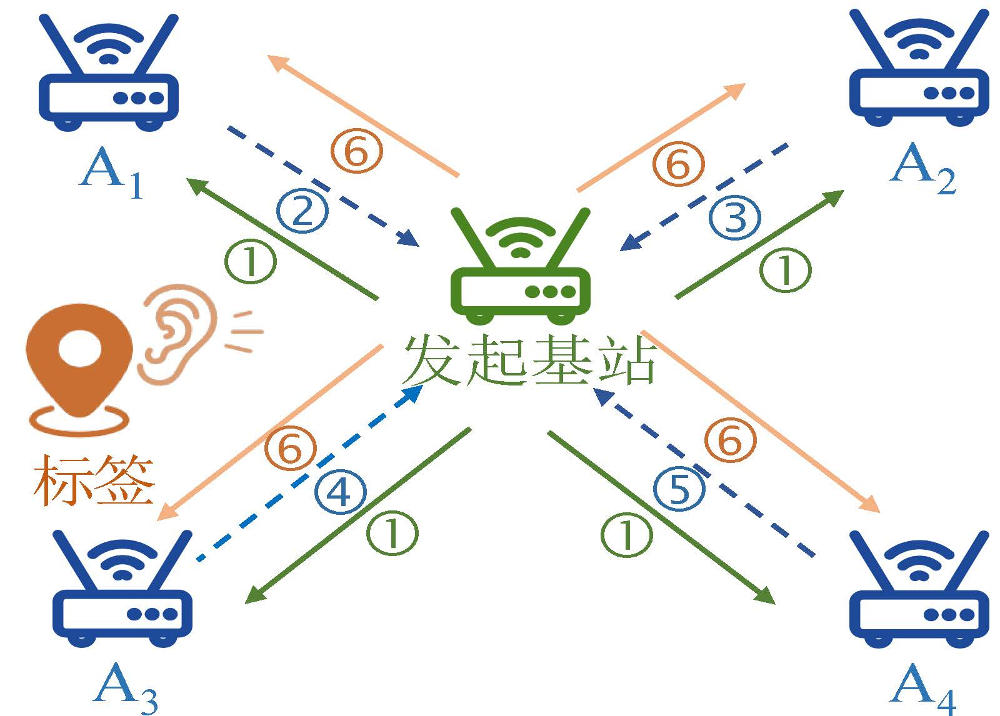
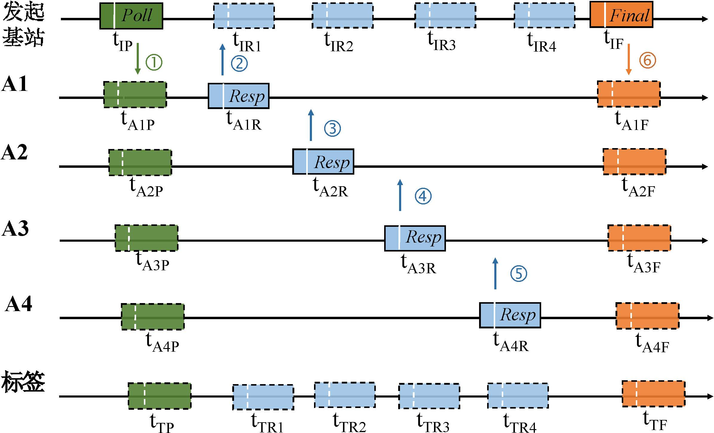

# V-TWR 算法
我们首先介绍算法系统的通信架构，然后介绍如何在这样的架构下实现标签的高精度定位，也就是V-TWR算法的具体设计。

<figure>

</figure>

## 通信架构
上图左边展示了系统的通信架构。
在这个架构里面，基站之间采用DS-TWR方法来进行冗余的通信并测距。标签则保持被动侦听的状态，它在基站测距的时候会接收它们之间的应答数据。此外，架构里面有一个特殊的基站，我们起名为发起基站，它负责发起整个系统的通信流程，并调度与其他基站测距过程。

整个数据通信过程如上图右边所示。发起基站首先广播一个“Poll”数据包，然后基站A1 $\to$ A4依次回应“Resp”数据包，最后发起基站再广播一个“Final”数据包。这样，发起基站和每个基站都形成了DS-TWR测距过程，它们之间的飞行时间可以通过DS-TWR公式来进行计算。在整个过程中，标签一共会接收6个数据包。由于标签的被动接收模式，系统的容量不会受到标签数量的影响。换句话说，系统可以理论上支持不限数量的标签。因此，系统就达到了高可扩展的目的。下面将介绍系统如何在这样的框架下实现标签的高精度定位。

## 算法设计
为了介绍的方便，本节首先对系统通信过程中收集的数据以及对应的时间戳信息进行标记。
如上右图所示，$t_{IP}$和$t_{IF}$分别表示发起基站发送“Poll”和“Final”数据包的时间，$t_{IRi}$表示发起基站接收第i个基站的“Resp”数据包的时间。同样地，$t_{TP}$和$t_{TF}$分别表示标签接收发起基站的“Poll”和“Final”数据包的时间，$t_{TRi}$表示标签接收第i个基站的“Resp”数据包的时间。
在上述表述中，$i = {1, \ldots, N}$，其中$N$是基站的数量。
由于发起基站可以将它收集的时间戳信息通过“Final”数据包传输给标签，标签在整个过程中就可以得到上述12个数据包的时间戳信息。
因此，V-TWR算法的目标就是利用这12个时间戳信息来为标签定位。
值得一说的是，V-TWR算法可以拓展到更多的基站，这里仅仅是用5个基站来举例说明。

<figure>

</figure>

直观来讲，为了达到高精度测距定位的目的，V-TWR算法需要充分利用基站间交换的冗余数据。为此，V-TWR算法提出一个虚拟测距的概念。
具体来说，V-TWR算法的核心设计是在标签端生成一个虚拟的“Resp”包并发送给发起基站。
这样标签和发起基站之间就可以形成DS-TWR测距过程。
我们用发起基站A0，基站A1来举例说明。
如上图所示，
发起基站0与基站A1之间还是采用DS-TWR方法来通信并测距，其中的时间戳均在图中标明。
假设标签在${t}_{TR1}'$时刻发送一个虚拟消息给发起基站A0，且这个虚拟消息恰恰在$t_{IR1}$时刻被A0接收。这个假设是合理的，只要选择合适的${t}_{TR1}'$值即可。
这样，标签和发起基站A0就能形成一个虚拟的DS-TWR测距过程。
基于虚拟时间${t}_{TR1}'$，它们之间的飞行时间可以用下式来计算：

$$
        T_{f} = \frac{(t_{IR1} - t_{IP}) \times (t_{TF} - {t}_{TR1}') - ({t}_{TR1}' - t_{TP}) \times (t_{IF} - t_{IR1})}{t_{IF}-t_{IP} + t_{TF} - t_{TP}} \tag{1}
$$

由于${t}_{TR1}'$是未知的，$T_f$是不能直接计算出来的，我们称之为虚拟飞行时间。而为了求解出这个虚拟飞行时间，V-TWR算法就需要推导出${t}_{TR1}'$。
V-TWR算法利用设备之间的物理位置来进行推导。记标签和发起基站A0之间距离为$d_{T \to I}$，标签与基站A1距离为$d_{T \to A1}$，以及A0与A1的距离为$d_{I \to A_1}$，我们可以得到以下关系：

$$
        t_{TR1}=t_{A1R}+\frac{d_{T \to A}}c \\
        t_{IR1}=t_{A1R}+\frac{d_{I \to A}}c \\
        t_{IR1}={t}_{TR1}' +\frac{d_{T \to I}}c   \tag{2}

$$

其中$c$为电磁波的速度。基于上面三个式子，我们可以得到虚拟时间${t}_{TR1}'$和已知量$t_{TR1}$的关系：

$$
    {t}_{TR1}' =t_{TR1}-\frac{d_{T \to A}}c-\frac{d_{T \to I}}c+\frac{d_{I \to A}}c  \tag{3}
$$

将式$(3)$代入式$(1)$，消去${t}_{TR1}'$可以得到如下结果：

$$
    \frac{d_{T \to I}}{c} \times T = \frac{d_{T \to A}+d_{T \to I}-d_{I \to A}}{c} \times (t_{IF} - t_{IP}) + T_{x1}     \tag{4}
$$

其中$T$和$T_{x1}$如下计算：

$$
        T = (t_{IF}-t_{IP}) + (t_{TF} - t_{TP}) \\
        T_{x1} = (t_{IR1}-t_{IP}) \times (t_{TF}-t_{TR1}) \\
        - (t_{TR1}-t_{TP}) \times (t_{IF} - t_{IR1})   \tag{5}
$$

不难观察到，对于同一对发起基站A0和标签来说，$T$是一个常量而$T_{x1}$是随着另一个基站变化而变化的。
举例来说，如果基站A1变成了基站A2，那么$T_{x1}$的值也会发生变化。
由于式$(4)$有两个未知量$d_{T \to I}$和$d_{T \to A}$，标签的位置依旧是算不出来的。
不过它揭示了这两个未知量$d_{T \to I}$和$d_{T \to A}$之间的关系，我们不禁思考，这有什么用呢？

我们注意到，对于发起基站外的其他基站来说，$d_{T \to I}$（即标签到发起基站的距离）可以假定是不变的。
由于整个通信过程是非常快的，整个通信流程只需要几毫秒到十几毫秒，因此假定在这段很短时间里，发起基站与标签的距离不变是合理的。如此，V-TWR算法就可以采用多个基站联合来求解出上面的未知量，从而解出标签的位置。

对基站A1到A4，我们可以将式$(4)$和$(5)$重新整理如下（$i = 1, \ldots, 4$）：

$$
        \frac{d_{T \to I}}{c} \times T = \frac{d_{T \to Ai}+d_{T \to I}-d_{I \to Ai}}{c} \times (t_{IF} - t_{IP}) + T_{xi} \\
        T_{xi} = (t_{IRi}-t_{IP}) \times (t_{TF}-t_{TRi}) \\
        - (t_{TRi}-t_{TP}) \times (t_{IF} - t_{IRi})  \tag{6}
$$

其中$T$表达式不变，可用式$(5)$计算得到。

将基站A2对应的结果减去基站A1对应的结果，并重新整理得到：

$$
    \frac{d_{T \to A2} - d_{T \to A1}}{c} = \frac{(T_{x1} - T_{x2})}{t_{IF} - t_{IP}} + \frac{d_{I \to A2} - d_{I \to A1}}{c}  \tag{7}
$$

上式等号左边$\frac{d_{T \to A2} - d_{T \to A1}}{c}$即是标签到基站A2和基站A1的距离差，而等号右边的式子均为已知量。也就是说，我们可以根据记录的时间以及已知的基站间距离求解得到标签到两个基站的距离差了。
类似地，$\frac{d_{T \to A3} - d_{T \to A1}}{c}$和$\frac{d_{T \to A4} - d_{T \to A1}}{c}$可以如下计算：

$$
    \frac{d_{T \to A3} - d_{T \to A1}}{c} = \frac{(T_{x1} - T_{x3}) }{t_{IF} - t_{IP}} + \frac{d_{I \to A3} - d_{I \to A1}}{c}  \\
    \frac{d_{T \to A4} - d_{T \to A1}}{c} = \frac{(T_{x1} - T_{x4}) }{t_{IF} - t_{IP}} + \frac{d_{I \to A4} - d_{I \to A1}}{c}  \tag{8}
$$

有了这三个距离差信息，我们就可以通过一些经典的位置求解算法来计算标签的位置了。

具体来说，我们可以利用以下两种方法来求解标签的位置：一是基于双曲线的位置求解算法，二是基于搜索的非线性最小二乘算法。
基于双曲线的算法通过双曲线求交点的方法来求解位置。理论上来讲，标签的位置是位于以基站为焦点的双曲线上的。因此，给定多个不同基站，标签位置就在多条双曲线的交点处。我们采用经典的Chan算法来进行求解。该算法假定测量噪声符合零均值的高斯分布，然后以非递归方式求解得到的双曲线方程。因此，Chan算法能够以很小的计算开销获取一个较为准确的结果。

而基于搜索的非线性最小二乘算法原理是这样的：给定解空间里面的一个侯选位置$pos_{1}$以及基站位置$pos_{ai}$（$i = 1,2,3 \ldots, N$，其中$N$是基站数量），标签到基站间的距离差可以计算为：

$$
    \Delta d_{i,j}=\left|\left| pos_{1}-pos_{ai}\right|\right|-\left|\left| pos_{1}-pos_{aj}\right|\right|, \quad i \neq j  \tag{9}
$$

当得到测量结果$\Delta \widehat d_{i,j}$之后，该算法可以通过最小化计算与测量的结果来求解标签的位置（$\widehat{pos}_{1}$）：

$$
    \widehat{pos}_{1}={\underset {pos}{\operatorname {arg\,min} }}\,{\textstyle\sum_{i=1}^{N-1}}{( \Delta {\widehat d}_{i,j}- \Delta d_{i, j})}^2 \tag{10}
$$

这个算法通常需要搜索很大的解空间来找到最符合目标的结果，因此它能够实现很高的精度，但是其计算开销很大。

考虑这两个算法的特点，即Chan算法可以快速地给定一个较粗略的结果而基于搜索的非线性最小二乘算法能够提供很高的精度却需要很大的空间搜索开销，我们则通过组合这两个算法来寻求定位精度与时间开销的均衡。具体来说，我们首先利用Chan算法来快速获取一个粗略的候选位置，然后在这个候选位置的一个小范围内利用基于搜索的非线性最小二乘算法进行搜索以获得更准确的位置结果，如在候选位置的1 $m$ $\times$ 1 $m$的范围内进行解空间搜索。

总而言之，我们首先利用V-TWR算法获取标签到不同基站的距离差信息，再使用Chan算法以及基于搜索的非线性最小二乘法来求解标签的位置，最终完成为标签高精度定位的目标。

## 补充说明
我们理论分析了V-TWR算法的误差，证明其与DS-TWR的定位误差为同一量级的，且明显优于TDOA方法。至此，我们就完成了同时实现高精度和高可扩展性的算法设计目标。

此外，为了进一步实现更精准、更鲁棒的效果，我们还设计了两个优化算法，分别为测距自校正优化算法和基站轮转优化算法。
测距自校正优化算法实现了自动测距校准的目的，大大减少了人工校准的开销，且有效地减少了UWB的测距偏差。
基站轮转优化算法则使得系统不再简单的依赖于某一个基站，同时通过链路质量的简单判断实现了抵抗NLOS影响的效果。

上述内容均可参加引用文章1。

## 参考文献
1. Yang J, Dong B S, Wang J L, "VULoc: Accurate uwb localization for countless
targets without synchronization", ACM IMWUT 2022.