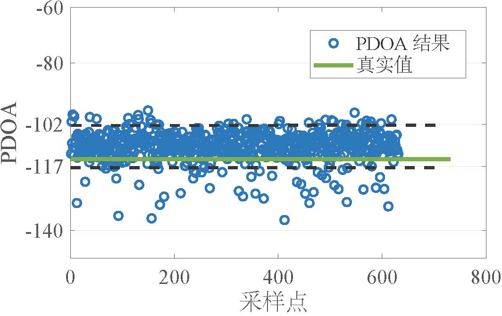
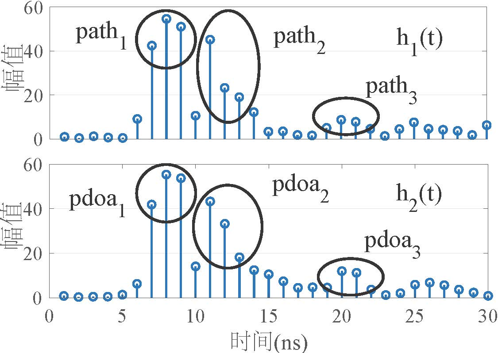
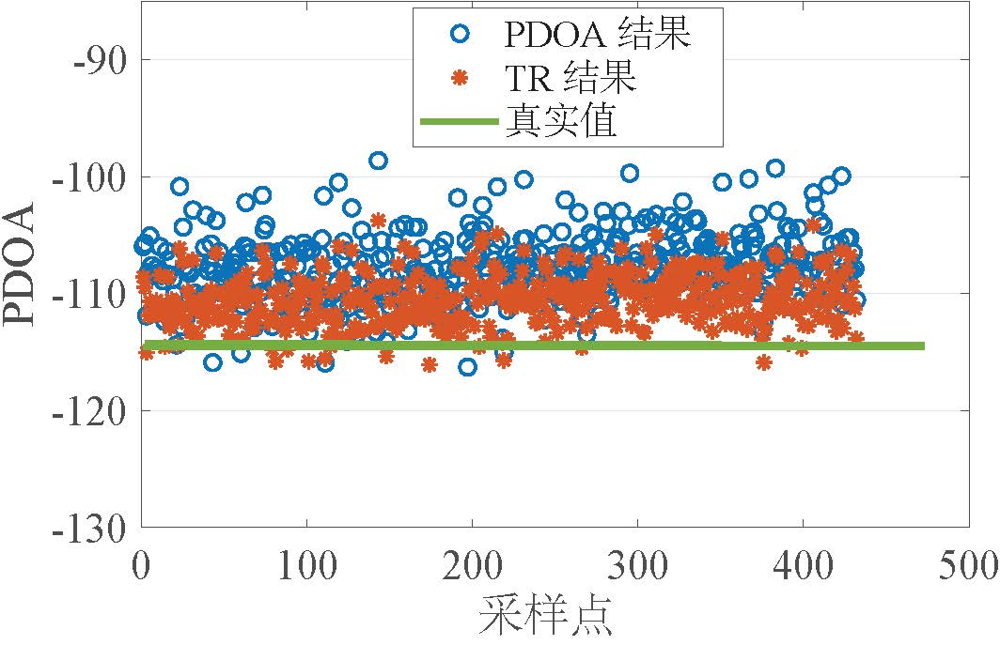
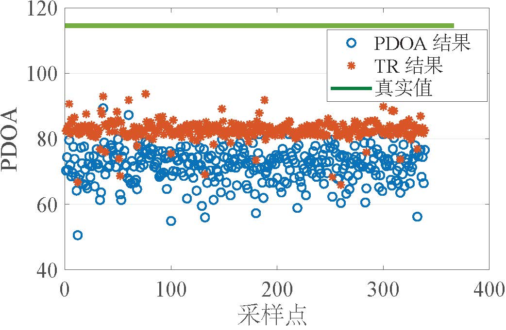

# AoA定位优化算法

我们首先展示现有方向测角的效果和问题，然后提出自己的设计。

## 现有测角方法的效果和不足
我们采用基于PDOA的AOA测量方法来计算角度，该方法是当前使用广泛的超宽带测角技术之一。
我们在UWB测距定位算法章节中进行了详细的介绍。
下图展示了该方法在正、负两个方向的PDOA测量结果，其中绿线为真实值，蓝点为测量的结果。
不难看出，即使在同一位置方向上，此方法的PDOA测量结果也有很大的偏差，如左图中两根黑色虚线之间的波动接近$AoA(PDOA=75) - AoA(PDOA=55) = 20 \degree$，对应$7.73\degree$的AoA测量误差。
此外，我们观察到，PDOA测量结果呈现空间不对称性，即在正方向的PDOA测量误差远大于负方向的PDOA测量误差。

<figure>

</figure>

为了进一步验证这一现象，我们收集了大量不同方向的PDOA测量结果，并将其展示在下图中。
其中蓝点为测量的PDOA结果，它是该方向上同一位置多次测量的平均值；
红线表示真实PDOA结果与测量的PDOA结果之间的理想关系。
不难看到，测量的PDOA结果确实在空间上是不对称的，即测量结果与真实结果在负方向上呈近似线性关系，在正方向上则呈明显的非线性关系。
同时，测量误差在负方向上很小，而在正方向上则快速变大。
这种非对称误差是非常大的，如在正方向上测角误差甚至大于$30\degree$。
为了获得准确的PDOA结果，这样的误差是需要被消除的。
这种测量结果与真实结果偏离的现象是由天线间耦合效应造成的，其他基于商用两天线设备的工作也展示了同样的问题，如参考文章1和2。

<figure>

</figure>

总而言之，现有UWB测角方法在商用两天线设备上的测量精度远不如人意。本节发现其中两个主要问题：（1）现有方法测量的AoA结果是不准确且不稳定的。（2）天线耦合效应会导致AoA测量结果严重偏离真实结果。

## 基于时间反演的测角方法

### 时间反演效应
时间反演（TR）效应是一种信号的能量在它与其时间反转和共轭版本结合时会在时间和空间域集中的现象。
它在1950年代被提出，并随后被应用到光学、超声波和WiFi等领域。
更多信息可参考文献3-5。

我们用超宽带信号的CIR数据来说明TR效应。
如下图所示，左边两个图分别为一个CIR数据$h(t)$以及它的时间反演版本$h^*(-t)$。
$h^*(-t)$是将$h(t)$序列进行时间反转和共轭得到的。
对这两个CIR进行卷积操作，我们可以得到一段对称且有着最高峰的序列，如右图所示。
当这两段CIR序列完全对齐的时候，序列对应点的相位在卷积时会被完美地消去，故而能够相干叠加得到图中所示的最高峰。
不难推算出，该峰值的相位为$0$。

总而言之，当接收到的CIR数据$h1$与它的时间反转和共轭版本进行卷积时，我们就能看到明显的能量集中效应。
根据卷积运算，当两段数据完全对齐时，它们将进行相干叠加并得到一个相位为0的最高峰。
TR效应有很多用途，如RIM（文献3）利用它来计算天线阵列的移动速度。RIM通过能量集中效应的强弱来判断移动天线阵列中的某一根天线何时到达前一根天线的位置，再基于移动时间就算出了天线阵列的移动速度。
我们下面则展示如何使用TR效应来提高商用多天线设备的PDOA评测精度。

<figure>

</figure>

### 基于时间反演（TR）的测角方法
如前文介绍的，当对两个相同的CIR数据序列应用TR效应时，我们能看到明显的能量集中现象。
而对两天线上的CIR数据序列应用TR效应时，我们需要考虑以下两点不同之处：
首先，这两个CIR数据之间是存在相位差的。
其次，由于超宽带细粒度的多径分辨率，两个CIR数据之间可能存在多个不同的相位差。
这两点不同也正是我们能够用TR效应来计算天线间相位差（PDOA）的原因。

为了便于理解，我们首先假设两个CIR之间只有一个相位差$p_1$。
不妨给定CIR数据$h(t)$，我们将$h1$写为$h(t)$的一系列采样点，其长度为$K$。
我们将$h2$表示为$h1$的时间反转和共轭版本，即$h2[i]=h1^*[K-1-i]$，其中$i=0, \ldots, K-1$。
然后我们将相位差$p_1$加到$h1$中，即$h1 = h1 \times e^{jp_1}$。
对于这两段序列，我们有一个很直观的想法：如果我们能够准确地将相位差$p_1$从$h1$中消除掉，然后对这两个CIR数据应用TR效应，那我们就可以看到能量集中效应，并且得到一段有很高峰值的序列。
然而，这样的方法是需要一个繁琐且耗时的搜索消除过程的。
我们则尝试直接在这两个CIR数据（$h1$和$h2$）上应用TR效应并计算得到的结果。
根据卷积运算，我们很容易推断得到$max(|h1 * h2|) = \sum_{i=0}^{K-1} |h1[i]|^2 \times e^{jp_1}$，这意味着我们仍然可以得到一段有最高峰的序列，且这个峰值的相位正好为$p_1$。
总而言之，我们可以直接对两段有相差的CIR序列应用TR效应，且计算得到的序列的最高峰对应的相位即为这两个CIR数据之间的相位差。

考虑到超宽带技术拥有细粒度的空间分辨率，两根天线评测的CIR中很可能存在多条反射路径。
下图左边展示了拥有多个相位差的两个CIR数据，即$h_1(t)$和 $h_2(t)$。
不难看到，CIR中有3条反射路径。
当这些路径的AoA不同时，这些路径对应的相位差也就不同。
不妨记$h_1(t)$和$h_2(t)$中不同路径对应的PDOA分别为$pdoa_1$， $pdoa_2$ 和 $pdoa_3$。
我们对$h_1(t)$和$h_2(t)$应用TR效应，即将$h_1(t)$与$h_2(t)$的时间反转共轭版本进行卷积。
当具有相同相差的序列对齐时，它们会进行相干叠加，从而得到右图所示的最高峰。
不难推算，这个峰值的相位为上述所有相差的矢量和。
实际上，我们只需要计算第一条路径对应的相位差，即$pdoa_1$，这也是标签到基站的视距路径对应的相位差。
因此，我们就需要选择两个CIR数据中$path_1$对应的部分，然后对这部分数据应用TR效应，从而推算出对应的PDOA结果。
总而言之，我们可以从两根天线的CIR数据中提取视距路径对应的部分，然后对它们应用TR效应，从而得到视距路径对应的PDOA结果。

<figure>

</figure>

我们将基于TR的PDOA方法与现有方法进行比较，以说明该方法对PDOA测量结果的提高。
下图分别展示了两种方法在负、正方向的一个测量结果。
其中绿线为真实值，蓝点为PDOA方法的测量结果，红点则为基于TR方法的测量结果。
不难看到，与现有方法的PDOA结果相比，基于TR方法的结果在两个方向上都更加稳定和准确。
同时，我们观察到测量结果与真实结果之间仍然存在明显的偏差。
也就是说，测量的PDOA结果与几何路径对应的真实值存在很大的差异。
这个差异是由天线的耦合效应造成的，即设备相邻天线的间距小于若干个波长。
AnguLoc（文献6）发现这个关系是非线性的，并使用一个多项式函数来进行拟合，从而实现测角偏差的校正。
然而，我们发现天线耦合带来的PDOA测量偏差与设备天线的间隔是高度相关的，因为我们观察到商用低成本设备的测量结果与AnguLoc的结论有明显不同。

<figure>

</figure>

我们在前面介绍过天线耦合带来的偏差问题，即商用两天线设备测量得到的PDOA结果呈现明显的空间非对称性：测量结果在正方向上误差很大，而且与真实值呈现出非线性关系；而测量结果在负方向上误差较小，且与真实值呈现出线性关系。
这种空间多样性使得一个简单的多项式校正函数无法很好地拟合数据测量的偏差。
为了解决这个问题，我们将数据根据特定的模式分开处理，从而推导出不同的校正关系。
对于负方向，我们采用线性曲线来拟合结果。
而对于正方向，我们则利用多项式曲线来拟合。
获得拟合曲线之后，我们就可以依据测量得到的PDOA结果，选取不同的修正模式来消除天线耦合带来的测量偏差，从而推断出准确的PDOA结果。

## 参考文献
1. Dotlic I, Connell A, Ma H, et al, "Angle of arrival estimation using decawave dw1000 integrated circuits", IEEE WPNC 2017.
2. Diagne S, Val T, Farota A K, et al, "Performances analysis of a system of localization by angle of arrival uwb radio", International journal of communications, network and system sciences 2020.
3. Wu C, Zhang F, Fan Y, et al, "Rf-based inertial measurements", ACM Sigcomm 2019.
4. Zhang F, Chen C, Wang B, et al, "Wiball: A time-reversal focusing ball method for decimeter-accuracy indoor tracking", IEEE IEEE Internet of Things Journal 2018.
5. Wu Z H, Han Y, Chen Y, et al, "A time-reversal paradigm for indoor positioning system", IEEE Transactions on Vehicular Technology 2015.
6. Heydariaan M, Dabirian H, Gnawali O, "Anguloc: Concurrent angle of arrival estimation for indoor localization with uwb radios", IEEE DCOSS 2020. 