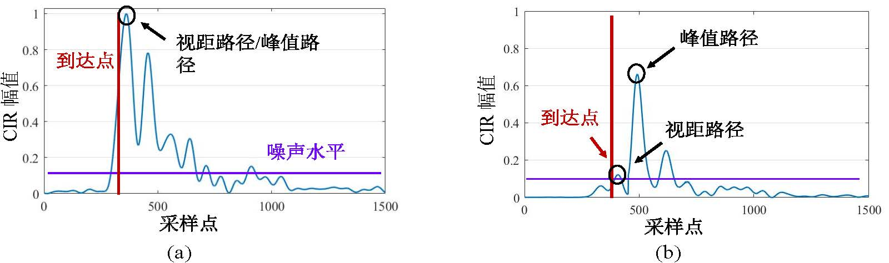
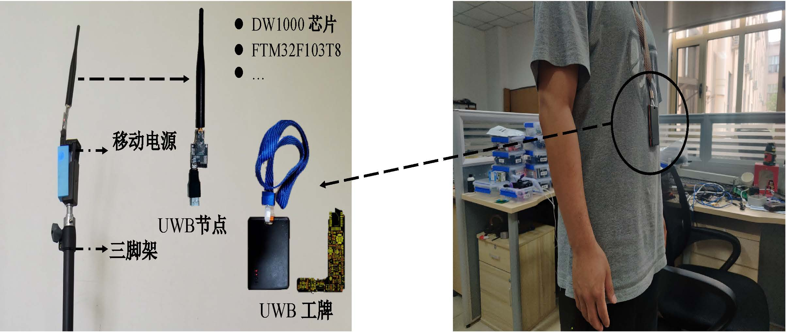
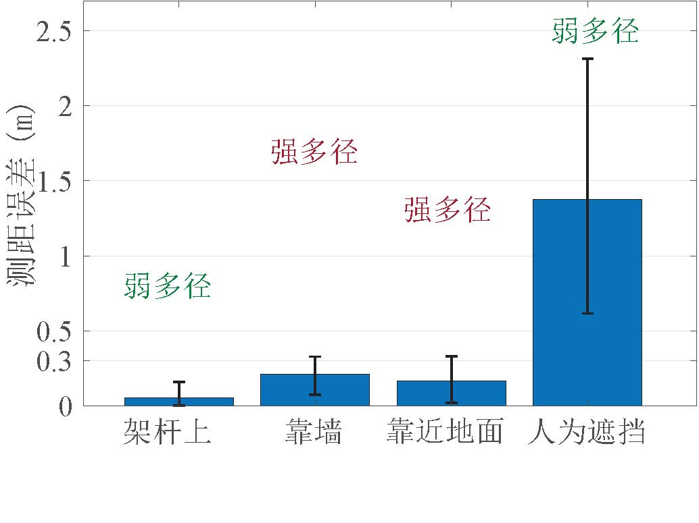
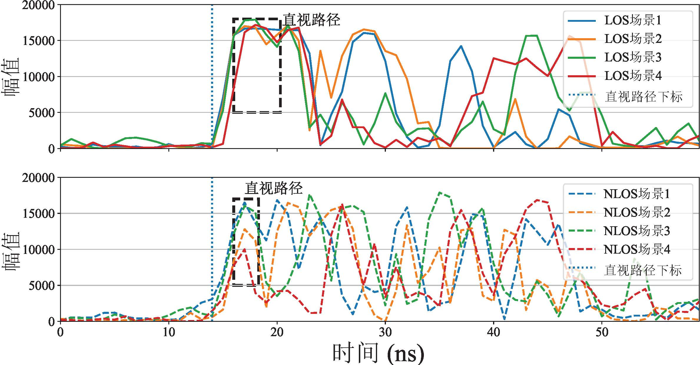
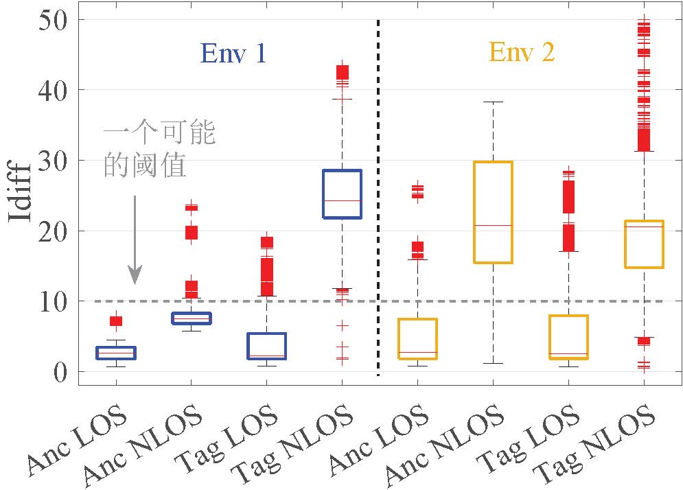
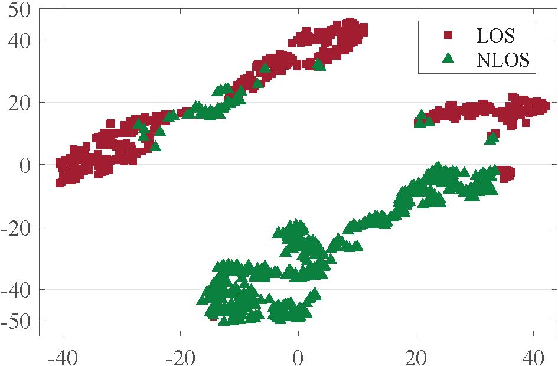
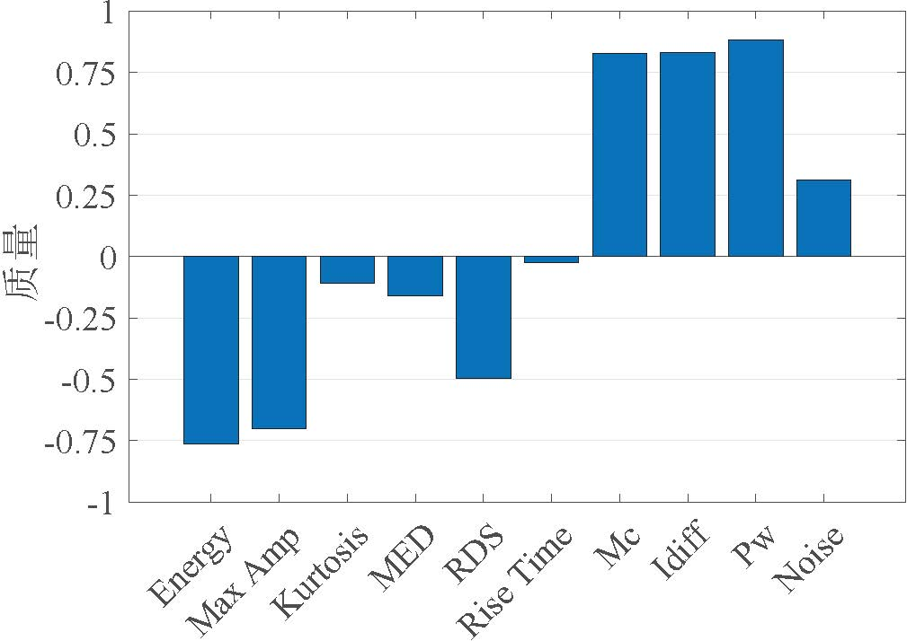
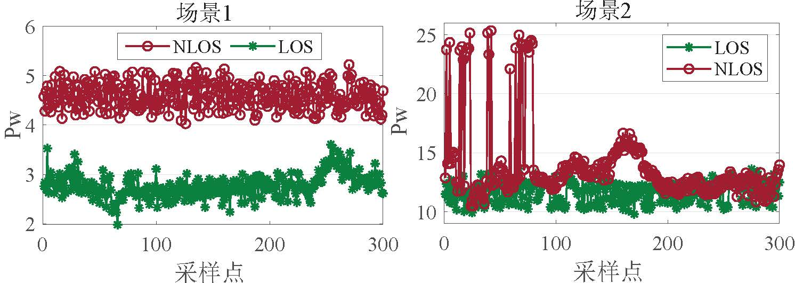

# UWB链路判断算法

## NLOS对UWB测距、定位的影响
在无线网络中，信道脉冲响应（CIR）很好地描述了信号通过无线信道的衰减和延迟信息。
假设有$L$条路径，来自路径$i$的信号的延迟为$\tau_i$，幅度为$\alpha_i$，CIR可以表示为：
$$
    h(t) =  \sum_{i=1}^{L} \alpha_i e^{-j2 \pi f_{c}\tau_i}\delta(t-\tau_i)
$$
其中$\delta(t-\tau_i)$是狄拉克德尔塔函数。

为了得到准确的信号接收时间，超宽带接收机在接收到数据包时会以纳秒级的分辨率记录CIR，然后利用一些专用算法，如LDE算法，从CIR中找到信号的第一条路径（即视距路径）并计算相应的到达时间。下图左边展示了视距下的CIR数据。如图所示，我们可以很容易找到视距路径，从而推导出准确的信号到达时间。
在信号到达时间的基础上，我们就可以很容易利用测距算法，如双向测距算法，来获得UWB设备间的距离，然后利用之前介绍的TDOA、AoA等方法来进行定位。右图展示的是非视距下的CIR数据。可以看到，视距路径的幅值衰减很严重，甚至可能低于噪声水平，这就导致超宽带接收机对视距路径的估计错误，从而得到误差很大的接收时间，进而影响测距、定位结果。

<figure>

</figure>

我们在下图所示的室内环境下进行实验以研究NLOS对超宽带测距定位的影响。
如左图所示，我们将UWB设备置于三脚架上作为基站，并封装了一共UWB工牌作为标签。
我们固定基站的位置，然后让志愿者戴上超宽带工牌并站在不同的位置，如右边图所示。
这里我们主要研究人体对信号遮挡的影响，这也是最常见的NLOS场景之一。

<figure>

</figure>

NLOS下超宽带测距和定位的结果如下所示。
从图(a)可以看到，在LOS场景下，超宽带技术可以实现接近10 cm的测距精度。
然而，在NLOS场景下，测距误差会迅速增加到2 m以上。
从图(b)看到， LOS场景下的超宽带定位结果与真实结果非常接近，而 NLOS下超宽带定位的误差则很大，甚至到几米。
由此看出，NLOS对超宽带的测距定位影响极大，亟需处理和解决以得到更加可靠的测距定位结果。因此如何处理号环境的影响，如何在存在NLOS的情况下准确实现定位，是UWB场景里面的需要解决的重要挑战。

<figure>

</figure>

## 基于链路特征的链路判断算法
目前常用的一种UWB链路判断算法是通过提取不同链路状态的特征值，然后推导相关阈值，从而进行链路状态的判断（即LOS或NLOS）。
如参考文献1和2利用一个叫做PW的信道特征来进行链路的判断，其中PW是信号总能量与视距路径能量的差值。
接下来，它们通过在环境下收集LOS和NLOS链路的PW值，推断出区分的阈值，然后即可进行链路判断。比如当某条链路的PW值大于6 dB的时候判定其为NLOS链路，反正则为LOS链路。

由于UWB很高的时空分辨率，其CIR信息的分辨粒度是很高的，通常为1 ns。换句话说，从这些链路数据提取出的链路特征的区分度应该也是很好的。
故而，基于特征和阈值的方法能够实现比较好的链路判断效果。
然而，其不足也很明显，即通常需要在部署应用之前进行数据收集和处理来得到适应当前环境的阈值，这会导致较高的系统部署开销，比如人力和时间成本。
因而，我们提出一个问题，能不能实现一个自适应的且无需先验数据收集的链路判断算法？于是，我们提出了基于基站链路的链路判断算法。

## 基于基站链路的链路判断算法

### 核心观察
以下三点观察激发了算法的设计：

**观察 1：基站链路比标签链路更容易判断。**

对于一个测距定位系统来说，NLOS直接影响的就是系统的测距和定位精度。因此，最直观的链路判断方法就是根据此链路对应的测距误差来进行链路状态的判断。测距误差越大，则该链路为NLOS链路的概率也越大。
由于标签位置在定位系统里是未知的，这种基于测距的链路判断方法对于标签来说是不可行的。
然而，考虑到基站位置通常是提前部署且已知的，这个方法就可以很好地用于基站间的链路判断。
总而言之，我们可以利用基站位置已知这一条件来轻松判断出它们之间的链路状态。

**观察 2：同一环境下，尽管NLOS链路之间可能有很大的差异，超宽带定位系统里面的LOS链路之间会具有非常相似的特征。**

由于测距结果会随着不同的障碍物类型以及标签与障碍物的不同距离而变化，这就导致了NLOS链路的变化多端。
然而，众所周知，超宽带技术的一大优越性在于它对多径的高度容忍力。
换句话说，无论在环境中的哪个位置，只要LOS存在，超宽带技术都可以获得相差无几的高精度测距结果。
为此，我们比较了超宽带设备在四种设置下的测距性能，即将测距设备放在杆顶上（LOS下弱多径），将设备放在地面上（LOS下强多径），将设备靠近墙角（LOS下强多径），以及人为遮挡杆顶上的设备（NLOS下弱多径）。
测距结果如下左图所示，可以看到，即使在强多径下，LOS场景的测距误差也低于0.3 m，而NLOS场景下的测距误差则迅速增加到1.23 m。
我们接着固定基站并在实验室的不同位置收集各种LOS链路和NLOS链路的CIR数据。
结果如下右图所示，其中上半部分展示了4条LOS链路，下半部分展示了4条NLOS链路。
虚线黑框圈出的是超宽带接收机评测的视距路径。
不难看到，LOS链路的视距路径非常清晰，且不同链路的视距路径的形态和特征都高度相似。
我们认为这有两个原因。
首先，LOS场景下的视距路径是信号传播的最短路径，因此其在接收机中的累积功率通常是整个CIR的主要部分。
其次，超宽带技术可以有效地将LOS场景下的视距路径与其他路径分开。即使在多径丰富的环境中，它也能准确地估计出视距路径。
然而，对于NLOS链路来说，它的视距路径要弱得多并且通常不是最高的路径。因此NLOS下视距路径的评估结果很容易受到噪声的影响，从而得到较大的评估误差。
总而言之，上述实验证明了我们的观察，即得益于超宽带技术出色的抗多径能力，在同一环境中，即使NLOS链路可能有很大的差异，其中的LOS链路能够表现出非常相似的特征。

<figure>

</figure>

**观察 3：基站间的LOS链路与标签到基站的LOS链路也拥有非常相似的特征。**

目前超宽带设备的基站和标签的硬件是完全对等的，它们唯一的区别可能是发射和接收的功率。
因此，我们可以进一步推断，基站与基站的LOS链路和标签与基站的LOS链路也拥有高度相似的特征。
基于这个判断，我们就提出利用基站之间的LOS链路来辅助标签链路判断的设计。
为了验证可行性，我们将超宽带链路分为四组：基站之间的LOS和NLOS链路（记为Anc LOS和Anc NLOS），基站和标签之间的LOS和NLOS链路（记为Tag LOS和Tag NLOS）。
我们采用一个被超宽带技术广泛使用的信道特征，即$Idiff$来标识超宽带链路的状态。
$Idiff$计算的是CIR中最高峰对应的下标与视距路径对应的下标之差。
对于LOS链路，$Idiff$会接近于0，这是因为最高峰非常接近视距路径。
而对于NLOS链路，$Idiff$往往很大，这是因为视距路径与峰值路径通常离得较远。

下图展示了两种环境下（Env1和Env2）的四种链路的$Idiff$分布。
可以看到，Anc LOS和Tag LOS链路的$Idiff$值都很小，而Anc NLOS和Tag NLOS的$Idiff$值都很大。
基站LOS链路的$Idiff$值与同一环境下的标签LOS链路对应的$Idiff$值非常接近，这与我们的预期是一致的。
此外，可以看到，基于经验阈值的链路判断算法很难适用于不同的环境。
如图所示，我们尝试使用一个预定义的阈值来区分LOS和NLOS链路。
这个阈值在Env 2下能够将两种链路很好地区分开但在Env 1下区分失败了。
总而言之，基站间的LOS链路与标签到基站的LOS链路是高度相似的，我们可以基于这个相似性来利用基站间链路辅助标签链路的判断。

<figure>

</figure>

借助基站间链路来进行标签链路判断的方法有两个主要优点：

**（1）它能够很好地适用于不同环境。**

我们利用两个典型环境，即一个室内实验室和一个室外停车场，来说明为什么这个方法能够适应不同的环境。
实验室里面有很多的障碍物，因此多径丰富，而停车场则是一块空地，因此它的链路质量会非常好。
由于两个环境下链路质量相差太大，经验阈值的方法就很难区分开两个环境下的不同链路，从而导致环境适应性问题。
而基于基站的链路判断方法则可以实时地对当前环境中的基站链路进行判断，并基于基站链路的状态来识别标签的链路状态，因而可以很好地适用于不同的环境。

**（2）它不需要先验的数据收集和训练，产生的开销很小。**

基于基站的方法能够获取实时的基站链路状态，并将其用于标签的链路判断。因此，我们就无需任何先验的数据收集来做校正或者训练，从而产生很小的系统开销。
此外，我们在系统设计中会尽量避免引入额外开销，例如，我们在引入不额外测距过程的前提下设计了基站链路判断算法以及采用了快速收敛的定位算法来均衡定位精度和计算时间开销等。

### 方法的设计和实现
我们介绍方法设计中最主要的三个部分：基站链路的判断方法，特征的质量评估和选择，以及标签链路的判断算法。

**基站链路的判断方法**

由于基站位置已知，那我们就可以通过基站间测距结果以及基站实际距离来进行基站链路的判断。
对于NLOS链路来说，由于信号到达时间的估计错误，它评估出来的距离$r$也会高度偏离理想的距离$\widehat{r}$。
因此，我们可以通过计算测距误差$e = |r - \widehat{r}|$来进行链路状态的判断。
当测距误差较大时，例如$e \geq thr$（一个设定的阈值），我们就可以判断该链路为NLOS链路；否则，我们将认为它为LOS链路。
$thr$值是由测距结果与理想距离的偏差决定的，考虑到超宽带抗多径的特性，这个偏差可以认为在室内环境下是基本一致的。
我们在上述实验中也验证了这个结论。
同时，根据实验结果，我们将$thr$设为0.3 m。

**特征的质量评估和选择**

我们没有使用整段CIR数据，而是从中提取特征来进行链路的判断，这样仅用少量数据就能达到链路判断的目的，大大减少数据处理的开销。
通常，我们可以从CIR中提取许多链路特征，例如振幅、均方根（Root Mean Square, RMS）延迟、信号能量等。
然而，并非所有特征都对超宽带的链路判断是有效和有用的。
因此，我们需要解决一个问题，即如何推断特征在链路判断上的重要性，以及如何融合最具代表性的特征来进行链路判断？

很多工作都探索了如何推断和选择特征来得到更好的链路判断结果。
然而，这些工作通常选择一个最佳特征组合并赋予组合内所有特征相同的权重。
与之不同的是，我们想要推导不同特征在超宽带链路判断上的置信度，以便更好地进行特征选择和特征融合，从而得到更准确的链路判断结果。
为了解决这个问题，我们采用一种广泛使用的特征选择方法，即卡方（Chi-Squared, CS）检验。
为了执行CS检验，我们首先从LOS和NLOS链路中收集了总共10个常用特征。
如下表所示，左列为特征名，右列为特征的计算方法。
表中所有特征都可以从长度为$T$的CIR（$r(t)$）中推断出来，其中$FP\_ind$和$FP\_pw$分别对应视距路径的下标和能量。
接下来，我们使用支持向量机（Support Vector Machine, SVM）来进行链路判断。
对于特征$i$，我们可以通过SVM分类得到两个数据簇，并计算得到四个指标的混淆矩阵：真阳性（$TP_i$）, 真阴性（$TN_i$）, 假阳性（$FP_i$），以及假阴性（$FN_i$）。
特征的质量如下计算：

$$
    \chi^2(i) = \frac{TP_i \times TN_i - FN_i \times FP_i}{(TP_i + FN_i)(FP_i+TN_i)} 
$$

计算得到的$\chi^2(i)$即是第$i$个特征的质量。
对于一个好的特征，$FN$和$FP$应该等于0，因此$\chi^2(i)$应该接近1。

|  特征名   | 计算方法  |
|  ----  | ----  |
| Energy  | $\epsilon = \sum_1^T r(t)^2$ |
| Maximum amplitude  | $r_{max} = $ max$|r(t)|$ |
| Kurtosis | $\mu = \frac{1}{T} \sum_1^T r(t)$ |
| | $ \sigma^2 = \frac{1}{T} \sum_1^T (r(t) - \mu)^2 $|
| | $ k= \sigma^4T\sum_1^T (r(t) - \mu)^4 $ |
| Mean excess delay | $\tau_{MED} = \sum_1^T t\frac{r(t)^2}{\epsilon} $ |
| RMS delay spread | $\tau_{MED} = \sum_1^T t\frac{r(t)^2}{\epsilon} $ |
| Rise time | $t_{rise} = t_H - t_L$ 其中 $t_L = FP\_ind$ |
| | $t_H = $ min ${t: abs(r(t)) \geq 0.6*r_{max}}$ |
| Mc | $r_{FP\_ind} - r_{max}$ |
| Idiff | $abs(FP\_ind - Peak\_ind)$ 其中 $r(Peak\_ind) = r_{max}$ |
| Pw | $\epsilon - FP\_pw$ |
| The standard noise | 由超宽带芯片评估得到 |

如下左图展示了基于特征$Pw$的SVM分类结果。
$Pw$是信号能量与视距路径能量的差值。
可以看到，$Pw$ 是一个很好的特征，因为它能够很好地分离两种类型的链路。
在SVM分类结果之上，我们可以通过卡方验证的方法来计算特征在链路判断上的质量。
通过这种方式，我们算出了所有特征的质量，其结果如下右图所示。
不难看到，特征$Mc$、$Idiff$、$Pw$以及$The\,standard\,noise$的质量很高（接近1），而其他的特征质量则很低。
从这个特征质量结果不难推断出，那些与多径信息高度相关的特征往往质量较差，因为超宽带对多径具有很强的容忍力。
高质量的这四个特征与多径是弱相关的，而与视距路径是强相关的，因此具有良好的链路判断质量。
这和之前的观察和分析结论是一致的。

根据特征质量结果​​，我们选择了四个特征，即$Mc$、$Idiff$、$Pw$和$The\,standard\,noise$，并将它们用于后续标签链路的判断。
根据计算出的特征质量结果，我们可以经过简单的归一化就能获得每个特征在链路判断上的置信度。不妨假设四个特征对应的特征质量分别为$m$，$i$，$p$和$t$，记$sm = m+i+p+t$，那么对应的特征置信度分别计算为$\frac{m}{sm}$，$\frac{i}{sm}$，$\frac{p}{sm}$和$\frac{t}{sm}$。
有了特征置信度，我们就可以进行特征融合来获得更好的链路判断效果。
我们进一步提出特征权重适配的方法，通过动态调整的权重来融合特征以适应不同的环境，详细过程将后续进行介绍。

<figure>

</figure>

**标签链路的判断算法**

到目前为止，我们判断出了基站的链路状态，同时推断得到了能有效判断超宽带链路的四种特征以及它们对应的置信度。
这样，我们就能够从收集的基站链路以及标签链路的CIR中提取对应的特征值。
至此，我们的目的就是利用已知基站链路状态的特征值对标签链路的特征值进行判断，从而推断出标签链路的状态。

如下图a所示，基于LOS和NLOS链路本质的区别，我们可以将标签和基站链路的特征值聚为两类，即包含基站LOS 链路的组 1和包含基站NLOS链路的组 2。
图中‘×’标记的是基站的链路数据，‘o’标记的是标签的链路数据，而黑色虚线圈出了不同标签链路的对应数据。
可以看到，$link$-$1$在组 1中，故而可以被判定为LOS链路，而其他链路在组 2中，因此被判定为NLOS链路。

<figure>
 a
 b
 c
 d
</figure>

然而，有两个问题使得我们无法获取到鲁棒的聚类效果。
第一个问题是可用来进行链路判断的数据量非常少，例如一次DS-TWR过程中一条链路交换的数据包只有三个，对应着三个CIR数据。
而仅从这三个CIR数据中提取特征来进行链路判断是很容易受到偶然因素影响的。
以上图b来举例说明，$link$-$2$虽然是NLOS链路，但由于测量误差，其大部分数据落入了组 1中，因此会被误判为LOS链路。
第二个问题是NLOS链路之间的特征值偏差可能会很大。
NLOS链路的特征值会随障碍物种类以及标签到障碍物的距离不同而发生很大的变化。
如果NLOS链路间的特征值偏差太大，就会给聚类结果带来误判。
如上图c所示，组 2仅包含$link$-$2$，就是因为同为NLOS链路的$link$-$2$的特征值和$link$-$3$的特征值偏差很大，于是$link$-$3$就被错误地划分到了LOS链路中。

为了解决这两个问题，我们提出一个基于多维信息融合的迭代消除聚类方法。
具体来说，给定$N$次连续测量结果，我们可以获得总共$3N$个数据用于链路判断。
上图d展示了三次连续测量数据的聚类结果。
可以看到，即使$link$-$3$有部分异常数据，但它的大部分数据落在了组 2，我们就可以正确地将$link$-$3$划分为NLOS链路。
这个结果证明了多次测量可以使链路判断结果对异常值容忍度更高。
我们根据经验设置$N = 5$，这样完成一次链路判断也仅仅需要大约100 ms的时间开销。

我们进一步利用多特征融合来增强分类的准确性。
假设有$m$个标签链路，对于第$j$个特征，我们可以得到一个判断结果$R_j = (r_1, r_2, \ldots, r_m)$，其中$r_i = 1$或$0$（$i = 1,2, \ldots, m$）表示第$i$条链路是否为NLOS链路。
我们利用一个加权方法来组合多个特征，得到最终的判断结果$R$：

$$
    R = \frac{\sum  W_j \cdot R_j}{\sum W_j}
$$

其中$W_j$是第$j$个特征的权重。当$R$中某条链路结果接近1时，则此链路趋向为NLOS链路，反之此链路则趋向为LOS链路。

由于链路特征在不同场景下对链路判断的准确性也会发生变化，我们应该设计一个动态权重$W_j$而不是静态且相等的权重来实现更加准确的链路判断效果。
举例来说，下图a展示了两个特征$Idiff$和$Pw$在两个不同场景下的链路测量结果。
可以看到，两个链路的$Idiff$值在场景1中有部分混合，而在场景2中可以完全分开。
相反地，两个链路的$Pw$值在场景1中分离得很好，而在场景2中变得部分混合。
这个结果很好地说明了不同特征在不同场景下的区分能力是不一样的。
因此，我们提出自适应特征组合的方法来进行链路判断，目的是让当前环境下区分度最好的特征所占权重最大。
首先，我们将所有特征值归一化到$[0, 1]$的范围。
然后，我们利用基站间链路的判断结果来推算当前环境下特征的权重。
不妨给定基站间LOS链路的第$j$个特征值为$los_j$，基站间NLOS链路对应的特征值为$nlos_j$，我们则将此特征的权重计算为$W_j = \frac{|\sum_1^N (los_j - nlos_j)|}{N } \cdot Qua_j$，其中$N$是链路特征的采样数，$Qua_j$是在特征的质量评估和选择时候计算的第 $j$个特征的置信度。
由于我们利用的是当前环境下基站链路来推算权重，故而也能够实现权重的环境自适应效果。

<figure>
 a
 b
</figure>

得到链路判断结果$R$后，我们通过迭代判断并过滤NLOS链路的方法来处理特征值偏差大的问题。
以idiff链路判断图c为例，因为$link$-$2$对应的链路判断结果最接近于1，我们可以首先将它判断为NLOS链路，并将其过滤掉。
接下来，我们对剩下的链路数据重复这个判断和过滤过程，直至找出所有的NLOS链路。
这样，我们就迭代地找到了NLOS链路$link$-$3$以及基站的NLOS链路，从而结束链路判断过程。

## 参考文献
1. Kim D H, Kwon G R, Pyun J Y, et al, "Nlos identification in uwb channel for indoor positioning", IEEE CCNC 2018.
2. Gururaj K, Rajendra A K, Song Y, et al, "Real-time identification of nlos range measurements for enhanced uwb localization", IEEE IPIN 2017.
