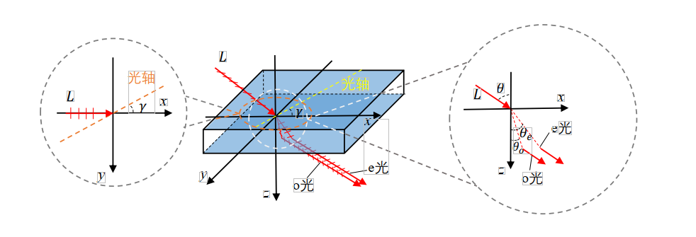
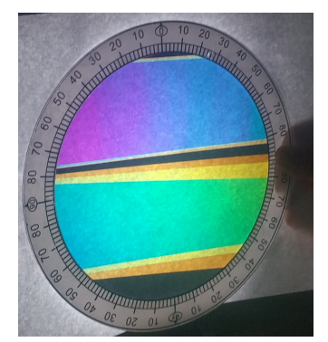

# 基于可见光信号的主动式设备位置感知

## 引言

物联网技术的快速发展，使得人们的生产生活都更加地智能化。越来越多的智能设备被应用到工厂、机场、家居等环境中，利用其通信能力以及感知能力为应用场景提供了大量的支持。室内定位技术可以帮助移动设备获取到其在空间中的位置，使得智能移动设备或机器人等可以在空间中进行移动作业，极大地扩展了物联网场景中智能设备的能力。许多智能设备或机器人等都携带有摄像头或光电二极管模块，可以对环境中的可见光进行收集和分析。基于可见光信号的移动设备定位技术因其所使用的可见光信号在环境中随处可得的便利性，而在众多应用场景中有着巨大的应用优势。近年来涌现了一大批利用环境中的可见光信号对移动设备进行定位的研究工作。

现有的基于可见光的移动设备定位技术为物联网应用场景下的设备提供了便捷的定位服务，为后来的可见光定位工作起到了积极的导向作用，但这些现有工作仍然存在诸多的局限性，使得现有方法应用范围有限。需要对光源进行改造的工作，能够给特定的场景提供便捷、精确的定位服务。但因为对大量光源进行电路改造成本较大，此类工作无法推广到一般的应用场景。需要对原有光源特征进行预先采集的工作也只能支持有限范围内的定位。当应用范围扩大，光源数量大量增加，不仅存储光源特征的成本提高，还使得不同光源之间的特征区分度降低，影响到系统的定位性能。使用相机成像模型的几何约束定位的工作依赖于对相机内参数的精准测量，阻碍了应用的大规模推广。

本节我们将向大家介绍一种无须对光源电路进行改造、也无须对所有光源进行预先特征采集、且不依赖任何相机参数的主动式可见光设备定位系统。各向异性材料的双折射现象会对入射的光线造成光程差，导致光线在射出双折射材料通过偏振片后发生干涉时产生各个频率上的干涉相长相消情况不同，从而改变入射光的光谱，使入射的白光显示出颜色，称为显色偏振现象。通过分析显色偏振系统中干涉结果与入射光线的入射方向之间的角度约束关系，得到显色偏振系统中可见光信道对信号的频率选择特性模型。

我们对各向异性材料显色偏振效应中干涉结果受光线入射方向的影响进行量化分析，得到显色偏振的频率选择特性与入射光角度的关系模型。从而利用该模型，通过显色偏振膜片的显色结果对入射光线进行角度估计，推导出显色偏振膜片与相机连线方向的角度约束。并结合相机与多个显色偏振膜片连线的角度约束，对相机的空间位置进行测量。

在本节，我们将介绍一种基于空间直线虚拟交点的定位算法，解决了利用相机采集到的显色结果的颜色误差导致的多个显色膜片到相机的角度约束不存在实际交点的问题，实现了在实际环境中对相机位置的感知。本节还将会介绍一种光学标签的身份编码方法，用于在较大的应用场景中通过设置多个光学标签来提供更加精确的定位服务。基于本节内容，我们可以使用经济实惠的透明胶带作为各向异性光学材料与偏振片进行组合，制作出可为相机提供定位服务的光学标签。

本节介绍的主动式可见光定位方法既不需要修改光源硬件又不需要相机内参数，可基于可见光信号的实现主动式相机定位。较之以往的可见光感知方法部署成本大幅降低。

## 显色偏振

可见光信号在信道中传播时，会由于信道中介质的折射、散射、反射等原因产生干涉的现象。在相同光程差的情况下，不同波长的可见光产生干涉相长和干涉相消的情况不同，导致一些波长的可见光增强的同时另一些波长的可见光减弱。干涉现象对包含多种波长分量的混合光的影响类似于滤波器对信号的频率选择特性，使得可见光信号的光谱发生变化。一束光在光谱上的变化会直接表现为颜色的变化，使得可见光干涉的结果可以直接被人眼或设备捕捉。各向异性材料的显色偏振现象就是基于干涉效应的可见光频率选择特性的体现。由各向异性材料的双折射效应所产生的两束折射光线借助偏振片的方向选择而产生干涉现象，使得入射光的颜色发生变化，因而被称为“显色偏振”现象。光线入射各向异性材料的角度会影响两束折射光线的光程差，从而改变显色偏振的显色结果，使得可见光信道表现出与光线入射方向相关的频率选择特性。本节将介绍可见光信道频率选择特性的产生原理及其现象。

### 光的干涉与频率选择特性

干涉是指两列波在空间中发生重叠时出现的波的叠加现象。产生干涉的两列波的振动直接叠加产生一个新的波。两束波发生干涉现象的条件是：（1）相同的频率，（2）相同的振动方向（3）恒定的相位差。当两列波的恒定相位差为0时，叠加产生的波的振幅是两列波振幅的直接相加，称为干涉相长。当两列波的恒定相位差为$\pi$时，叠加产生的波的振幅是两列波振幅的直接相减，称为干涉相消。当两列波的恒定相位差为其他值时，将会产生不同程度的相长或相消。

图. 产生干涉的两列波的不同相位差所对应的干涉结果。

上图所示的是不同相位差下两列波的干涉结果，可以看出干涉的相长和相消的情况与两列波之间的相位差相关。干涉结果的强度受到两列相干波强度和它们之间相位差影响。

光是具有波粒二象性的电磁波，能以波的形式产生干涉现象。在著名的托马斯⋅杨双缝干涉实验中，当一束单一频率的光穿过双缝时会产生两个相干光源。来自这两个相干光源的光在到达显示屏上同一位置时有着固定的光程差，由于相干光源频率相同，所以固定的光程差代表着固定的相位差。由于到达显示屏上不同位置的光程差不同，两束光线在显示屏上不同的位置干涉时的相位差也不同。在一些位置上，两束光干涉相长，形成亮条纹。在另一些位置上，两束光干涉相消，形成暗条纹。 

当把双缝干涉的光源由单一频率的光替换成由多种频率光线所组成的混合光时，在双缝后到达显示屏上同一位置的光线的光程差仍然是固定的。但此时的光程差对于混合光中的不同频率的光意味着不同的相位差，在显示屏的同一位置上不同频率光的干涉相长、相消情况不同。混合光的光谱在干涉后发生变化，干涉相长的频率增强，干涉相消的频率减弱。在固定光程差的情况下对多种频率的混合光所起的作用类似于滤波器对频率的选择作用。若混合光是有着所有频率可见光的自然光，产生干涉之前由于所有频率上光的强度相近而表现为白光。在干涉后一些频率上的光强增强，另一些频率上的光强减弱，能量越强的频率对干涉后混合光的颜色影响越强。干涉导致的光谱的改变，使得干涉后的混合光显示出相应的颜色。显示屏上不同位置由于光程差不同，干涉后的相长相消情况不同，导致显示屏上不同位置干涉的结果不同，显示出如下图所示彩色的条纹。

图. 以白光作为光源时的双缝干涉条纹。

### 各向异性材料的双折射效应与显色偏振现象

当光射入到各向异性晶体中时，在晶体内产生两束折射光的现象称为双折射效应。常见的能产生双折射效应的各向异性晶体有，石英、方解石、红宝石等。除了这些自然形成的晶体，许多塑料类制品由于在制作过程中的拉伸和挤压导致分子的拉伸，也表现出光学上的各向异性特征，对光线产生双折射的效果。如下图所示，可以看到在各向异性材料方解石晶体的双折射效果下，图纸上的网格和铅笔都表现出两个影像。

图. 方解石晶体的双折射现象。

当入射光沿晶体的某一个方向入射时，不会发生双折射现象，这个方向称为晶体的光轴（OpticalAxis）。光轴不是晶体中的一根轴，而是一个方向。当一束偏振光沿非光轴的方向入射到各向异性晶体中时会产生两束振动方向互相垂直的偏振光，如下图所示。其中一束折射光的振动方向垂直于光轴，称为寻常光（OrdinaryRay），下文中将其简称为o光。另一束偏振方向平行于光轴，称为非寻常光（Extraordinary Ray），下文中将其简称为e光。光线在双折射晶体中符合折射定律，当一束光以入射角$\theta$入射时，折射的o光和e光满足如下关系：

$$
n_{air}sin\theta = n_o sin\theta_o = n_e sin\theta_e
$$

其中$n_{air}=1$是空气的折射率，$\theta_o$和$\theta_e$分别是o光和e光的折射角。在入射方向与光轴一致时，$n_o\neq n_e$，也就是说只要光线不沿光轴方向射入，就会因为o光和e光的折射率不同而产生两条折射光线。o光的折射率是恒定的，从任何角度射入的光线都满足$n_o=N_o$，而e光的折射率随e光与光轴夹角而变化。当e光垂直光轴时$n_e=N_e$，当e光沿光轴时$n_e=N_o$，当e光沿其他方向时$n_e$介于$N_o$与$N_e$之间。e光的折射率受入射角$\theta$和入射光线与光轴在入射面上投影的夹角$\gamma$影响。

图. 偏振光在各向异性晶体中分成两束振动方向互相垂直的折射光。

当两束距离合适的平行偏振光同时入射到各向异性材料中，其出射光中的o光和e光会合并成为一束。其侧视图如下图所示，来自其中一条光线的o光和另一条光线的e光在射出各向异性晶体的时候光路发生重合。但此时这两条重合的光线偏振方向互相垂直。此时重合的两条光线虽然频率相同，相位差恒定，但其偏振方向互相垂直，并不满足干涉条件。

图. 双折射效应侧视图：来自两束平行的入射偏振光的寻常光和非寻常光在出射时汇聚为一束。

若是想要从上图中D点出射的光线发生干涉，需要使这两束振动方向垂直的光穿过一个线性偏振片（LinearPolarizer）。线性偏振片是一种只允许振动方向与其透振方向相同的光线通过的光学膜片，以下简称偏振片。当一束振动方向与偏振片透振方向不同时，只有其在偏振片透振方向上的分量能够通过。从D点射出的两束偏振方向互相垂直的光线在经过一个线偏振片后，同时在线偏振片的透振方向产生一个分量。这两个分量振动方向一致、频率相同、相位差恒定，因符合了干涉的三个条件而产生干涉。干涉的结果是射入双折射材料的白光光谱发生改变而显示出颜色。显色偏振的效果如下图所示。图中使用一个被台灯照亮的白纸作为光源，用一个偏振片产生偏振光，偏振光穿过作为双折射材料的透明胶带后穿过第二个偏振片，产生干涉显色的现象。不同的色带是由于所使用的双折射材料的厚度不同。同一条带上的颜色变化是由于观察点到条带上不同位置的角度不同。我们发现，双折射材料的厚度和观察的角度都会影响显色偏振的显色结果。

图. 以胶带作为双折射材料的显色偏振现象。

## 基于光学标签显色结果的相机定位算法

利用具有上述双折射效应的光学标签对相机进行定位，首先需要对光学标签所使用的显色偏振膜片进行显色偏振特征的采样，然后根据相机所拍摄到的图片上每个膜片的颜色，通过显色与角度关系得到相机到每个膜片的角度约束，最后根据多个膜片的角度约束计算出相机在3D空间中的位置。

### 基于采样与插值的光学标签显色特征获取

细粒度的光学标签显色特征全部通过采样的方式获取的话需要大量的人力消耗。我们观察到显色偏振现象的显色结果随入射角度的变化是连续的，因此，本工作中采用粗粒度采样结合插值的方法来获取光学标签显色特征。首先，采用遍历各个方向的方式对光学膜片在不同入射光角度下的显色结果进行采样。固定显色偏振光学膜片，在其一侧放置一个点光源，用相机在光学膜片的另一侧对膜片进行拍摄。拍摄的过程中记录相机相对于光学膜片的方位。由于空间中的方向有无穷多个，相机无法遍历所有的方向，只能对其中的一些方向上的显色结果进行采集。由于显色结果在相邻的方向上的变化是连续的，我们可以对采集到的粗粒度的结果进行插值获得更细粒度的显色结果与角度的对应关系。

### 基于空间直线相交的相机位置测量

在光学标签坐标系下对相机位置进行测量，首先应该以光学标签为参考物建立坐标系。以光学标签的中心为原点O，以垂直于光学标签表面的方向为Z轴，X轴指向光学标签右侧，Y轴指向光学标签上侧。如下图所示，为了便于表示，这里只在图中展示了3个光学膜片，并用这三个光学膜片来介绍本文中所使用的定位算法。

图. 利用相机到多个光学膜片的角度约束，得到相机位置。

如上图所示，$t_1$, $t_2$, $t_3$分别是已知位置的3个光学膜片，其中心位置分别为$p_1,p_2,p_3$。一个相机在位置$p_{cam}$对着三个膜片同时进行拍摄。分析相机捕获到的图片，得到的三个膜片显色结果的色相分别为$h_1,h_2,h_3$。由膜片的显色与观察角度的关系，以及三个膜片在坐标系中的位置$p_1,p_2,p_3$，得到从三个膜片出发的可能的空间射线组合$G_1,G_2,G_3$。射线组合$G_i$上的所有点都可以在光学膜片$t_i$上观察到色相值为$h_i$颜色。在$G_1,G_2,G_3$中必然各存在一条射线穿过相机所在位置$p_{cam}$。若空间中一点被分别来自$G_1,G_2,G_3$的三条射线同时穿过，本工作中，这样的点被称为射线组$G_1,G_2,G_3$的公共交点。只需要求出三组空间射线组合$G_1,G_2,G_3$的公共交点就可以得到相机的位置$p_{cam}$。

至此，我们就可以根据相机采集的光学膜片颜色信息得到角度约束并最终解析出相机的坐标位置。

## 参考文献

1. Lingkun Li, Pengjin Xie, Jiliang Wang. "RainbowLight: Towards Low Cost Ambient Light Positioning with Mobile Phones", ACM MOBICOM 2018.
2. Pengjin Xie, Lingkun Li, Jiliang Wang, Yunhao Liu. "LiTag: localization and posture estimation with passive visible light tags", ACM SenSys 2020.