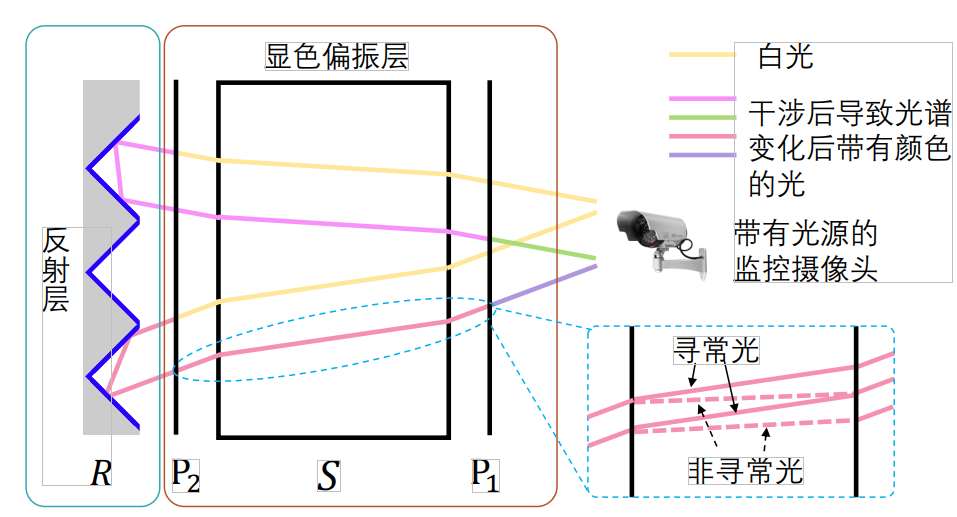
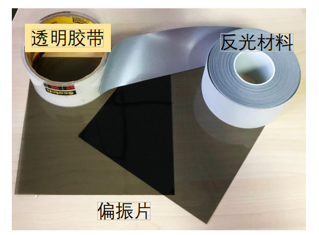

# 基于可见光信号的被动式标签位置感知和姿态估计

## 引言
本节介绍一种基于各向异性光学材料的显色偏振效应的被动式光学标签，无须特殊定制的阅读器，使用随处可得的相机和监控摄像头就可以实现用于普通物体的位置感知和姿态估计。该标签由偏振片、各向异性光学材料和反光材料组成，完全不需要消耗能量。被动式光学标签的反光层将来自摄像头方向的光线原路反射回摄像头，使得摄像头接收到标签上的显色情况。

利用上一节中显色偏振光学标签的定位原理，仅可以得到相机在光学标签坐标系下的位置，而无法获取相机的姿态（即相机坐标系各轴的朝向信息）。本节介绍的工作基于由标签颜色得到的相机在标签坐标系下的位置，结合相机成像模型中的投影几何关系，建立空间中的物点与照片上像点之间的投影模型。利用光学标签在相机“像平面”上的像点和光学标签在标签坐标系下的“物点”之间的投影关系，在相机坐标系与标签坐标系之间建立联系。根据标签坐标系与相机坐标系之间的转换关系，经由坐标系转换计算得到标签在相机坐标系下的位置和姿态信息。

本节介绍的被动式定位标签用成本低廉的透明胶带、偏振片和反光材料制作被动式光学标签，该标签制作成本低、部署容易，可以很方便的使用到不同的场景中。使用智能手机上的相机对光学标签进行拍摄，并得到被动式光学标签的位置和姿态。该系统可以为普通物体提供简便易得的定位和姿态估计服务，使得大量没有计算能力和通信能力的设备能够接入到物联网中。1. 结合显色偏振光学标签对相机的定位能力和相机成像原理设计了一种全新的不需要相机内参数的定位和姿态估计方法。
  
## 被动式光学标签设计

图. 被动式显色偏振光学膜片。

被动式光学定位标签引入了一种能把光线反射到光源方向的反光材料，将反光材料与显色偏振膜片结合构成了纯被动式的光学膜片，如上图所示。该反光材料的反射原理类似于自行车灯和交通反光材料，可以把光线以平行于入射方向的方向反射出去。摄像头所携带的光源发出的白光首先经过显色偏振层，两束出射光线发生干涉而产生颜色。干涉后带有颜色的光继续传播到达反射层，经由反射层反射后光线沿入射方向返回。再次经由显色偏振层后发生第二次干涉，光谱再次改变后到达摄像头，被摄像头捕获。
使用下图所示的胶带、偏振片和反光材料制作被动式显色偏振膜片。无须任何的电路部分和供电模块，完全实现真正的被动式。由于显色偏振效应对光线的频率选择特性与光线入射方向相关，且被动式显色偏振膜片的反射光线与入射光线方向平行，所以被动式显色偏振膜片的显色结果与入射光的方向相关，即与光源和相机相对于显色膜片的方向有关。

图. 用于制作被动式显色偏振膜片的材料：透明胶带、偏振片与反光材料。

下图是自带有光源的相机从不同的角度拍摄被动式显色偏振膜片得到的图片，可以看出被动式显色偏振膜片的显色结果与相机相对膜片的观察方向相关。

图. 被动式显色偏振膜片在不同
观察方位下的显色结果。

将多个显色偏振膜片集成到同一个平面上，得到如下图所示的被动式光学标签。该标签在没有光源为其提供入射光线的情况下，各光学膜片呈现较为暗淡的颜色，如图左所示。当摄像头一侧的光源打开，光源发出的入射光线到达反射层后原路返回到摄像头，则会使被动式标签上的各光学膜片上呈现出明亮的显色结果，如图右所示。

图. 多个被动式显色偏振膜片组成被动式光学标签：（左）摄像头未开光源时的被动光学标签，（右）摄像头打开光源时的被动光学标签。

基于此，通过获取被动式光学标签反射光颜色和相对位置，我们可以计算出标签相对于摄像头的位置和姿态信息。

## 参考文献

1. Lingkun Li, Pengjin Xie, Jiliang Wang. "RainbowLight: Towards Low Cost Ambient Light Positioning with Mobile Phones", ACM MOBICOM 2018.
2. Pengjin Xie, Lingkun Li, Jiliang Wang, Yunhao Liu. "LiTag: localization and posture estimation with passive visible light tags", ACM SenSys 2020.