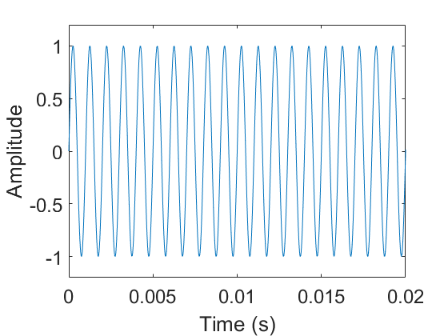

# 信号的生成、发送和接收

​		在物联网组网传输的过程中，不可避免地要接触到各种无线信号，其中电磁信号和声波信号是比较有代表性的两种。为了实现无线传输的基本功能以及在上面发展出来的各种技术，我们首先需要了解信号的基本处理方法和相关的理论知识，并且最好还能够实际动手试试。

​		在真实场景中，我们一般都是使用电磁波信号进行通信和感知，现在市面上有了能够让我们进行信号处理的设备，例如通用软件无线电设备(USRP, Universal Software Radio Peripheral)设备可以处理电磁波。

​		为了使大家能够更加直观的感受和学习信号的特点，让大家能够更加直观地看到信号，更加直接的处理和分析信号。本课程后面的材料中如果没有特殊声明，都将使用声波信号来模拟物联网连接过程中的各种技术，这样做有以下的几个好处：

- 声波信号可以较好的模拟电磁波的特点，大部分的处理方法都是通用的，可以使大家比较容易地理解基本方法。
- 声波信号对硬件的要求较低，现有的手机等设备就能够进行声波信号处理，方便大家直接做实验，也降低了硬件门槛。
- 声波信号可以比较直观地画图展示，便于大家进行分析对比。同时声波信号能够被人听到，可以有更加直观的感受。
- 有了声波信号的基础，学习其他信号会非常方便，可以方便地扩展到电磁波等其他信号。

​		通过后面的学习，大家能够熟悉信号处理的基本方法，以及物联网通信和感知的基本思路。本章内容将介绍信号处理的基本方法和理论知识，为之后的物联网传输、通信、感知技术奠定基础。

​	在介绍信号的生成、发送和接收之前，我们先来了解一下声波信号的基本特征。**声波**是一种机械波，是由发声体振动并在介质中传播产生的。声波每秒钟振动的周期数称为声波的频率，单位是赫兹（Hz）。一般来说，人耳可以听到的声波频率大概在20 Hz​到20 kHz之间，频率超过20 kHz​的声波我们称为超声波，低于20 Hz​的声波称为次声波。

​	由于声波的传播是由物体的震动引起了空气的震动，因此声波也可以带动其他物体震动，出现了类似超声波洗龙虾、超声波洗眼镜、超声波洗牙等应用。

​	下图展示了一个频率为1 kHz​的正弦声波信号，图中横轴为时间，纵轴为信号的幅度。信号的幅度在$1$和$-1$之间周期性变化，变化的频率为1 kHz​，即一秒钟内有一千个周期。

<center>

</center>
<center>
<div style="color:orange; border-bottom: 1px solid #d9d9d9; display: inline-block;color: #999;padding: 2px;">图. 1KHz正弦声波信号信号</div>
</center>

​	为了产生这段声音，我们只需要在Matlab中运行如下代码就可以。大家可以用Matlab的```sound()```函数将这段声音播放出来看看（代码第5行播放声音），代码最后会将生成的声波保存成本地文件```sound.wav```，用电脑上的音频播放器播放该文件的效果应与```sound()```函数在代码中直接播放的效果一致。

```matlab
Fs = 48000;                             % 采样频率（单位：Hz）
T = 4;                                  % 时间长度（单位：s）
f = 1000;                               % 信号频率（单位：Hz）
y = sin(2*pi*f*(0 : 1/Fs : T));         % 产生声音
sound(y,Fs)                             % 播放声音
audiowrite('sound.wav', y, Fs);         % 保存声音
```


​		上面的代码完整地实现了声波的生成、发送（播放）和保存成本地文件的功能。大家可以注意，我们这里出现了 **采样** 这一概念，其中还涉及到两个频率： **采样频率** 和 **信号频率** 。这些概念以及它们之间的联系与区别将在之后的小节介绍。

> 这个材料里面很多代码是基于`Matlab`来写的，如果没有使用过，可以查看附录中的材料作为参考，网上也有很多其他的参考资料。

​	Matlab同样可以实现声波的接收功能，代码如下：

```matlab
Fs = 48000;                             % 采样频率（单位：Hz）
Rec = audiorecorder(Fs, 16, 1);         % 定义录音对象
T = 4;                                  % 录音时长（单位：s）
record(Rec, T);                         % 开始录音
pause(T);                               % 等待录音结束
y = getaudiodata(Rec);                  % 从录音对象中取出音频数据
audiowrite('sound.wav', y, Fs);         % 保存声音
```

​		上面的代码录制一段时间的声波信号并保存成本地文件。在定义录音对象时调用了函数```audiorecorder```，这个函数有3个参数，从前到后依次是 **采样频率** , **采样位数** 和 **声道数** 。理解这个函数，我们要理解信号处理的几个关键概念，包含采样、量化等。在这个例子中，我们设置采样频率为48 kHz​，采样位数为$16$位，声道数为$1$（即单声道）。这3个参数从3个不同的维度确定了所接收声波的格式。声道数一般指的是该声音有几路（例如是几个麦克风录制的）。在matlab代码中，如果声道数为1，则录制得到的音频数据是一个列向量；如果声道数为2，则录制得到的音频数据是两个列向量组成的矩阵，每一列分别代表从一个麦克风录制的结果。麦克风就是信号的采样设备，在电磁波场景中，就使用电磁波采样设备对电磁波信号进行采集。

这里是我们信号发送和接收的基础了，大家可以都动手来尝试一下。这一部分是我们用声波来模拟信号发送和接收的基础。在无线信号平台上，经历的也是类似的过程，只不过用来发送、采样的硬件设备不一样，我们这里使用声波更加直观。

