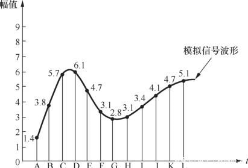

# 信号量化

​	根据采样定理，我们可以对一个连续的信号进行采样，保证最后能够还原出原始信号。采样后，第二个问题就跟着出现了，对于采样到的每一个数据，由于实际数据是连续的（例如测量温度0度到40度的连续取值），理论上的取值精度是无限大的（例如可以为39.00000000001度，小数点后有非常多的0），保存这样的数据就需要无限大的存储空间。显然，在我们的实际系统处理的过程中无法存储精度这样高的数据。

​	如何来存储这些数据，就涉及到信号处理过程中的一个重要步骤：量化。大家平时处理的信号，例如无线信号（I/Q）数据，声音采样后的信号，都是经过量化后的结果。

​	在信号处理过程中，量化指将信号的连续取值（或者大量可能的离散取值）转化为有限多个（或较少的）离散值的过程。量化主要应用于从连续信号到数字信号的转换中。连续信号经过采样成为离散信号，离散信号经过量化即成为数字信号。注意离散信号指的是在时间上离散（即信号在有限多个时刻处有定义，而不是在一段连续的时间上），但可能在值域上（即幅度）并不离散，因此需要经过量化的过程才能存储。信号的采样和量化通常都是由ADC实现的。回顾一下，连续信号通常需要经过两个步骤，在时间上离散和在值域上离散，最后才能够转化成我们能够处理的数据，这两个步骤分别就对应到采样和量化。

​	下图展示了量化的基本原理过程，量化过程将连续的输入信号转换为离散的输出信号，图中的虚线指的是如果不经过任何转换，输入信号和输出信号应该完全一致。但由于量化的作用，输入信号的一段连续取值只能转化成有限的几个离散值，实线的“阶梯型”曲线反映了这一结果，即把一小段连续区间内的输入信号值转化成同一个输出信号值。

图. 量化原理图

​	上图中“阶梯”的数量，即量化后离散取值的可能个数，是用**量化位数**计算出来的。例如，8位的ADC输出的数字信号在幅度上可以有$2^8=256$种不同的离散取值。为了进一步说明量化的过程，这里以3位（3 bit）ADC进行量化的过程为例进行说明，如下图所示：

图. 量化示意图

​	上图中，输入信号是一个模拟信号，采样点为A～L，幅值范围为0～9（注意是连续的），采样值、量化和编码的结果如下表所示：

表. 采样值、 量化和编码的结果

​	我们将采样得到的实数信号值通过一定的近似方法（这里采用“四舍五入到整数”的近似方法）转化为量化值（量化值本身可以是整数或者实数），然后再将量化值对应到3比特的二进制数，称为编码，这样我们就能在电脑中存储这一段信号了。

​	量化过程输出信号和原始信号显然是有差别的，这个差别就是**量化噪声**。同时量化中使用的位数越多，输出的信号就越接近原始信号，量化噪声就越小。我们通常说的高保真，其中有一个重要步骤就是采用足够多的量化位数，保证量化噪声足够小，这样量化出来的信号能更接近原始信号，当然其代价就是存储和处理的开销变大。大家在网上交了会员费能够听到的高保真音乐，可以看到它们占用的存储空间也会比一般的音乐文件大很多。

​	按照量化级的划分方式不同，有均匀量化和非均匀量化两种方式。在上面“量化原理图”中，如果每个“阶梯”，即输出信号可能的离散取值是等间隔分布的，则称为均匀量化，否则就是非均匀量化。对于n位的均匀量化，ADC输入动态范围被均匀地划分为$2^n$份。而对于n位的非均匀量化，ADC输入动态范围的划分不均匀，一般用类似指数的曲线进行量化。这两种划分方式是为了满足实际需要：非均匀量化是针对均匀量化提出的，例如在一般的语音信号中，绝大部分是小幅度的信号，且人耳听觉遵循指数规律，为了保证关心的信号能够被更精确的还原，我们应该将更多的量化位用于表示幅度较小的信号。

​	至此，我们已经将物理信号转化为了计算机上可以处理的数字信号了，这也是通信的基础。对应于声波，我们将声波信号存储起来了，对于其他的无线信号，我们也可以采用类似的方法将信号存储起来了（通常都是I/Q数据，后面我们解释I/Q数据是什么含义）。

> 思考
> 1. 假设要将最大频率为8KHz的歌曲信号转成数字信号，量化位数为8 bit，则产生的信号码率至少是多少（信号码率为每秒的数据量，数据量单位为字节B、千字节KB等）？1分钟的信号大小是多少？
> 2. 日常生活中的Wi-Fi信号有一个工作频段是在$2.4GHz$附近，这是否意味着需要$4.8GHz$的采样频率才能对Wi-Fi信号进行采样？按照8位量化器的量化方式，在$4.8GHz$的采样率下，一秒钟可以生成多大的数据量？

## 参考资料和文献

1. [详解音频信号量化](https://baijiahao.baidu.com/s?id=1614627981206121506&wfr=spider&for=pc)