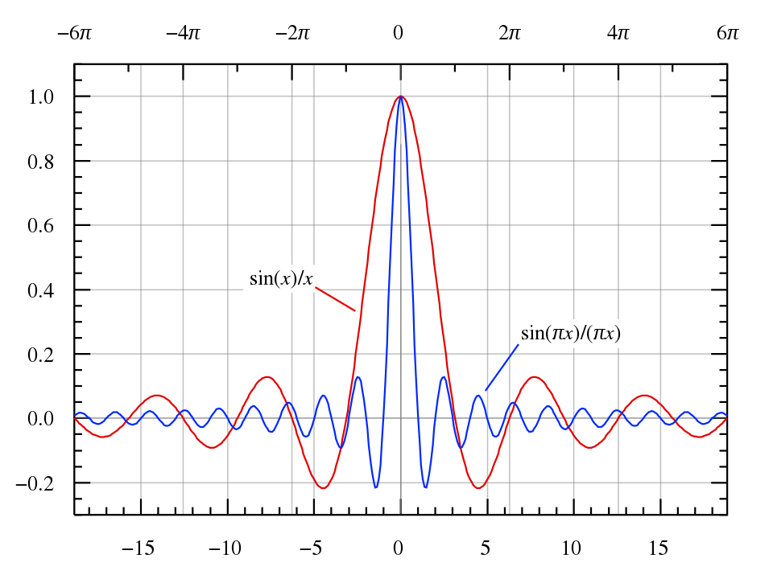

# 傅里叶变换

​	我们可以将任意满足狄利克雷条件的周期函数，展开成傅里叶级数。由于展开式中的每一项仅包含单一的频率，因此我们可以从中提取信号中各频率分量的强度——即信号频谱。至此，我们利用傅里叶级数，最终实现了信号从时域到频域的转换。

图. 傅里叶级数实现信号从时域到频域的转换

​	但是，傅里叶级数仅仅适用于满足狄利克雷条件的周期函数，对于更一般的非周期函数，我们又该如何将它从时域转换到频域呢？

​	事实上，时域信号的周期$T$决定了频域上相邻两个输出之间的距离，即频率的分辨率$\Delta f = \frac{1}{T}$，周期信号的频谱是离散的。当输入信号的周期不断增大，得到频域输出之间的距离随之不断减少。当周期$T$不断增加直至趋近于$\infty$，这时候频率间隔会非常小。此时周期信号退化为非周期性的一般时域信号，而相应的该信号对应的频域输出距离此时也趋近于$0$，即一个连续的频域输出。从直观上来看，非周期的信号对应着连续的信号频谱。

图. 从傅里叶级数到傅里叶积分

​	一个非周期的信号可以视为周期信号$T \to \infty$的极限。

​	我们先写出周期为$T$的函数$g(t)$的傅里叶级数：
$$
\begin{aligned}
g(t) &= \sum_{n=-\infty}^{\infty} c_{n} \cdot e^{j \frac{2 \pi n t}{T}} \\
&= \sum_{n=-\infty}^{\infty} \left(\frac{1}{T}\int_{-\frac{T}{2}}^{\frac{T}{2}}g(\xi )e^{-j\frac{2\pi n\xi }{T}} d\xi\right) \cdot e^{j \frac{2 \pi n t}{T}}
\end{aligned}
$$

​	注意到$g(\xi )e^{-j\frac{2\pi n\xi }{T}}$是周期函数，所以积分区间是$[0,T]$或$[-\frac{T}{2},\frac{T}{2}]$并不影响$c_n$的值。频谱上的频率毋庸置疑应该是$f_n = \frac{n}{T}$，频率分辨率$\Delta f = \frac{1}{T}$。重新整理一下傅里叶级数展开式，我们有

$$
g(t) = \sum_{n=-\infty}^{\infty} \left(\int_{-\frac{T}{2}}^{\frac{T}{2}}g(\xi )e^{-j2\pi f_n \xi } d\xi \right) e^{j 2 \pi f_n t} \Delta f.
$$

​	接下来我们令$T\to +\infty$，那么$\Delta f \to 0$，求和号变为积分号，于是我们得到

$$
g(t) = \int_{-\infty}^{\infty} \left(\int_{-\infty}^{+\infty}g(\xi )e^{-j2\pi f \xi } d\xi \right) e^{j 2 \pi f t} df.
$$

​	上式称为$g(t)$的傅里叶积分表示。相比于傅里叶级数使用无穷求和来展开一个函数，傅里叶积分用连续的频率$f$展开了$g(t)$。特别的，对应于离散谱中的频率分量$c_n$，我们有连续形式的频率分量

$$
\hat{g}(f) = \int_{-\infty}^{+\infty}g(\xi )e^{-j2\pi f \xi } d\xi.
$$

​	我们称$\hat{g}(f)$为$g(t)$的 **傅里叶变换（Fourier Transform，FT）** 。从傅里叶积分表达式中，我们看到还有从$\hat{g}(f)$回到$g(t)$的 **逆傅里叶变换（Inverse Fourier Transform，IFT）** 

$$
g(t) = \int_{-\infty}^{\infty} \hat{g}(f) e^{j 2 \pi f t} df.
$$

​	读者可能在其他文献上看到与上面形式不同的傅里叶变换公式，比如多了个常数因子$\frac{1}{2\pi}$，如使用角频率$\omega$而非频率$f$。这仅仅是记号不同，并不影响FT本质。

​	下面我们来计算一个非常经典的傅里叶变换——矩形函数的傅里叶变换，注意如果要理解信号处理的很多功能，必须要好好理解矩形函数的变换，反过来说，如果理解清楚了矩形函数的变化，那么很多功能就很好理解了。矩形函数为

$$
g(t)=\left\{
\begin{aligned}
1, &\quad -\frac{1}{2} < t < \frac{1}{2} \\
0, &\quad 其他
\end{aligned}
\right.
$$

​	则

$$
\begin{aligned}
\hat{g}(f) &= \int_{-\frac{1}{2}}^{\frac{1}{2}}e^{-j2\pi f \xi } d\xi \\
&= \left. -\frac{1}{j2\pi f }e^{-j2\pi f \xi } \right |_{-\frac{1}{2}}^{\frac{1}{2}} \\
&= \frac{\sin(\pi f)}{\pi f}
\end{aligned}
$$

​	这个结果又叫$sinc$函数，其图像如下所示，在$0$处呈现一主瓣，距离中心越远旁瓣越小。

图. sinc 函数图像

> 大家要记住这个函数图像，未来很多地方都会碰到，对后面理解很多地方都很重要。

​	由于矩形函数和$sinc$函数酷似动画里的海绵宝宝和派大星，因此又有人戏称海绵宝宝和派大星是一对傅里叶变换。

图. 海绵宝宝的傅里叶变换是派大星

​	这一对傅里叶变换因为太过知名而经常在许多地方出现，如2019年计算机网络顶级会议SIGCOMM就采用了它们作为logo的设计元素，方形曲线同时寓意长城，和会议举办地城市北京的文化融合在一起，可谓设计精妙。

图. SIGCOMM 2019 图标

​	一般来说，傅里叶变换针对的是非周期信号，通常意义下周期信号的傅里叶变换不存在（因为积分结果是无穷大）。但如果引入广义函数，我们也能够对诸如$\sin(t)$这样的信号做傅里叶变换，其结果则是大名鼎鼎的狄拉克$\delta$函数。从这个角度讲，傅里叶变换是包含傅里叶级数的，在此我们不继续探讨，感兴趣的读者可以自行探究。

​	傅里叶变换除了给出信号频谱外，其实还引出了一类重要的数学方法——积分变换。在我们上面的介绍中，是说傅里叶变换求解出了时域信号的频域，其实我们还可以说它是把一个函数变为了另一个函数（也即函数的函数），其具体做法是把原来的函数乘上一个核函数再做积分。如果我们把核函数换成别的形式，就可以得到其他积分变换，如拉普拉斯变换、希尔伯特变换、梅林变换等。这些积分变换有着重要的作用，例如可用来解偏微分方程。笔者犹记得教授数理方程的老师曾打趣地说过：“过了很多年之后啊，你们可能已经不太记得这门课上学的东西，那你们如何能在别人面前说你学过数理方程呢？只要你还记得，你会用分离变量法解弦振动方程，用傅里叶变换解热传导方程就可以了！”。
