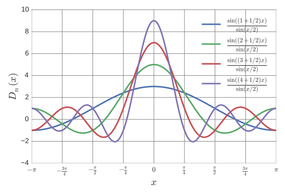
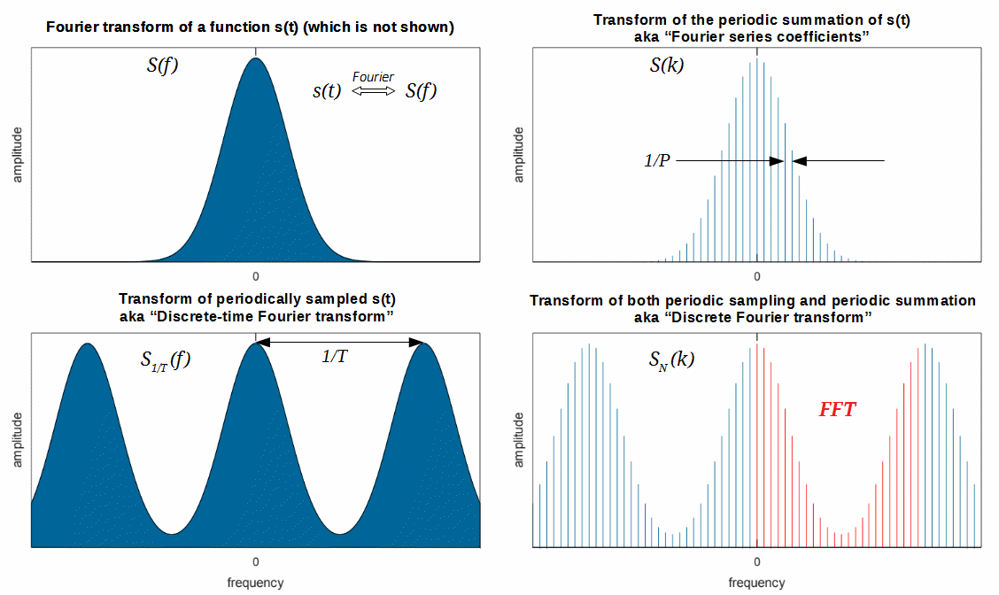
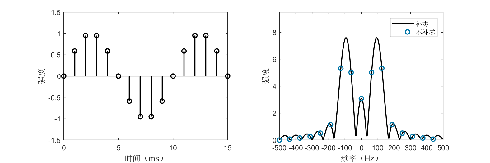
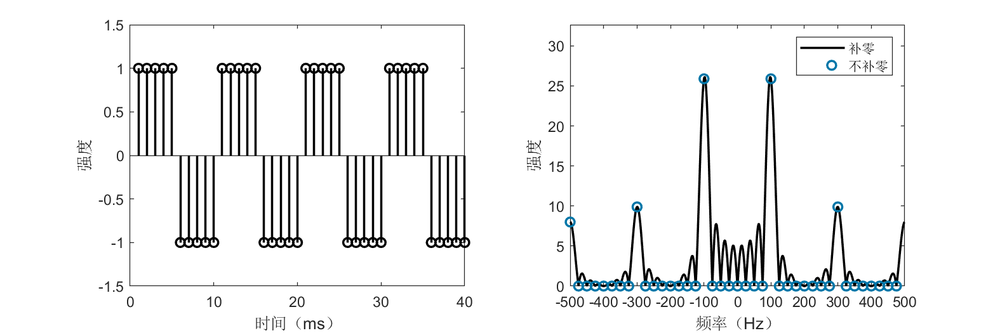

# 离散傅里叶分析

## 离散傅里叶级数

​	从傅里叶级数到傅里叶变换，我们从离散频域变到了连续频域，但它们处理的都是连续时间信号，而在实际信号处理中我们不会处理连续的信号，更多地会面对因为采样而在时间上离散的信号。我们同样关心这些信号的频谱。因此我们仿照前面的做法，从研究离散的周期序列开始，推导离散傅里叶级数。也就是我们假设我们能够采样到一个周期信号，怎么根据采样的结果来分析这个信号。

​	设有一个离散的周期序列$x[n]$（我们用方括号表示里面的变量是离散的），其周期为$N$。按照傅里叶的思想，我们可以将它展开为一系列三角波的和。在之前的傅里叶级数展开中，我们选择的频率是基频的0倍、1倍、2倍……周期为$N$的序列其基频是$\frac{1}{N}$，那么我们应选取的三角波是$e^{j2\pi\frac{0}{N}n}, e^{\pm j2\pi\frac{1}{N}n}, e^{\pm j2\pi\frac{2}{N}n}, \cdots$, 但稍加观察我们会发现，并非像连续情形下出现了无穷多种频率，离散情况下这些三角波事实上只有$N$种，因为$e^{j2\pi\frac{k+N}{N}n} = e^{j2\pi\frac{k}{N}n}$。离散情况下只存在$\frac{0}{N}, \frac{1}{N}\dots, \frac{N-1}{N}$这样的频率，所以离散傅里叶级数对应可表示为

$$
x[n] = \sum_{k=0}^{N-1}c_k \mathbf{e_k}.
$$

​	可以看到，该表达式与有限维欧几里得空间上向量的展开更为相似，我们用与连续傅里叶级数中相似的做法来确定$c_k$与$\mathbf{e_k}$。首先我们要定义一个内积，我们令无穷长周期$N$的离散序列$\mathbf{a}= (\cdots, a_0, a_1, \cdots, a_{N-1}, \cdots)$和$\mathbf{b}= (\cdots, b_0, b_1, \cdots, b_{N-1}, \cdots)$的内积为

$$
\langle \mathbf{a}, \mathbf{b}\rangle = N \sum_{n=0}^{N-1} a_n \overline{b_n}.
$$

​	可以验证该定义满足内积三条件（右边的系数$N$只是为了让我们的记号与后面章节更贴合，其选取本身可以是任意的，如设为1）。我们选取单位正交基向量$\mathbf{e_k} = (\frac{1}{N}e^{j2\pi \frac{k}{N}\cdot0}, \frac{1}{N}e^{j2\pi \frac{k}{N}\cdot1}, \cdots, \frac{1}{N}e^{j2\pi \frac{k}{N}(N-1)}), k=0, 1, \cdots, N-1$。那么我们有 **离散傅里叶级数（Discrete Fourier Series，DFS）** 展开式

$$
x[n] = \frac{1}{N}\sum_{k=0}^{N-1} c_k e^{j2\pi \frac{k}{N}n}.
$$

​	系数$c_k$可如下确定

$$
c_k = \langle x, \mathbf{e_k}\rangle = N\sum_{n=0}^{N-1} x[n] e^{-j2\pi \frac{k}{N}n}.
$$

​	读者可能在其他地方看到形式类似但略有差别的DFS公式，我们再次强调这只是记号不同，并不影响DFS本质，如把$\frac{1}{N}$拆成两个$\frac{1}{\sqrt{N}}$分别放到以上两个公式里。

​	我们同样以矩形波为例，计算DFS展开。设矩形波

$$
x[n]=\left\{
\begin{aligned}
1, &\quad 0 \leq n < 4 \\
-1, &\quad 4 \leq n < 8 \\
x[n\pm 8], &\quad 其他.
\end{aligned}
\right.
$$

​	则

$$
c_k = \sum_{n=0}^{3} 1 \cdot e^{-j\frac{2\pi k}{8}n} + \sum_{n=4}^{7} (-1) \cdot e^{-j\frac{2\pi k}{8}n}.
$$

​	我们用MATLAB展示矩形波的展开过程，如下：

```matlab
%% 矩形波的离散傅里叶级数展开
% 构造周期为8的离散矩形波
N = 8;
xn = [ones(N/2, 1); -1*ones(N/2,1)];
figure;
stem(repmat(xn,2,1),'color','black','linewidth',1.5);
ylim([-1.5 1.5]);
```
<center>

</center>

<center>
<div style="color:orange; border-bottom: 1px solid #d9d9d9;
display: inline-block;
color: #999;
padding: 2px;">图. 周期为8的矩形波</div>
</center>

```matlab
% 计算离散傅里叶系数
figure;
z = zeros(length(xn), 1);
for k = 0:N-1
    % 向量e_k的系数
    ek = zeros(length(xn), 1);
    for ii = 1:8
        ek(ii) = exp(1j*2*pi*ii*k/N)/N;
    end
    ck = N * sum(xn .* conj(ek));

    z = z + ck*ek;
    if mod(k, N/4) == 1
        % 绘图
        subplot(2,2,ceil(k/(N/4)));
        % 画出序列的实部
        stem(real(repmat(z,2,1)),'color','b','linewidth',1.5);
        title(strcat(['前' num2str(k+1) '项求和']));
        ylim([-1.5 1.5]);
    end
end
```
<center>

</center>

<center>
<div style="color:orange; border-bottom: 1px solid #d9d9d9;
display: inline-block;
color: #999;
padding: 2px;">图. 矩形波离散傅里叶级数展开</div>
</center>

## 离散时间傅里叶变换

​	上面讨论了周期序列的离散傅里叶级数，按照之前的逻辑，当我们把周期信号推向非周期信号时，离散的频域会变成连续的频域，离散傅里叶级数就应该变成“离散傅里叶变换”？不过由于种种原因，我们把这样推出来的变换称之为离散时间傅里叶变换。我们后面会讨论的“离散傅里叶变换”不仅时域离散，频域也是离散的。

​	对于一个非周期的序列$x[n]$，我们考虑截取其中从$N_1$到$N_2$长为$N$的一段作周期延拓，于是得到一个周期为$N$的序列$\widetilde{x}[n]$。

$\widetilde{x}[n]$有离散傅里叶级数

$$
\widetilde{x}[n] = \frac{1}{N}\sum_{k=N_1}^{N_2} c_k \, e^{j2\pi \frac{k}{N}n}.
$$

​	DFS的系数$c_k$为

$$
c_k = \sum_{n=N_1}^{N_2} \widetilde{x}[n] e^{-j2\pi \frac{k}{N}n}.
$$

​	令$N_1 \to -\infty$，$N_2 \to +\infty$，则$\widetilde{x}[n]$变为$x[n]$。若求和式收敛，则

$$
c_k = \sum_{n=-\infty}^{+\infty} x[n] e^{-j2\pi \frac{k}{N}n}.
$$

​	令$\omega = 2\pi \frac{k}{N}$，当$N\to +\infty$的时候$\omega$将表示一个连续的频率。我们把$c_k$换成另一个记号$X(\omega)$，则有

$$
X(\omega) = \sum_{n=-\infty}^{+\infty} x[n] e^{-j\omega n}.
$$

​	我们称$X(\omega)$为$x[n]$的 **离散时间傅里叶变换（Discrete-time Fourier Transform，DTFT）** 。对于它的逆变换，我们可以考察$\widetilde{x}[n]$的表达式，$\frac{1}{N}=\frac{\Delta \omega}{2\pi}$在$N \to +\infty$时成为$\frac{d \omega}{2\pi}$，求和号转为积分号，我们得到

$$
x[n] = \frac{1}{2\pi}\int_{0}^{2\pi} X(\omega) e^{j\omega n}d\omega.
$$

​	上式称为 **逆离散时间傅里叶变换（Inverse Discrete-time Fourier Transform, IDTFT）** 。

与之前一样，我们仍旧来计算一下矩形波的DTFT。令

$$
x[n] = \left\{
\begin{aligned}
1, &\quad -N \leq n \leq N \\
0, &\quad 其他.
\end{aligned}
\right.
$$

则

$$
X(\omega) = \sum_{n=-N}^{N} e^{-j\omega n} = 1 + 2\sum_{n=1}^{N}\cos(n\omega) = \frac{\sin((N+\frac{1}{2})\omega)}{\sin\frac{\omega}{2}}.
$$

​	上面的结果是著名的狄利克雷核（Dirichlet kernel），其图像和sinc函数极为相似，不同点在于狄利克雷核是一个周期函数。

<center>

</center>

<center>
<div style="color:orange; border-bottom: 1px solid #d9d9d9;
display: inline-block;
color: #999;
padding: 2px;">图. 狄利克雷核</div>
</center>

​	从另一个角度来说，我们对一个连续信号进行离散的采样就是希望从采样结果也能获得连续信号的频谱，所以狄利克雷核与sinc函数相似也是理所当然的。当采样率无穷高时，DTFT的结果与FT相同。在采样定理所描述的一定理论条件下，可以由DTFT完全恢复出原来的连续函数。


## 离散傅里叶变换

​	最初傅里叶分析被提出并不是为了做信号处理，而是解偏微分方程，但是现在傅里叶分析应用最广的地方便是信号处理。依信号的连续性和周期性分类，我们分别导出了FS、FT、DFS和DTFT，如下所示：

连续的周期信号   $\Rightarrow$ 傅里叶级数（FS）

连续的非周期信号 $\Rightarrow$ 傅里叶变换（FT）

离散的周期信号   $\Rightarrow$ 离散傅里叶级数（DFS）

离散的非周期信号 $\Rightarrow$ 离散时间傅里叶变换（DTFT）

​	不过在信号处理中最常用的却是一个称为离散傅里叶变换的方法，这又是从何而来呢？注意到，在FS、FT、DFS和DTFT中，我们讨论的都是无穷长信号的分析。在实际系统中，我们往往只能得到有限长的离散信号，如何分析一个它的频谱呢？

​	首先让我们想一想，什么是离散有限长信号的频谱？离散和有限都只是现实施加于我们的限制，我们希望这个“频谱”能反映真实信号的频谱。设离散有限长信号$x[n]$的长度为$N$，$n\in \{0, 1, \cdots, N-1\}$。那么，有三种情况：

1. 真实信号是周期的，有限长信号恰好截断了整数个周期；
2. 真实信号是周期的，有限长信号并非截断了整数个周期；
3. 真实信号是非周期的。

### 第一种情况
​	对于第一种情况，很简单，只要把这一段信号复制多遍放到首尾做周期延拓即可，于是乎我们便得到了一个离散的周期信号。用DFS就能得到信号频谱，也即DFS的系数$c_k$。我们把$c_k$换成另一个记号$X[k]$，因此有

$$
X[k]=\sum_{n=0}^{N-1} x[n] \, e^{-j2\pi\frac{k}{N} n}, \quad k=0,1, \ldots, N-1.
$$

​	我们称$X[k]$为$x[n]$的 **离散傅里叶变换（Discrete Fourier Transform, DFT）** 。由DFS展开式，我们还有 **逆离散傅里叶变换（Inverse Discrete Fourier Transform, IDFT）** ：

$$
x[n]=\frac{1}{N} \sum_{k=0}^{N-1} X[k] \, e^{j2\pi\frac{k}{N} n}, \quad n=0,1, \ldots, N-1.
$$

​	这里再次强调，DFT和IDFT变换式中和式前面的归一化系数并不重要。在上面的定义中，DFT和IDFT前的系数分别为1和$\frac{1}{N}$，有时会将这两个系数都改成$\frac{1}{\sqrt{N}}$。

​	所以DFT就是DFS中的系数公式，IDFT就是DFS展开式，相当于从另外一个角度把离散周期信号重新理解了一遍。继而我们可以把上面的分类修改为：

连续的周期信号   $\Rightarrow$ 傅里叶级数（FS）

连续的非周期信号 $\Rightarrow$ 傅里叶变换（FT）

离散的周期信号   $\Rightarrow$ 离散傅里叶级数（DFS）& 离散傅里叶变换（DFT）

离散的非周期信号 $\Rightarrow$ 离散时间傅里叶变换（DTFT）

​	这时读者会问了，那第二、三种情况怎么办呢？

### 第二、三种情况
​	先来看第二种情况，问题来了，我怎么知道它截断的是不是整数个周期呢？我唯一知道的只有那个有限长的序列，我怎么能在没有其他证据情况下对真实信号妄加揣测呢？所以说，情况二无解，我们只能默认截断的是整数个周期。但由于现实中很难正好截断整数个周期，因此会导致用DFT计算得到的频谱可能与连续信号有差别，俗称“频谱泄露”。

​	第三种情况同样如此，信号都是非周期了，我怎能知道小于$0$或大于$N$的时候信号是什么样子呢？所以合理的假设是，我们的采样时间足够长，长度$N$的序列已经包含了有效信号的全部，之外的部分都是$0$。如此一来，我们得到了一个无穷长非周期离散序列，自然可以用DTFT来处理它，于是有信号频谱

$$
X(\omega) = \sum_{n=-\infty}^{+\infty} x[n] e^{-j\omega n} = \sum_{n=0}^{N-1} x[n] e^{-j\omega n}.
$$

​	细心的读者会发现，DFT表达式跟上式好像差不多。没错，DFT只是$X(\omega)$进行离散取值$\omega=\frac{2\pi k}{N}$时的情况。或者换种说法，对有限长信号而言，DFT是DTFT在频域主值区间上的抽样。在信号处理中，为方便数字电路计算，我们不仅需要时域离散，还需要频域离散，因此即使真实信号是非周期的，我们也需要对DTFT的连续频谱进行抽样以存储频谱。既然总归要抽样，DFT也是对DTFT的一种抽样，何不就用DFT来对付这第三种情况呢？

​	善于思考的读者会想到，就算DFT能抽样，但它的频域分辨率只是固定的$\frac{2\pi}{N}$，如果我想要更细粒度的频谱，DFT不就办不到了？不急，DFT还有一个神奇的辅助操作——时域 **补零（Zero Padding）** ，比如我们将$x[n]$添上长度为$N$的$0$序列，记为$y[n]$，即

$$
y[n] = \left\{
\begin{aligned}
x[n], &\quad 0 \leq n < N \\
0, &\quad N \leq n < 2N
\end{aligned}
\right.
$$

​	那么$y[n]$的DFT为

$$
Y[k] = \sum_{n=0}^{2N-1} y[n] \, e^{-j2\pi\frac{k}{2N} n} = \sum_{n=0}^{N-1} x[n] \, e^{-j2\pi\frac{k}{2N} n}.
$$

​	与

$$
X[k] = \sum_{n=0}^{N-1} x[n] \, e^{-j2\pi\frac{k}{N} n}
$$

​	相比，显然得到的频谱$Y[k]$和之前的频谱$X[k]$相同，但分辨率却成为$\frac{\pi}{N}$，比原来提高了一倍。如果我们还想要更高的分辨率，添加更多的$0$即可。要注意不管补多少零，DFT的结果总是DTFT的一个抽样，故补了无穷多零时的频谱就是DTFT频谱。

​	以上，总结三种情况，对于离散的有限长信号，只需要DFT（辅以时域补零）就可求出我们需要的频谱。

## 快速傅里叶变换

​	DFT虽然可以计算有限时间内的频谱，但它的计算复杂度是$O(N^2)$的，计算量过大，限制了在实际中的应用。在20世纪60年代中期，一种称之为 **快速傅里叶变换（Fast Fourier Transform, FFT）** 的算法被引入，它是快速计算序列的DFT或IDFT的方法。这一算法在1965年被库利（Cooley）和图基（Tukey）独立地发现。其实FFT也有相当长的历史，FFT之所以成为重要的近代发现是由于它被证明非常适合于高效的数字实现，并且它将计算变换所需要的时间减少了几个数量级。有了这一算法，在利用DFT的许多有趣而过去认为不切实际的想法突然变得实际起来，并且使离散时间信号与系统分析技术的发展加速向前迈进。1994年美国数学家吉尔伯特·斯特朗把FFT描述为“我们一生中最重要的数值算法”，它还被IEEE科学与工程计算期刊列入20世纪十大算法。

​	我们以长度$N=2^r$的序列来讲解FFT算法原理（其他非2的幂的FFT算法也已存在，感兴趣的读者可以自行探究）。FFT的核心思想是分治算法，把一个计算长为$N$的序列的DFT转化为计算两个长为$\frac{N}{2}$的序列的DFT，以此降低计算量。我们誊写DFT的公式如下：

$$
X[k] = \sum_{n=0}^{N-1} x[n] \, e^{-j2\pi\frac{k}{N} n}.
$$

​	为表示方便，我们记$W_N = e^{-j2\pi\frac{1}{N}}$。那么DFT的公式就可以写为

$$
X[k] = \sum_{n=0}^{N-1} x[n] \, W_N^{kn}.
$$

​	按照$n$取值的奇偶性，我们把序列$x[n]$分为两部分$x_{odd}[m]$和$x_{even}[m]$（$m=0, 1, \cdots, \frac{N}{2}-1$），因而上式可写为

$$
\begin{aligned}
X[k] &= \sum_{n=2m} x[n] \, W_N^{kn} + \sum_{n=2m+1} x[n] \, W_N^{kn} \\
&= \sum_{m=0}^{\frac{N}{2}-1} x_{even}[m] \, W_N^{2km} + \sum_{m=0}^{\frac{N}{2}-1} x_{odd}[m] \, W_N^{k(2m+1)}.
\end{aligned}
$$

​	简单计算后我们知道$W_N^{2km} = W_{N/2}^{km}$，所以

$$
\begin{aligned}
X[k] &= \sum_{m=0}^{\frac{N}{2}-1} x_{even}[m] \, W_{N/2}^{km} + W_N^{k}\sum_{m=0}^{\frac{N}{2}-1} x_{odd}[m] \, W_{N/2}^{km}. \\
&= Y_1[k] + W_N^kY_2[k]
\end{aligned}
$$

​	当$k<\frac{N}{2}$时，$Y_1[k]$和$Y_2[k]$分别是$x_{odd}[m]$和$x_{even}[m]$的DFT；当$k\geq \frac{N}{2}$时，$Y_1[k] = Y_1[k-\frac{N}{2}]$，$Y_2[k] = Y_2[k-\frac{N}{2}]$，我们可以重复利用$x_{odd}[m]$和$x_{even}[m]$的DFT结果。

​	于是我们成功地将一个长为$N$的DFT计算转化为两个长为$\frac{N}{2}$的DFT计算。设FFT的算法时间复杂度为$T(N)$，因为最后合并结果消耗$O(N)$的时间，我们有

$$
T(N) = 2T(N/2) + O(N).
$$

​	不难得知上述算法的时间复杂度为$O(N\log N)$。同学们回忆一下算法课上的内容，自己计算一下这个过程的复杂度。类似的思路，对IDFT我们也有对应的 **逆快速傅里叶变换（Inverse Fast Fourier Transform, IFFT）** 。

​	以上我们阐述了一种递归的FFT算法，在实际实现中，我们常常把递归算法转为迭代算法。尤其为了在硬件上实现，常见的FFT算法还要引入一种蝶式计算结构。为了增强计算性能，还要做很多的优化。此处我们不再详述。


<center>
<div style="color:orange; border-bottom: 1px solid #d9d9d9;
display: inline-block;
color: #999;
padding: 2px;">图. FT v.s. FS v.s. DTFT v.s. DFT</div>
</center>

### 基于FFT的大数乘法与卷积

​	这里我们来介绍两个利用FFT进行高效算法设计的例子——大数乘法与卷积。表面上看这两个例子似乎相去甚远，但它们的核心思想却是一样的。

​	在学习程序设计课程的时候，我们都写过大数乘法，其实现是模拟手工列竖式计算，计算复杂度为$O(N^{2})$。通过FFT，我们可以将大数乘法的复杂度变为$O(N\log N)$。

​	设$A$和$B$是两个很大的数，$C=A\cdot B$。把这两个数写成多项式的形式（这里我们补足够数量的前导零使得它们的乘积也能用$N$位表示）：

$$
A(x)=\sum_{n=0}^{N-1}a_n x^n \qquad
B(x)=\sum_{n=0}^{N-1}b_n x^n
$$

​	其中$a_0, a_1, \cdots, a_{N−1}$分别表示$A$的第一位、第二位……第$N$位，$b_0, b_1, \cdots, b_{N−1}$分别表示$B$的第一位、第二位……第$N$位。这样我们就能用向量$(a_0, a_1, \cdots ,a_{N−1})$来表示$A$，向量$(b_0, b_1, \cdots ,b_{N−1})$来表示$B$，这种表示方法叫做系数表示法，当$x$取10时就是我们常用的十进制。

​	我们知道多项式除了有系数表示法，还有点值表示法（拉格朗日插值），$n$个点可以唯一确定一个多项式。例如当我们知道$(0, A(0)), (1, A(1)), \cdots, (N-1, A(N-1))$这些点时，$A$也就是已知的。

​	下面我们考虑这样一种计算方法

1. 将$A, B$的系数表示变为点值表示。
2. 计算点值表示的乘积，即$(0, C(0)), \cdots, (N-1, C(N-1))=(0, A(0)\cdot B(0)), \cdots, (N-1, A(N-1)\cdot B(N-1))$
3. $C$的点值表示已经确定了$C$，将其转化为系数表示即求得对应大数乘积。

​	步骤2的复杂度为$O(N)$，但步骤1和3的朴素算法复杂度是$O(N^{2})$，看似没有降低总体的复杂度，但这个思路给了我们优化它的可能。

​	观察大数的多项式表示，其实是一个求和，而DFT也是一个求和。如果$x$取为DFT里对应各频率的单位复根（点值表示法的取点是任意的，我们可以在复平面上任取$N$个点），那么“将$A$的系数表示变为点值表示”这一操作等价于“求解$A$的DFT”，点值表示化为系数表示则对应于IDFT。由于FFT和IFFT的存在，步骤1和3的算法复杂度都变成了$O(N\log N)$，于是总体计算大数乘法的时间复杂度也变成了$O(N\log N)$。

​	在学习信号处理时，不可避免地，我们会遇到一个概念——**卷积（Convolution）**。离散形式的卷积定义如下：设$a[n],b[n]$为无穷长离散序列，则$a[n]$和$b[n]$的卷积为

$$
s[n] = a[n] \ast b[n] = \sum_{m=-\infty}^{+\infty} a_mb_{n-m}.
$$

​	实际中的序列都是有限的，只知道$N$个点的值该怎么办呢？我们有两种办法，（一）周期延拓，（二）其他值视为零。第一种方法导致的对有限序列的卷积计算称为 **循环卷积（Circular Convolution）** ，也叫圆周卷积，用$\circledast$表示。第二种方法导致的对有限序列的卷积计算称为 **线性卷积（Linear Convolution）** ，用$\ast$表示。我们考察线性卷积的情况，也即$a[n] = (\cdots, 0, a_0, a_1, \cdots, a_{N-1}, 0, \cdots)$，$b[n] = (\cdots, 0, b_0, b_1, \cdots, b_{N-1}, 0, \cdots)$。则$s[n]$可列如下：

$$
\begin{aligned}
s[0] &= a_0b_0 \\
s[1] &= a_0b_1 + a_1b_0 \\
s[2] &= a_0b_2 + a_1b_1 + a_2b_0 \\
&\cdots \\
s[N-1] &= a_{0}b_{N-1} + a_{1}b_{N-2} + \cdots + a_{N-1}b_{0} \\
&\cdots \\
s[2N-2] &= a_{N-1}b_{N-1}.
\end{aligned}
$$

​	这样计算$s[n]$的复杂度显然是$O(N^2)$。但我们仔细观察会发现，$s[n]$的表达式竟与手工列竖式计算大数乘法的结果是一样的！也就是说我们同样可以利用FFT将算法复杂度变为$O(N\log N)$。所以我们先计算$a[n]$和$b[n]$的FFT，$s[n]$就是两者乘积的IFFT。用公式来说，即：

$$
s[n] = a[n] \ast b[n] = \text{IFFT}\left\{\,\text{FFT}\{a[n]\} \cdot \text{FFT}\{b[n]\}\,\right\}.
$$

​	或者我们写为：

$$
FFT\{a[n] \ast b[n]\} = FFT\{a[n]\} \cdot FFT\{b[n]\}.
$$

​	这就是傅里叶变换著名的性质：时域的卷积等于频域的乘积。其实更正确地说，针对FFT，我们应该用循环卷积，也即：

$$
FFT\{a[n] \circledast b[n]\} = FFT\{a[n]\} \cdot FFT\{b[n]\}.
$$

​	注意这个性质非常非常重要，请时刻记住！

​	请读者思考为什么循环卷积才是对的？（提示：前面暗含一个假设，$a[n]$和$b[n]$补了很多零）

### 案例：用FFT分析信号

​	接下来我们以MATLAB代码的形式介绍如何用FFT分析信号频谱。我们以四个信号为例，分别是

1. 整周期截断的正弦波
2. 非整周期截断的正弦波
3. 复数三角波
4. 方波

**整周期截断的正弦波**

```matlab
fs = 1e3; % 采样率1000Hz

% 构造频率为100Hz的正弦波
f0 = 100;
t = (0:1/fs:1/f0-1/fs)'; % 采样一个周期
% t = (0:1/fs:5/f0-1/fs)'; % 采样五个周期
xn = sin(2*pi*f0*t);
N = length(xn);
figure('Position', [400 400 1400 300]);
subplot(131);
stem((0:N-1)',real(xn),'color','black','linewidth',1.5);
ylim([-1.5 1.5]);
xlabel('时间（ms）');
ylabel('强度');

% 不补零的FFT
yn = fft(xn);
% 将负频率放到左侧
yn = [yn(N/2+1:end); yn(1:N/2)];

% 补零的FFT
r = 16; % 补零倍数
yn2 = fft(xn, r*N);
% 将负频率放到左侧
yn2 = [yn2(N*r/2+1:end); yn2(1:N*r/2)];

subplot(132);
f1 = (-r*N/2:r*N/2-1)'/(r*N)*fs;
f2 = (-N/2:N/2-1)'/N*fs;
plot(f1, abs(yn2),'color','black','linewidth',1.5); hold on
stem(f2, abs(yn),'color',[0,118,168]/255,'linewidth',1.5,'linestyle','none');
xlabel('频率（Hz）');
xticks(-500:100:500);
ylabel('强度');
ylim([0 1.25*max(abs(yn2))]);
legend('补零', '不补零', 'Location', 'NorthEast');

subplot(133);
f1 = (-r*N/2:r*N/2-1)'/(r*N)*fs;
f2 = (-N/2:N/2-1)'/N*fs;
plot(f1, angle(yn2),'color','black','linewidth',1.5); hold on
stem(f2, angle(yn),'color',[0,118,168]/255,'linewidth',1.5,'linestyle','none');
xlabel('频率（Hz）');
xticks(-500:100:500);
ylabel('相位');
ylim([-5 5]);
legend('补零', '不补零', 'Location', 'NorthEast');
```

<center>

</center>
<center>
<div style="color:orange; border-bottom: 1px solid #d9d9d9;
display: inline-block;
color: #999;
padding: 2px;">图. 采样一个周期的100Hz正弦波（左：时域图像，中：FFT幅度谱，右：FFT相位谱）</div>
</center>

<center>

</center>

<center>
<div style="color:orange; border-bottom: 1px solid #d9d9d9;
display: inline-block;
color: #999;
padding: 2px;">图. 采样五个周期的100 Hz正弦波（左：时域图像，中：FFT幅度谱，右：FFT相位谱）</div>
</center>

​	上图分别展示了采样长度为一个周期和五个周期的$100$Hz正弦波的时域、频域图像。我们在图中画出了负的频率，这是很正常的，因为一个实数总能写成两个共轭复数的和，因而具有一个正频率和与之对应的负频率。总的来说，实数信号的频谱总是对称的，通常我们仅看其中的一半。FFT的结果是复数，因而既有幅度也有相位信息，上图除了展示FFT幅度谱外，还展示了FFT相位谱。一般来说幅度谱较为常用，因为它可以告诉我们信号中某个频率占有多少比重，相位谱也是很重要的，如在OFDM调制中非常关注FFT相位。

​	图中一个奇怪的现象是，当我们只采样了一个周期的信号时，未补零的频谱告诉我们信号中只含有$100$Hz的频率，补了16倍零的更细粒度的频谱却告诉我们最大成分的频率并非$100$Hz（蓝色圆圈与黑色曲线最高点明显不重合）。这是为什么呢？因为在FFT看来，一个实数正弦波包含有两个频率，分别是$100$Hz和$-100$Hz，由于信号的有限性，这两个频率会产生旁瓣从而互相干扰，于是原本应指向$100$Hz的峰被扰动偏移了。这个效应会随着旁瓣的变小而趋弱。

​	抑制旁瓣在实际信号处理中非常重要，一般抑制旁瓣有两种方法，其一是给信号乘上一个窗函数，俗称“加窗”。“加窗”的过程在很多工作中包括论文中都被有意无意的忽略了，或者就不讲了，实际上很多情况窗函数的使用能够极大的简化信号处理的难度，甚至能对效果起到决定性的作用。另一种方法是延长采样时间（让我们的信号不再“有限长”）。由图可知，在我们加长采样时间到五个周期时，黑线的尖峰终于近似和蓝色圆点重叠，我们从频谱读到了$100$Hz频率。

> 思考：这两种操作为什么能够使得频率的结果更加精确？

**非整周期截断的正弦波**

```matlab
fs = 1e3; % 采样率1000Hz

% 构造周期为100Hz的正弦波
f0 = 100;
t = (0:1/fs:1.6/f0-1/fs)'; % 采样一个半周期
% t = (0:1/fs:5.6/f0-1/fs)'; % 采样五个半周期
xn = sin(2*pi*f0*t);
N = length(xn);
figure('Position', [400 400 900 300]);
subplot(121);
stem((0:N-1)',real(xn),'color','black','linewidth',1.5);
ylim([-1.5 1.5]);
xlabel('时间（ms）');
ylabel('强度');

% 不补零的FFT
yn = fft(xn);
% 将负频率放到左侧
yn = [yn(N/2+1:end); yn(1:N/2)];

% 补零的FFT
r = 16; % 补零倍数
yn2 = fft(xn, r*N);
% 将负频率放到左侧
yn2 = [yn2(N*r/2+1:end); yn2(1:N*r/2)];

subplot(122);
f1 = (-r*N/2:r*N/2-1)'/(r*N)*fs;
f2 = (-N/2:N/2-1)'/N*fs;
plot(f1, abs(yn2),'color','black','linewidth',1.5); hold on
stem(f2, abs(yn),'color',[0,118,168]/255,'linewidth',1.5,'linestyle','none');
xlabel('频率（Hz）');
xticks(-500:100:500);
ylabel('强度');
ylim([0 1.25*max(abs(yn2))]);
legend('补零', '不补零', 'Location', 'NorthEast');
```

<center>

</center>

<center>
<div style="color:orange; border-bottom: 1px solid #d9d9d9;
display: inline-block;
color: #999;
padding: 2px;">图. 采样一个半周期的100Hz正弦波（左：时域图像，右：FFT幅度谱）</div>
</center>

<center>

</center>

<center>
<div style="color:orange; border-bottom: 1px solid #d9d9d9;
display: inline-block;
color: #999;
padding: 2px;">图. 采样五个半周期的100Hz正弦波（左：时域图像，右：FFT幅度谱）</div>
</center>

​	不同于整周期截断的信号，非整周期截断的信号会出现“频谱泄露”或者“失真”。如上图所示，蓝色圆圈不再处于峰顶。无论我们怎么增加采样时间，不补零的频谱始终告诉我们还有好些其他不同于$100$Hz的频率存在，且强度不小。在这种情况下，用补零提高频谱分辨率是必要的。

​	从这个小小的例子我们可以看出FFT作用，也可以看出来如何使用好FFT也是一个很大的问题，即便对于这么简单的一个信号，如果使用方法不对，得到的效果将会有很大的差别，很多同学在实际信号处理或者论文实验的过程中发现结果不理想，很多时候要从最小最基础的地方想原因。这也是为什么我们要把傅里叶这一部分啰嗦这么多的一个很重要的原因。

**复数三角波**

```matlab
fs = 1e3; % 采样率1000Hz

% 构造频率为100Hz的复数三角波
f0 = 100;
t = (0:1/fs:5/f0-1/fs)'; % 采样五个周期
xn = exp(1j*2*pi*f0*t);
N = length(xn);
figure('Position', [400 400 900 300]);
subplot(121);
stem((0:N-1)',real(xn),'color','black','linewidth',1.5);
ylim([-1.5 1.5]);
xlabel('时间（ms）');
ylabel('强度');

% 不补零的FFT
yn = fft(xn);
% 将负频率放到左侧
yn = [yn(N/2+1:end); yn(1:N/2)];

% 补零的FFT
r = 16; % 补零倍数
yn2 = fft(xn, r*N);
% 将负频率放到左侧
yn2 = [yn2(N*r/2+1:end); yn2(1:N*r/2)];

subplot(122);
f1 = (-r*N/2:r*N/2-1)'/(r*N)*fs;
f2 = (-N/2:N/2-1)'/N*fs;
plot(f1, abs(yn2),'color','black','linewidth',1.5); hold on
stem(f2, abs(yn),'color',[0,118,168]/255,'linewidth',1.5,'linestyle','none');
xlabel('频率（Hz）');
xticks(-500:100:500);
ylabel('强度');
ylim([0 1.25*max(abs(yn2))]);
legend('补零', '不补零', 'Location', 'NorthEast');
```

<center>

</center>

<center>
<div style="color:orange; border-bottom: 1px solid #d9d9d9;
display: inline-block;
color: #999;
padding: 2px;">图. 采样五个周期的100Hz复数三角波（左：时域实部图像，右：FFT幅度谱）</div>
</center>

​	上图展示了$e^{j2\pi\cdot 100t}$这个复信号的时域和频域图像，不同于实数三角波，该信号具有单一的频率$100$Hz。

**方波**
```matlab
fs = 1e3; % 采样率1000Hz

% 构造周期为10ms的方波
T = 10e-3;
num = 4; % 4个周期采样
N = num * fs * T;
xn = repmat([ones(fs*T/2, 1); -1*ones(fs*T/2,1)], num, 1);
figure('Position', [400 400 900 300]);
subplot(121);
stem(xn,'color','black','linewidth',1.5);
ylim([-1.5 1.5]);
xlabel('时间（ms）');
ylabel('强度');

% 不补零的FFT
yn = fft(xn);
% 将负频率放到左侧
yn = [yn(N/2+1:end); yn(1:N/2)];

% 补零的FFT
r = 32; % 补零倍数
yn2 = fft(xn, r*N);
% 将负频率放到左侧
yn2 = [yn2(N*r/2+1:end); yn2(1:N*r/2)];

subplot(122);
f1 = (-r*N/2:r*N/2-1)'/(r*N)*fs;
f2 = (-N/2:N/2-1)'/N*fs;
plot(f1, abs(yn2),'color','black','linewidth',1.5); hold on
stem(f2, abs(yn),'color',[0,118,168]/255,'linewidth',1.5,'linestyle','none');
xlabel('频率（Hz）');
xticks(-500:100:500);
ylabel('强度');
ylim([0 1.25*max(abs(yn2))]);
legend('补零', '不补零', 'Location', 'NorthEast');
```
<center>

</center>

<center>
<div style="color:orange; border-bottom: 1px solid #d9d9d9;
display: inline-block;
color: #999;
padding: 2px;">图. 周期10ms的方波（左：时域图像，右：频域幅度谱）</div>
</center>

​	上图展示了一个周期为$10$ms的方波信号及其频谱，可以看到，频谱中最主要的频率是$100$Hz，与周期$10$ms对应。当然读者也能明显看出来，频率不只是100Hz，大家也可以思考这个是为什么。

## 参考文献

1. Oppenheim, Alan V and Buck, John R and Schafer, Ronald W. Discrete-time signal processing. Vol. 2[M]. Upper Saddle River, NJ: Prentice Hall, 2001.
2. Cormen, Thomas H and Leiserson, Charles E and Rivest, Ronald L and Stein, Clifford. Introduction to algorithms[M]. MIT press, 2009.
