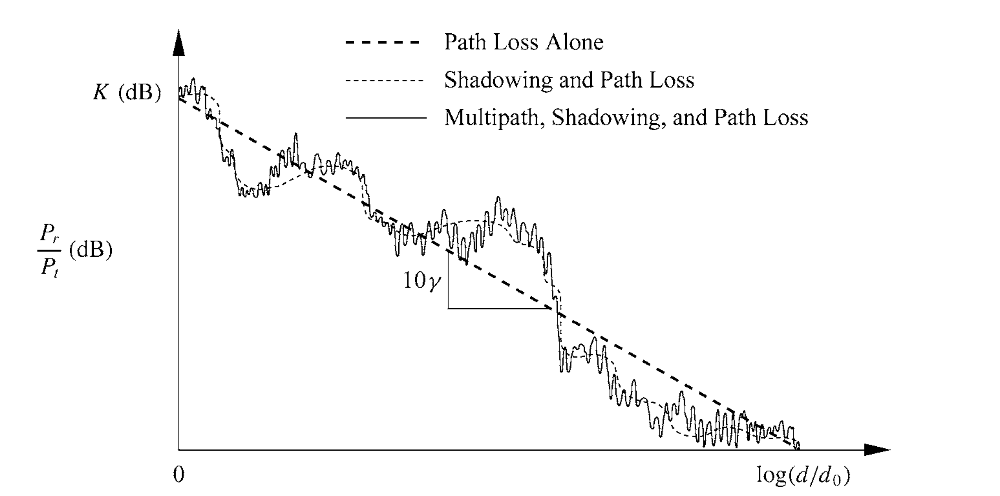

# 案例：无线信道模拟与测量

## 信道衰落模拟

​	电磁波在空间中传播过程中存在能量衰减。在自由空间中，信号没有散射、折射、反射等导致能量损失的情况。因此在通信系统中得到系统的损耗表达式为：

$$
L_{f}=\frac{P_{t}}{P_{r}}=\left(\frac{4 \pi d}{\lambda}\right)^{2} G_{t} G_{r}
$$

​	其中：$\lambda$为信号传输波长，$P_t$与$P_r$为发端和接收端的功率；$d$表示信号发射端与接收端之间的距离，$G_t$与$G_r$是发端及接收端的天线增益。根据上式，在已知信号的发射功率、传播距离、天线增益和信号波长的情况下，可以对接收信号的强度及衰落情况进行估计。

```matlab
%-----------Parameters Setting------------
LightSpeedC=3e8;
BlueTooth=2400*1000000;%hz    
Zigbee=915.0e6;%hz    
Freq=BlueTooth;
TXAntennaGain=1;%db
RXAntennaGain=1;%db
PTx=0.001;%watt
sigma=6;%Sigma from 6 to 12 %Principles of communication systems simulation with wireless application P.548
mean=0;
PathLossExponent=2;%Line Of sight

%------------ FRIIS Equation --------------
% Friis free space propagation model:
%        Pt * Gt * Gr * (Wavelength^2)
%  Pr = --------------------------
%        (4 *pi * d)^2 * L

pr_set = [];
for Dref = 0:1:1000
    Wavelength=LightSpeedC/Freq;
    PTxdBm=10*log10(PTx*1000);
    M = Wavelength / (4 * pi * Dref);
    Pr0= PTxdBm + TXAntennaGain + RXAntennaGain - (20*log10(1/M));
    pr_set = [pr_set, Pr0];
end

figure;
fg = plot(pr_set);
set(fg,'Linewidth',2);
ylabel('RX Power (dBm)');
xlabel('Distance (m)');
grid on;
set(gca, 'XMinorGrid','on');
set(gca, 'YMinorGrid','on');

set(gcf, 'position', [600 500 500 320]);
set(gca, 'FontSize', 18, 'FontName', 'Arial', 'FontWeight', 'normal');
    
```

考虑噪声对信道中传输信号的影响，我们可以在接收到信号的基础上叠加上高斯噪声。

```matlab
% log normal shadowing radio propagation model:
% Pr0 = friss(d0)
% Pr(db) = Pr0(db) - 10*n*log(d/d0) + X0
% where X0 is a Gaussian random variable with zero mean and a variance in db
%        Pt * Gt * Gr * (lambda^2)   d0^passlossExp    (X0/10)
%  Pr = --------------------------*-----------------*10
%        (4 *pi * d0)^2 * L          d^passlossExp
% get power loss by adding a log-normal random variable (shadowing)
% the power loss is relative to that at reference distance d0
%  reset rand does influcence random
rstate = randn('state');
randn('state', DistanceMsr);
%GaussRandom=normrnd(0,6)%mean+randn*sigma;    %Help on randn
GaussRandom= (randn*0.1+0);
%disp(GaussRandom);
Pr=Pr0-(10*PathLossExponent* log10(DistanceMsr/Dref))+GaussRandom;
randn('state', rstate);
```

​	最终在接收端收到的信号强度与传播距离的关系如下图所示：

<center>

</center>

<center>
<div style="color:orange; border-bottom: 1px solid #d9d9d9;
display: inline-block;
color: #999;
padding: 2px;">图. 自由空间衰落模型仿真</div>
</center>

## 多径模拟

​	无线信号经过两条以上的路径抵达接收天线，在接收端信号会叠加到一起。大气层对电波的散射、电离层对电波的反射和折射，以及山峦、建筑等地表物体对电波的反射都会造成多径传播。

​	在模拟多径信号时，我们可以根据不同多径的传播延迟，计算各传播路径上信号的能量衰减以及相位变化：

```matlab
function sout = sim_multi_path(sig, delay, Fs)
    ts = 1 / Fs;
    
    % attenuation
    d = delay * 3e8;
    f = 470e6;
    PL = -147.56+20*log10(d*f);
    att = sqrt(10.^(-PL/10));
    att = att * 1e4;
    
    fprintf('Attenuation:');
    for a = att 
        fprintf(', %.6f', a); 
    end
    fprintf('\n');
    
    % interp
    factor = 100;
    sig = interp(sig, factor);
    its = ts / factor;
    
    % delay taps
    taps = round(delay / its);
    
    fprintf('Delay(taps of %d):',factor);
    for i = taps 
        fprintf(', %d', i); 
    end
    fprintf('\n');
    
    sout = [zeros(1, length(sig) + max(taps))];
    for i = 1:length(delay)
        sout(1:taps(i)+length(sig)) = sout(1:taps(i)+length(sig)) + att(i) * [zeros(1,taps(i)), sig*exp(1i*2*pi*rand)];
    end
    sout = sout(1:factor:end);
end
```

​	以下为调用上述多径生成函数模拟多径效应的影响：

```matlab
% generate multi-path signal
Fs = 1e6;         % sample rate   
t = 0:1/Fs:0.1;   % time
symb = exp(1i*2*pi*13e3*t);

delay = [1e3, 1.3e3, 1.5e3] / 3e8;
msymb = sim_multi_path(symb, delay, Fs);

snr = -10;
an = 1/10^(snr/20);
noise = an * randn(1, length(msymb));
msymb = msymb + noise;

figure; hold on
plot(real(symb));
plot(real(msymb));
```


<center>

</center>

<center>
<div style="color:orange; border-bottom: 1px solid #d9d9d9;
display: inline-block;
color: #999;
padding: 2px;">图. 多径叠加仿真结果</div>
</center>

## 衰落叠加综合


​	综合看传播路径衰落（Path Loss）、遮挡（Shadowing）、多径（Narrowband Fading）对接收信号的影响（如下图）。Path Loss造成信号衰减是均匀的、单调的；Shadowing造成的衰减相对更快（比Path Loss），断崖下跌；Fading造成的衰减是快速变化的（由于频率高），基本呈现零均值高斯分布。
<center>

</center>

<center>
<div style="color:orange; border-bottom: 1px solid #d9d9d9;
display: inline-block;
color: #999;
padding: 2px;">图. 路径损耗、阴影衰落和窄带衰落的结合</div>
</center>

<!-- ## 信道状态测量
基于已知前导码，测量H矩阵

## 信号还原
使用前导码测量信道参数，根据测量结果对后面的编码信号进行恢复与还原 -->