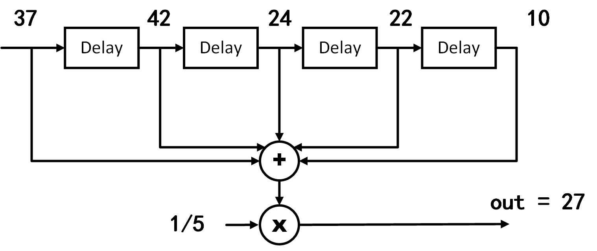
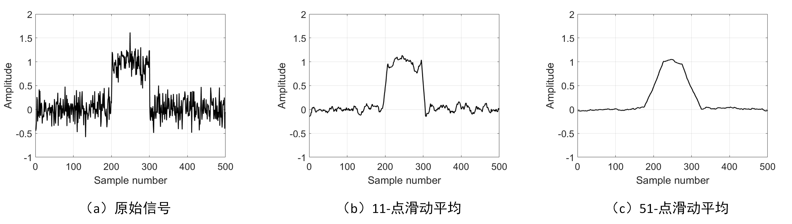

# 滑动平均滤波器

## 简介
​	为了理解滤波器，我们已大家最常用的滑动平均滤波器为例来进行说明。
滑动平均是大家经常在处理数据中用到的操作。其实滑动平均就是一个经典的滤波器。直观上来看，滑动平均滤波器非常适合用于减少随机噪声，我们能够感受到通过滑动平均数据变平滑了。
在介绍滑动平均滤波器之前，我想先问大家几个问题：
1. 滑动平均是低通还是高通滤波器，为什么？
2. 滑动平均是否是一个很好的滤波器，为什么？
   
同时保持清晰的阶跃响应，这使其成为时域编码信号的首选滤波器。但是，从频域看，滑动平均滤波器是对频域编码信号最不友好的滤波器，它几乎没有能力将一个频带与另一个频带分开。由滑动平均滤波器发展来的滤波器还包括高斯滤波，布莱克曼滤波和多次滑动平均滤波，这些改进的滑动平均滤波器在频域中具有稍好的性能，但以增加的计算时间为代价。

## 滑动平均的卷积实现

​	说起滑动平均，大家应该都很熟悉，这种利用滑动窗口计算数据集中不同子集平均数的数据分析方法，广泛应用在数据分析和财务统计中。例如利用滑动平均分析股票价格、交易量、研究国内生产总值、就业或其他宏观经济时间序列等，滑动平均的主要特点是可以消除短期波动，突出长期趋势或周期。接下来我们将通过一个实际的例子，带领大家回顾滑动平均的实现过程。
<!-- 事实上，通过接下来的介绍，我们会发现滑动平均这种消除短期波动的特点，本质上等同于使用滤波器滤除高频噪声的过程，即滑动平均的效果实际上是对输入数据实施了低通滤波。我们接下来以一个实际的例子，说明滑动平均和低通滤波的关系。 -->

<!-- - [ ] 我们结合着滑动滤波，要思考两个问题：1）为什么滑动平均是滤波，为什么能够滤掉高频。2）滑动平均滤波的性能怎么样，还有没有比滑动平均更好的滤波方法。（这个地方要重点阐释清楚），从滑动滤波出发，以FFT频域时域为基础，解释清楚滤波这个事情，同时介绍好典型的滤波器及其特点。满足大部分需要使用滤波器的人的需求。 -->

​	考虑一组长度有限的非零输入，滑动平均滤波器首先确定一个长度固定的滑动窗口。以下表中的数据为例，我们使用一个长度为5的滑动窗口，计算某桥梁在五分钟的跨度内，每分钟通过汽车数量的平均值。表格的第二列是每分钟实际通过汽车数，滑动平均操作从第5个数开始，计算这个数与其前4个数的平均值（如下表第三列的27），该平均值就是滑动平均算法的第一个输出。然后移动滑动窗口，计算下一个数与其前4个数的平均值（如下表第三列的第二个输出40.4）。以此类推，直至所有输入的数都参与过平均值计算。

|序号|过去1分钟通过汽车数量|过去5分钟平均通过汽车数量|
|-----|-----|-----|
|1|10|-|
|2|22|-|
|3|24|-|
|4|42|-|
|5|37|27|
|6|77|40.4|
|7|89|53.8|
|8|22|53.4|
|9|63|57.6|
|10|9|52|

​	我们可以使用MATLAB的`movmean()`函数用于计算滑动平均：
>`M = movmean(A,k)` 返回由局部 `k` 个数据点的均值组成的数组，其中每个均值是基于 `A` 的相邻元素的长度为 `k` 的移动窗口计算得出。当 `k` 为奇数时，窗口以当前位置的元素为中心。当 `k` 为偶数时，窗口以当前元素及其前一个元素为中心。当没有足够的元素填满窗口时，窗口将自动在端点处截断。当窗口被截断时，只根据窗口内的元素计算平均值。`M` 与 `A` 的大小相同。

​	`movmean()`的第`n`个输出对应的窗口默认以第`n`个输入为中心，当然，我们也可以指定第`n`个窗口在输入序列中的具体位置。例如，`M = movmean(A,[kb kf])` 通过长度为 `kb+kf+1` 的窗口计算均值，其中包括当前位置的元素、后面的 `kb` 个元素和前面的 `kf` 个元素。下面展示的是我们利用`movmean()`函数计算车辆数量滑动平均的代码：

```matlab
% computes a moving average by sliding a window of length len_win.
din = [10 22 24 42 37 77 89 22 63 9 0 0 0 0];
len_win = 5;
dout = movmean(din,len_win);
% the kth output uses the kth input as the center of the window
dout = dout(ceil(len_win/2):end);
disp(dout);
% Display the Result of Slide Average
figure; hold on
plot(len_win + (0:length(dout)-1),dout,'-o','LineWidth',1.5,'Color','k');
plot(1:length(din),din,'-^','LineWidth',1.5);
xlim([1 len_win+length(dout)-1]);
legend('Filtered', 'Original');
set(gcf, 'Position', [800 800 550 300]);
xlabel('Time');
ylabel('Number of Cars');
set(gca, 'FontSize', 16);
box on
```

​	使用滑动窗口计算平均的结果如下图所示，在输入数据中原本存在许多突变的点，这些点在滑动平均操作后都变得更加平滑了。
<!-- **直观上看，考虑在时间序列中，突变的点对应高频的信号，因此滑动平均操作可以消除输入序列中的高频分量。通过滑动平均操作，我们实现了过滤高频分量、保留低频分量的目标，即实现了一个简单的低通滤波器。** -->

<center>

</center>

<!--  -->
<center>
<div style="color:orange; border-bottom: 1px solid #d9d9d9;
display: inline-block;
color: #999;
padding: 2px;">图. 滑动窗口计算平均的结果</div>
</center>

​	在上面的这个例子中，直到输入前五个点后，滑动窗口才在**时刻5**输出了第一个滑动平均的结果，即

$$
y_{avg}(5) = \frac{1}{5}[x(1)+x(2)+x(3)+x(4)+x(5)]
$$

​	对于更一般的情况，**时刻n**的输出$y_{avg}(n)$，我们可以将其表示为：

$$
y_{avg}(n) = \frac{1}{5}[x(n-4)+x(n-3)+x(n-2)+x(n-1)+x(n)]=\frac{1}{5}\sum_{k=n-4}^{n}x(k)
$$

​	从上式可以看出，每个滑动窗口内的平均计算，可以理解为对窗口内所有输入值求和后再除以窗口长度（如下图所示）。

<center>

</center>

<!--  -->
<center>
<div style="color:orange; border-bottom: 1px solid #d9d9d9;
display: inline-block;
color: #999;
padding: 2px;">图. 求和后平均</div>
</center>

​	如果我们根据乘法分配律，将乘系数的操作移到求和之前，在滑动窗口内的平均计算就变成了对输入数据的加权求和。只不过在这个例子中，所有输入的权重都是相同的（即$\frac{1}{5}$）。

<center>

</center>

<!--  -->
<center>
<div style="color:orange; border-bottom: 1px solid #d9d9d9;
display: inline-block;
color: #999;
padding: 2px;">图. 加权求和</div>
</center>

​	显然，上述滑动平均的过程，本质上等同于一个卷积运算，其卷积核为一个简单的矩形脉冲，即$1/5,1/5,1/5,1/5,1/5$。

## 噪声抑制与窗口选择

​	仅从滑动平均滤波器的实现方法看，很多人也许会质疑它的实际效果，因为它的实现实在是过于简单。但正因为因为滑动平均滤波器实现非常简单，所以它通常是遇到问题时首先要尝试的方法。事实上，滑动平均滤波器不仅对许多应用非常有效，而且对于一些常见问题，它的滤波效果就是最佳的——它可以减少随机白噪声，同时保持最清晰的阶跃响应。

​	在使用滑动平均滤波器时，最关键的参数是滑动窗口的大小，也就是使用矩形函数作为卷积核时，卷积核的长度。下面用一个实际的MATLAB例子向大家展示使用不同长度的滑动窗口对滑动平均效果的影响。

```matlab
x = randn(1,500)*0.2 + [zeros(1,200), ones(1,100), zeros(1,200)];
figure;
    plot(x,'k','LineWidth',1.5);
    xlabel('Sample number');
    ylabel('Amplitude');
    set(gca, 'FontSize', 16);
    ylim([-1 2]);
    box on
    grid on
    
y1 = movmean(x,11);
figure;
    plot(y1, 'k','LineWidth',1.5);
    xlabel('Sample number');
    ylabel('Amplitude');
    set(gca, 'FontSize', 16);
    ylim([-1 2]);
    box on
    grid on
    
y1 = movmean(x,51);
figure;
    plot(y1, 'k','LineWidth',1.5);
    xlabel('Sample number');
    ylabel('Amplitude');
    set(gca, 'FontSize', 16);
    ylim([-1 2]);
    box on
    grid on
```

​	原信号及滤波后的信号如下图所示，（a）中的信号是埋在随机噪声中的脉冲，在（b）和（c）中，滑动平均滤波器的平滑作用减小了随机噪声的幅度（优点），但也降低了边缘的清晰度（缺点）。可以看到滑动窗口选择得越长，随机噪声抑制效果越好，但对应的边缘清晰度（阶跃响应的过渡速度）也越差。尽管如此，相比于所有其他可能使用的线性滤波器，当给定最低需要满足的边缘清晰度，滑动平均滤波器对随机噪声的抑制效果是最好的。规定滤波器的降噪量等于平均值中点数的平方根，则一个100点滑动平均滤波器可以将噪声水平降低10倍。

<center>

</center>

<!--  -->
<center>
<div style="color:orange; border-bottom: 1px solid #d9d9d9;
display: inline-block;
color: #999;
padding: 2px;">图. 选择不同滑动窗口时，滑动平均滤波器效果</div>
</center>

​	要理解为什么滑动平均滤波器是最佳的随机噪声抑制方案，请想象我们要设计一个具有固定边缘清晰度的滤波器。例如，假设我们要求一个滤波器的阶跃响应上升沿不得长于11个采样点，在此要求下，所有基于卷积实现的滤波器（FIR滤波器）的卷积核长度都不得超过11个点。由于可以得到优化问题：如何选择滤波器内核中的11个值，以最小化输出信号上的噪声？对于随机噪声场景而言，每一个采样点的噪声都是随机的，因此，通过在卷积核中为输入点中的任意一个分配较大的系数来对它们中的任何一个进行优先处理是没有用的。 当对所有输入样本同等对待（即滑动平均）时，可获得最佳的噪声抑制效果。

## 频率响应

​	之前我们说过，滑动平均在时域上可以提供最佳的随机噪声抑制效果，但从频域看，滑动平均滤波器在频带分离任务上表现非常糟糕。我们先用一个MATLAB的仿真实例来观察滑动平均滤波器的频域响应：

```matlab
%% Impulse Response of moving average filter
% Generating Impulse
din = zeros(1,1e4);
din(5e3) = 1;

% Impulse Response of moving average filter
dout = movmean(din,3);
z = fft(dout,100*length(dout));
figure; hold on
    plot(abs(z),'k','LineWidth',1.5);

dout = movmean(din,11);
z = fft(dout,100*length(dout));
    plot(abs(z),'--k','LineWidth', 1.5,'Color','#708090');
    
dout = movmean(din,31);
z = fft(dout,100*length(dout));
    plot(abs(z),'-.k','LineWidth', 1.5,'Color', '#2F4F4F');
    
xlabel('Frequency');
ylabel('Amplitude');
xlim([0 0.5*numel(z)]);
set(gca, 'FontSize', 16);
legend('3 point', '11 point', '31 point');
grid on
box on
```

​	下图展示了使用不同长度滑动窗口的滑动平均滤波器的频率响应曲线。可以看到，随着滑动窗口长度的增加，通带带宽逐渐变窄，阻带抑制逐渐增强，这与时域上观察到的窗口越长、噪声抑制效果越好相吻合。此外，可以看到无论使用多长的滑动窗口，滑动平均滤波器均具有较长的过渡带，且阻带抑制较差，因此可以判断其在频域是一个表现非常糟糕的低通滤波器。

<center>

</center>

<center>
<div style="color:orange; border-bottom: 1px solid #d9d9d9;
display: inline-block;
color: #999;
padding: 2px;">图. 滑动平均滤波器的频率响应。滑动平均滤波器的过渡带较长，且阻带抑制较差，因此它是一个不太好的低通滤波器。</div>
</center>
​	事实上，我们知道时域上的卷积等于频域上的乘积，反过来时域上的乘积等于频域上的卷积。
所以要看滑动平均的滤波器的频率响应，我们首先要注意到滑动平均滤波器相当于将信号与一个矩形窗口做卷积（例如$1/5,1/5,1/5,1/5,1/5$）。因此要计算滑动平均滤波的频率响应，我们先计算矩形窗频域情况（通过快速傅里叶变换），然后我们可以知道滑动平均滤波对频率的影响了。不难计算出来，滑动平均滤波器的频域响应：
$$
H[f] = \frac{sin(\pi fM)}{Msin(\pi f)}
$$

> 联系傅里叶变换那一节内容，思考这里是如何计算出来的。

​	$H[f]$的形式与$sinc$函数相一致，其特点是过渡带滚降缓慢、阻带抑制不明显。因此，单纯使用移动平均滤波，无法将一个频带与另一个频带分开。简而言之，移动平均值是一个非常出色的平滑滤波器（时域中的作用），但是却是一个不太好的低通滤波器（频域中的作用）。


考虑差异性的信号特征和多样化的应用需求，不存在一个通用的完美滤波器可以“放之四海而皆准”满足所有应用的需求。
例如一个简单的滑动平均，其实就是滑动平均滤波器，大家肯定是经常使用的，但是可能没有注意到这个本质也是一个滤波器。滑动平均滤波可以适用于大部分时域信号恢复场景，但其频域响应响应则不尽如人意（什么是频率响应？可能大家之前使用的时候从来没有思考过，就感觉它能够用来平滑信号），无法有效分离多个不同频率信号。又如切比雪夫滤波器可以在频域分离不同频率的信号，但从时域上看，滤波后信号的相位和振幅都发生了明显变化，失真明显。因此，数字信号处理工程师们为了满足不同的应用需求，设计了多种不同的滤波器。本节剩余部分，我们将介绍一系列的滤波器参数指标，从时域和频域分别对滤波器的特征进行描述。

## 时域参数

​	我们通常使用 **阶跃响应（Step Response）** 描述滤波器的时域特征。阶跃响应指输入信号为单位准阶跃信号时，滤波器的响应输出（阶跃信号的形式如下图所示）。由于阶跃信号本质上是单位脉冲信号在时间上的积分，所以对于线性系统而言，阶跃响应就是单位脉冲响应在时间上的积分。看到这里，大家可能会感到疑惑：我们为什么要使用阶跃响应描述滤波器的时域特征？答案在于人脑理解和处理信息的方式：在时域分析中，阶跃响应与人类查看信号中包含的信息的方式相匹配。例如，假设给你一个未知来源的信号并要求你对其进行分析，你潜意识做的第一件事通常是将信号分成相似特性的区域——一些区域可能是光滑的、一些可能具有较大的振幅峰值、一些可能含有较高的噪声，然后分别对不同区域中的信号进行处理。这个过程与阶跃函数高度相似——阶跃函数是表示两个不同区域之间划分的最纯净的方式。它可以标记事件何时开始或事件何时结束。它告诉你左侧的内容与右侧的内容有所不同。 这与人脑查看时域信息的方法不谋而合：一组阶跃函数将信息划分为具有相似特征的区域。反过来，阶跃响应也很重要，因为它描述了滤波器如何影响信号段的分界线。

<center>

</center>

<center>
<div style="color:orange; border-bottom: 1px solid #d9d9d9;
display: inline-block;
color: #999;
padding: 2px;">图. 阶跃信号</div>
</center>

​	从滤波效果的角度也可以理解为什么使用阶跃响应描述时域滤波效果。在时域滤波时，我们的主要目的是恢复信号失真，即希望滤波后的信号可以反映原始信号的时域趋势（包括时域振幅、相位等）。例如，当我们要处理一段受噪声影响而严重失真的音频，对于音频中突兀的单个的噪点，我们希望滤波后该噪点可以被抑制或消除，保持相邻信号的前后一致性；而假如音频内容从某个时刻起从钢琴曲变成了演讲录音，显然我们不希望滤波前后这两段不同内容的声音互相影响、甚至混叠在一起，因此我们希望滤波器可以识别信号从一个稳态（钢琴曲）到另一个稳态（演讲录音）的变化。阶跃信号就是上述滤波例子的极端情况，其包含两个稳态（信号幅度等于0或1），两个稳态在一特定时刻发生切换，利用阶跃信号可以最大程度地检验滤波器对输入信号趋势的反映效果。理想的时域滤波器，应该可以分别消除两个稳态上的异常点，且输出中两个稳态之间互相的影响尽可能小。

​	通过前面的介绍，我们已经知道使用阶跃响应可以描述滤波器对时域信号的影响。那么给定一个滤波器阶跃响应，阶跃响应的哪些参数可以用于描述该滤波器的性能？

<center>

</center>

<center>
<div style="color:orange; border-bottom: 1px solid #d9d9d9;
display: inline-block;
color: #999;
padding: 2px;">图. 滤波器时域性能评估参数。阶跃响应用于测量滤波器在时域内的性能。有三个参数很重要:(1)过渡速度(transition speed)，如(a)和(b)；(2)过冲(Overshoot)，如(c)和(d)所示；(3)相位线性(决定了阶跃响应的上半部和下半部之间是否对称)，如(e)和(f)所示。
</div>
</center>

1. 过渡速度（transition speed）：我们规定阶跃响应中输出振幅从10％变化到90％振幅所经历的样本数为过渡速度。为了准确区分相邻的稳态信号，阶跃响应中的过渡段应该尽可能短，即过渡速度尽可能快。图（a）和（b）分别展示了两个具有不同过渡速度的阶跃响应的例子，显然前者可以更好地区分两个不同的信号状态。理想滤波器的过渡速度为0，即阶跃响应中稳态可以瞬时改变，但由于实际信号中噪声、有限采样频率、避免信号混叠等考量，理想的过渡速度是不可能达到的。
   
2. 过冲幅度（overshoot）：过冲指信号通过滤波器后其时域振幅发生波动的现象，这是时域中包含的信息的基本失真。图（c）和（d）显示了阶跃响应中的过冲现象。理想时域滤波器应该尽可能避免过冲，因为它会改变信号中采样的幅度。 
   
3. 线性相位（linear phase）：通常希望阶跃响应的上半部分与下半部分对称，如(f)所示。这种对称是为了使上升边与下降边看起来相同。这种对称性被称为线性相位，因为当阶跃响应上下对称时，频率响应的相位是一条直线。


## 频域参数

​	从频域上看，滤波器的作用是允许某些频率的信号无失真地通过，而完全阻塞另一些频率的信号。对理想数字滤波器而言，**通带** 指频率响应等于1的频率范围，此频率范围内的信号可以无失真地通过滤波器；**阻带** 指频率响应等于0的频率范围，此频率范围的信号被完全阻止。在实际的滤波器实现中，通常无法实现对阻带信号的完全抑制，传统模拟滤波器中将截止频率定义为振幅减小到0.707（即-3dB）的地方，数字滤波器中有时也会看到将信号衰减99％，90％，70.7％或50％的幅度水平被定义为截止频率。此外，实际滤波器在通带和阻带频率之间通常还有一个过渡带，过渡带频率内的信号衰减介于通带和阻带之间。根据允许通过信号频率的不同，我们将滤波器分为低通、高通、带通和带阻四种类型，如下图所示。

<center>

</center>

<center>
<div style="color:orange; border-bottom: 1px solid #d9d9d9;
display: inline-block;
color: #999;
padding: 2px;">图. 四类频域滤波器：(a)低通滤波器； (b)带通滤波器； (c)高通滤波器； (d)带阻滤波器
</div>
</center>

​	四类滤波器频域幅度特征分别为：
- 低通滤波器：允许信号中的低频或直流分量通过，抑制高频分量或干扰和噪声。
- 高通滤波器：允许信号中的高频分量通过，抑制低频或直流分量。
- 带通滤波器：允许一定频段的信号通过，抑制低于或高于该频段的信号、干扰和噪声。
- 带阻滤波器：抑制一定频段内的信号，允许该频段以外的信号通过。

​	上述四种滤波器的共同特征是能够在频域分离不同频率的信号分量，在设计和选择滤波器时，我们需要考虑以下三个重要参数：

1. 滚降速度：为了分离间隔很近的频率，滤波器必须具有快速滚降，如下图（b）所示。
   
2. 通带波纹：为了使通带频率不改变地通过滤波器，必须尽可能抑制通带纹波，如下图（d）所示。

3. 阻带衰减：为了充分阻挡阻带频率，必须具有良好的阻带衰减，如下图（f）所示。

<center>

</center>

<center>
<div style="color:orange; border-bottom: 1px solid #d9d9d9;
display: inline-block;
color: #999;
padding: 2px;">图. 用于评估频域性能的参数。所示的频率响应是针对低通滤波器的。三个重要参数：（a）和（b）所示的过渡带宽度，（c）和（d）所示的通带纹波，以及（e）和（f）所示的阻带衰减。
</div>
</center>

## 滤波器分类

​	下表总结了如何根据数字滤波器的用途和实现方式对数字滤波器进行分类。 数字滤波器根据用途不同可以分为三类：时域、频域和自定义。 如前所述，当信息以信号波形的形式编码时，使用时域滤波器。 时域滤波可实现诸如平滑、直流消除、波形整形等操作。相反，当信息包含在正弦波的频率特征中时，应该使用频域滤波器。频域滤波器的目标是将一个频带与另一个频带分开。 当过滤器需要特殊动作时，比如提取特定模式信号、匹配滤波等，使用自定义滤波器，从频域看自定义滤波器比四个基本响应（高通，低通，带通和带阻）要复杂得多。

<center>

</center>

<center>
<div style="color:orange; border-bottom: 1px solid #d9d9d9;
display: inline-block;
color: #999;
padding: 2px;">图. 滤波器分类
</div>
</center>

​	数字滤波器可以通过卷积和递归两种方式实现。通过卷积实现的滤波器，由于卷积核长度有限，其冲击响应也具有有限长度，即当前时刻的输出取决于之前的有限输入，且对于脉冲输入信号的响应最终趋向于0，因此基于卷积实现的数字滤波器也称为有限冲激响应滤波器或FIR滤波器。通过递归实现的滤波器，当前时刻的输出不仅取决于之前N个时刻的输入，还受之前更长时刻输出的影响（借助反馈链路），其冲击响应可以达到无限长，因此基于递归实现的滤波器也称为无限冲激响应滤波器或IIR滤波器。