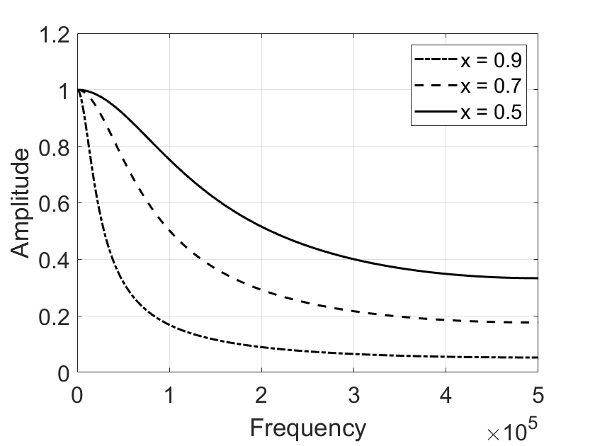

# IIR数字滤波器

## 简介

​	在上一节我们介绍了基于卷积的FIR滤波器，实际上通过设计合适的滤波器内核，我们可以实现任意高的滤波要求。要实现好的滤波效果，意味着使用更长的滤波器内核，因此计算开销也相应增加。在计算资源受限的场景中，基于卷积的滤波器无法满足应用需求，为了解决这一问题，研究者们发现，使用递归滤波器可以获得长脉冲响应而无需执行长卷积。通过递归实现的滤波器，其冲击响应可以达到无限长，因此基于递归实现的滤波器也称为无限冲激响应滤波器或IIR滤波器。基于递归的滤波器执行得非常快，但与基于卷积的数字滤波器相比，它的灵活性更差。本节将介绍IIR滤波器的工作方式，以及如何设计简单的IIR滤波器。

## 基于递归的滤波器设计

​	在FIR滤波器中，每一时刻的输出取决于之前的有限个输入，即时刻$n$的输出由时刻$n$及其之前$M$个时刻的输出信号与滤波器内核卷积得到，即

$$
y[n] = a_0x[n] + a_1x[n-1] + a_2[n-2] + a_3x[n-3] + \cdots
$$

​	但实际上，为了计算当前时刻的输出，我们可以使用的信息源除了既往的输入信号，还可以调用输出信号在先前时刻的计算值，即$y[n-1], y[n-2], \cdots$。因此，使用此附加信息，算法将采用以下形式：

$$
\begin{aligned}
    y[n] = a_0x[n] &+ a_1x[n-1] + a_2[n-2] + a_3x[n-3] + \cdots\\
    &+b_1y[n-1] + b_2y[n-2] + b_3y[n-3] + \cdots
\end{aligned}
$$

​	换句话说，通过将输入信号的值乘以“a”系数，将先前从输出信号计算的值乘以“b”系数，并将乘积相加，可以找到输出信号中的每个点。上述公式称为递归公式，使用该公式的过滤器称为递归过滤器，“a”和“b”值称为滤波器的递归系数。在实际实践中，通常最多只能使用十几个递归系数，否则滤波器将变得不稳定（例如输出不断增加或振荡）。递归过滤器在工程实践中很有用，因为它们绕过了冗长的卷积。当考虑增量函数通过递归过滤器传递时会发生什么，即考虑该滤波器的脉冲响应时，输出通常是呈指数衰减的正弦振荡。由于这种脉冲响应无限长，因此递归滤波器通常称为无限脉冲响应（IIR）滤波器。

​	下面的代码展示了一阶IIR低通滤波器的实现示意，一阶IIR滤波器使用单个历史输出$y[n-1]$计算当前$y[n]$值。

```matlab
%% Impaulse Response of single pole filter
% Generating Impaulse
din = zeros(1,1e4);
din(5e3) = 1;

% IIR -- low pass
% Impaulse Response 
x = 0.9;
dout = din;
for i = 2:numel(din)
    a0 = 1-x;
    b1 = x;
    dout(i) = a0 * din(i) + b1 * dout(i-1);
end
figure; hold on;
z = fft(dout,100*length(dout));
    plot(abs(z),'-.k','LineWidth',1.5);
    
x = 0.7;
dout = din;
for i = 2:numel(din)
    a0 = 1-x;
    b1 = x;
    dout(i) = a0 * din(i) + b1 * dout(i-1);
end
z = fft(dout,100*length(dout));
    plot(abs(z),'--k','LineWidth',1.5);
    
x = 0.5;
dout = din;
for i = 2:numel(din)
    a0 = 1-x;
    b1 = x;
    dout(i) = a0 * din(i) + b1 * dout(i-1);
end
z = fft(dout,100*length(dout));
    plot(abs(z),'k','LineWidth',1.5);

xlabel('Frequency');
ylabel('Amplitude');
xlim([0 0.5*numel(z)]);
ylim([0 1.2]);
set(gca, 'FontSize', 16);
legend('x = 0.9', 'x = 0.7', 'x = 0.5');
grid on;
box on;
```

​	下图展示了不同参数下一阶低通IIR低通滤波器的频域脉冲响应。一阶IIR滤波器的通带衰减、阻带抑制和过渡带宽度都和理想低通滤波器有较大差异，这是因为滤波器阶数较低，对性能有较大制约。此外，在不同参数下，低通滤波的通带带宽和阻带抑制效果都有明显的差异。

<center>

</center>

<center>
<div style="color:orange; border-bottom: 1px solid #d9d9d9;
display: inline-block;
color: #999;
padding: 2px;">图. 一阶低通IIR滤波器。</div>
</center>

​	下面MATLAB代码展示了一阶高通IIR滤波器的实现方法。

```matlab
%% Impaulse Response of single pole filter
% Generating Impaulse
close all;
din = zeros(1,1e4);
din(5e3) = 1;

% IIR -- high pass
% Impaulse Response 
x = 0.9;
dout = din;
for i = 2:numel(din)
    a0 = (1+x)/2;
    a1 = -(1+x)/2;
    b1 = x;
    dout(i) = a0 * din(i) + a1 * din(i-1) + b1 * dout(i-1);
end
figure; hold on
z = fft(dout,100*length(dout));
    plot(abs(z),'-.k','LineWidth',1.5);
    
x = 0.7;
dout = din;
for i = 2:numel(din)
    a0 = (1+x)/2;
    a1 = -(1+x)/2;
    b1 = x;
    dout(i) = a0 * din(i) + a1 * din(i-1) + b1 * dout(i-1);
end
z = fft(dout,100*length(dout));
    plot(abs(z),'--k','LineWidth',1.5);
    
x = 0.5;
dout = din;
for i = 2:numel(din)
    a0 = (1+x)/2;
    a1 = -(1+x)/2;
    b1 = x;
    dout(i) = a0 * din(i) + a1 * din(i-1) + b1 * dout(i-1);
end
z = fft(dout,100*length(dout));
    plot(abs(z),'k','LineWidth',1.5);

xlabel('Frequency');
ylabel('Amplitude');
xlim([0 0.5*numel(z)]);
ylim([0 1.2]);
set(gca, 'FontSize', 16);
legend('x = 0.9', 'x = 0.7', 'x = 0.5');
grid on
box on
```

​	下图为不同参数下一阶高通IIR滤波器的频域响应，一般情况下参数$x$的值不得大于1，否则可能出现滤波输出不收敛的情况。

<center>

</center>

<center>
<div style="color:orange; border-bottom: 1px solid #d9d9d9;
display: inline-block;
color: #999;
padding: 2px;">图. 一阶高通IIR滤波器。</div>
</center>

​	我们使用上述实现的一阶IIR滤波器分离信号中的高频和低频分量：

```matlab
%% Time domain filter performance
close all;
t = 0:1/1e3:1;
x = sin(pi/3 + 2*pi*0.6*t);
idx = 0.7:1/1e3:0.8;
x(round(idx * 1e3)) = 0.2*sin(2*pi*100*idx) + x(round(idx * 1e3));
figure;
plot(x,'k','LineWidth',1.5);
    
xlabel('Sample number');
ylabel('Amplitude');
xlim([0 numel(x)]);
ylim([-1.2 1.2]);
set(gca, 'FontSize', 16);
grid on
box on

din = x;
x = 0.9;
dout = din;
for i = 2:numel(din)
    a0 = 1-x;
    b1 = x;
    dout(i) = a0 * din(i) + b1 * dout(i-1);
end
figure; 
% z = fft(dout,100*length(dout));
    plot(dout,'k','LineWidth',1.5);
xlabel('Sample number');
ylabel('Amplitude');
xlim([0 numel(din)]);
ylim([-1.2 1.2]);
set(gca, 'FontSize', 16);
grid on
box on

x = 0.9;
dout = din;
for i = 2:numel(din)
    a0 = (1+x)/2;
    a1 = -(1+x)/2;
    b1 = x;
    dout(i) = a0 * din(i) + a1 * din(i-1) + b1 * dout(i-1);
end
figure; 
% z = fft(dout,100*length(dout));
    plot(dout,'k','LineWidth',1.5);
xlabel('Sample number');
ylabel('Amplitude');
xlim([0 numel(din)]);
ylim([-1.2 1.2]);
set(gca, 'FontSize', 16);
grid on
box on
```

​	从时域看，上面实现的低通和高通IIR滤波器效果如下图所示。下图(a)为原始包含低频和高频分量的混合信号；图(b)为信号通过一阶低通IIR滤波器后的结果；图(c)为信号通过一阶高通IIR滤波器后的结果。可以看到一阶IIR滤波器可以一定程度地实现不同频率信号的分离，但距离理想频域滤波器效果还有相当大的差距。下一节我们将介绍更复杂的IIR滤波器设计，通过使用高阶滤波器输入和设计合适的滤波参数，可以实现更优的频域滤波效果。

<center>

</center>

<center>
<div style="color:orange; border-bottom: 1px solid #d9d9d9;
display: inline-block;
color: #999;
padding: 2px;">图. 一阶IIR滤波器时域滤波效果。</div>
</center>