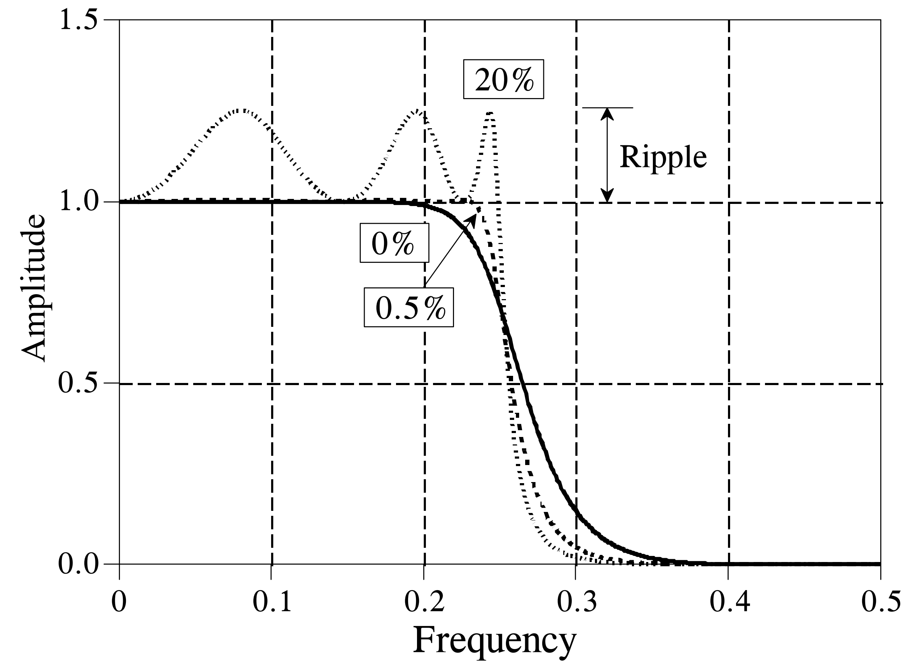
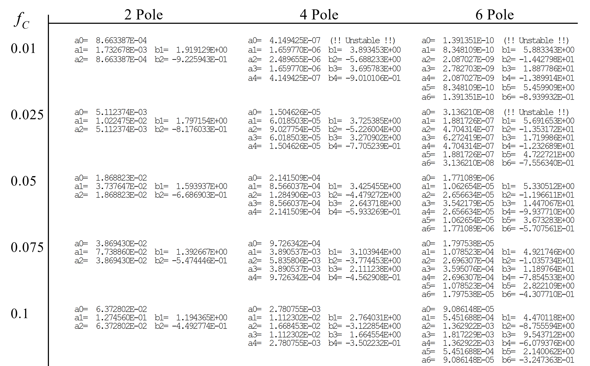
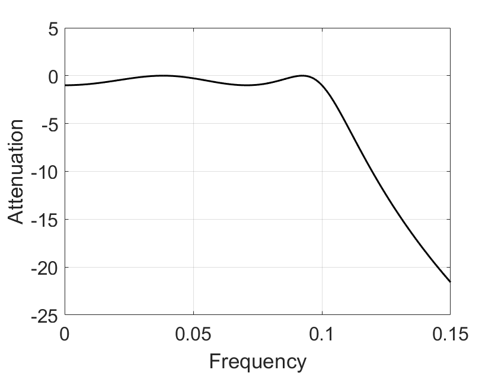
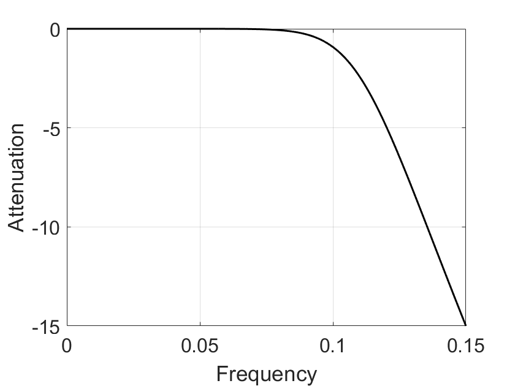
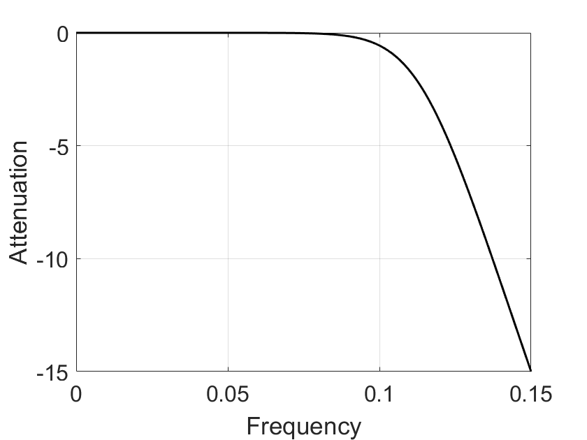

# 高级滤波器设计

## 简介

​	本节将以切比雪夫滤波器为例，介绍高级IIR滤波器的使用方法。切比雪夫滤波器用于将一个频带与另一个频带分开。作为一种IIR滤波器，其最大的优点是计算开销低，对于大部分应用来说，其频域响应已经足够满足应用需求了。切比雪夫滤波器的计算速度通常比相同效果下基于卷积的FIR滤波器快一个数量级，这是因为它们是通过递归而不是卷积执行的。IIR滤波器的高级设计基于z变换，本章将介绍切比雪夫等高级IIR滤波器的基本使用方法，不涉及对其数学理论的讨论和研究。

## 滤波器频域响应

​	切比雪夫（Chebyshev）响应是一种通过通过允许频率响应中存在纹波来实现更快的过渡带衰减的数学策略。这些策略最早由俄罗斯数学家Pafnuti Chebyshev在其开发的切比雪夫多项式中提出。使用这种数学策略实现的滤波器因此被命名为切比雪夫滤波器。下图展示了低通切比雪夫滤波器的频域响应：当允许的纹波比分别为0%，0.5% 和 20%时，切比雪夫滤波器的频域响应分别具有不同的过渡带衰减速度。允许的纹波比越大，过渡带衰减速度越快，所以在使用切比雪夫滤波器时需要在通带纹波比和过渡带衰减速度之间做权衡。

<center>

</center>

<center>
<div style="color:orange; border-bottom: 1px solid #d9d9d9;
display: inline-block;
color: #999;
padding: 2px;">图. 一型切比雪夫滤波器频域响应。</div>
</center>

​	实际上，当纹波比设置为0%时，滤波器就退化成了巴特沃斯滤波器。上述的切比雪夫滤波器只允许通带出现纹波，而阻带是完全平坦的。而实际上，当允许阻带也出现纹波时，滤波器的过渡带可以以更快的速度衰减。我们通常将前者称为一型切比雪夫滤波器，后者称为二型切比雪夫滤波器。另一类被称为椭圆滤波器的IIR滤波器也允许阻带发生存在纹波，椭圆滤波器在给定的滤波器阶数的情况下提供了最快的过渡带衰减速度，但其设计起来要困难得多。

​	上述介绍可以看出，不同的滤波器模型以及不同的参数都会影响滤波器的滤波效果。下面介绍几个在滤波器设计和选择时通常需要考虑的频域响应参数：

- 中心频率（Center Frequency）：滤波器通带的频率$f_0$，一般取$f_0=(f_1+f_2)/2$，$f_1$、$f_2$为带通或带阻滤波器左、右相对下降$1dB$或$3dB$边频点。窄带滤波器常以插损最小点为中心频率计算通带带宽。
- 截止频率（Cutoff Frequency）：指低通滤波器的通带右边频点及高通滤波器的通带左边频点。通常以$1dB$或$3dB$相对损耗点来标准定义。相对损耗的参考基准为：低通以DC处插损为基准，高通则以未出现寄生阻带的足够高通带频率处插损为基准。
- 通带带宽：指需要通过的频谱宽度，$BW =(f_2-f_1)$。$f_1$、$f_2$为以中心频率$f_0$处插入损耗为基准。
- 插入损耗（Insertion Loss）：由于滤波器的引入对电路中原有信号带来的衰耗，以中心或截止频率处损耗表征，如要求全带内插损需强调。
- 纹波（Ripple）：指1dB或3dB带宽（截止频率）范围内，插损随频率在损耗均值曲线基础上波动的峰值。
- 带内波动（Passband Ripple）：通带内插入损耗随频率的变化量。1dB带宽内的带内波动是1dB。
- 带内驻波比（VSWR）：衡量滤波器通带内信号是否良好匹配传输的一项重要指标。理想匹配VSWR=1：1，失配时VSWR 大于1。对于一个实际的滤波器而言，满足VSWR小于1.5：1的带宽一般小于通带带宽，其占通带带宽的比例与滤波器阶数和插损相关？？。
- 回波损耗（Return Loss）：端口信号输入功率与反射功率之比的分贝（dB）数，也等于$20Log10\rho$，$\rho$为电压反射系数。输入功率被端口全部吸收时回波损耗为无穷大。
- 阻带抑制度：衡量滤波器选择性能好坏的重要指标。该指标越高说明对带外干扰信号抑制的越好。通常有两种提法：一种为要求对某一给定带外频率$fs$抑制多少dB，计算方法为$fs$处衰减量；另一种为提出表征滤波器幅频响应与理想矩形接近程度的指标——矩形系数。滤波器阶数越多矩形度越高——即K越接近理想值1，制作难度当然也就越大。
- 延迟（Td）：指信号通过滤波器所需要的时间，数值上为传输相位函数对角频率的导数，即$Td=df/dv$。
- 带内相位线性度：该指标表征滤波器对通带内传输信号引入的相位失真大小。按线性相位响应函数设计的滤波器具有良好的相位线性度。

<center>

</center>

<center>
<div style="color:orange; border-bottom: 1px solid #d9d9d9;
display: inline-block;
color: #999;
padding: 2px;">图. 滤波器频域响应参数</div>
</center>

​	对于经典的IIR滤波器：如巴特沃斯滤波器、切比雪夫滤波器、椭圆滤波器、贝塞尔滤波器等，不同滤波器分别有各自的特点，例如巴特沃斯滤波器在通带内响应曲线极其平坦，而椭圆滤波器则旨在尽可能压缩过渡带的宽度。下图展示了几种常用滤波器的频域响应特性。

<center>

</center>

<center>
<div style="color:orange; border-bottom: 1px solid #d9d9d9;
display: inline-block;
color: #999;
padding: 2px;">图. 几种不同特点的常用滤波器：巴特沃斯滤波器（左上）、I型切比雪夫滤波器（右上）、II型切比雪夫滤波器（左下）、椭圆函数滤波器（右下）</div>
</center>


**巴特沃斯滤波器**

​	特点：通频带内的频率响应曲线最大限度平坦，没有起伏，而在阻频带则逐渐下降为零。

一阶巴特沃斯滤波器的衰减率为每倍频6分贝，每十倍频20分贝；二阶巴特沃斯滤波器的衰减率为每倍频12分贝；三阶巴特沃斯滤波器的衰减率为每倍频18分贝，如此类推。巴特沃斯滤波器的振幅对角频率单调下降，并且也是唯一的无论阶数，振幅对角频率曲线都保持同样的形状的滤波器。对巴特沃斯滤波器而言，阶数越高，频率响应在阻频带振幅衰减速度越快，而振幅对角频率曲线的形状保持不变。？？？

**切比雪夫滤波器**

​	特点：和理想滤波器的频率响应曲线之间的误差最小，但是在通频带内存在幅度波动。和巴特沃斯滤波器相比，切比雪夫滤波器在过渡带衰减快，但频率响应的幅频特性不如前者平坦。

切比雪夫滤波器是在通带或阻带上频率响应幅度等波纹波动的滤波器，振幅特性在通带内是等波纹。在阻带内是单调的称为切比雪夫I型滤波器；振幅特性在通带内是单调的，在阻带内是等波纹的称为切比雪夫II型滤波器。采用何种形式的切比雪夫滤波器取决于实际用途。

**椭圆滤波器**

​	特点：在通带等纹波（阻带平坦或等纹波），阻带下降最快。

**贝塞尔滤波器**

​	特点：通带等纹波，阻带下降慢，即幅频特性的选频特性最差。但是，贝塞尔滤波器具有最佳的线性相位特性。

​	贝赛尔(Bessel)滤波器是具有最大平坦的群延迟（线性相位响应）的线性过滤器。贝赛尔滤波器常用在音频天桥系统中。模拟贝赛尔滤波器描绘为几乎横跨整个通频带的恒定的群延迟，因而在通频带上保持了被过滤的信号波形。贝塞尔(Bessel)滤波器具有最平坦的幅度和相位响应。带通（通常为用户关注区域）的相位响应近乎呈线性。Bessel滤波器可用于减少所有IIR滤波器固有的非线性相位失真。

## 滤波器实现

​	使用切比雪夫或巴特沃斯设计滤波器时，通常先使用拉普拉斯（Laplace）变换和z变换等数学方法将脉冲响应分解为正弦曲线和衰减指数。这个变换过程，本质上是将系统特征表示为一个复数多项式除以另一个复数多项式的形式，式子中分子的根称为零点，而分母的根称为极点。复杂的滤波器系统比简单的系统具有更多的极点和零点。不同的滤波器设计对应了复平面上不同的极点和零点坐标。因此在设计滤波器时，通常首先根据滤波器频域响应参数的要求，选择复平面上极点和零点的位置，然后根据极点和零点的位置，找到合适的递归系数来实现递归滤波器。例如，巴特沃思滤波器的极点位于复平面的圆上，而切比雪夫滤波器的极点位于椭圆上。

​	理解上述滤波器设计过程需要具备较深入的数学基础知识。但实际上，对于大部分信号处理的应用来说，尤其是我们在课程上、在物联网研究过程中，我们并不需要从头开始学习这些原理（知道它们背后的数学原理对理解方法当然是有很大作用，大家可以先用，最后还是要多花时间去看一下专门的书籍）。
因此，最简便的IIR滤波器实现方法就是查表。给定所需的频域响应参数，如截止频率、通带纹波比、阻带纹波比、滤波器阶数等，即可直接从表中找到最接近的参数表项，从而获取递归系数。

<center>

</center>

<center>
<div style="color:orange; border-bottom: 1px solid #d9d9d9;
display: inline-block;
color: #999;
padding: 2px;">图. IIR滤波器递归参数表（局部）</div>
</center>

​	查表的方法有两个问题，其一是表中的滤波器参数有限，无法实现任意参数的定制化需求，只能找尽可能接近的表项；其二是查表的过程是比较麻烦且费时的。好在MATLAB等信号处理工具为我们提供了直接调用经典滤波器的可能。

​	下面展示用MATLAB设计低通IIR滤波器的流程：

**切比雪夫滤波器**

1. 求出滤波器阶数N和通带边界频率:

    `[N, wp0] = cheb1ord(wp, ws, Rp, As,'s')`

2. 计算滤波器系统函数分子分母多项式系数

    `[B, A]=cheby1(N, Rp, wp0, 's')`

3. 绘制Ha(s)的频响特性曲线：

    采样频率范围：`wk=0:ws/512:ws;`

    系统函数：`Hk=freqs(B, A, wk);`

    用损耗函数绘图：`plot( wk/(2*pi),20*log10( abs(Hk) ) )`

4. 将模拟滤波器`Ha(s)`，从s平面转换到z平面，得到数字低通滤波器系统函数`H(z)`。


**巴特沃斯滤波器**

1. 求出滤波器阶数N和3dB截止频率:

    `[N, wc] = buttord(wp, ws, Rp, As, 's')  %模拟滤波器；若直接设计数字滤波器，后面用'z'  wc为归一化为[0, 1]的特征频率`

    `[B,A] = butter(N, Wn,‘high’， ‘s’) %设计高通的模拟滤波器`

    `[B,A] = butter(N, Wn, ‘stop’，‘s’) %设计带阻的模拟滤波器`

2. 计算滤波器系统函数分子分母多项式系数:

    `[B, A]=butter(N, wc, 's')`

3. 绘制`Ha(s)`的频响特性曲线：

    采样频率范围：`wk=0:ws/512:ws;`  

    系统函数：`Hk=freqs(B, A, wk);%freqs用来求模拟信号的系统函数`

    用损耗函数绘图：`plot( wk/(2*pi),20*log10(abs(Hk)) )`

​	以下给出MATLAB代码示例：

```matlab
%% 切比雪夫I型滤波器（脉冲响应不变法）
% 1、给定数字滤波器的设计指标 
wp=0.2*pi;   % rad, 
Ap=1;        %dB, 
ws=0.3*pi;   % rad;
As=15;       % dB  
 
% 2.脉冲响应不变法转换成模拟滤波器的技术指标
T1=1;   
wp1=wp/T1;
ws1=ws/T1; 
 
% 3、利用模拟滤波器的设计指标设计模拟滤波器
[N2,wp0]= cheb1ord(wp1, ws1, Ap, As, 's');
[B2, A2]=cheby1(N2, Ap,wp0, 's');
  
% 4、将模拟滤波器系统函数转换成数字滤波器系统函数
wk=0:ws/512:ws;  
[Bz, Az] = impinvar(B2, A2, 1/T1) ;
Hk=freqz(Bz,Az,wk); 
figure;
plot(wk/(2*pi),20*log10(abs(Hk)),'k','LineWidth',1.5);
xlabel('Frequency');
ylabel('Attenuation');
set(gca, 'FontSize', 16);
grid on
box on
```

<center>

</center>

<center>
<div style="color:orange; border-bottom: 1px solid #d9d9d9;
display: inline-block;
color: #999;
padding: 2px;">图. 切比雪夫I型滤波器（脉冲响应不变法）</div>
</center>

```matlab
%% 切比雪夫I型滤波器（双线性变换法）
% 1、给定数字滤波器的设计指标
 
wp=0.2*pi;    % rad, 
Ap=1;         %dB, 
ws=0.3*pi;    % rad;
As=15;        % dB  
 
% 2、将数字滤波器的设计指标转换成为模拟滤波器的设计指标
T2=2;
wp2=(2/T2)*tan(wp/2);
ws2=(2/T2)*tan(ws/2);
 
% 3、利用模拟滤波器的设计指标设计模拟滤波器
 
[N2,wp0]= cheb1ord(wp2, ws2, Ap, As, 's');
[B2, A2]=cheby1(N2, Ap,wp0, 's'); 
 
% 4.将模拟滤波器系统函数转换成数字滤波器系统函数
wk=0:ws/512:ws;  
[Bz, Az] = bilinear(B2, A2, 1/T1) ;
Hk=freqz(Bz,Az,wk);
figure;
plot(wk/(2*pi),20*log10(abs(Hk)),'k','LineWidth',1.5);
xlabel('Frequency');
ylabel('Attenuation');
set(gca, 'FontSize', 16);
grid on
box on
```

<center>

</center>

<center>
<div style="color:orange; border-bottom: 1px solid #d9d9d9;
display: inline-block;
color: #999;
padding: 2px;">图. 切比雪夫I型滤波器（双线性变换法）</div>
</center>

```matlab
%% 巴特沃斯滤波器（脉冲响应不变法）
% 1、给定数字滤波器的设计指标
 
wp=0.2*pi;   % rad, 
Ap=1;        %dB, 
ws=0.3*pi;   % rad;
As=15;       % dB  
 
% 2、将数字滤波器的设计指标转换成为模拟滤波器的设计指标
 
T1=1;   
wp1=wp/T1;
ws1=ws/T1;
 
% 3、利用模拟滤波器的设计指标设计模拟滤波器
 
[N1,wc]= buttord(wp1, ws1, Ap, As, 's');
[B1, A1]=butter(N1, wc, 's');
 
 
% 4、将模拟滤波器系统函数转换成数字滤波器系统函数
 
wk=0:ws/512:ws;  
[Bz, Az] = impinvar(B1, A1, 1/T1) ;
Hk=freqz(Bz,Az,wk);   
figure;
plot(wk/(2*pi),20*log10(abs(Hk)),'k','LineWidth',1.5);
xlabel('Frequency');
ylabel('Attenuation');
set(gca, 'FontSize', 16);
grid on
box on
```

<center>

</center>

<center>
<div style="color:orange; border-bottom: 1px solid #d9d9d9;
display: inline-block;
color: #999;
padding: 2px;">图. 巴特沃斯滤波器（脉冲响应不变法）</div>
</center>

```matlab
%% 巴特沃斯滤波器（双线性变换法）

% 1、给定数字滤波器的设计指标
wp=0.2*pi;   % rad, 
Ap=1;        %dB, 
ws=0.3*pi;   % rad;
As=15;       % dB 
 
 
% 2、将数字滤波器的设计指标转换成为模拟滤波器的设计指标
T=2;
wp2=(2/T)*tan(wp/2);
ws2=(2/T)*tan(ws/2);
 
% 3、利用模拟滤波器的设计指标设计模拟滤波器
[N1,wc]= buttord(wp2, ws2, Ap, As, 's');
[B1, A1]=butter(N1, wc, 's'); 
 
 
% 4.将模拟滤波器系统函数转换成数字滤波器系统函数
wk=0:ws/512:ws;  
[Bz, Az] = bilinear(B1, A1, 1/T) ;
Hk=freqz(Bz,Az,wk); 
figure;
plot(wk/(2*pi),20*log10(abs(Hk)),'k','LineWidth',1.5);
xlabel('Frequency');
ylabel('Attenuation');
set(gca, 'FontSize', 16);
grid on
box on
```

<center>

</center>

<center>
<div style="color:orange; border-bottom: 1px solid #d9d9d9;
display: inline-block;
color: #999;
padding: 2px;">图. 巴特沃斯滤波器（双线性变换法）</div>
</center>

## 参考资料
- 数字信号处理——IIR数字滤波器的设计：https://blog.csdn.net/Qinlong_Stm32/article/details/84570524