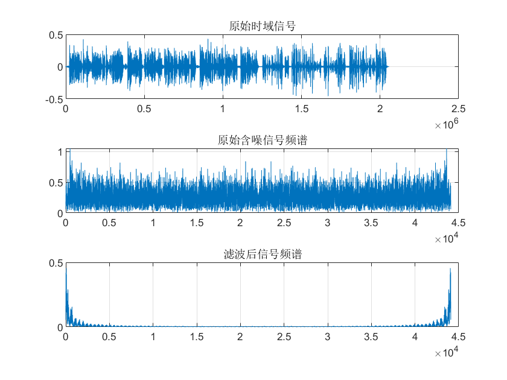
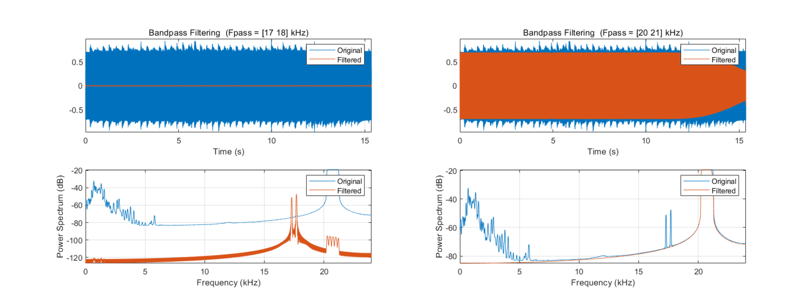

# 案例：滤波器比较与选择

​	到目前为止，我们介绍了包括滑动平均滤波器、基于卷积的FIR滤波器、基于递归的IIR滤波器、切比雪夫滤波器、巴特沃斯滤波器等多种不同类型的数字滤波器。面对所有这些可供选择的滤波器，我们如何知道在实际应用中要使用哪个？本节的目的是从性能、运算速度等方面对不同滤波器进行比较，以及说明如何针对应用需求选择合适的滤波器。这个是大家平时实验时候最关心的事情。

## FIR滤波器 vs IIR滤波器

​	FIR滤波器和IIR滤波器均可实现将一个频带与另一个频带的信号分离开。前者通过将输入信号与一个加窗的$sinc$滤波器内核做卷积实现，后者通过递归函数实现。对分离不同频带信号的需求而言，哪种数字滤波器是更好的选择？

为了回答这个问题，我们构造了一个纹波比为0.5％的6阶切比雪夫低通滤波器，和一个滤波器内核为51的FIR滤波器，对这两个滤波器的性能进行对比。

<center>

</center>

<center>
<div style="color:orange; border-bottom: 1px solid #d9d9d9;
display: inline-block;
color: #999;
padding: 2px;">图. 51-point FIR滤波器与6阶切比雪夫IIR滤波器频域响应对比。</div>
</center>

​	从上图可以观察到，基于卷积的FIR滤波器能以更快的从通带过渡到阻带，两种滤波器在通带的表现都足够优秀，而FIR滤波器具有更明显的阻带波动。从上面的频域响应看，这两个过滤器之间并没有太大的区别，当需要适度的性能时，它们都可以工作。接下来我们考虑这两个滤波器的性能极限分别在哪里。下图展示了两种滤波器在配置参数为最佳滤波效果时的频域响应情况。IIR滤波器是具有0.5％纹波的6阶切比雪夫滤波器，这是在0.05截止频率下用单精度浮点数可以实现的最大极数。FIR滤波器使用1001点的滤波器内核，该内核是通过将501点window-sinc滤波器内核与自身卷积而形成的。可以看到，当比较滤波器的极限滤波性能时，FIR滤波器完胜！即使对递归滤波器进行改进（例如使用更高的阶数、多级实现、双精度浮点数等），其性能也仍然无法与FIR相提并论。

<center>

</center>

<center>
<div style="color:orange; border-bottom: 1px solid #d9d9d9;
display: inline-block;
color: #999;
padding: 2px;">图. FIR滤波器与切比雪夫IIR滤波器极限参数配置下频域响应对比。</div>
</center>


​	看到这里，许多同学可能会觉得，既然FIR滤波器在频域滤波的性能绝对好于IIR滤波器，是不是以后凡是碰到有滤波需求的应用时，无脑选择FIR滤波器就行了呢？也并非这样的。在实际应用中，除了滤波效果，我们还需要考虑一个关键问题：计算速度。精心设计的FIR滤波器可以达到很好的期待的滤波效果，前提是你有足够的耐心等待滤波器输出你期待的结果。比较FIR和IIR滤波器的执行速度，可以发现通常IIR滤波器要比性能相当的FIR滤波器快一个数量级。

​	所以在大部分对滤波精度要求不是那么高的应用场景中，我们更倾向于选择IIR滤波器，因为它的结构简单、计算速度也更快，且它的频域滤波效果可以满足绝大多数应用场景的需要。

## 滑动平均 vs 一阶递归

​	在时域滤波场景中，我们通常使用滑动平均或一阶递归实现时域波形整形。为了比较这两种滤波器的使用差异，我们分别构造一个9点滑动平均滤波器和一个一阶递归滤波器。下图展示了两种滤波器的阶跃响应。在（a）中，移动平均阶跃响应是一条直线，这是从一个稳态迁移到另一个稳态的最快方法。 在（b）中，递归滤波器的阶跃响应更平滑，这对于某些应用可能更好。 

<center>

</center>

<center>
<div style="color:orange; border-bottom: 1px solid #d9d9d9;
display: inline-block;
color: #999;
padding: 2px;">图. 9-point滑动平均滤波器和一阶递归滤波器阶跃响应曲线。</div>
</center>

​	上图也反映了，这两种滤波器在时域滤波的性能上实际上相差无几，通常可以根据个人喜好在两者之间进行选择（真的是喜好么？:)）。但是，在考虑大规模数据滤波和编程复杂度问题的时候，我们在选择滤波器时就需要在开发时间和执行时间之间进行权衡。如果我们希望减少开发时间，并愿意接受较慢的过滤器，例如，我们可能需要一次滤波几千个点。由于整个程序仅需几秒钟即可运行，我们通常会选择使用递归过滤器，这样编程和修改将稍微容易一些，并且执行速度也不会很慢。但是，如果我们需要一次滤波几亿个点，我们则应该选择使用滑动平均，并通过算法优化使得计算速度尽可能快。

## 实践案例——声音滤波

​	借助滤波器，我们可以保留或抑制信号中特定频率的内容。这是物联网信号处理中的常用也必不可少的操作。很多同学们对这一部分基本概念有所了解，但是具体操作起来仍然比较陌生，尤其是之前很多同学并没有实际使用的经验。
在理解了基本原理之后，我们展示使用滤波来处理真实信号的案例。本部分将以录音降噪程序为例，向大家展示如何设计并实现具有特定功能的数字滤波器。我们处理一段混有高频噪声的录音信号，通过低通滤波抑制噪声信号，从而达到给录音降噪的目的。

注意，上真数据了！

**时域滤波**

​	从时域看，通过滑动平均可以将高频噪声带来的毛刺波动尽可能的平滑，并保留低频信号的波形特征。滑动平均的主要可调整参数为窗口大小，下面我们将实现基于滑动平均信号整形，用于抑制录音信号中的噪声。

```matlab
clc; clear; close all; clear sound

% 载入录音信号
[xr,fs] = audioread('Music.mp3');
xr=xr(:,1)'; 
noise = 0.01 * rand(1, numel(xr));
noise = highpass(noise, 500, fs);
xr = xr + noise;
figure; subplot(3,1,1); plot(xr); title('原始时域信号');
box on; grid on;

nfft = 1e4;
t = (0:numel(xr)-1)/fs;
fidx = (0:nfft-1)/nfft * fs;

% 原始含噪信号频谱
z = fft(xr(1:nfft));
subplot(3,1,2); plot(fidx, abs(z));
grid on; box on;
title('原始含噪信号频谱');

% 滑动平均过滤高频噪声
mwin = 100;
xr = movmean(xr, mwin);

% 滤波后信号频谱
z = fft(xr(1:nfft));
subplot(3,1,3); plot(fidx, abs(z));
grid on; box on;
title('滤波后信号频谱');

sound(xr, fs);
```

<center>

</center>

<!--  -->
<center>
<div style="color:orange; border-bottom: 1px solid #d9d9d9;
display: inline-block;
color: #999;
padding: 2px;">图. 滑动平均低通滤波效果示意</div>
</center>

​	可以看到通过滑动平均，原始声波信号中的高频分量被明显抑制；但同时，有用声音所在频率（0~1kHz）的信号能量也产生了衰减。这是由于滑动平均滤波器在频域对通带内的信号也有所抑制。

​	接下来，我们调整滑动窗口长度(窗口长度等于 10，30，50，70),绘制不同窗口长度下滤波结果的频谱图,分析滑动窗口长度对滤波效果的影响。
```matlab
for mwin = [10,30,50,70]
    % 滑动平均过滤高频噪声
    xr = movmean(xr, mwin);

    % 滤波后信号频谱
    z = fft(xr(1:nfft));
    subplot(2,2,ceil(mwin/10/2)); plot(fidx, abs(z));
    grid on; box on;
    title(['滑动平均窗口大小=', num2str(mwin)]);
end
```
<center>

</center>

<!--  -->
<center>
<div style="color:orange; border-bottom: 1px solid #d9d9d9;
display: inline-block;
color: #999;
padding: 2px;">图. 不同滑动窗口长度下低通滤波效果对比</div>
</center>

​	可以发现，滑动平均窗口越长，通带带宽越窄，对高频噪声的抑制效果越好；但同时，滑动窗口越长，也意味着通带内有用信号被抑制得越严重，失真越明显。

**带通滤波**

​	在有些情况下，噪声的频率同时分布在高频区间和低频区间。因此只通过简单的低通或者高通都无法达到令人满意的降噪效果。因此我们希望能够实现对特定频带内的信号滤波，即带通滤波。带通滤波器能通过指定频率范围内的频率分量,同时尽量降低其他范围的频率分量。

​	下面我们将编写程序实现带通滤波,提取录音文件中频率范围分别在17kHz~18kHz 与 20kHz~21kHz 两个频带的信号。

​	最直观的想法，是通过信号下变频，先将目标频带的信号搬移到0 Hz附近，然后使用低通滤波对目标频段外的信号进行抑制。

```matlab
% parameters
filename = 'res2.wav';

% read data
[y, Fs] = audioread(filename);

fft_plot(y, Fs, length(y), 'without filter');

t = (0:numel(y)-1) / Fs;
y = y .* cos(2*pi*-17e3*t); % 下变频的方法
y = lowpass(y, 1e3, Fs);
```

<center>

</center>

<center>
<div style="color:orange; border-bottom: 1px solid #d9d9d9;
display: inline-block;
color: #999;
padding: 2px;">图. 带通滤波效果</div>
</center>

> 思考：下变频的原理？

 	当然MATLAB也提供了bandpass的带通滤波函数，供用户提取制定频带内的信号，其实现逻辑与上述代码类似：

```matlab
% parameters
filename = 'res2.wav';

% read data
[y, Fs] = audioread(filename);
fft_plot(y, Fs, length(y), 'without filter');

% bandpass
figure;
bandpass(y, [17000, 18000], Fs);
figure;
bandpass(y, [20000, 21000], Fs);

function fft_plot(y, Fs, NFFT, plot_title)
    fx = (0:NFFT-1)*Fs/NFFT;
    ffty = fft(y, NFFT);
    m = abs(ffty);
    figure;
    plot(fx, m);
    title(plot_title);
    xlabel('f');
    ylabel('amplitude');
end
```
