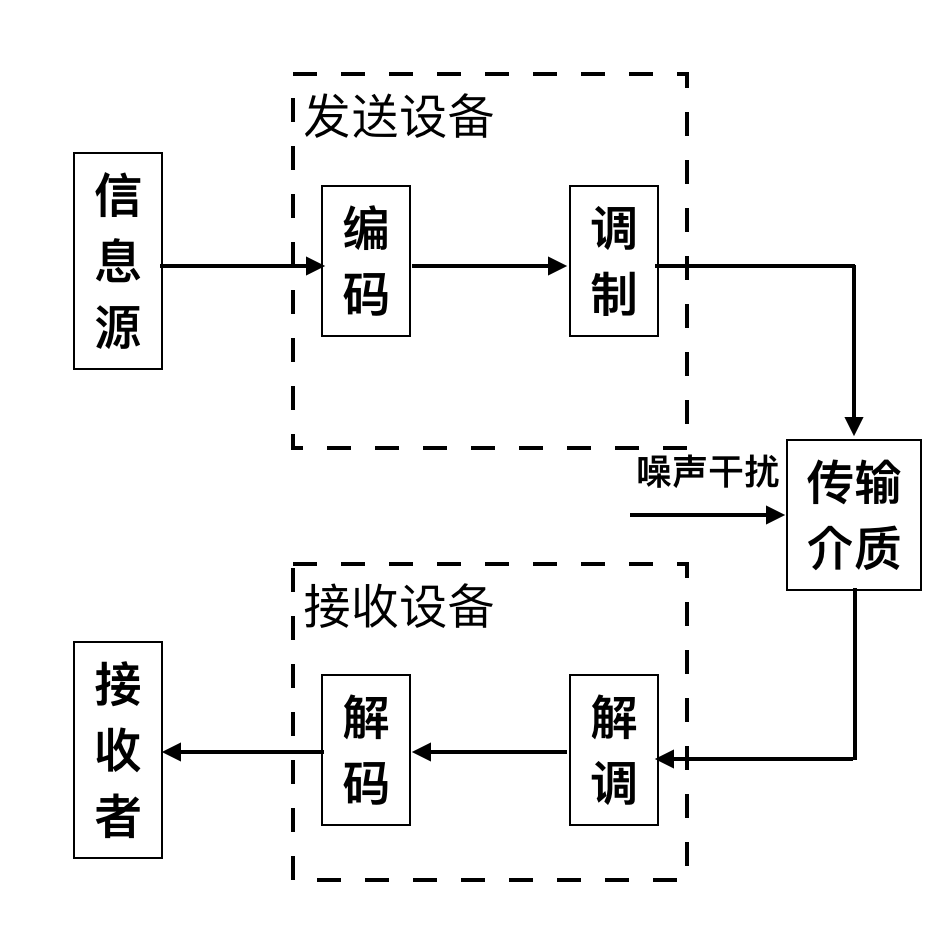
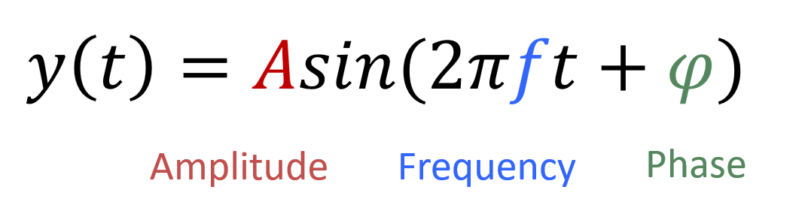

# 调制解调介绍
​		无线通信过程是指从数据转化为无线信号，在接收端又由无线信号转化为数据的过程。一般包含如下几个步骤：编码，调制，传输，解调，解码。如下图所示

图. 通信过程

​		在数据发送前，先对数据做一定的编码，用于数据的纠错检错等，例如可以在其中加上CRC，加上纠错码，使用Grey码等。在本节里面我们先主要讲调制和解调的过程。调制的过程是把编码后的信息（一般都采用二进制串来表示）转换成需要发送的信号。解调的过程则相反，把接收到的信号转换成二进制串。后面我们将会以一个完整的协议代码为案例，讲解通信的整个过程。

​		通俗的来讲，我们要发送一个二进制串（比如说01011100），通过以发送某种信号（例如正弦波信号）的设备。调制的过程是说怎样把二进制数据转成信号（例如可以通过调节参数改变正弦波的形状，或者将若干正弦波叠加在一起）发送出去。那么我们应该发送什么样的信号，或者说我们把发送的信号设计成什么样子，才能让对方知道我们发送的是01011100这个二进制串呢？

​		为了让接收方能够通过接收到的信号计算出发送方发送的二进制串，一个最朴素的想法是：我们用两个不同参数的正弦信号来分别代表“0”和“1”，只要发送端和接收端事先约定好哪种信号代表哪个二进制符号，就可以区分发送的数据。为了使发送的正弦信号不同，我们先来观察下图中的正弦函数公式：

图. 正弦信号的特征

​		可以看到，改变正弦函数的幅度、频率或者相位就可以生成不同的正弦信号。而幅度、频率、相位三个特征恰好对应了幅度调制、频率调制、相位调制三种调制方法。除此之外，还可以利用发送正弦信号的时间间隔等特征来利用信号表示二进制符号。

​		本章介绍调制解调的基本步骤和常见的几类调制解调方法。掌握了这些方法后，就可以在代码层面上实现一个简单的无线通信系统了。

## 参考资料和文献

1. 《信号与系统（第二版）》