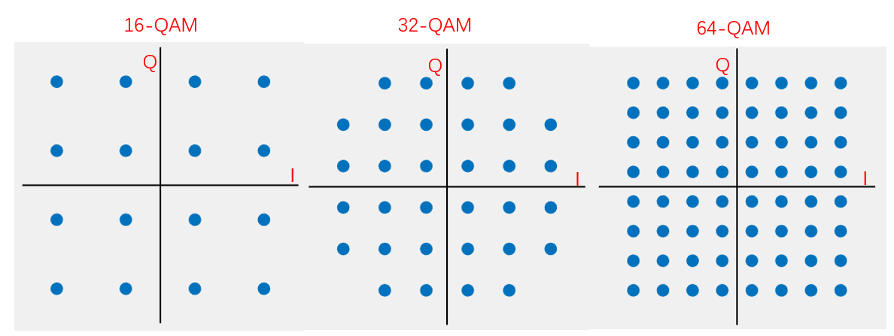
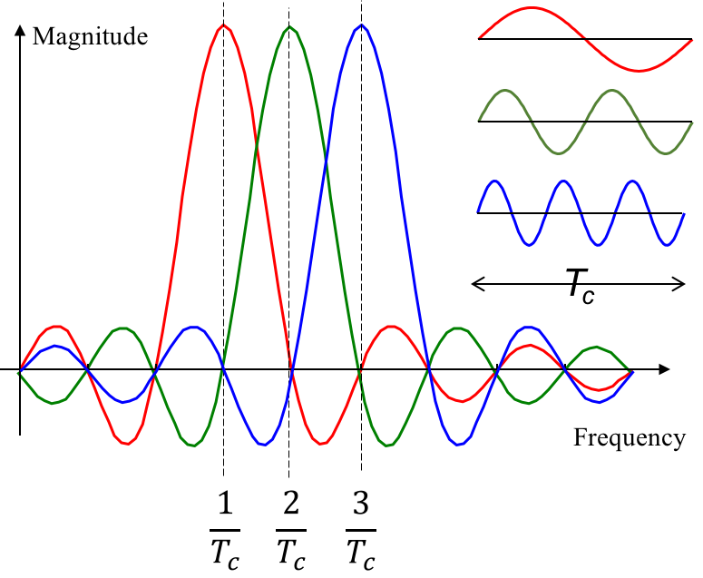

# 调制方法综合应用

​		以上介绍的幅度调制、频率调制和相位调制是调制方法中最基本的三类，在此基础上，可以发展出效率更高、抗噪声能力更强的调制方式。本节将介绍在三类基本调制方法上演变出的其他调制方式，包括OQPSK，QAM和OFDM。


## OQPSK

观察QPSK的星座映射图，我们可以发现从00 到 11 和从10 到01之间的相位跳变都是$\pi$。这样导致调制出来的信号会有一个相位的突变，如下图中红圈部分所示：

<center>

</center>
<center>
<div style="color:orange; border-bottom: 1px solid #d9d9d9; display: inline-block;color: #999;padding: 2px;">图. QPSK调制中会出现相位翻转为pi的情况</div>
</center>

​		这些相位跳变在实际系统中是不希望出现的，通常系统处理相位的跳变的时候都会出现问题。例如当信号通过低通滤波器时，这种相位翻转会导致较大的幅值波动，进而影响解码的成功率。

​		为了解决这一问题，我们可以使用偏移四相键控(Offset QPSK, OQPSK)。
OQPSK方法是基于QPSK的I/Q调制方式，基本跟QPSK是类似的。I路信号和QPSK相同，而Q路信号向后错位半个周期。这样一来I路和Q路信号翻转的位置相差半个周期，也就是说I路和Q路信号不会出现同时翻转，信号相位最大只能变化$\frac{\pi}{2}$。

​		下图分别展示了OQPSK的I、Q基带信号、分别调制了信息的两路信号以及叠加后的信号。

<center>

</center>
<center>
<div style="color:orange; border-bottom: 1px solid #d9d9d9; display: inline-block;color: #999;padding: 2px;">图. I/Q信号和调制后的OQPSK信号</div>
</center>

## QAM

​		之前介绍的BPSK，QPSK和8PSK的星座图里点的数量依次增加，那是否还可以继续增加到16PSK呢？

​		如果在单位圆上平均分配16个数据点，相邻两点之间的间距就会比8PSK更近，抗噪声的效果会进一步变差。我们重新审视一下星座图，如果把星座图的坐标系看作是极坐标系，则里面某个数据点的极角代表了信号相位，这个数据点距离原点的距离代表了信号幅度。为了让星座图上相邻的两个数据点距离稍远一些，我们不能把数据点限定在单位圆上。这样一来，我们需要**结合调幅和调相两种调制方式**，这种方式被称作正交相位调制(Quadrature Amplitude Modulation, QAM)。在前面的相位调制方法中，不管是BPSK，QPSK还是8PSK，信号的幅度始终是不变的。而在QAM调制中，信号的幅度可以同时变化。

​		下图展示了16-QAM、32-QAM和64-QAM的星座图：

<center>

</center>
<center>
<div style="color:orange; border-bottom: 1px solid #d9d9d9; display: inline-block;color: #999;padding: 2px;">图. 16-QAM、32-QAM和64-QAM的星座图</div>
</center>

​QAM调制方式进一步增加了每个数据点包含的信息量，提高了传输效率。

> 思考：基于前的BPSK，QPSK的代码，如何实现QAM的算法。

## OFDM
正交频分多路复用（Orthogonal Frequency Division Multiplexing）是802.11协议中频繁出现的一项调制技术，802.11a，802.11g，802.11n，802.11ac等协议均使用OFDM作为调制方式，可以这么说，也正是由于OFDM的加入，使得WiFi的速率得到了很大的提高。因此OFDM是与每个人密切相关、无时无刻都在使用的一项技术。

​		大家可能注意到了，不管是前面的BPSK，QPSK，8PSK还是QAM等，调制信号的时候使用的都是一个频率，即都使用的是$f$。那么如果要进一步提高数据发送的效率，很自然的一个想法是能不能使用多个频率，在每个频率上使用BPSK、QPSK、8PSK或者QAM来进行调制。如果在接收端我们又能将不同频率的数据分开，对每个频率单独解码的话，我们就显然能够达到更高的速率。这其实就是OFDM的基本思想，其中OFDM中OF就是指使用多个正交的频率，从而保证不同频率数据叠加到一起的时候不会互相干扰。

​		为了说明OFDM的原理，我们需要首先介绍**多载波调制** （Multi-Carrier Modulation, MCM）技术。OFDM是MCM技术的一类。

​		多载波调制将要传输数据分开调制到不同频率上，我们首先将要传输的数据分开对应到不同的传输频率，即串行比特流分成多个并行的子比特流。然后每一个比特流调制到不同的子载波上进行传输，它和单载波调制原理的对比如下图：

<center>

</center>
<center>
<div style="color:orange; border-bottom: 1px solid #d9d9d9; display: inline-block;color: #999;padding: 2px;">图. 单载波和多载波调制原理对比</div>
</center>

​		可以看到，单载波调制只发送一路信号，而多载波调制可以发送多路叠加到一起的信号，这多路信号的每一路频率都不相同。
直观上看，最简单粗暴的方法是在接收端使用带通滤波器就可以分离出每一路信号，当然实际上我们不需要这样。使用带通滤波器的一个基本要求是：多载波调制的每一路信号之间干扰要尽可能的小，因此如何有效的选择这些载波的频率是多载波调制中的一个关键。

> 思考：应该如何选择多载波调制中每一个子载波的频率，才能满足这个要求呢？

​		一个最直接简单的思路是让两个子载波频率差异尽量大，这样两个子载波之间的互相干扰就会比较小，但很显然这样编码的效率是比较低的。

​		OFDM提供了另外的一个思路，设第$m$路子载波的表达式为$\phi_m(t)=e^{j2\pi f_m t}$，其中$f_m$为第$m$路子载波的频率。为了使任意两个不同的子载波之间干扰尽可能的小，我们希望这两个子载波之间体现出“正交性”，那么什么叫做两个频率之间的正交呢？
这个概念比较抽象，两个频率正交能够使得我们解码过程中两个频率对应的信号之间不互相干扰。这里，我们可以将正交认为是一个码元长度$T_c$内二个不同频率对应的信号内积为0，接下来我们解释为什么满足这样的性质能够保证两个正交频率信号叠加他们之间不互相干扰。令

$$
\int_0^{T_c}e^{j2\pi f_i t}(e^{j2\pi f_j t})^*dt=\int_0^{T_c}e^{j2\pi (f_i-f_j) t}dt=\frac{sin(\pi \Delta f T_c)}{\pi \Delta f}e^{j\pi \Delta f T_c}=0
$$

​		其中$\Delta f = f_i-f_j$，从公式中可以看出，要满足正交性，需满足$\Delta f = \frac{n}{T_c}$，$n$为正整数，即任意两个子载波的频率差是$\frac{1}{T_c}$的正整数倍，因此我们可以设计子载波的频率，使得相邻子载波的频率差为$\frac{1}{T_c}$，这种设计就是OFDM中采用的子载波频率。如果将频率最小的子载波的频率设置为$\frac{1}{T_c}$的话，也就说所有子载波的频率都为$\frac{1}{T_c}$的整数倍。
​为了深入理解“正交性”的概念，可以参考下图：

<center>

</center>
<center>
<div style="color:orange; border-bottom: 1px solid #d9d9d9; display: inline-block;color: #999;padding: 2px;">图. OFDM中子载波的正交性</div>
</center>

​		各子载波上的码元长度都为$T_c$，因此它们的频谱在$\frac{1}{T_c}$处都为0。间隔为$\frac{1}{T_c}$的子载波叠加后，各子信道的频率样本间不存在相互干扰（例如子载波2和子载波3的频谱在$\frac{1}{T_c}$处的输出都为0）。

## OFDM实现

所以OFDM可以如下方法来实现，使用多路正交的频率，在每一路频率上使用之前我们说过的调制方式（BPSK、QPSK等），然后将生成的多路信号叠加到一起得到OFDM的信号。

这里我们以QPSK调制基带信号为基础，使用4路正交的子载波，即在每一路子载波上使用QPSK，最终实现一个简单的OFDM调制解调功能。为了简化代码，这里的调制部分省略了添加模拟信道噪声的步骤。

调制：

```matlab
function OFDMmodulator(codes, fileName)
%输入参数：
%codes: 待调制的数据，0/1数组
%fileName：保存到本地的信号文件
%调用样例：
%OFDMmodulator([1,1,0,0,1,0,1,0], 'data')
%调用结果：
%同文件夹下生成一个‘data.wav’音频文件
fs = 48000;
T = 0.025;
N = 4;    %采用4路子载波进行OFDM调制
f = (1 : N)' / T;

%将信号长度补齐到8的倍数（4路子载波，每个QPSK码元代表2bit）
cLen = length(codes);
L = 2 * N;
add0 = mod(cLen, L);
if add0 ~= 0
    codes = [codes, zeros(1, L - add0)];
    cLen = cLen + L - add0;
end

%生成I信号和Q信号
sigI = sin(2 * pi * f * (0 : 1/fs : T - 1/fs));
sigQ = cos(2 * pi * f * (0 : 1/fs : T - 1/fs));

%生成两路基带信号，并相加
sigL = size(sigI, 2);
sig = zeros(N, sigL * cLen / L);
for i = 1 : cLen / L
    fI = (1 - 2 * codes(i * L - 7 : 2 : i * L))' * sqrt(2) / 2;
    fQ = (1 - 2 * codes(i * L - 6 : 2 : i * L))' * sqrt(2) / 2;
    sig(:, (i - 1) * sigL + 1 : i * sigL) = fI .* sigI + fQ .* sigQ;
end

%叠加4路信号
sig = sum(sig, 1);
%将信号幅度恢复为1
sig = sig / max(abs(sig));

audiowrite([fileName, '.wav'], sig, fs);

end
```

​		发送端可以将这个调制好的声音播放出去，这在手机上就可以进行，然后接收端通过录音将声音接收下来，然后使用下面的算法进行解调，整个过程跟真实的无线数据收发一致。

​		主要的解调代码如下：

```matlab
function codes = OFDMdemodulator(fileName)
%输入参数：
%fileName：调制数据得到的信号文件
%输出：
%codes: 解调结果，0/1数组
%调用样例：(同文件夹内需要有'data.wav'文件)
%OFDMdemodulator(‘data’)
%调用结果：
%输出[1,1,0,0,1,0,1,0]
[sig, fs] = audioread([fileName, '.wav']);
sig = sig';
T = 0.025;
N = 4;
f = (1 : N)' / T;
L = 2 * N;

%生成I信号和Q信号
sigI = sin(2 * pi * f * (0 : 1/fs : T - 1/fs));
sigQ = cos(2 * pi * f * (0 : 1/fs : T - 1/fs));
sigL = size(sigI, 2);
sigI = reshape(sigI', 1, sigL, N);
sigQ = reshape(sigQ', 1, sigL, N);

%生成星座图上的4个点对应的标准基带信号，保存在一个4行、4页的矩阵中（每一行对应一个星座图上的点，每一页对应一路子载波信号）

sigMat = sqrt(2) / 2 * (...
    [1; 1; -1; -1] .* repmat(sigI, 4, 1, 1) + ...
    [1; -1; 1; -1] .* repmat(sigQ, 4, 1, 1));

cLen = L * length(sig) / sigL;
codes = zeros(1, cLen);

for i = 1 : cLen / L
    seg = repmat(sig((i - 1) * sigL + 1 : i * sigL), N, 1);
    %通过积分的方式（积分针对的是连续信号，离散信号则是对点积求和），判断当前的这一段信号和哪个标准信号距离最近。积分的结果越大代表两个信号越相似。
    [~, maxI] = max(sum(sigMat .* seg, 2), [], 1);
    codes(i * L - 7 : 2 : i * L) = maxI(:)' > 2;
    codes(i * L - 6 : 2 : i * L) = mod(maxI(:)', 2) == 0;
end

end
```

和QPSK类似，在解调的代码实现中，生成标准基带信号时采用了多维矩阵的形式。大家可以对比单载波的QPSK和使用多载波的OFDM调制解调的代码，并在代码中找到利用子载波正交性进行解码的地方，以加深对OFDM原理的理解。

​		如果我们将上述的Matlab实现的调制和解调代码实现到手机上去的话，再结合手机的播放声音和录音的功能，就很容易实现一个基于声波的无线传输系统。大家可能会看到有很多关于声音的传输的前沿论文和软件，他们的基本实现都是以此为基础的，例如就有论文专门研究如何实现声波上的OFDM，我们再这里就跟大家直接进行展示。理解了这个，大家也可以动手去尝试一下。

​注意，为了方便理解，我们给的OFDM的调制解调方式跟真实的会有一些差别。上述代码介绍的调制过程是首先产生不同频率的正交信号，在每一路信号上进行调制，然后每一个频率对应的信号进行叠加。

真实的调制解调过程并不需要产生不同频率的正交信号，而是通过傅里叶逆变换ifft，指定不同子载波频率后通过傅里叶逆变换生成要调制的数据。在接收端通过傅里叶变换将各个子载波的系数即编码信号解码出来。

具体傅里叶变换和傅里叶逆变换的方法可以参见傅里叶分析一章节。

- 发送端：发送的数据为$c_k$，基于$x[n] = \frac{1}{N}\sum_{k=0}^{N-1} c_k e^{j2\pi \frac{k}{N}n}.$，我们可以生成要发送的信号$x[n]$。此时发送的信号有两个特点：
  - 有不同的正交频率组成，即$e^{j2\pi \frac{k}{N}n}$
  - 每一个正交频率对应的参数即为编码的信息。例如可以为$c_k = I_k + Q_k*j$。
- 接收端：收到数据后，对数据进行傅里叶分析，这样我们能够从接收到的数据里面计算出$c_k$，从而计算出$I_k$和$Q_k$，从而解调数据。

> 基于这一主要思路，大家可以尝试一下OFDM的实现，并思考这样实现的好处是什么。

​		当然完整的OFDM实现要比这个更复杂，例如还会添加循环冗余的前缀等等。大家理解了OFDM的基本操作后，很多其他的技术部分也比较好理解了。强烈建议大家都去相对完整地实现一遍OFDM方法，一定会有很大的收获。基于现在的这些基础知识，请大家相信实现OFDM不会有你们想的那么复杂。

## 参考资料和文献

1. 《信号与系统（第二版）》

