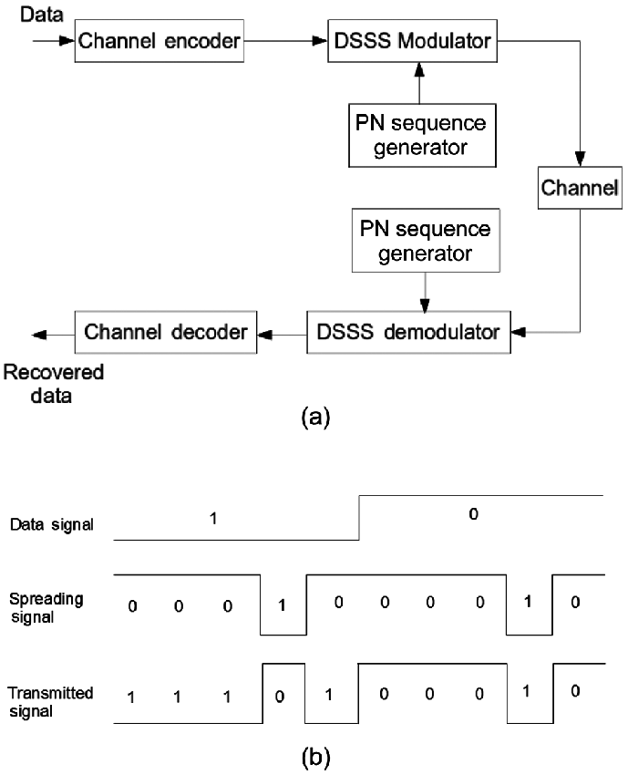

# 引言

学习了之前的调制解调的底层技术，剩下的就是如何基于这一系列技术来实现物联网场景中需要的各种无线传输协议了。本部分我们主要介绍无线协议部分，有线协议假设大家都在计算机网络学习过程中都较为了解了。

根据物联网应用的不同需求，我们可以将物联网中使用到的无线协议大致分为四个不同类别。按照传输能耗和距离来说，第一类是远距离高速率的传输协议，典型协议包括蜂窝网络通信技术，如3G、4G、5G相关技术等，这是我们目前移动通信使用的典型技术。第二类是近距离高速率传输技术，如WiFi、蓝牙等，这些技术传输距离在几十到几百米级别，主要用在家庭环境和日常应用中，使用非常广泛，前面两类可能是一般用户最常使用到的网络协议了，也符合传统网络应用的主要特点和需求。第三类是近距离低功耗传输技术，如传统物联网中ZigBee、RFID、低功耗蓝牙等，这是物联网最近发展起来的技术，能够提供近距离低速率的传输。第四类是远距离低功耗传输技术，前面三类技术大都要求较高的信噪比，对障碍的穿透性较小，无法在复杂环境中实现远距离低功耗传输。低功耗广域网技术填补这一技术空白，低功耗广域网技术以极低功耗进行远距离传输（如几公里到几十公里），具备极低信噪比下的通信能力。

在物联网通信中，通信距离、通信速率、通信功耗就像不可能三角一样通常难以兼得，在实际设计中会根据需求有所取舍，例如WiFi选择高数据率，就会适当放低通信距离和通信功耗的要求。同样手机上使用的移动通信技术主要选择了通信距离和通信速率，放低通信功耗的要求。
所以技术还是那些技术，限制还是那些限制，一方面大家在设计适应不同场景的无线通信技术，如WiFi、蓝牙、5G等，另外一方面大家在给定技术的条件下想方设法的在接近技术的极限。

# Wi-Fi

如今无线局域网Wi-Fi是人们日常生活中访问因特网的重要手段之一，它可以通过一个或多个体积很小的接入点，为一定区域内的（家庭、校园、餐厅、机场等）众多用户提供因特网访问服务。在IEEE为无线局域网制定IEEE 802.11规范之前，存在许多不同的无线局域网标准，这样的缺点是用户在A区域（例如餐厅）上网需要在电脑上安装一种类型的网卡，当他回到B区域（例如办公室）则需要为电脑更换另一种类型的网卡。除了浪费时间和硬件成本外，在不同协议覆盖重叠区域内，无线信号的干扰降低了网络访问的性能。因此为了规范和统一无线局域网的行为，从上世纪90年代至今IEEE制定了802.11系列协议。

## 1. IEEE 802.11协议简史

如表1所示，不同的IEEE 802.11协议的差异主要体现在使用频段、调制模式、信道差分等物理层技术。IEEE 802.11协议中典型的使用频段有两个，其一是2.4—2.485GHz公共频段，其二是5.1—5.8GHz高频频段。由于2.4—2.485GHz是公共频段，微波炉、无绳电话和无线传感器网络也使用这个频段，因此信号噪声和干扰可能会稍大。5.1—5.8GHz高频段的传输主要受制于视线传输和多径传播效应，一般用于在室内环境中，其覆盖范围要稍小。不同的调制模式决定了不同的传输带宽，在噪声较高或无线连接较弱的环境中可减小每个信号区间内的传输速率来保证无误传输。下面我们来归纳一下802.11协议族不同协议类型物理层的主要特点。

**表1  IEEE 802.11协议对比**

IEEE 802.11协议 | 发布时间 | 频带(GHz) | 最大速度 | 调制模式
-------|-------|-------|-------|-------
IEEE 802.11-1997 | 1997 | 2.4 | 2Mbps | DSSS
IEEE 802.11a | 1999 |5|54Mbps|OFDM
IEEE 802.11b|1999|2.4|11Mbps|DSSS
IEEE 802.11g|2003|2.4|54Mbps|DSSS或OFDM
IEEE 802.11n|2009|2.4/5|100Mbps|OFDM
IEEE 802.11ac|2014|5|866.7Mbps|OFDM
IEEE 802.11ax|2019|2.4/5|9608Mbps|OFDMA

- (1) 1997年6月发布的IEEE 802.11-1997协议采用直接序列扩频（Direct Sequence Spread Spectrum，简称DSSS）技术，使用2.4-2.485 GHz频段，可支持传输带宽为1Mbps和2Mbps。

- (2) 1999年9月同时发布了IEEE 802.11a和IEEE 802.11b协议。IEEE 802.11a协议采用正交频分多路复用（Orthogonal Frequency Division Multiplexing，简称OFDM）技术，使用5.1-5.8 GHz相对较高的频段，带宽可达到54Mbps。由于802.11a使用高频频段，其室内覆盖范围要略小。IEEE 802.11b协议采用高速直接序列扩频（High Rate-DSSS，简称HR-DSSS）技术，使用2.4-2.485GHz频段，带宽可达到11Mbps。从IEEE 802.11a和IEEE 802.11b协议的特点可见，两者是相互不兼容的。

- (3) 2003年6月发布的IEEE 802.11g协议采用了和IEEE 802.11a相同的OFDM技术，保持了其54Mbps的最大传输带宽。同时802.11g使用和802.11b相同的2.4—2.485GHz频段，并且兼容IEEE 802.11b的设备，但兼容802.11b设备会降低802.11g网络的传输带宽。

- (4) 2009年10月发布的IEEE 802.11n协议除了采用OFDM技术，还采用多天线多输入多输出（MIMO）技术，其带宽可达到100Mbps。同时IEEE 802.11n可选择使用2.4-2.485GHz和5.1-5.8GHz两个频段。

- (5) 2014年1月发布的IEEE 802.11ac协议支持多用户的多天线多输入多输出技术，相较IEEE 802.11n，能够提供更宽的射频带宽（提升至160MHz），更高密度的编码（高达256QAM），是IEEE 802.11n潜在的继任者。

尽管在物理层使用的技术有很大差异，这一系列IEEE 802.11协议的上层架构和链路访问协议是相同的。例如MAC层都使用带冲突预防的载波监听多路访问（Carrier Sense Multiple Access/Collision Avoidance，简称CSMA/CA）技术，数据链路层数据帧结构相同以及它们都支持基站和自组织两种组网模式。下面我们将一一介绍这些共性。

看完刚才这一些内容和一大堆的名词，大家是不是感觉有点晕，不要紧，下面的几个章节中大家会自己动手来实现上面的很多方法，通过自己动手来深入了解这一些通信的基础概念。

注意看上面这个表格，其中OFDM是WiFi中主要使用的调制技术了。DSSS（Direct Sequence Spread Spectrum）一般翻译为直接序列扩频，这是这个英文的逐字翻译。
网络里面有很多概念翻译得还是比较好的，但是也有很多概念翻译的时候不太形象。例如将routing翻译为路由，这个词就不太能直观的理解，如果翻译成寻路可能就更方便直接多了，例如路由算法变成了寻路算法，这样大家一听也就明白了，当然现在大家挺多了，估计对路由这个词也就熟悉了。
另外大多数概念都是通过英文直译过来，大家在理解的时候首先按照字面上来理解，其实就能猜出来大概的意思了。
直接序列扩频，字面意思就是发送数据前通过一个序列来扩展频率，那么其中有几个问题了，怎么通过序列扩频，为什么要扩频。大家如果接触通信够多的话，会经常听到扩频这个概念。简单的说，在数据发送前，将原始的比特序列扩展成为另外一个序列，通常我们说的这个序列里面每一个元素是一个码元（chip），如下图中所示，一个比特将会对应到多个码元（chip），然后基于码元对数据进行调制解调。这就是DSSS的主要思路，事实上大家回忆一下就能想到CDMA其实也用了类似的思路。如下图所示，扩频的过程就是原始数据乘以扩频码的过程。

图. DSSS直接序列扩频示意

那么问题来了，DSSS这样操作后，为什么能达到扩频的效果，这样扩频的效果有什么好处呢？

从下面这个图我们可以看出来，如果能实现发送端扩频的效果，原来发送的窄带宽的数据在发送过程中变成了更宽的带宽，占用更多的频谱，直观上看，由于占用更多的频谱，那么发送中自然就不那么容易收到干扰。例如如下图中所示，如果发送过程中有某个频段的噪声，这个噪声不会影响到所有数据，而只会影响到频谱中的某一段数据。在接收数据的后，那么如何减少这部分干扰的影响呢，通常会把我们想要的数据部分能量在进行一次集中（注意发送前扩频，接收后集中），集中我们感兴趣的数据部分能量的同时，也将干扰信号做了类似扩频的效果，如下图所示，因此这样DSSS能够达到扩频的效果。
那么怎么样在接收端实现数据能量的集中和干扰能量的分散呢（类似扩频），很容易我们还是想到乘以这个相同的扩频码，通过乘以扩频码，我们如果能保证扩频码乘以自己后乘积为1，就很容易看出来我们是可以还原出原来的比特序列的。
例如假设原始比特为$b$, 扩频后应该为$b*D[\cdot]$，基于$b*D[\cdot]$进行我们前面说过的调制解调。
在解扩频的过程中，我们可以将收到的数据$b*D[\cdot]$ 乘以$D[\cdot]$。通过选取合适的扩频码使得$D[\cdot]D[\cdot]=1$，我们就可以解出来b。

注意CDMA其实也是这个过程，在CDMA中，不同的发送端选取不同的扩频码，当这些扩频码之间正交（即两个扩频码的乘积为零）的情况下，在解码的过程中，乘以对应的扩频码就可以将相应的数据还原出来而不会影响原来的数据。后面有时间我们再来讲一下CDMA的具体过程，大家也可以看DSSS的这个图来思考，其实很多技术思路是类似的。

图. DSSS直接序列作用

## 2. 星型网络连接

在IEEE 802.11的架构中，最重要的组成部分是由一个基站（在IEEE 802.11中被称为接入点或者AP）和多个无线网络用户组成的基本服务组（Basic Service Set，简称BSS）。如图2所示，每个圆形的区域表示一个基本服务组。每个接入点通过有线网络互联设备（交换机或者路由器）连入上层公共网络中。

图. 无线局域网WLAN架构

<!-- 图2. 无线局域网WLAN架构 -->

每个AP会有一个或多个服务集标识符（Service Set Identifier，简称SSID）。如果使用Windows操作系统，在“控制面板”->“网络连接”->“无线网络连接”图标上点击右键出现选择菜单，然后点击其中的“查看可用无线网络”选项，那么可为用户提供无线连接服务的接入点的SSID都会被列出来。同时接入点管理者还会为其指定一个频段作为通信信道。IEEE 802.11b/g使用2.4-2.485 GHz频段传输数据，对于这85MHz的频宽，802.11b/g将其分为11个部分相互重叠的信道。任何两个不相互重叠的信道中间需要相隔4个或4个以上其它信道。例如信道1、6和11是3条互相不重叠的信道，如果在一间教室内有3个接入点，则IEEE 802.11b/g信道分配模式可以保证这3个接入点之间的信号互不干扰，但如果有多于3个的接入点，例如存在一个使用信道9的接入点，它会对使用信道6和信道11的接入点造成干扰。

## 3. 介质访问控制协议
前面我们讲的调制解调的方法主要介绍的是两个节点直接如何进行数据传输，例如设备和基站间如何进行数据传输。如果有多个设备存在的情况下，由于无线网络的特点，很容易能够想到多个设备之间会数据冲突。
如何解决这个问题呢，这就是介质访问控制层需要做的事情，也就是通常我们说的MAC（Medium Access Control）层做的事情。

跟前面类似，介质访问控制层这个翻译其实也是比较直观的翻译，介质就是指传输要用的信道，访问是指设备在传输的过程中都得使用访问这个信道，其实Access翻译成使用也是可以的，在这里可能还更容易让人理解，虽然在很多其他的地方都翻译成访问，例如安全领域。访问控制是指很多设备同时要使用信道，我们要控制各个设备的访问时间、访问顺序等。针对这一目标，就产生了一系列MAC协议，例如有些时候需要的是公平，有些时候需要考虑的是访问优先级（重要的先访问），有些时间需要兼顾优先级下的公平等等。所以MAC设计也是网络研究领域尤其是无线网络研究领域一直的研究热点，如果你有碰到一个新的网络类型，或者你在基于一种新的网络类型做研究，那么首先就可以想想MAC协议上可以做哪些设计。例如后面我们会提到的无线传感网、低功耗广域网这些新型网络领域，我们自己也开展了很多MAC协议的研究。

具体到WiFi协议里面，由于每个Wi-Fi接入点可能会关联多个无线网络用户，并且在一定区域内可能存在多个接入点，因此两个或更多用户可能在同一时间使用相同的信道传输数据。此时由于无线连接会相互干扰，更容易导致数据包的丢失，因此需要多用户信道访问协议来控制用户对信道的访问。IEEE 802.11协议中使用带冲突避免的载波监听多路访问（Carrier Sense Multiple Access/Collision Avoidance，简称CSMA/CA）协议。CSMA是指用户在发送数据之前先监听信道，如果信道被占用则不发送数据。CSMA/CA是指即使侦听到信道为空，也为了避免冲突而等待一小段随机时间后再发送数据帧。虽然以太网介质访问控制协议也使用了CSMA技术，但其细节与IEEE 802.11协议的介质访问控制协议还是有所不同。首先由于无线信号干扰问题所造成数据传输出错概率较大，因此IEEE 802.11协议中要求建立数据链路层确认/重传机制。然而以太网中有线连接的传输出错概率较小，其并没有强制要求数据链路层建立确认/重传机制。再者是以太网使用带冲突检测的载波监听多路访问（Carrier Sense Multiple Access/Collision Detected，简称CSMA/CD）协议，其原理是：当用户监听到信道为空时立即发送数据，并且在发送数据的同时监听信道，如果此时它检测到了和其它用户的数据传输信号发生了冲突，则立刻停止传输并随机等待一小段时间后重新传输。802.11协议使用CSMA/CA而不使用CSMA/CD主要有两个原因：

- (1)冲突侦测需要全双工（发送数据的同时也可以接收数据）的信道。而对于无线传输信号来说往往发送信号的能量远高于接收到的信号的能量，建立能侦测冲突的硬件代价是很高的。

- (2)即使无线信道是全双工的，但是由于无线信号衰减特性和隐藏终端问题，硬件还是不能侦听到全部可能的冲突。

在IEEE 802.11协议中，一旦无线网络用户开始传输数据帧，直到整个帧传输完成，传输过程才会停止。在多用户访问环境中，由于无法使用CSMA/CD机制，无计划的传输整个帧带来的冲突会导致整体传输性能的下降。尤其当数据帧的长度相对较长时，冲突的概率会大大增加。为了降低传输冲突的概率，IEEE 802.11协议采用的CSMA/CA机制采取了一系