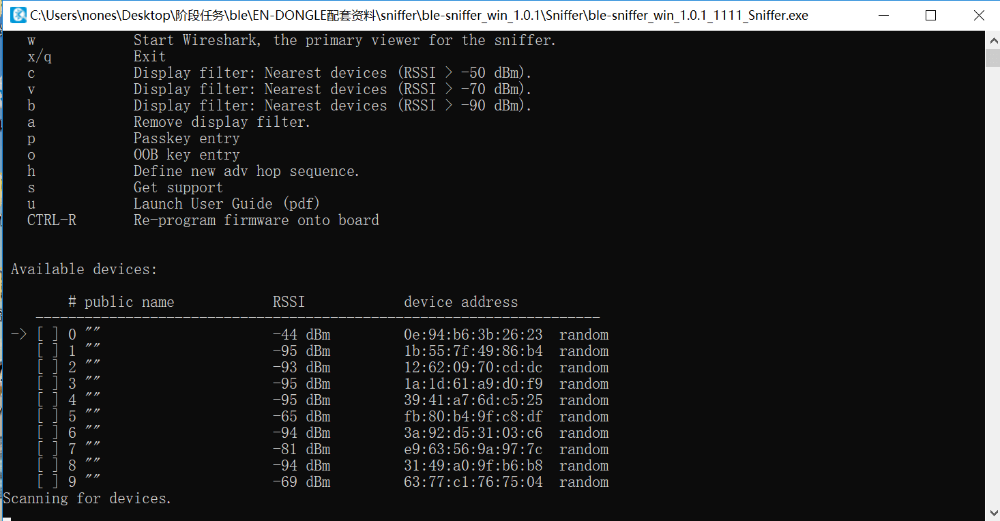
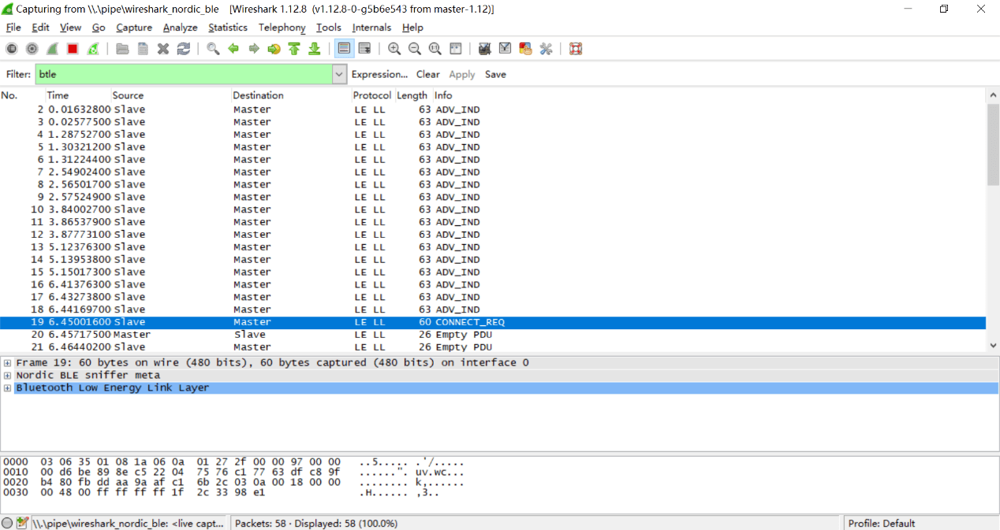

# 蓝牙实验


## 1 BLE嗅探

BLE嗅探原理：BLE通信内容包含广播包和连接数据包。由于广播包在公开的广播信道传输，在通信范围内任何人都可以接收到这些广播包。因此，BLE嗅探一般指嗅探连接数据包。BLE连接数据包在跳频信道中传输，如果不知道跳频序列则无法嗅探。但由于所有的跳频参数都在建立连接时主机发出的连接请求中，只要获取到这个包，嗅探工具就能够计算出跳频序列，进而在跳频信道中获取连接数据包。因此，BLE嗅探工具要求在主机和从机建立连接前开始嗅探。

常用的BLE嗅探工具有以下几种：

- 使用智能手机或蓝牙适配器进行嗅探：成本低、只能嗅探到广播包、信息不太全面
- 使用USB Dongle进行嗅探：成本较低、能监听广播包和通信包、只能监听低功耗蓝牙、只能在windows系统下使用
- 使用Ubertooth one进行嗅探：支持所有版本蓝牙监听、支持数据加解密等高级功能

## 2. BLE通信伪造

伪造广播数据包：由于BLE通信中中央设备通过接受到的广播包来区分不同的外围设备，如果一个攻击设备使用某个外围设备的广播包进行广播，那么中央设备可能会将这个攻击设备误认为外围设备，与攻击设备进行连接。

伪造通信数据包：由于BLE通信中外围设备接受任何中央设备的连接请求，因此攻击设备可以主动向外围设备发起连接，访问其中的数据。


## 3. 实验一：搜索附近的BLE设备，制作一个beacons节点

**实验内容：**

让同学们动手搜索附近的蓝牙设备，理解BLE设备的广播模式，并自己动手制作一个能够广播的BLE节点。

**知识介绍：**

Beacons是使用蓝牙4.0（BLE）技术发射信号的小设备。利用BLE的广播信道，发送不定向数据，大小为128bit，有效范围为几米，工作时间可达三年

iBeacon和Eddystone都是beacons的数据格式标准。iBeacon是苹果提出的，时间最早；Eddystone是谷歌提出的，功能最强。

**实验步骤：**

- (1) 使用智能手机下载APP（IOS：lightblue；Android：BLE Debugger），并使用APP搜索附近的BLE设备，理解广播包的各个参数。


<center>
<div style="color:orange; border-bottom: 1px solid #d9d9d9;
display: inline-block;
color: #999;
padding: 2px;">图. APP使用界面</div>
</center>

- (2) 利用linux系统中的bluez协议栈，将电脑制作成一个发射BLE广播包的beacons节点。linux系统执行以下命令：
  
    ```shell
    $hciconfig hci0 up  					              #开启蓝牙网卡
    $hcitool -i hci0 cmd 0x08 0x000A 01 			       #开启广播模式
    $hcitool -i hci0 cmd 0x08 0x0008 1a 02 01 06 03 03 aa fe 12 16 aa fe 10 00 03 62 6C 6F 67 2E 67 74 77 61 6E 67 01 00 00 00 00 00	#定制广播内容
    ```

- (3) 手机下载eBeacon或Eddystone validator软件，查看beacons节点状态


<center>
<div style="color:orange; border-bottom: 1px solid #d9d9d9;
display: inline-block;
color: #999;
padding: 2px;">图. beacons节点状态</div>
</center>

## 4. 实验二：理解BLE设备通信流程和嗅探方法

**实验内容：**

使用手机与小米手环通信，使用USB Dongle监听通信。让同学们理解BLE设备的通信流程，同时掌握嗅探工具的使用方法。

**知识介绍：**

BLE嗅探常用工具：

- USB Dongle：芯片厂商为了方便开发者能够方便的调试通信，将芯片集成为USB模块。
- nRF51822：为嗅探低功耗蓝牙而设计的一款 USB Dongle

**实验步骤：**

- (1) 给每个同学发一个USB Dongle，并让他们在电脑上安装嗅探器驱动和wireshark。
- (2) 助教使智能手环进入广播阶段，让每个同学使用USB Dongle开始监听，并锁定目标小米手环。


<center>
<div style="color:orange; border-bottom: 1px solid #d9d9d9;
display: inline-block;
color: #999;
padding: 2px;">图. 锁定目标设备</div>
</center>

- (3) 助教使用手机连接智能手环，并进行一些操作。使用wireshark的数据包给同学们讲解BLE的广播、建立连接、身份认证和特征读写的详细过程。


<center>
<div style="color:orange; border-bottom: 1px solid #d9d9d9;
display: inline-block;
color: #999;
padding: 2px;">图. 设备的广播模式和建立连接过程</div>
</center>

- (4) 助教在手环中读写一些信息，让同学们在wireshark中找到这些信息。

<!-- 图2.3 设备读写数据过程 -->

### 5. 实验三：窃听智能门锁密码

**实验内容：**

使用脚本模拟智能门锁开锁过程，让同学们使用usb dongle嗅探门锁密码，体会BLE攻击的具体过程。

**规则描述：**

- (1) 假设你周围有个使用低功耗蓝牙控制的智能门锁，该门锁的主人会不定时发送解锁密钥来开门。尝试使用蓝牙嗅探技术，获取门锁密钥，攻破大门！
- (2) 门锁MAC地址未知，该门锁会在广播模式和连接模式不断切换。密钥格式为：KEY{xxxxxx}，祝你好运！

**实验步骤：**

- (1) 助教使用gate.py脚本和bleno模拟的门锁开始解锁过程，同学们使用USB Dongle嗅探并截获门锁密钥。
- (2) 游戏结束后，助教给同学们复盘，并讲解嗅探过程的常见问题。

### 4.4. 实验四：设计一个BLE设备

**实验内容：**

让同学们自己制作BLE中央设备和外围设备，深入理解BLE通信流程和伪造通信原理。（可以专门开一节课让同学们展示他们设计的设备）

**实验要求：**

设计一个蓝牙设备，思考它的业务逻辑，根据业务逻辑构造该设备的广播包与连接数据包。并实现与该设备交互的连接脚本。（推荐bleno+bluepy实现）

完成作业后，交付设备与脚本源代码和说明文档。文档中说明该设备的功能和业务流程。

**举例：**

小明使用nodejs实现了一个温度传感器。该传感器具有用户身份认证功能、存储温度功能和改变显示单位功能。建立连接后，该设备要求用户在身份认证handle写入一串预设字符串，否则不能读写温度和单位的数据。通过验证后，用户可以读取温度的handle，设备会根据单位计算并返回结果。用户还可以向单位handle写入数据改变温度显示单位（摄氏度、华氏度等。）

**参考实现：**
https://github.com/noble/bleno/tree/master/examples

## 参考文献

1. Jiliang Wang, Feng Hu, Ye Zhou, Hanyi Zhang, Zhe Liu, Yunhao Liu. "BlueDoor: Breaking the Secure Information Flow via BLE Vulnerability", ACM MOBISYS 2020.