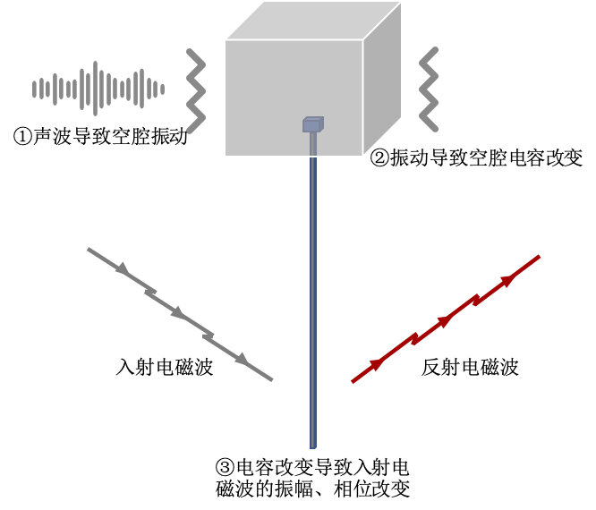

# Backscatter的起源
 在上个世纪40年代，有一种窃听设备 the Great Seal bug（金唇）。该设备的构造十分简单，由一个接收特定频段的天线，和一个连接到天线的空腔构成。空中的声波会撞击这个空腔，并使其发生震动，而震动引起的形变会改变这个空腔的电容，从而改变入射电磁波的幅度、相位等特征（类似于调制技术）。在接收端，反射回来的电磁波便可以解调出空腔拾取的声音信号。 值得一提的是，由于这个设备无需供电，其在美国驻苏联大使馆的大使办公室中工作了七年才被发现并取下。 the Great Seal bug是无源的，且同样需要外部的激励信号，被认为是Backscatter技术的前身。

<center>

</center>

<center>
<div style="color:orange; border-bottom: 1px solid #d9d9d9;
display: inline-block;
color: #999;
padding: 2px;">图. 窃听设备 the Great Seal bug</div>
</center>

# Backscatter基础原理

Backscatter通信又可以被称为反向散射通信。之前我们看到的通信方式大多可以被认为是主动式的通信方式，即发送方主动产生电磁波，并基于这个电磁波进行调制传输数据。反向散射通信是采用的另外一种模式，发送方不需要主动产生信号，而是通过反射别的设备产生的电磁波来进行通信，在反射过程中改变反射信号的特点（如幅度、相位等）编码信号。

例如在反向散射通信中，反向散射标签可以控制其天线在完全吸收信号/完全反射两种状态中切换，相应，反射出来的信号就会具备不同的振幅，这个振幅就可以用来代表不同的信息。

为了更深入的理解反向散射标签如何在两种状态中切换，进而改变反射信号的振幅，我们在这一章对backscatter的基础原理进行介绍。

当电磁波在传播中遇到具有不同阻抗的两种介质的边界时，电磁波将会被一定程度的吸收或反射回去。所以，只需要在天线处进行阻抗的切换，就可以改变反射的电磁波实现数据传输。
Backscatter技术不需要专门的电源产生通信过程中需要的载波，因此能耗极小，可使射频设备的功耗若干个数量级，甚至可以做到不需要专用的电源，可以吸收环境中的能量进行通信。因此在物联网的各种应用中，Backscatter技术有很大的优势。

假设达到Backscatter标签的激励信号为$S_{in}$，则其反射出信号$S_{out}$可以由下式描述：

$$
S_{out} = \frac{Z_{a}-Z_{c}}{Z_{a}+Z_{c}}S_{in}
$$

其中，$Z_{a}$和$Z_{c}$和分别表示天线的阻抗（一般为$50\Omega$）和连接到天线的电路对应的阻抗。

例如，我们将标签的$Z_{c}$值设置在0和$Z_{a}$之间切换，在电路实现中是切换图5中的$S_{1}$连接到的阻抗值。分别将$Z_{a}=0$和$Z_{a}=Z_{c}$代入上面的公式，可以得到$S_{out}=S_{in}$（这里$S_{in}$为前文提到的CW）和$S_{out}=0$。这样接收端可以通过反射回信号的振幅就可以判定基带的高低电平。

<center>

</center>

<center>
<div style="color:orange; border-bottom: 1px solid #d9d9d9;
display: inline-block;
color: #999;
padding: 2px;">图. 通过改变阻抗控制反射信号的振幅</div>
</center>

## 基于频移的Backscatter

我们还可以将$S_{in}$通过频移(Frequency Shifting)的手段使其远离$S_{out}$所处的频段。这样，在接收处便可通过一个滤波器排除来自不同频段的干扰。

接着我们以FSK（频移键控）的Backscatter为例，向大家介绍Backscatter中常见的频移操作。如果将开关$S_{1}$在两个状态间切换的频率设置为$f_{0}$，相当于将$S_{in}$乘上了$\{0, 1, 0, 1, \ldots, 0, 1\}$这样的序列，也就是频率为$f_{0}$的方波$S_{square}(f_{0}t)$。如果忽略掉方波的高次谐波，将方波近似为同频的余弦信号$cos(f_{0}t)$。可以得到：

$$
\begin{equation}
  \begin{split}
	S_{out} &= S_{square}(f_{0}t) \cdot S_{in}\\
	& \approx cos(f_{0}t) \cdot S_{in}\\
  & = \frac{1}{2}(e^{j2 \pi f_{0}t}+e^{-j2 \pi f_{0}t})S_{in}
  \end{split}
\end{equation}
$$

从该式中可以看出来，Backscatter反射出的信号$S_{out}$将激励信号$S_{in}$分别向上和向下频移$f_{0}$。如果Backscatter标签根据需要发送的内容，切换$f_{0}$的取值，接收端就可以对比激励信号与$S_{out}$的频率差，从而得到Backscatter标签发送的FSK数据。

请读者在Matlab中运行下面的代码，理解对$S_{in}$的频移操作，以及接收机如何解出backscatter信号。

``` Matlab
% 注：以下的代码假设直接在基带进行频移操作，实际的通信过程中发射机与接收机需要经过上变频和
% 下变频等操作，为了方便理解，在这里略去 

t = (1 : 1024)/128e3;
s_in = exp(1j*2*pi*100e3*t);
% 生成激励信号S_in，为一个单频信号

s_backscatter_bit0 = cos(2*pi*16e3*t);
s_backscatter_bit1 = cos(2*pi*32e3*t);
% tag以不同频率控制开关以发送"0"或"1"

s_out_bit0 = s_in .* s_backscatter_bit0;
s_out_bit1 = s_in .* s_backscatter_bit1;
% tag生成不同频率的信号与s_in相乘，得到s_out

figure;
hold on
plot(abs(fftshift(fft(s_out_bit0))));
plot(abs(fftshift(fft(s_in))));
hold off
figure;
hold on
plot(abs(fftshift(fft(s_out_bit1))));
plot(abs(fftshift(fft(s_in))));
hold off
% 画出发送"0"或者"1"（即频移不同频率）的频谱
```

> 思考：Backscatter除了利用不同的频移频率来编码数据，同样可以通过改变$S_{square}$的初相位，在频移的同时使用PSK的方式通信，这是如何实现的？

