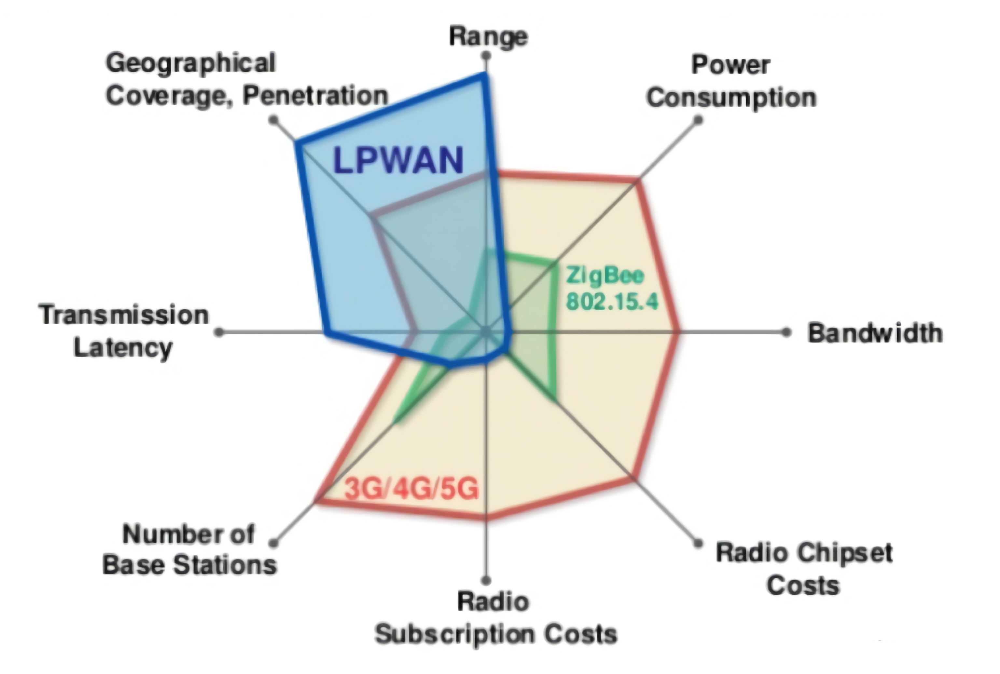

学习了之前的调制解调技术，大家可以开始理解我们常用的网络协议都是如何从底层开始构建的。剩下是如何基于这一系列技术来实现物联网场景中需要的各种无线传输协议了。

根据物联网应用的不同需求，我们可以将物联网中使用到的无线协议大致分为四个不同类别。按照传输能耗和距离来说，第一类是远距离高速率的传输协议，典型协议包括蜂窝网络通信技术，如3G、4G、5G相关技术等，这是我们目前移动通信使用的典型技术。第二类是近距离高速率传输技术，如WiFi、蓝牙等，这些技术传输距离在几十到几百米级别，主要用在家庭环境和日常应用中，使用非常广泛，前面两类可能是一般用户最常使用到的网络协议了，也符合传统网络应用的主要特点和需求。第三类是近距离低功耗传输技术，如传统物联网中ZigBee、RFID、低功耗蓝牙等，这是物联网最近发展起来的技术，能够提供近距离低速率的传输。第四类是远距离低功耗传输技术，前面三类技术大都要求较高的信噪比，对障碍的穿透性较小，无法在复杂环境中实现远距离低功耗传输。低功耗广域网技术填补这一技术空白，低功耗广域网技术以极低功耗进行远距离传输（如几公里到几十公里），具备极低信噪比下的通信能力。

在物联网通信中，通信距离、通信速率、通信功耗就像不可能三角一样通常难以兼得，在实际设计中会根据需求有所取舍，例如WiFi选择高数据率，就会适当放低通信距离和通信功耗的要求。同样手机上使用的移动通信技术主要选择了通信距离和通信速率，放低通信功耗的要求。
所以技术还是那些技术，限制还是那些限制，一方面大家在设计适应不同场景的无线通信技术，如WiFi、蓝牙、5G等，另外一方面大家在给定技术的条件下想方设法的在接近技术的极限。
对于WiFi、蜂窝网络协议等，大家都能在很多书中找到详细的介绍，本书中就不再赘述，在这里我们主要来讲LoRa协议和RFID协议等。

# 低功耗广域网
前面我说的网络协议，WiFi可以是短距离高带宽的，BLE和ZigBee等协议是短距离低带宽的，
现有的技术提供了面向不同场景的连接基础，
之前讲过的有三类主要的协议，第一类是远距离高速率的传输协议，典型协议包括蜂窝网络通信技术，如3G、4G、5G相关技术等，这是我们目前移动通信使用的典型技术。第二类是近距离高速率传输技术，如WiFi、蓝牙等，这些技术传输距离在几十到几百米级别，主要用在家庭环境和日常应用中，使用非常广泛，前面两类可能是一般用户最常使用到的网络协议了，也符合传统网络应用的主要特点和需求。第三类是近距离低功耗传输技术，如传统物联网中ZigBee、RFID、低功耗蓝牙等，上面三类技术大都要求较高的信噪比，对障碍的穿透性较小，无法在复杂环境中实现远距离低功耗传输。低功耗广域网技术填补这一技术空白，低功耗广域网技术以极低功耗进行远距离传输（如几公里到几十公里），具备极低信噪比下的通信能力。低功耗广域网有效的弥补了现有物联网连接方法的不足，成为支持物联网连接的重要基础，得到了国内外的广泛关注，并成为了国内外的研究和应用前沿。

LPWAN (Low Power Wide Area Network)指的是低功耗广域网，其特点在于极低功耗，长距离以及海量连接，适用于物联网万物互联的场景。LPWAN不只是一种技术，而是代表了一族有着各种形式的低功耗广域网技术，如下图所示。其中LoRa使用的是一种扩频技术，NB-IoT使用的是窄带技术，这是两种有代表性的低功耗广域网技术。

图. LPWAN技术一览

图. 无线技术分类

无线通信技术从数据率和通信范围两个维度的比较如上图，不难看出，LPWAN填补了我们常见通信技术(比如WiFi，Bluetooth，4G/5G等)的空白，即通信距离长、能耗低、通讯速率低。
虽然LPWAN通信速率不高，但是依然能够满大部分物联网通信的需求，其超低功耗的特点是它收到青睐的原因。

在早期的研究中，主要有三种技术为物联网系统提供数据传输服务。

- 一是短距离无线网，代表技术包括蓝牙、ZigBee、Z-Wave 等。
这类技术通常对功耗要求低，但其传输覆盖范围小、传输速率受限，因此适合短距离低带宽的应用场景。
- 二是传统无线局域网，即 IEEE 802.11 协议族所规定的一系列协议，典型的就是我们平时常用的WiFi协议。这类技术覆盖范围较短，通常是家庭和室内环境的距离，大致覆盖几十米到数百米。适合高带宽短距离的应用场景。
- 三是蜂窝网络，包括 GSM、LTE 等技术。这一类技术距离远、带宽高，适合高带宽需求或者移动应用的场景。

<!-- 

图. LPWAN与传统无线网络技术比较

 -->

针对上述已有技术在具体物联网应用中存在的不足，低功耗广域网(Low Power Wide Area Networks， LPWAN)发展成为了适合大规模物联网应用场景的连接技术。
LPWAN兼具短距离无线网络低功耗和蜂窝网络超大覆盖范围的优点，覆盖范围广、通信能耗低。
因此对于分布在大范围区域内的低功耗物联网设备来说，LPWAN是最佳的连接选择。
在 LPWAN 网络中，这些物联网设备可以随意部署或移动，因此 LPWAN 可以满足智能城市中的诸多应用，如智能化计量，家庭自动化，可穿戴电子，物流，环境监测等。这些应用需要交换数据量少，交换的频率也不高。
LPWAN 应用场景包括但不限于智能交通、工厂、农业、采矿等领域。
由于 LPWAN 具有传统的蜂窝网络和传统无线技术所不具备的特点（例如相比于蜂窝网络来说功耗更低，相比于传统无线网覆盖更广），同时由于其独特的设计，使得LPWAN通常能在更低的信噪比下工作，因此能够适合在复杂环境中的联网。

现有的LPWAN技术，按工作频段不同，主要可以分为授权频段（License Band）和非授权频段（Unlicense Band）两类。

- 采用授权频段技术的为3GPP（3rd Generation Partnership Project）主导的NB-IoT（Narrow Band IoT），其采用现有蜂窝网络的基础硬件，通过升级来实现，主要投入为电信营运商及相关设备厂商。
- 至于非授权频段，就呈现了遍地开花的状况，大部分不属于电信领域的ICT厂商，主要的代表技术LoRa、SigFox等。它们都采用了ISM频段（Industrial Scientific Medical Band），这是一种各国开放给工业、科学及医学机构使用的频段。它们无须许可证及费用，只需要遵守一定的发射功率（一般低于1W），不要对其他频段造成干扰即可。

## LoRa

LoRa 是 Long Range Communication的简称，狭义上的LoRa指的是一种物理层的信号调制方式，是 Semtech 公司定义的一种基于Chirp扩频技术的物理层调制方式，可达到-148 dBm的接收灵敏度，以较小的数据速率（0.3-50kbps）换取更高的通讯距离（市内3km，郊区15km）和更低的低功耗（电池供电在特定条件下可以工作长达10年）。
从系统角度看，LoRa也指由终端节点、网关、网络服务器、应用服务器所组成的一种网络系统架构：LoRa定义了不同设备在系统中的分工与作用，规定了数据在系统中流动与汇聚的方式。
从应用角度看，LoRa为物联网应用提供了一种低成本、低功耗、远距离的数据传输服务：LoRa在使用10mW射频输出功率的情况下，可以提供超过25km视线传输距离，从而支持大量广域低功耗物联网应用。
本节剩余部分将从LoRa应用、LoRa系统架构、LoRa物理层调制技术三个方面，自顶向下地对LoRa进行介绍。

需要指出的是，现在关于LoRa的研究工作越来越多。有很多的研究工作甚至论文声称自己使用了LoRa或者就是LoRa，但是实际只是其中一小部分跟LoRa有一些关系，比如可能仅仅使用了CSS技术，甚至都可能只是使用了频率线性增长的信号，例如有一些使用了FMCW技术的工作，也将自己和LoRa联系起来。这些都不能与通常所说的LoRa协议划等号。

## LoRa应用

LoRa作为目前广泛使用的低功耗广域网技术(LPWAN)，为低功耗物联网设备提供了可靠的连接方案。
如下图所示，相比于Wi-Fi、蓝牙、ZigBee等传统无线局域网，LoRa可以实现更远距离的通信，有效扩展了网络的覆盖范围。而相比于移动蜂窝网络，LoRa具有更低的硬件部署成本和更长的节点使用寿命，单个LoRa节点可以在电池供电的情况下连续工作数年。LoRa具有低数据率、远距离和低功耗的性质，非常适合与室外的传感器及其他物联网设备进行通信或数据交互。

图. LPWAN与其他无线通信技术对比

考虑到LoRa在覆盖距离、部署成本等方面的巨大优势，近年来LoRa在全球范围内进行了大量的应用部署，在智能仪表（如智能水表、智能电表）、智慧城市、智能交通数据采集、野生动物监控等众多物联网场景中都可以看到LoRa的应用。例如LoRa通信模块与传统的水质传感器进行连接，从而使用户可以数十公里外远程监控饮用水在输送过程中的水质变化情况。而在荷兰的KPN项目中，工程人员通过广泛部署LoRa网关，实现LoRa网络全覆盖，为智慧运输、智能农业、智慧路灯等具体应用提供了通信支持。

## LoRa架构
现在常用的LoRa架构由节点、网关及服务器所组成，各部分的关系如下图所示。
LoRa节点与网关之间采用单跳直接连接，这一阶段的物理层使用线性扩频调制（Chirp Spreading Spectrum， CSS），MAC层通常使用LoRaWAN协议。后面我们会详细介绍CSS调制方法的细节。

网关收到数据包后，对数据包信号进行解码，并将解码结果传输给网络服务器，这一阶段使用传统的TCP/IP进行传输，同时网络服务器与网关之间的交互仍然遵守LoRaWAN协议。
网络服务器汇总多个网关的数据，过滤重复的数据包，执行安全检查，并根据内容将数据发送至不同的应用服务器，供用户读取和使用，这一阶段也使用TCP/IP和SSL进行传输和加密。

图. LoRa网络架构

## LoRaWAN
注意到我们前面提到过的，单一的LoRa节点向LoRa网关发送数据主要采用CSS调制方法。在LoRa网络中，会有很多LoRa节点向同一网关发送数据，根据我们前面介绍的，这就需要MAC协议来协调不同节点间的数据传输，在LoRa中比较典型的MAC协议就是开源的LoRaWAN。
LoRaWAN是由LoRa联盟在LoRa物理层编码技术的基础上提出的MAC层协议，由LoRa联盟负责维护。LoRaWAN规范1.0版本于2015年6月发布。LoRaWAN协议主要规定了节点与网关、网关与服务器之间的连接规范，确定了LoRa网络的星型拓扑结构。受LoRa节点成本和能耗的限制，现有的LoRaWAN协议基本采用纯ALOHA机制，即节点在发送数据前不进行载波侦听，也就是没有使用CSMA/CA，而是随机选择时间进行发送。

> 大家思考为什么这样选择，这样会导致什么影响。

1） LoRaWAN协议的简单性有助于降低节点能耗，延长节点的使用寿命；
2） 载波侦听等协议对于信噪比非常低的LoRa信号实现较难，大家想象一下传统的载波侦听都可以基于信号强度，但是在LoRa中信号强度可能设置都会在噪声一下，这样是很难检测到信号，从而就很难进行冲突避免的。最近南洋理工大学的李默老师团队等正在开发基于载波侦听的针对LoRa网络的MAC层协议，大家可以多去关注。
3）由于LoRa节点的通信距离覆盖较大，节点部署可能比较密集，使用CSMA/CA协议等可能会很大程度降低网络效率，大家可以在理论的角度稍微计算一下。另外其中Hidden Terminal 和 Exposed Terminal的影响可能会进一步降低性能。
 这样由于LoRaWAN中并没有采用复杂的冲突避免机制，这也导致了LoRa网络的信号冲突问题，尤其是网络规模比较大的时候，因此为了让LoRa网络能够在实际系统中应用，就必须解决这一问题，我们团队从另外一个角度思考这个问题，如何在数据包冲突的时候还能够解码出来，即LoRa数据包的并发解码，在这方面做了很多的工作[2-5]，欢迎大家交流讨论。

> 思考为什么CSMA/CA效率不行？

LoRaWAN定义了网络的通信协议和系统架构，还负责管理所有设备的通信频率、数据速率和功率。
在LoRaWAN的控制下，网络中的所有设备可以是异步的，并在只有可用数据时进行传输。
针对不同的应用场景，LoRaWAN定义了三种节点运行模式，分别是Class A（ALL）、Class B（Beacon）、Class C（Continuously Listening）：

- Class A模式主要提供低功耗上行连接，处于Class A模式的节点可以在任意时间发起上行传输，并只在传输结束时打开两个下行接收窗口，此时接收来自网关ACK。Class A模式下，网关无法主动连接到节点，当无数据传输时，节点处于休眠状态，因此该模式下节点能耗最低。
- Class B模式提供节点与网关的周期性连接，该模式下网关节点周期性向节点广播信标帧，保持节点与网关的时间同步。
- Class C模式提供节点与网关的持续性连接，该模式下节点始终处于唤醒状态，因此能耗最高。

三种网络模式中，Class A是所有LoRa网络都必须支持的模式，也是最常用的网络模式。这三个模式设计并不复杂，其实就是在网络灵活性、可用性和节能之间的一个平衡。Class A最节能，但是灵活性相对较低，例如下行数据只能依赖于上行数据的时间。Class C最耗电，但是也是上行和下行数据发送最灵活的。

图. LoRaWAN: Class A, B, C

## 参考文献
1. https://lora-alliance.org/about-lorawan/
2. Shuai Tong, Zilin Shen, Yunhao Liu, Jiliang Wang. "Combating Link Dynamics for Reliable LoRa Connection in Urban Settings", ACM MobiCom 2021.
3. Zhenqiang Xu, Pengjin Xie, Jiliang Wang. "Pyramid: Real-Time LoRa Collision Decoding withPeak Tracking", IEEE INFOCOM 2021.
4. Shuai Tong, Jiliang Wang, Yunhao Liu. "Combating Packet Collisions Using Non-Stationary Signal Scaling in LPWANs", ACM MOBISYS 2020.
5. Zhenqiang Xu, Shuai Tong, Pengjin Xie, Jiliang Wang, "FlipLoRa: Resolving Collisions with Up-Down Quasi-Orthogonality", IEEE SECON 2020
6. Shuai Tong, Zhenqiang Xu, Jiliang Wang. "CoLoRa: Enable Muti-Packet Reception in LoRa", IEEE INFOCOM 2020.

