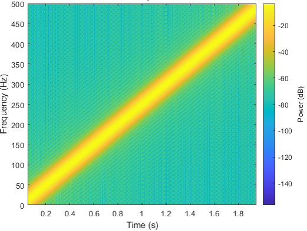
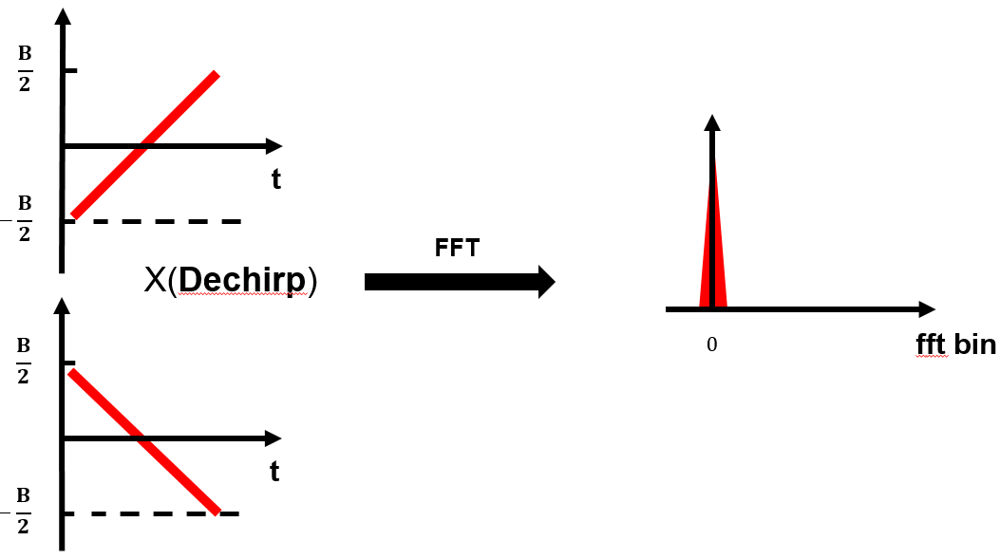
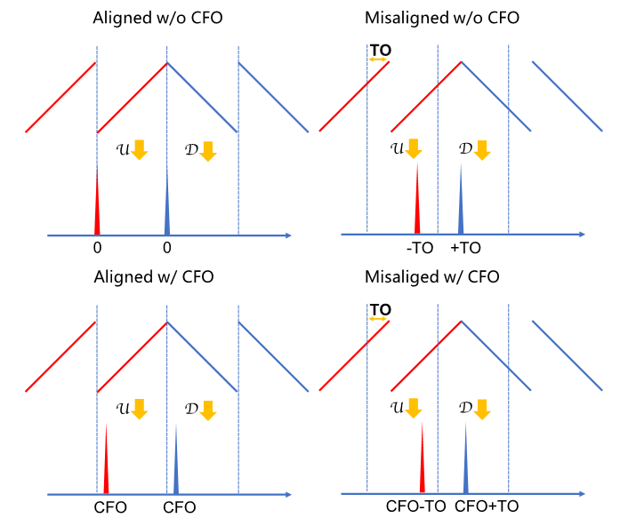
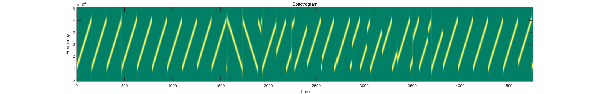
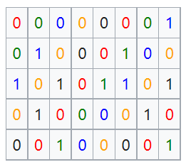
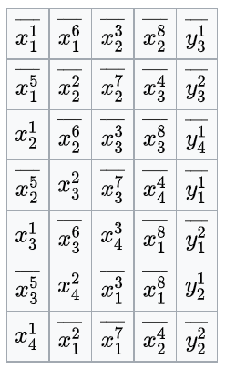
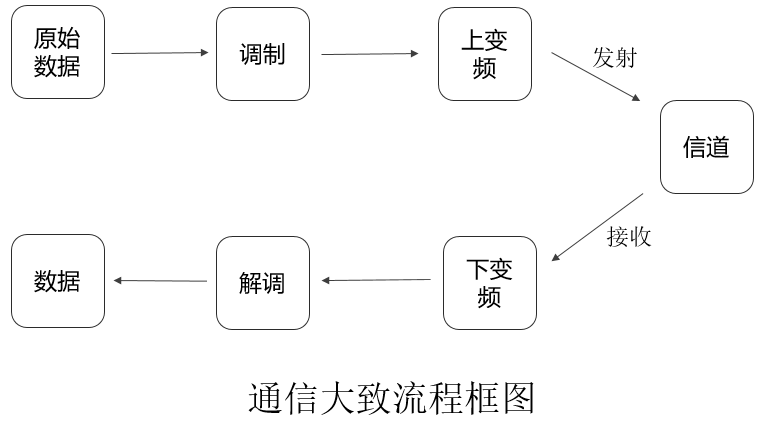
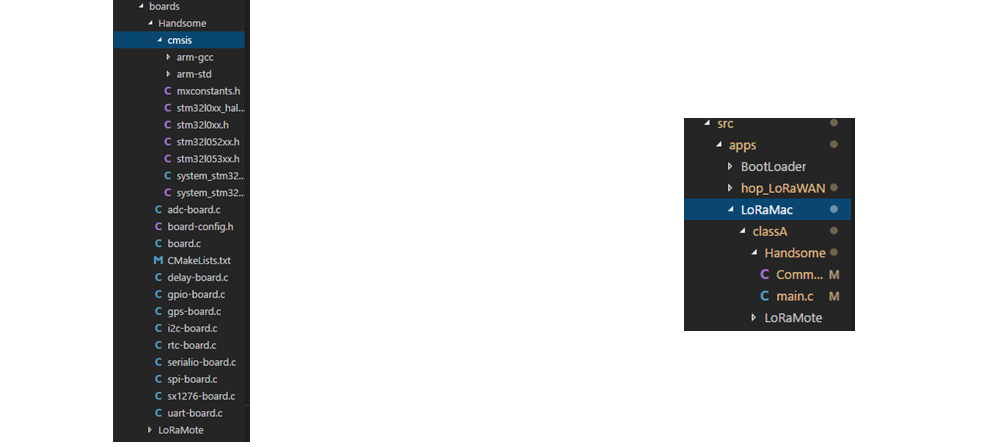

# LoRa 通信

在这一部分，我们来介绍LoRa通信的基本原理，包括调制、解调、编码和解码，着重于物理层协议的分析，最后我们以声波作为传输方式展示如何进行LoRa通信。关于上层协议（如LoRaWAN），有很多其他的资料和开源实现供读者学习[1][2]。下面我们所讨论的LoRa，不加特殊说明的话，指LoRa物理层。结合着前面刚刚学习过的调制解调的知识，大家能够进一步加深对物联网通信的理解。

需要说明的是，LoRa物理层是一个商用的私有协议，并没有完整公开的协议说明，因而已有的一些LoRa实现[3][4][5]都是基于推理，同时很多LoRa代码实现的性能是很差的，包括不少研究论文中使用的LoRa代码，实际性能也存在着很大的问题。为此，我们深入地进行了可验证的LoRa逆向工程并开源了两个完整的代码库。我们的实现可以达到商业LoRa芯片的性能和编解码能力。

MATLAB版本用于原型验证和离线操作，基于GNURadio平台的C++版本则是一个实时的高性能LoRa实现。希望这两个代码库可以更好地帮助大家学习和研究LoRa。未来我们还将开源FPGA上LoRa编解码的硬件实现。

MATLAB 版本 LoRaPHY: [https://github.com/jkadbear/LoRaPHY](https://github.com/jkadbear/LoRaPHY)

GNURadio 版本 gr-lora：[https://github.com/jkadbear/gr-lora](https://github.com/jkadbear/gr-lora)

**相关论文的介绍见**[7]: Zhenqiang Xu, Pengjin Xie, Jiliang Wang. "Pyramid: Real-Time LoRa Collision Decoding withPeak Tracking", IEEE INFOCOM 2021.


大家开始学习LoRa前，先跟着我来了解LoRa的基本原理，然后我会展示一个基于声波的完整LoRa通信系统，方便大家更加直观的理解LoRa，在此基础上，大家可以再去使用和研究真实LoRa通信，使用提供的代码。

> 在理解LoRa同时，希望大家特别注意体会LoRa是通过什么样的设计来支撑远距离、低功耗的传输特性的。这是在目前很多研究中被忽略的，导致很多工作说是基于LoRa，但是已经完全没有了LoRa的特点。

## LoRa 调制与解调

在这节我们介绍LoRa的调制与解调，也即如何在物理波形和比特数据之间进行转换。
LoRa 使用 CSS （Chirp Spread Spectrum）线性扩频调制，频率线性扫过整个带宽，因此抗干扰强，对多径和多普勒效应的抵抗较好。LoRa的基本通信单元是linear chirp，也即频率随时间线性增加（或减小）的信号。我们将频率随着时间线性增加的chirp符号叫做upchirp，将频率随着时间线性减小的chirp符号叫做downchirp，如下两图分别从时域和频域展示了一个upchirp的图像：

<center>

</center>
<center>
<div style="color:orange; border-bottom: 1px solid #d9d9d9;
display: inline-block;
color: #999;
padding: 2px;">图. Chirp时域图。横坐标为时间，纵坐标为信号幅度。</div>
</center>

<!-- <center>

</center>
<center>
<div style="color:orange; border-bottom: 1px solid #d9d9d9;
display: inline-block;
color: #999;
padding: 2px;">图. Chirp时频图。横坐标为时间，纵坐标为频率。</div>
</center> -->

<center>

</center>
<center>
<div style="color:orange; border-bottom: 1px solid #d9d9d9;
display: inline-block;
color: #999;
padding: 2px;">图. upchirp的时频图。横坐标为时间，纵坐标为频率</div>
</center>

一个chirp怎么编码数据呢？LoRa的做法是通过在频域循环平移chirp进行数据的编码，不同的起始频率代表不同的数据。如下图所示，在带宽B内四等分标定四个起始频率，我们可以得到4种类型的符号，分别表示00，01，10，11。我们将图(a)所示从最低频率扫频到最高频率的chirp符号称为basic upchirp。所以在接收端，只需要将这个起始频率计算出来，就可以计算出每一个chirp对应的比特数据。

<center>

</center>
<center>
<div style="color:orange; border-bottom: 1px solid #d9d9d9;
display: inline-block;
color: #999;
padding: 2px;">图. LoRa循环频移编码。当SF=2时，分别编码了00，01，10，11的四种符号。</div>
</center>

LoRa规定了一个参数SF（Spreading Factor，扩频因子），其定义为


$$ 
2^{SF} = B \cdot T.
$$

可以看出，给定带宽B，SF越大每一个chirp长度T越长。
SF用于调节传输速率和接收灵敏度，越大的SF速率越小但支持更远的通讯距离。一般来说每一个chirp可能的起始频率数目是 $2^{SF}$。

当我们使用软件无线电设备（Software-defined radio, SDR）接收一段LoRa设备发出的信号，并把信号的时频图画出来，那么它大概会是如下样子：

<center>

</center>
<center>
<div style="color:orange; border-bottom: 1px solid #d9d9d9;
display: inline-block;
color: #999;
padding: 2px;">图. LoRa数据包时频图</div>
</center>

一个完整的LoRa数据包结构包含三个部分：前导码（Preamble）、SFD（Start Frame Delimiter）和数据部分（Data）。 前导码包含6~65535个basic upchirp和两个标识网络号的其他chirp符号。接着是2.25个basic downchirp，作为SFD标识数据段的开始。后面的数据段则包含着若干编码了数据chirp。

LoRa解调过程，实质就是求出chirp符号的起始频率，其做法通常是这样的：首先将收到的基带upchirp信号与downchirp点乘，化为单频信号，这一操作叫做解扩频(dechirp)。Dechirp能够将chirp信号能量集中到单一频率，是LoRa的抗噪及传输远距离的原因之一。

Dechirp之后，对得到的信号进一步做FFT(快速傅里叶变换)，可在频域获得一个峰值，这个峰值位置对应的频率即是起始频率，我们因此得到对应的$SF$个比特。对于一个upchirp而言，如果采样率高于带宽的话，会得到两个峰，我们可以将这两个峰进行叠加来增强峰的高度，进而求出对应的位置。下面两图分别对应basic upchirp和非basic upchirp的解调过程。

<center>

</center>
<center>
<div style="color:orange; border-bottom: 1px solid #d9d9d9;
display: inline-block;
color: #999;
padding: 2px;">图. 解调basic upchirp</div>
</center>

<center>

</center>
<center>
<div style="color:orange; border-bottom: 1px solid #d9d9d9;
display: inline-block;
color: #999;
padding: 2px;">图. 解调非basic upchirp</div>
</center>

我们再以数学式子的形式将上面的过程更细致地梳理一遍。

upchirp从最低频率开始，随时间增加逐渐上升至最高频率。而downchirp则与之相反，从最高频率逐渐下降至最低频率。最高频率和最低频率之间的差值为LoRa的带宽$B$。设basic upchirp的最低频率为$f_0=-\frac{B}{2}$，最高频率为$f_1=\frac{B}{2}$，chirp长度为$T$。因此其频率可以表示为$f(t)=f_0+kt$，其中$k=\frac{BW}{T}$表示扫频速度。线性变化的频率对时间做积分可以得到二次形式的相位$\phi(t) = 2\pi (f_0 t + \frac{1}{2}kt^2)$。由此，basic upchirp可以表示为：

$$
C(t)=e^{j2\pi(f_0+\frac{1}{2}kt) t}
\tag{1}
$$

> 思考：这里频率为什么会有负的，意义是什么？

当嵌入数据时，LoRa首先令basic upchirp乘上一个固定频率的偏移分量，偏移后的信号可以表示为$C(t)e^{j2\pi \Delta ft}$。随后，LoRa将所有频率高于$f_1$的信号段循环频移至$f_0$频率处，频移后的信号如下图(e)所示。如果定义了 $2^{SF}$ 种不同的偏移频率，最多可以表示 $SF$ 比特的数据。

在解调部分，我们要进行dechirp和FFT。对于一个收到的数据包，LoRa首先令数据包中每个数据upchirp与basic downchirp相乘。与upchirp类似，basic downchirp可以表示为：

$$
C^*(t)=e^{j2\pi(f_1-\frac{1}{2}kt) t}
$$

当$f_0 = -f_1$时，$C^*(t)$是$C(t)$的共轭，因此这个相乘的结果是一个单频信号，其频率等于编码chirp的频率偏移量：

$$
C^*(t)\cdot C(t)e^{j2\pi \Delta ft}=e^{j2\pi \Delta ft}
$$

对$e^{j2\pi \Delta ft}$做FFT将时域信号转化为频域波峰，波峰的下标即对应信号编码的数据。

整个LoRa解码流程如下图所示，对应两种信号的解码，左为basic upchirp，右为非basic upchirp。第一行为信号的时间-频率图，第二行为信号的时间-幅度图，第三行为信号乘downchirp后的时间-幅度图，第四行为傅里叶变换结果，注意左边在0的位置有峰。

<center> 

</center>
<center>
<div style="color:orange; border-bottom: 1px solid #d9d9d9;
display: inline-block;
color: #999;
padding: 2px;">图. LoRa解调流程</div>
</center>

下面用一个具体的MATLAB例子，向大家展示如何生成LoRa调制信号：

LoRa在物理层将信号都调制成Chirp，我们可以使用MATLAB内置的chirp函数直接生成Chirp信号，也可以根据公式(1)手动构造时变相位，产生Chirp信号。下面代码展示了如何根据LoRa物理层的调制参数手动构造Chirp信号的相位：

```matlab
function s = chirp(SF, BW, Fs)
    T = 2^SF/BW;        % Chirp长度
    t = 0:1/Fs:T;       % 采样时刻
    k = BW / T;         % 频率变化率（线性）
    phase = 2*pi*(-BW/2 + 0.5*k*t) .* t      % Chirp时变相位
    s = cos(phase);
end
```

LoRa通过对Chirp信号做循环频移使其携带数据信息。注意上述式子生成的chirp是实数信号，通常情况下，我们使用复数形式表示基带信号。使用MATLAB生成调制Chirp信号的可以通过以下代码实现？？？：

```matlab
function symb = chirp_gen(code_word, SF, BW, Fs)
    
    nsamp = Fs * 2^SF / BW;        % number of samples of a chirp
    t = (0:nsamp-1)/Fs;            % time vector a chirp
    
    % I/Q traces
    f0 = -BW/2; % start freq
    f1 = BW/2;  % end freq
    chirpI = chirp(SF, BW, Fs);
    chirpQ = -chirpI;
    mchirp = complex(chirpI, chirpQ);
    mchirp = repmat(mchirp,1,2);
    clear chirpI chirpQ

    % Shift for encoding
    time_shift = round((2^SF - code_word) / 2^SF * nsamp);
    symb = mchirp(time_shift+(1:nsamp));
end
```

在解调LoRa信号时，接收端先对Chirp信号做解扩频，将频率随时间线性变化的chirp信号转变为一个频率固定不变的单频信号。然后接收端对这个解扩频后的单频信号做傅里叶变换，将目标信号能量在频域进行集中，产生显著的能量波峰。下述代码展示了解扩频和傅里叶变换的过程。

```matlab
function [fft_res,freq_pwr] = chirp_dchirp_fft(symb, nfft, SF, BW, Fs)

    % parameter
    DEBUG = true;         % DEBUG
    dn_chirp = conj(chirp_gen(0, SF, BW, Fs))
    
    target = zeros(1, numel(dn_chirp));
    sig_ed = numel(target);
    if (sig_ed > numel(symb))
        sig_ed = numel(symb);
    end
    target(1:sig_ed) = symb(1:sig_ed);
    
    % dechirp
    de_samples = target .* dn_chirp;
    
    if DEBUG
        fprintf('\n [de-chirp & FFT] init phase %.2f', angle(de_samples(100)));
        figure;plot(real(de_samples));title('de-chirp & FFT');
    end

    % FFT on the first chirp len    
    fft_res = fft(de_samples, nfft);
    
    freq_pwr = abs(fft_res);
end
```

由于Chirp在循环频移后部分信号的起始频率等于原始起始频率减去BW，当采样频率高于BW时，这两段信号在频域将产生两个互不重叠的波峰（一个在原始频率 $f_0$ 处，另一个在频率 $Fs-BW+f_0$ 处）。因此，如果接收端的采样频率大于BW，我们需要手动将两个不同频率处的波峰在频域叠加，以确保整个chirp信号的能量得到集中。为了确保两个波峰可以叠加增强，我们搜索两个波峰之间所有可能的相位差，并选择可以使叠加后波峰能量最大的相位。

```matlab
function out_rst = chirp_comp_alias(rz, over_rate)
    % over_rate = Fs / BW;
    nfft = numel(rz);
    target_nfft = round(nfft / over_rate);
    cut1 = rz(1:target_nfft);
    cut2 = rz(end-target_nfft+1:end);
    
    comp = 0;
    mx_pk = -1;
    step = 1/16;
    for i = 0:step:1-step            
        tmp = cut1 + cut2 * exp(1i*2*pi*i);
        if max(abs(tmp)) > mx_pk
            mx_pk = max(abs(tmp));
            out_rst = tmp;
            comp = 2*pi*i;
        end
    end
end
```

接收端要处理收到的信号，需要先检测接收信号中是否包含LoRa前导码，判断当前是否有可以接收的LoRa数据包。LoRa芯片通过对收到信号与标准前导码计算互相关判断当前信号是否包含LoRa数据包。当然，数据包检测过程也可以通过对收到信号分段后，连续做解扩频和FFT，通过观察FFT结果是否有连续、相同频率波峰，判断是否有LoRa前导码信号。

```matlab
% 检测datain中有没有重复出现的波峰
function [frame_sign, frame_st] = frame_detect2(datain, prb_len, SF, BW, Fs)
    nsamp = Fs * 2^SF / BW;
    
    % datain short than a preamble
    frame_sign = false;
    frame_st = -1;
    if length(datain) < prb_len * nsamp
        return;
    end
    
    nfft = nsamp * 4;
    nwins = floor(length(datain) / nsamp);
    res_ft = zeros(1, nwins);
    
    % 每个窗口最高波峰
    for i = 1:nwins
        symb = datain((i-1)*nsamp + (1:nsamp));
        rz = chirp_dchirp_fft(symb, nfft);
        rz = chirp_comp_alias(rz, Fs/BW);
        
        fidx = (0:numel(rz)-1) / numel(rz) * 2^SF;
        [ma, I] = max(abs(rz));
        res_ft(i) = fidx(I);
        
        fprintf("window[%d] peak at %.1f, with height of %d\n", i, fidx(I), ma);
    end

    % 搜索是否有连续prb_len个重复的峰
    for i = 1 : nwins-prb_len
        pks = res_ft(i:i+prb_len-1);
        disp(round(pks));
        if prb_len == 8
            [~, I] = max(abs(pks - mean(pks)));
            if I == 1 || I == 8
                tmp = pks;
            else
                tmp = [pks(1:I-1), pks(I+1:end)];
            end
        else
            tmp = pks;
        end
        if max(abs(tmp - mean(tmp))) < 2
            fprintf("frame detected!\n");
            frame_sign = true;
            frame_st = round(nsamp - mean(pks)/2^SF * nsamp) + (i-1)*nsamp;
            return;
        end
    end
end
```

需要特别指出的是：
1. 上述解调过程只是其中的一种方法，也有很多其他的方法，比如有一些研究工作就利用时域上观察频率变化规律来解码（大家可以想想这样做可能有什么根本问题）。
2. 上述解调过程中其实还有很多细节，例如如何达到最好的解调效果、如何精准地找到频率等。这些我这里目前都没有完全展开，请大家参考论文[6]和代码实现[LoRaPHY](https://github.com/jkadbear/LoRaPHY)仔细思考。

接下来介绍如何处理信号同步问题，即如何解决载波频偏（Carrier Frequency Offset，CFO）和时间偏移（Time Offset，TO）的影响。 假设我们发送的chirp信号扫频范围在470MHz ~ 470.5MHz，到了接收端，收到的信号扫频范围可能会变成 470MHz+$\delta$ ~ 470.5MHz+$\delta$ ，这个频偏是由于收发端时钟不一致造成的，我们称之为CFO。 当我们解码的时候，截取信号的窗口可能没有和chirp符号完全对齐，这样也会带来一个频率偏移，我们称之为TO。 下图展示了有无CFO、窗口是否对齐的四种解调结果。

<center>

</center>
<center>
<div style="color:orange; border-bottom: 1px solid #d9d9d9;
display: inline-block;
color: #999;
padding: 2px;">图. 利用up-down对齐进行CFO消去[6]</div>
</center>

> 请大家基于上图思考如何在TO和CFO都存在的情况下，准确地计算出TO和CFO。如果还不太熟悉的话建议去看一下我们的论文[6]。


利用upchirp和downchirp做时间、频率同步的MATLAB实现代码如下：[TODO 代码修改完善]？？

```matlab
function [outsig, t_offset,f_offset] = frame_sync(frame_sig, DEBUG, SF, BW, Fs)
    nsamp = Fs * 2^SF / BW;
    nfft = nsamp * 10;
    
    up_pre = frame_sig(5*nsamp + (1:nsamp));
    down_pre = frame_sig(11*nsamp + (1:nsamp));
    over_rate = Fs / BW;
    
    % % dechirp
    rz = chirp_dchirp_fft(up_pre,nfft);
    rz = chirp_comp_alias(rz, over_rate);
    up_az = abs(rz);
    [~,peak_i] = max(up_az);
    up_freq = peak_i/nfft * Fs;
    
    dcp = down_pre .* Utils.gen_symbol(0);
    rz = fft(dcp, nfft);
    rz = chirp_comp_alias(rz, over_rate);
    down_az = abs(rz);
    [~,peak_i] = max(down_az);
    down_freq = peak_i/nfft * Fs;
    
    if DEBUG
        fprintf('[up-chirp] freq = %.2f\n[down-chirp] freq = %.2f\n', up_freq, down_freq);
        figure;
        subplot(2,2,1);
            Utils.spectrum(up_pre);title('spectrum of up');
        subplot(2,2,2);
            Utils.spectrum(down_pre);title('spectrum of down');
            
        f_idx = (0:nfft-1)/nfft*Fs;
        subplot(2,2,3);
            plot(f_idx(1:numel(up_az)), up_az); title('FFT of up'); xlim([0 BW]);
        subplot(2,2,4);
            plot(f_idx(1:numel(down_az)), down_az); title('FFT of down'); xlim([0 BW]);
    end
    
    % % calculate CFO
    f_offset = (up_freq + down_freq) / 2;
    if abs(f_offset) > 50e3
        if f_offset < 0
            f_offset = f_offset + BW/2;
        else
            f_offset = f_offset - BW/2;
        end
    end
    
    % % calculate Time Offset
    t_offset = round((up_freq - f_offset) / BW * nsamp);
    if t_offset > nsamp/2
        t_offset = t_offset - nsamp;
    end
    
    sig_st = t_offset;
    if sig_st < 0
        frame_sig = frame_sig(-sig_st:end);
        sig_st = 0;
    end
    
    outsig = frame_sig(sig_st+1:end);
end
```

## LoRa 编码与解码

在这节介绍LoRa的编码与解码，也即如何在起始频率的自然二进制表示和数据包中的数据之间进行转换。这是个纯粹的比特到比特的变换，因而只考虑其中一个方向读者就能全部理解了。

考虑解码过程，如何从波峰的下标转化为真正的编码数据？在LoRa中需要经过以下几个步骤：
1. 格雷码编码（Gray coding）
2. 对角交织（Interleaving）
3. 海明解码（Hamming decoding）
4. 数据白化（Whitening）
5. 包头解析（Header Decoding）
6. CRC校验（CRC checksum）


下面我用[LoRaPHY](https://github.com/jkadbear/LoRaPHY)演示如何生成一个符合LoRa规范的信号：

```matlab
rf_freq = 470e6;    % 载波频率，主要用于纠正采样频偏（SFO），在仿真中可忽略
sf = 9;             % 扩频因子
bw = 125e3;         % 带宽 125kHz
fs = 1e6;           % 采样率 1MHz

phy = LoRaPHY(rf_freq, sf, bw, fs);
phy.has_header = 1;         % explicit header 模式
phy.cr = 1;                 % code rate = 4/8 (1:4/5 2:4/6 3:4/7 4:4/8)
phy.crc = 1;                % 允许 payload CRC
phy.preamble_len = 8;       % 前导码： 8 basic upchirps

% 编码4个bytes [1 2 3 4]
symbols = phy.encode((1:4)');
fprintf("[encode] symbols:\n");
disp(symbols);

% 基带调制
sig = phy.modulate(symbols);

% 画出时频图
LoRaPHY.spec(sig, fs, bw, sf);
```

<center>

</center>
<center>
<div style="color:orange; border-bottom: 1px solid #d9d9d9;
display: inline-block;
color: #999;
padding: 2px;">图. 生成的LoRa数据包</div>
</center>

再来看如何解码这个生成的LoRa信号：

```matlab
% 解调
[symbols_d, cfo] = phy.demodulate(sig);
fprintf("[demodulate] symbols:\n");
disp(symbols_d);

% 解码
[data, checksum] = phy.decode(symbols_d);
fprintf("[decode] data:\n");
disp(data);
fprintf("[decode] checksum:\n");
disp(checksum);
```

输出结果为：
> [demodulate] symbols: 481 177 417 33 97 73 249 401 181 91 299 379 9 2 1 1 1 64
> [decode] data: 1 2 3 4 119 16
> [decode] checksum: 119 16

下面详细介绍每一步的具体实现细节。

**LoRa symbol 编码**

LoRa基于CSS（Chirp Spreading Spectrum，啁啾扩频）编码，每一个传输的symbol是一个chirp。LoRa用一个参数SF（Spreading Factor，扩频因子）来调控传输速率和通信距离，SF的定义为 

$$2^{SF} = B\cdot T$$ 

其中B为chirp扫频的带宽，T为一个chirp持续的时间。

基带上的一个basic upchirp可以表示为 

$$
e^{j2\pi \left(-\frac{B}{2}+\frac{B}{T}t\right)t}
$$

在时间T内其频率自-B/2线性增加到B/2。LoRa通过对一个basic upchirp的循环平移来编码SF个比特。

**LoRa 物理层编码过程**

- Hamming 编码（包头共2.5个有效bytes，CRC可选）
- 逐字节Whitening
- 逐字节Shuffling
- Interleaving将字节转化到SF的表示范围（8 bits/byte => SF bits/symbol)
- Gray 解码（Gray code => Binary code）

最终物理层包头总是处于起始 8 个 chirp symbol 中。

**LoRa 物理层数据包的 symbol 数目**

 $$
 P + MP + 8 + \max\left(\left\lceil\frac{2n-SF+7+4CRC-5IH}{SF-2DE}\right\rceil\cdot \frac{4}{CR}, 0\right)
 $$

- n 为数据包字节数。
- P 为 Preamble 的数目，可选 6～65536，通常设置为 6。
- MP 为 Mandatory Preamble 的数目，含 2 个网络标示码与 2.25 个共轭 symbol （如其他 symbol 均为 upchirp ，则这 2.25 个 symbol 为 downchirp ，用于对齐）。
- 当 chirp symbol 周期 T=2^SF/B > 16ms 时，DE=1（LowDataRateOptimize），否则 DE=0。
- 如在 B=125kHz 的情况下，SF=7/8/9/10 时 DE=0，SF=11/12 时 DE=1。
- CRC=1 表示使用了 CRC 验证，CRC=0 表示未使用 CRC 验证。
- IH=0 表示使用 explicit header，IH=1 表示使用 implicit header。
- CR可取  $\frac{4}{5},\frac{4}{6},\frac{4}{7},\frac{4}{8}$ 。

**symbol 数目公式推导**

令 PPM = SF - 2DE ，代表一个 symbol 能编码的比特数。

上面已经解释，若一个 chirp 的持续时间过长，LoRa 认为它能代表的低位比特是不准确的，故减去 2DE。
Hamming 编码即代表 coding rate，如 4/7 表示使用 (7, 4) hamming 码。
编码是分组的，4 个 symbol 会被扩充为 $\frac{4}{CR}$ 个 symbol。
n 个字节的 payload 即有 8n 个比特，对应 symbol 数为  $\left\lceil\frac{8n}{4PPM}\right\rceil\cdot \frac{4}{CR}$。
这也就是公式中的主要项。
Whitening、Shuffling、Gray 编码并不影响字节数因此也不影响 symbol 数。
Interleaving 只在剩余字节数不足以填充 $\frac{4}{CR}$ 个 symbol 时产生影响。
剩余的 symbol 来自包头。

LoRa 包头含有 8 位表示包长度、8位表示包头 CRC、3位标识编码率（coding rate）、1位标识是否有 payload CRC、4 bits 保留比特，共 2.5 bytes。
协议规定紧跟在 SFD 后的 8 个 symbol 用来编码包头内容且有效比特数为 (SF - 2) bits/symbol，coding rate 为 $\frac{4}{8}$。
这 8 个 symbol 在编码包头后还剩 $\frac{4(SF - 2) - 2.5*8}{8} = 0.5SF - 3.5$ bytes 可用于编码数据。
如果 payload 的 CRC 存在，则要占用 2 bytes 的数据。
另外考虑到物理层还允许省略包头即 implicit header 模式，还能省出 2.5 bytes （尽管是 implicit header 模式，协议仍然规定这 8 个 symbol 的特殊地位）。
因此除去初始的 8 个 symbol，还有 $\max\left(\left\lceil\frac{8(n - 0.5SF + 3.5 + 2CRC - 2.5IH)}{4PPM}\right\rceil\cdot \frac{4}{CR}, 0\right)$ 个 symbol（ max 用于防止负数出现）。
加上前导码和 SFD 我们便得到了最后结果。

**LoRa 物理层解码示例**

我们以一个经过 demodulation 的 LoRa 数据包为例，该数据包使用 SF=7, CR=4/5, BW=125kHz，发送内容为 4 个字节：0x11, 0x10, 0x10, 0x01。在除去 Preamble、Sync Word、SFD 之后我们收到的 data symbol 为 29 49 97 1 29 17 61 101 0 102 75 86 84 26 86 50 32 89。这些数字代表 FFT 窗口中 peak 的位置，也即 bin，取值范围 $0\sim 2^{SF}-1$ 。

**提取包头**

首先 LoRa 做了一个很奇怪的操作（现为rpp0/gr-lora的操作失误，待其更新whitening bytes？？），把所有数都在模 $2^{SF}$ 的意义下减一，于是序列变为 28 48 96 0 28 16 60 100 127 101 74 85 83 25 85 49 31 88。

包头信息包含在前 8 个数中且使用 CR=4/8，选取它们并右移两位（舍弃低两位），得到 7 12 24 0 7 4 15 25。然后对序列进行 Gray 编码（BinaryToGray），例如 7 的二进制表示为 00000111，所以 `7 ^ (7 >> 1) = 00000111 ^ 00000011 = 00000100`。同理对剩下的数进行操作。

```C
// https://en.wikipedia.org/wiki/Gray_code
/*
 * This function converts an unsigned binary
 * number to reflected binary Gray code.
 *
 * The operator >> is shift right. The operator ^ is exclusive or.
 */
unsigned int BinaryToGray(unsigned int num)
{
    return num ^ (num >> 1);
}

/*
 * This function converts a reflected binary
 * Gray code number to a binary number.
 * Each Gray code bit is exclusive-ored with all
 * more significant bits.
 */
unsigned int GrayToBinary(unsigned int num)
{
    unsigned int mask = num >> 1;
    while (mask != 0)
    {
        num = num ^ mask;
        mask = mask >> 1;
    }
    return num;
}
```

因为每个数的有效位数只有 5 位，我们得到 00100 01010 10100 00000 00100 00110 01000 10101。将这些数从左到右排成一个 5*8 的表（也即 (SF-2)*4/CR），自下往上为高位到低位。接着，我们按行斜着抽取 8 个比特，如下图，依次抽取红色、绿色、蓝色、橘色、黑色。注意从左往右是低位到高位，于是我们得到 00000000 10110100 10100011 00000000 11000110。这个过程称之为解交织（deinterleave）。



在获得 5 个字节后，按照 (6, 1, 2, 3, 5, 4, 7, 8) 这个置换对每个字节进行混洗。我们规定第 1 位是最低位，第 8 位是最高位。则该置换表示一个字节的第 5、7、8 位不动，其余位进行一个循环左移（注意方向）。例如对 <span style="color:red">1</span><span style="color:red">0</span>1<span style="color:red">1</span>0100，红色位不动，黑色位循环左移得到 <span style="color:red">1</span><span style="color:red">0</span>0<span style="color:red">1</span>1001。这个过程称之为解混洗（deshuffle）。

对每个字节依次操作后我们得到 00000000 10011001 10000111 00000000 11001100。接着还有一个解白化（dewhiten）的操作，用一个固定的序列与数据做异或，在解包头时，该序列均为 0，也等于没有进行解白化。我们额外给包头添加一个 00000000。

最后到了 CR 的产生处——Hamming Code。目前我们得到的一个字节包含 8 个有效比特（4/CR），其中只有 4 个比特是数据比特，如何取出它们并利用 Hamming Code 的纠错性呢？事实上，由于一个字节长度有限，我们可以采取打表的方法找到最接近的码向量。

```matlab
hamming84_dec_gentab = [
    00, 00, 00, 00, 00, 00, 03, 03, 00, 00, 05, 05, 14, 14, 07, 07, ...
    00, 00, 09, 09, 02, 02, 07, 07, 04, 04, 07, 07, 07, 07, 07, 07, ...
    00, 00, 09, 09, 14, 14, 11, 11, 14, 14, 13, 13, 14, 14, 14, 14, ...
    09, 09, 09, 09, 10, 10, 09, 09, 12, 12, 09, 09, 14, 14, 07, 07, ...
    00, 00, 05, 05, 02, 02, 11, 11, 05, 05, 05, 05, 06, 06, 05, 05, ...
    02, 02, 01, 01, 02, 02, 02, 02, 12, 12, 05, 05, 02, 02, 07, 07, ...
    08, 08, 11, 11, 11, 11, 11, 11, 12, 12, 05, 05, 14, 14, 11, 11, ...
    12, 12, 09, 09, 02, 02, 11, 11, 12, 12, 12, 12, 12, 12, 15, 15, ...
    00, 00, 03, 03, 03, 03, 03, 03, 04, 04, 13, 13, 06, 06, 03, 03, ...
    04, 04, 01, 01, 10, 10, 03, 03, 04, 04, 04, 04, 04, 04, 07, 07, ...
    08, 08, 13, 13, 10, 10, 03, 03, 13, 13, 13, 13, 14, 14, 13, 13, ...
    10, 10, 09, 09, 10, 10, 10, 10, 04, 04, 13, 13, 10, 10, 15, 15, ...
    08, 08, 01, 01, 06, 06, 03, 03, 06, 06, 05, 05, 06, 06, 06, 06, ...
    01, 01, 01, 01, 02, 02, 01, 01, 04, 04, 01, 01, 06, 06, 15, 15, ...
    08, 08, 08, 08, 08, 08, 11, 11, 08, 08, 13, 13, 06, 06, 15, 15, ...
    08, 08, 01, 01, 10, 10, 15, 15, 12, 12, 15, 15, 15, 15, 15, 15];
```

例如 10011001 代表十进制数 153，我们找到表中第 153 个数为 04 即解码结果（153 以 0 为起始，04 是十进制表示，对应成二进制为 0100）。

于是我们又得到 0000 0100 0011 0000 0110 0000。这里共 2.5 有效字节（我们补充的 0 不是有效字节），恰好是包头含有的所有信息（当 SF 更大时，会剩余一些字节用来编码数据）。这些比特的拼装顺序为，前 4 个比特放置高 4 位，后 4 个比特放置低 4 位。对号入座得 00000100 00110000 01100000。参考 LoRa 包头结构为

```C
typedef struct __attribute__((__packed__)) loraphy_header {
    uint8_t length;           // 数据包字节数
    uint8_t crc_msn : 4;      // 包头 CRC 高位
    uint8_t has_mac_crc : 1;  // 是否含有 Mac 层 CRC
    uint8_t cr : 3;           // 数据包使用的 Coding Rate
    uint8_t crc_lsn : 4;      // 包头 CRC 低位
    uint8_t reserved : 4;     // 保留位
} loraphy_header_t;
```

译码得到包长为第一个字节 4，CR 为第二个字节的高三位 001，代表使用了 4/5。

**数据部分解码**

数据部分的解码过程与包头解码类似，主要区别如下：
* 数据部分的 Coding Rate 由包头决定，在我们的例子中为 4/5
* 数据部分不像包头那样强制忽略 symbol 的低两位，而是以 symbol 持续时间阈值作分界线，当 T = 2^SF/B > 16ms 时认为末两位的精确度不足以编码信息因而忽略
* 数据部分的 Whitening Sequence 与包头不同
* 数据部分的比特拼装顺序为，前 4 个比特放置低 4 位，后 4 个比特放置高 4 位
* 包头解码时可能残留一部分数据段信息用于数据部分解码

值得注意的是，在 CR=4/5 or 4/6 时，我们无需查 Hammming 表而是可以直接提取数据比特（4/7 可以纠错一比特，4/5 及 4/6 只能检错）。

在本例中，CR=4/5，100<span style="color:red">1</span>1<span style="color:red">0</span><span style="color:red">0</span><span style="color:red">1</span> 中红色位即数据位（第 1、2、3、5 位），其余是校验位。

至此，我们可以将数据同样解码出来，最终结果为 04 30 60 11 10 10 1 82 D3，其中 82 D3 是数据的 CRC。由于我们是分组解码的，最后可能会剩余一些字节，这些字节内容是随机的，每次收发数据都会不同。

因为我们知道了整个解码流程，因而我们可以通过构造发送数据来产生我们想要的 symbol（当然，由于校验的存在，我们不能构造校验码）。CR=4/5 时前 7 个 Whitening Sequence 为 ff ff 2d ff 78 ff 30。假设我们要发送 4 个字节  $x_i=x_i^8x_i^7x_i^6x_i^5x_i^4x_i^3x_i^2x_i^1$ $(i=1, 2, 3, 4)$ ，根据上面的论述，我们可以得到下面的交织表：



其中$y_i^j$代表第$i$个字节中高低4位的校验位。

基于上表，我们可以任意更改前4个symbol的值。例如，我们希望数据部分第一个symbol是0，那么首先将0减一得 1111111，再 Gray 编码得 1000000，对应$x_4^1\overline{x_3^5}x_3^1\overline{x_2^5}x_2^1\overline{x_1^5}\overline{x_1^1}$ ，令  $x_1^1=1, x_1^5=1, x_2^1=0, x_2^5=1, x_3^1=0, x_3^5=1, x_4^1=1$ ，不妨发送 0x11, 0x10, 0x10, 0x01。


## 基于声波的LoRa通信

在这一节，我们来实现基于声波的LoRa通信。采用Matlab生成声音，然后通过手机去播放(发射)，使用另一台手机去录音(接收)。最后再将这段信号传到电脑端进行最后的解码。


在发射端，原始数据首先进行调制得到一个基带信号，基带信号是频率很低的信号，传输距离受限，要达到预期的通信距离，对天线要求就很苛刻了。所以通常的做法是将这个基带信号调制到高频信号上，这一过程叫做上变频。之后，就是将信号传输出去，通过一个信道(比如空气、水等介质)，被接收者接收。
接收端的操作基本与发射端“相反”。首先是下变频得到低频率的基带信号，之后进行对应的解调和解码得到原始数据。
射频信号通常需要对应的收发机进行发射和接收，这里我们通过声音去模拟这一通信的过程。之所以选择用声音去模拟实现，是因为声音可以用手机播放和录取，易于实践。

<center>

</center>
<center>
<div style="color:orange; border-bottom: 1px solid #d9d9d9;
display: inline-block;
color: #999;
padding: 2px;">图. 通信流程</div>
</center>


**发射端**

由于手机采样率限制，信号频率带宽不能很高，这里设置信号带宽2kHz，采样率48kHz，编码SF=7个比特，也就是可编码符号数目为 $2^{SF}=128$，
接下来生成Chirp和基带LoRa信号，这里编码了3个6，之前加了一段0信号，是为了使信号长一点，编码录音的时候错过有效信号。对于编码数据，在实现上可以不同。

```matlab
fc = 16e3;           % 载波频率，主要用于纠正采样频偏（SFO），在发射端可忽略
sf = 7;              % 扩频因子
bw = 2e3;            % 带宽 2kHz
fs = 48e6;           % 采样率 48kHz
Nchirp = 2^sf/bw*fs; %一个Chirp的采样点数

phy = LoRaPHY(fc, sf, bw, fs);
phy.has_header = 1;         % explicit header 模式
phy.cr = 1;                 % code rate = 4/8 (1:4/5 2:4/6 3:4/7 4:4/8)
phy.crc = 1;                % 允许 payload CRC
phy.preamble_len = 8;       % 前导码： 8 basic upchirps

% 编码3个6
symbols = phy.encode([6, 6, 6]);
sig = phy.modulate(symbols);

zs = zeros(1, Nchirp*5);
chirp_sound = cat(2, zs, sig);      % 基带信号
```
之后上变频：将基带信号的实部乘上一个余弦高频信号，基带信号的虚部乘上一个正弦高频信号（有负号），最后将它们加起来作为真实发送的信号。这里设置的高频信号为 $f_c = 16$ kHz。

```matlab
t = (0:length(chirp_sound)-1)/fs;
car_chirp_sound = real(chirp_sound).*cos(2*pi*fc*t)+imag(chirp_sound).*sin(-2*pi*fc*t);
```

注意，这里模拟射频信号，故使用了I/Q两路信号，并将其转成了复数形式，但是实际信道传输的信号是实数信号，故最终取实部发送。思考一下为什么？

最后将生成的信号存成声音文件，这里是.wav格式，接下来进行播放即可。当然电磁波数据发送的时候不会有保存成.wav的这一步，只是由于我们声波通信实现方便，我们先保存成.wav，也方便大家直接查看发送的数据。同学们可以打开这个文件来直观地听一下发送的数据。

```matlab
audiowrite('chirpSound.wav', car_chirp_sound, fs, 'BitsPerSample', 16);
```

**接收端**

使用手机录音，收到数据(也是.wav格式)之后，需要对这个数据进行解码。利用`audioread`读入数据，得到数据点和采样率，wav文件通常是双声道的，我们只需要取其中一个声道的数据即可。

```matlab
[recv_sound, fs] = audioread('chirpSound_recv.wav');
recv_sound = recv_sound(:,1);
```

第一步是滤波去噪，去除不是想要频段的噪声。不熟悉的可以去看看滤波那一章。

```matlab
recv_sound_bf = BPassFilter(recv_sound, 18e3, 4e3, fs)
```

第二步即下变频，并通过低通滤波，提取基带信号。还不熟悉滤波的可以再去看看滤波那一章。

```matlab
%% 下变频  从高频信息提取低频信号(基带信号)
real_chirp_sound = recv_sound_bf.*cos(2*pi*fc*t);
imag_chirp_sound = recv_sound_bf.*sin(-2*pi*fc*t));
%% 低通滤波
real_cs = BPassFilter(real_chirp_sound, 3e3, 2e3, fs);
imag_cs = BPassFilter(imag_chirp_sound, 3e3, 2e3, fs);
rec_chirp_sound = real_cs + 1j*imag_cs;
```

其中，BPassFilter 函数代码如下：

```matlab
% 本函数利用窗函数法设计带通滤波器，主要用来滤出单一频率，即中心频率
% data是输入的数据, centerFre是带通的中心频率, offsetFre是频偏,最终带通为centerFre +- offsetFre/2
% ,sampFre是采样率
function y = BPassFilter(data, centerFre, offsetFre, sampFre)
    % 设计I型带通滤波器
    M = 0 ;    % 滤波器阶数（必须是偶数）
    Ap = 0.82; % 通带衰减
    As = 45;   % 阻带衰减
    Wp1 = 2*pi*(centerFre - offsetFre)/sampFre;  % 算出下边频
    Wp2 = 2*pi*(centerFre + offsetFre)/sampFre;  % 算出上边频

    % 矩形窗
    N = ceil(3.6*sampFre/offsetFre); % 计算滤波器阶数,采用矩形窗，3dB截频在中心频率到上下边频的中点
    M = N - 1;
    M = mod(M,2) + M ; % 使滤波器为I型(偶数)

    % 单位脉冲响应的下脚标
    h = zeros(1,M+1);  % 单位冲击响应变量赋初值
    for k = 1:(M+1)
        if (( k -1 - 0.5*M)==0)
            h(k) = Wp2/pi - Wp1/pi;
        else
            h(k) = Wp2*sin(Wp2.*(k - 1 - 0.5*M))/(pi*(Wp2*(k -1 - 0.5*M))) - Wp1*sin(Wp1*(k - 1 - 0.5*M))/(pi*(Wp1*(k -1 - 0.5*M)));
        end
    end
    y = filter(h,1,data);
end
```

第三步是解码，这一步首先要对齐信号，我们根据信号能量找到大致信号所在的区间（由于前导码的存在，这一步并非必要的）。通过滑动窗口平均，可以过滤部分能量突变的情况。

```matlab
A = movmean(abs(rec_chirp_sound), mwin);
thresh = (max(A) - min(A))/3 + min(A);
inds = find(A > thresh);  % 找信号高于thresh的下标位置
cut_rec_cs = rec_chirp_sound(inds(1):(inds(end)+Nchirp));  % 截取信号

% 解调
[symbols_d, cfo] = phy.demodulate(cut_rec_cs);
fprintf("[demodulate] symbols:\n");
disp(symbols_d);

% 解码
[data, checksum] = phy.decode(symbols_d);
fprintf("[decode] data:\n");
disp(data);
fprintf("[decode] checksum:\n");
disp(checksum);
```

<!-- ### 4.1 预热实验

**实验内容：**

本部分实验，请同学们运行提供的代码和程序体验LoRa编解码和通信。

**实验步骤：**

- 解压缩课程资料。可以看到下面的目录


<center>
<div style="color:orange; border-bottom: 1px solid #d9d9d9;
display: inline-block;
color: #999;
padding: 2px;">图. 课程资料</div>
</center>

其中code目录里面含有生成和解析声音的代码(genSound.m和anaSound.m)，接收应用里面含有我们用Android写的应用music.apk，可以发送和接收声音。接收的数据存放了两个我们之前用手机接收的声音数据(m.wav和o.wav)。

- 生成声音信号。用Matlab打开code文件夹，运行genSound.m，不出意外的话，在同级目录下会出现chirpSound.wav文件，.wav是一种声音存储格式，这就是用LoRa chirp生成的声音文件。

- 安装music.apk并开始录音。这里是基于Android平台的，下面是music.apk界面。


<center>
<div style="color:orange; border-bottom: 1px solid #d9d9d9;
display: inline-block;
color: #999;
padding: 2px;">图. 应用程序界面</div>
</center>

点击开始录音即会录，点击停止录音即停止当前的录音，并将生成的文件存到对应的位置，按钮下面标明了存储的路径。

- 发送声音。用手机或者电脑等可以播放声音的设备播放chirpSound.wav文件，提供的music.apk点击选择音频也可以进行播放，但是通常用自带的播放器就行了。
chirp信号中文翻译名为啁啾，因为它像鸟的叫声，大家实验一下，看是否是这样。

- 解码声音。找到录取的声音，将其传到电脑上面，然后再次使用Matlab运行anaSound.m，就可以对声音进行解析，并且输出最后的数据。不出意外的话，就可以看到编码的数据666了。


<center>
<div style="color:orange; border-bottom: 1px solid #d9d9d9;
display: inline-block;
color: #999;
padding: 2px;">图. 解码结果</div>
</center>

注意更改声音文件的路径，之前提供了两个声音文件，即使你没有发射接收操作，你也可以直接运行进行解码，当然最好是体验一整套通信流程。 -->


<!--  - (1) 尝试使用MATLAB编码chirp信号，并绘制时域和频域图像，分析构造信号的正确性。

提示：可以使用MATLAB自带的Chirp函数或者直接用Chirp的数学表达式2*pi*f*t+k*pi*t^2。-->
<!-- 至于画时域图和频域图，可以自己学习参考课程资料给的代码。 -->

<!--  - (2) 尝试使用生成的chirp信号编码数据，设计对应的解码器并验证其功能。

提示：编码策略可以参考LoRa循环偏移的编码策略，也设计自己的编码方法。-->
<!-- 解码的代码也可以参考提供的课程资料里的代码。 -->

> 思考
> 1. 比较发射正弦波和LoRa chirp两种声音信号通信距离，能量强度等等。
> 2. 如何让LoRa chirp信号传得更远？有哪些优化方法？可以自己动手试试。

## LoRa网络搭建
使用实际的LoRa节点和网关，我们可以搭建起一个LoRa网络。
一个LoRa网络包含节点，网关，服务器三部分。因此搭建一个LoRa网络就需要分别对这三个部分进行搭建和实现：

* 实现节点的应用的程序，本教材目前实现了基于SX1278和SX1268两套程序。
* 搭建网关服务。
* 搭建LoRa服务器

我们下面就从这三个方面进行展开介绍。

- 首先是实现节点的应用程序

    采用的参考代码在[这里](https://github.com/Lora-net/LoRaMac-node)。使用git clone命令下载到本地仓库，这里的代码使用的是VS code平台。

    首先应该先配置环境，分别需要配置Cmake, GNU ARM-Toolchain以及OpenOCD,相应的配置要求在[这里](https://github.com/Lora-net/LoRaMac-node/blob/develop/Doc/development-environment.md)。

    为了使代码适用于我们自己的硬件，需要对代码进行修改移植，修改的地方主要是与硬件相关的地方。首先在boards文件夹下新建一块适用于自己硬件的板子，可以随意起名，我们这里名Handsome，具体文件组织和所需文件如下图所示。硬件的修改主要为MCU和Radio两部分，上述代码提供了很多相似的硬件代码，我们可以copy相应的代码。注意的是board-config.h为自己的硬件对应的引脚。

    <center>
    
    </center>
    <center>
    <div style="color:orange; border-bottom: 1px solid #d9d9d9;
    display: inline-block;
    color: #999;
    padding: 2px;">图. 节点代码和应用代码目录</div>
    </center>

    修改得到了自己的板子，然后就可以在app下面新建自己的板子对应的应用，如上右图。调试的方法可以先调通串口打印相关的代码，然后用串口进行调试。还需要注意的是要让这个程序运行起来，需要修改相应的CMakeLists.txt文件，它控制着代码的编译生成。修改方法是，找到修改目录下对应的CMakeLists.txt文件(若没有，需要自己生成)，修改的地方可以参考这个文件的编写，比如新增了Boards下名为Handsome的板子，就需要在Handsome下新建一个CMakeLists.txt，这个文件的编写，可以参考其他板子下的CMakeLists.txt文件。同时在外层的CMakeLists.txt里要新增这个板子，这个也可以参考其他板子，比如搜索一下板子LoRaMote的使用地方，然后仿照添加进去。

   **如何烧写程序**

    1. 安装烧写程序

    下载官方提供并经过修改的STM32烧写程序 http://download.thulpwan.top/stm32flash.zip ？？？，解压并编译安装 <code>make && make install</code> ，安装成功后应可以执行 <code>stm32flash -h</code>。

    2. 烧写bin

    如下载 http://download.thulpwan.top/abp01-sf12-4863-classA.bin ，将其烧写入节点：

    ```bash
    stm32flash -w abp01-sf12-4863-classA.bin -v -g 0 /dev/tty.SLAB_USBtoUART
    ```

    其中 <code>/dev/tty.SLAB_USBtoUART</code> 为Mac上显示的串口设备，在Linux通常类似 <code>/dev/ttyUSB0</code> 。

-  网关服务的搭建。

   购买的网关通常自带了相关的LoRaWAN代码可以直接使用。也可以自己搭建网关服务，网关的代码一般包含网关硬件控制相关的代码LoRa_gateway和通信代码packet_forwarder。
   参考代码分别为[LoRa_gateway](https://github.com/Lora-net/lora_gateway)和[packet_forwarder](https://github.com/Lora-net/packet_forwarder)。

    依然是先git clone下来，然后再分别对连部分代码进行编译生成，这之后会在lora_geteway目录下生成./reset_lgw.sh文件，在packet_forwarder/lora_pkt_fwd目录下面生成lora_pkt_fwd可执行文件。然后需要依次执行./reset_lgw.sh start，./lora_pkt_fwd，即可将网关运行起来。

    需要注意packet_forwarder/lora_pkt_fwd目录下的global_conf.json和local_conf.json两个文件，这是用来配置网关的，其中一个主要目的是使服务器能够找到网关，global_conf是全局对于网关接收到的频率频段进行设置，local_conf.json主要设置云服务器的server.
    CN470频段设置如下：

    Channel Group | Channel | Start Freq(MHz) | End Freq(MHz) |
    -|-|-|-
    | 0 | 0-7 | 470.3 | 471.7 |
    | 1 | 8-15 | 471.9 | 473.3
    | 2 | 16-23 | 473.5 | 474.9
    | 3 | 24-31 | 475.1 | 476.5 |
    | 4 | 32-39 | 476.7 | 478.1 |
    | 5 | 40-47 | 478.3 | 479.7
    | 6 | 48-55 | 479.9 | 481.3 |
    | 7 | 56-63 | 481.5 | 482.9
    | 8 | 64-71 | 483.1 | 484.5
    | 9 | 72-79 | 484.7 | 486.1 |
    | 10 | 80-87 | 486.3 | 487.7 |
    | 11 | 88-95 | 487.9 | 489.3 |

    ChannelsMask字节<span style="color:red">从左到右</span>代表的Channel频率<span style="color:red">逐渐降低</span>，如：最后一个ChannelsMask若为<span style="color:red">0x00FF</span>则代表使用Channel Group <span style="color:red">10</span>，<span style="color:red">0xFF00</span>代表使用Channel Group <span style="color:red">11</span>。
    <mark>注：网关有可能需要反复运行多次才可以成功启动。</mark>

-  搭建LoRa服务器。

    LoRa服务器的搭建有比较详细的教程，见[这里](https://www.loraserver.io/)。
    LoRa服务器也可以分为三个部分, LoRa gateway bridge, LoRa server 和 LoRa app server。
    读者可以使用我们实验室自己搭建的loraserver, 地址为 https://loraserver.thulpwan.top/
    首先需要注册一个账户并登陆，再创建自己的application，service-profile随意选，payload codec留空即可。点击提交完成。
    然后点击创建节点。device eui需要唯一且与自己节点端代码一致。device-profile选择test-abp即可。选中disable frame-counter validation，提交即完成.
    之后填写节点配置信息。可以选择generate也可以自己手写，最好保持唯一性。而且这些值应该同节点代码中保持一致。简单起见，可以使后四个key取相同值。
    运行节点，网关和服务器，不出意外，网关和服务器端均能收到abp配置的节点消息。
    为了测试是否能够收到包，进入loraserver主界面，随便点一个app，在上面的第三行有一个integration。 点击创建INTEGRATION，选择kind为HTTP integration，四种URL可以填一样的，也可以填不一样的进行区分，ip或者域名为你创建的应用。提交即可在应用里收到上行数据。


## 参考文献
1. https://github.com/Lora-net/LoRaMac-node
2. https://github.com/brocaar/chirpstack-network-server
3. https://github.com/rpp0/gr-lora
4. https://github.com/BastilleResearch/gr-lora
5. https://www.epfl.ch/labs/tcl/resources-and-sw/lora-phy
6. Shuai Tong, Zilin Shen, Yunhao Liu, Jiliang Wang. "Combating Link Dynamics for Reliable LoRa Connection in Urban Settings", ACM MobiCom 2021.
7. Zhenqiang Xu, Pengjin Xie, Jiliang Wang. "Pyramid: Real-Time LoRa Collision Decoding withPeak Tracking", IEEE INFOCOM 2021. [PDF code]
8. Shuai Tong, Jiliang Wang, Yunhao Liu. "Combating Packet Collisions Using Non-Stationary Signal Scaling in LPWANs", ACM MOBISYS 2020. [PDF]
9. Zhenqiang Xu, Shuai Tong, Pengjin Xie, Jiliang Wang, "FlipLoRa: Resolving Collisions with Up-Down Quasi-Orthogonality", IEEE SECON 2020
10. Shuai Tong, Zhenqiang Xu, Jiliang Wang. "CoLoRa: Enable Muti-Packet Reception in LoRa", IEEE INFOCOM 2020. [PDF]
11. Shuai Tong, Zilin Shen, Yunhao Liu, Jiliang Wang. "Combating Link Dynamics for Reliable LoRa Connection in Urban Settings", ACM MobiCom 2021.
12. Jinyan Jiang, Zhenqiang Xu, Jiliang Wang. "Long-Range Ambient LoRa Backscatter with Parallel Decoding", ACM MobiCom 2021.
