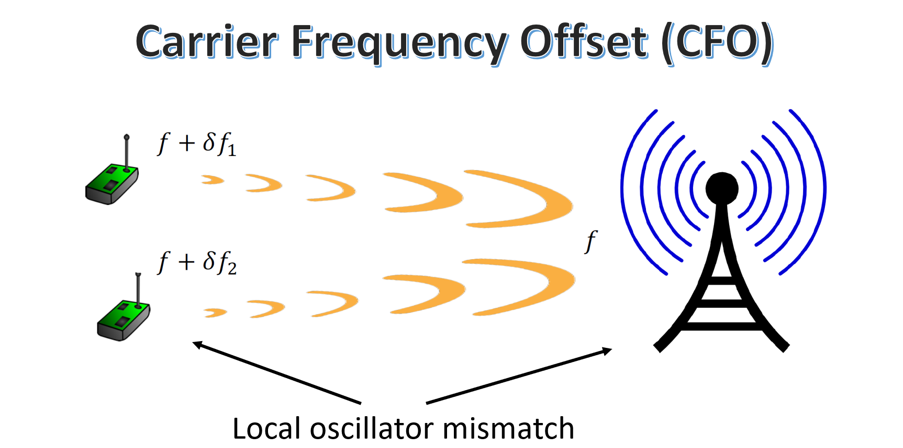
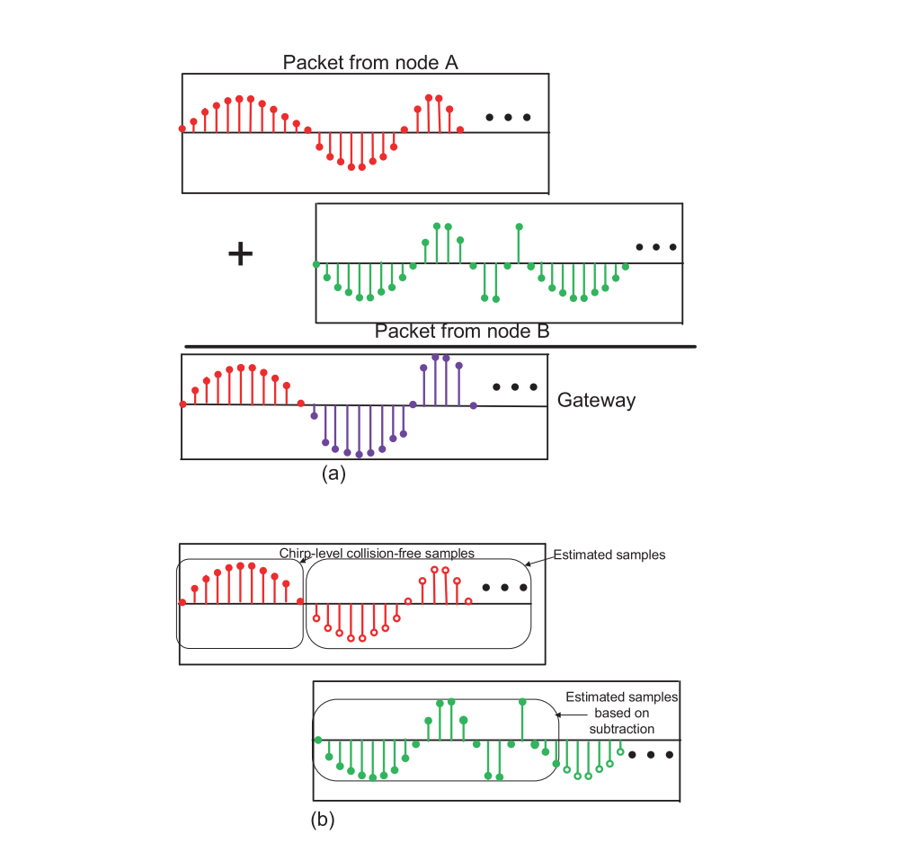
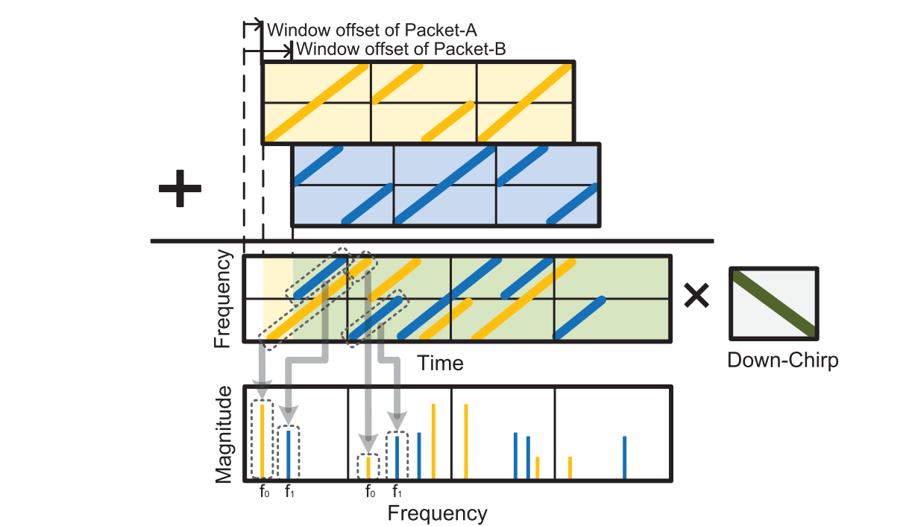
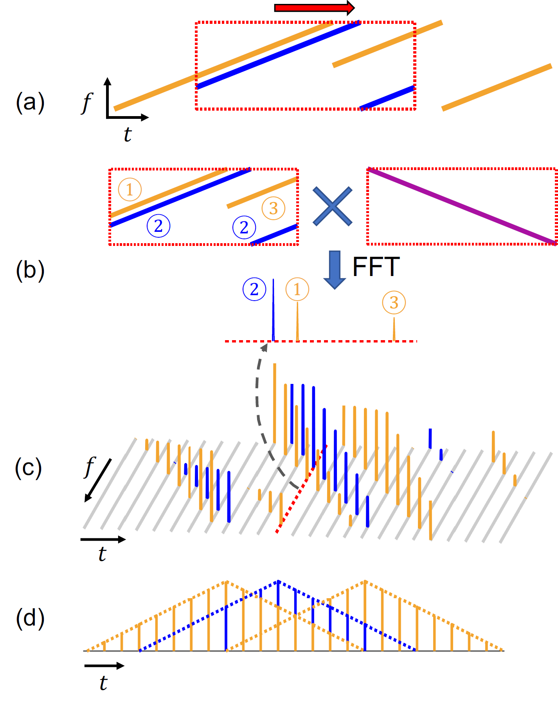

# 并发传输与冲突解码
前面我们介绍过，现有的LoRa网络节点采用Aloha的数据发送方式，那么很明显会带来一个问题，数据之间可能会产生冲突。这个冲突会有多严重，会如何影响网络的性能呢？

让我们首先思考这样一个问题：现有的LoRa网络是否有能力为大规模泛在物联网提供可靠的连接保障？在Mobicom’19的一篇文章中[1]，研究者们对此给出了一个否定的回答。在这篇文章中，研究者们提出了一项名为bitflux的指标，用于描述单位面积内应用运行所需要的网络吞吐量。基于这一指标，研究者们计算了Zebranet、GreenOrbs等典型物联网系统的网络需求，并将该需求与现有LoRa网络的连接能力进行比较，最终得出“现有LoRa技术无法完全满足大规模物联网系统连接需求”这一结论。由此可以看出，提升的网络容量、使系统支持更高的并发度是LoRa技术迈向实际应用的必由之路。

图. LoRa信号冲突示意

那如何提升网络容量呢？事实上，由于LoRa远距离的传输特性和星形的网络拓扑，单个LoRa网关通常需要在几平方公里的覆盖范围内连接的数以千计的物联网节点。如此大规模的连接使LoRa网络中普遍存在严重的数据包冲突。一方面，数据包冲突造成数据损坏和丢包，浪费了宝贵的信道资源；另一方面，由冲突导致的数据重传极大消耗了节点的电量，从而严重影响低功耗物联网节点的使用寿命。因此，妥善解决LoRa网络中的数据包冲突问题，将极大地改善LoRa网络的传输性能，从而使LoRa能够满足绝大多数物联网应用的连接需求。

在无线网络中，解决数据包冲突的策略无外乎两类：一类是冲突避免，即通过调度算法避免多个节点在同一时刻占用同一信道；另一类是冲突消除，即在冲突发生后，根据信号的时域或频域特征，对冲突的数据包信号进行分离和恢复。

传统的无线网络协议，如802.11通常采用冲突避免策略，即令节点在传输信号之前先对信道进行侦听，当检测到信道占用时进行随机回退。但对LoRa节点而言，由于LoRa信号传输距离远、网络覆盖规模大，节点很难做到可靠的信道状态监听，另外采用载波侦听等协议在非常低信噪比的LoRa信号中很难实现，传统的载波侦听可以基于信号强度，但是在LoRa中信号强度可能会在噪声以下，这样很难检测到信号，从而很难进行冲突避免。另一方面，信道监听也加剧了节点的能量消耗，从而缩短LoRa节点的工作寿命。为了解决以上挑战，南洋理工大学的学者提出了LMAC[2]协议，借助LoRa芯片的信道活动侦听（Channel Activity Detection，CAD）模块，配合LoRa网关，实现对信道状态的分布式侦听。LMAC是首个应用在LoRa网络中的CSMA协议，发现了LoRa的CAD模块能以极低的能耗开销对信道中LoRa信号进行检测，并设计了由网关维护全局信道状态表。实验表明，借助LMAC，LoRa可以将的实际网络吞吐率可提升近2.2倍，极大地改善了LoRa的连接性能。
实际上由于LoRa节点的通信距离覆盖较大，节点部署可能比较密集，使用CSMA/CA协议等可能会很大程度降低网络效率，大家可以在理论的角度试着计算一下。另外其中隐藏终端和暴露终端的影响可能会进一步降低性能。

另一类解决LoRa数据包冲突的方法是通过冲突消除技术分离并还原各个冲突LoRa数据包的内容。基于这一思路，研究者们提出了多种不同的冲突解码方法，例如Choir[3]利用了不同硬件的频率偏移特征来分离数据包。

图. Choir利用硬件频率偏移分离冲突信号

在解调过程中，来自不同节点的数据包信号具有不同的微小频率偏移，可以根据该频率偏移把不同的LoRa编码符号对应到不同的发送节点，从而实现冲突解码。使用Choir解码网络中的冲突信号，最高可以将LoRa的整体网络吞吐量提高6.84倍。

图. Choir利用波峰微小频率差异解冲突

除了利用频域特征区分信号，也有研究者提出借助时域信号特征、根据不同节点数据包信号到达网关的时间差异来分离冲突编码符号。其中mLoRa[4]就是一项利用信号时域特征消除冲突的典型工作。当多个数据包先后抵达网关发生冲突，收到信号最起始的一部分是无冲突且可被正常提取的。利用这一段信号我们可以知道冲突信号中一个正确的符号是什么，进而可以构造出该符号并将其消去。消除该符号后，剩余信号中又可以得到一段非冲突信号，因此可以依次迭代以上的操作，直至将所有的冲突数据包全部分离出来。

图. mLoRa冲突解码示意

19年提出的工作FTrack[5]同样利用了数据包到达时间差，不同的是，FTrack直接将信号的频谱特点，并通过频谱图上信号的时间连续性区分属于不同节点的数据包信号。以上几个方法提取不同信号特征，有效提高LoRa网络的实际数据吞吐率。但是这几个方法也有一个共同的缺陷，即他们的实现都要求接收信号具有较高的信噪比（SNR > 0）。如果信噪比较低（SNR < 0），那么无论是找准频率微小偏移、找出一段时域非冲突信号、还是从时频图分离冲突数据包，都会变得非常困难。所以这些方法无法使用在低SNR场景中，当信号比噪声低的场景中无法工作。而在LoRa应用场景中，经常会碰到的场景是信号强度比噪声低。因此，以上几种方法在实际LoRa应用中仍然具有一定的局限性。

图. FTrack冲突解码示意

为了更好地解决LoRa数据包信号冲突问题，我们课题组也做了以下几个工作：

1) 为了实现低信噪比情况下的冲突信号分离，我们提出了CoLoRa[6]——一种基于频域波峰比值分离冲突信号的方法。具体来说，为了分离冲突信号，我们在接收端使用一组与冲突数据包不对齐的接收窗口，使冲突信号中的每一个编码符号恰被两个相邻的接收窗口分为两段。然后我们对各接收窗口内的信号进行常规解调，并通过傅里叶变换将每一编码符号变换为两个相邻接收窗口中的能量波峰。由于傅里叶变换特点，上述操作得到的频域波峰高度应与编码符号在窗口内的持续长度成正比。因此对每一编码符号我们提取其两个频域波峰的高度比作为该符号的特征值，此高度比由编码符号与接收窗口之间的时间差决定，且属于同一数据包的编码符号高度比都相同，而不同数据包符号的高度比存在明显差异。基于此，我们可以使用波峰高度比对冲突信号进行聚类和分离，实现冲突解码的目标。在上述解码过程中，我们充分发挥了LoRa解调带来的能量集中特性，将难以测量的时域特征变换为稳定的频域波峰特征，因此上述方法在信噪比极低的情况下仍可正常分离冲突的LoRa信号。

图. CoLoRa冲突解码示意

2) 为了进一步提高LoRa接收端的冲突解码能力，放松接收窗口的选择限制，我们提出了NScale冲突解码协议[7]，旨在令LoRa接收端使用任意接收窗口分离并解码冲突数据包。NScale充分考虑了信号的能量分布特征，属于不同数据包的编码符号在接收窗口中具有不同的能量分布区间。因此，我们在进行解调操作前，对窗口内信号的振幅进行非均匀缩放，然后根据缩放前后各信号段的波峰高度变化情况确定信号段在窗口内的分布特征，最后根据不同数据包信号到达时间的特异性完成冲突分离和解码。图13-1展示了NScale的核心思想。

图. NScale冲突解码示意

3）上述冲突解码工作都基于对收到的信号进行离线分析，因此无法做到实时冲突解码。为此我们提出了Pyramid[8]——一个能够实时实现冲突解码的流式算法模型。Pyramid同样利用了到达时间差和信号强度，其核心是以更细的粒度对信号进行标准LoRa解码操作，但是在记录数据的时候，会把所有的波峰记录下来。理论上，波峰的高度与窗口内的信号长度成正比，若我们可以连续地对信号做操作，那对应峰的高度轨迹会是一个三角形。冲突信号里众多三角形仿佛“金字塔”般重叠排列在一起，同属于一个数据包的“金字塔”会等间隔分布开，而塔顶间距恰好是一个符号长度。将这些塔顶分门别类就完成了冲突分离。该方案无需对数据包进行特殊的对齐，因而可以进行简单的“重复操作”。Pyramid的代码实现已开源在[https://github.com/jkadbear/gr-lora](https://github.com/jkadbear/gr-lora)。

现有研究工作在冲突避免和冲突消除方面的努力，使LoRa网关在不增加额外硬件配置的情况下，并发接收数据的能力提高了十几乃至几十倍，从而极大提高了网络的实际吞吐率，为连接更大规模的物联网系统提供了可能性。

图. Pyramid冲突解码示意

## 参考文献
1. Ghena B, Adkins J, Shangguan L, et al. Challenge: Unlicensed lpwans are not yet the path to ubiquitous connectivity. The 25th Annual International Conference on Mobile Computing and Networking. 2019: 1-12.

2. Gamage A, Liando J C, Gu C, et al. LMAC: Efficient carrier-sense multiple access for LoRa. Proceedings of ACM MobiCom. 2020: 1-13.

3. Eletreby R, Zhang D, Kumar S, et al. Empowering low-power wide area networks in urban settings. Proceedings of ACM SIGCOMM. 2017: 309-321.

4. Wang X, Kong L, He L, et al. MLoRa: A multi-packet reception protocol in LoRa networks. IEEE 27th IEEE ICNP. 2019: 1-11.

5. Xia X, Zheng Y, Gu T. FTrack: Parallel decoding for LoRa transmissions. Proceedings of ACM SenSys. 2019: 192-204.

6. Tong S, Xu Z, Wang J. CoLoRa: Enabling Multi-Packet Reception in LoRa. Proceedings of IEEE INFOCOM. 2020: 2303-2311.

7. Tong S, Wang J, Liu Y. Combating packet collisions using non-stationary signal scaling in LPWANs. Proceedings of Proceedings of ACM MobiSys. 2020: 234-246.

8. Xu, Zhenqiang and Xie, Pengjin and Wang, Jiliang.Pyramid: Real-Time LoRa Collision Decoding with Peak Tracking. Proceedings of IEEE INFOCOM. 2021.
