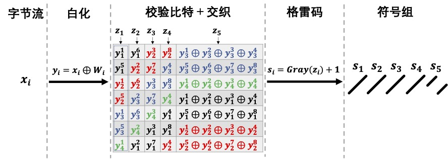
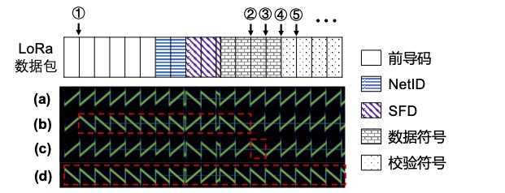

# 弱信号解码

LPWAN设备可以部署在各种环境中，例如高楼林立的城市地区、物品繁杂的室内环境和极为封闭的地下空间。
在这些环境中，严重的遮挡、多径效应和干扰并不少见。
因此 LPWAN 设备的链路质量可能较低，甚至与网关断开连接，出现不可预测的网络覆盖盲区。
一个直接的解决方法是部署更多网关来提高覆盖范围。
然而，由于环境的复杂多变，添加网关成本高且难度大。
我们介绍一种可以实现弱链路通信并提高商业LoRa网络实际覆盖范围的新方法，方法的名字叫做Ostinato[?]。
与以往的方法不同，Ostinato直接工作在单个LoRa节点和单个LoRa网关上，无需其他节点或网关的协作。
Ostinato的主要思想是将原始的LoRa数据包转换为具有重复符号模式的伪数据包，然后在接收端聚集多个符号的能量以增强抗干扰能力。该方法无需任何硬件修改即可工作在商用LoRa节点上。
通过调整能量聚集的重复符号数，方法可以适应不同环境下不同级别的弱链路。

## 弱信号解码方法设计

为了将此思想应用于真实的LoRa网络，我们解决了Ostinato设计中的以下关键挑战：

### 重复符号生成
第一步是将原始数据包转换为具有重复符号的伪数据包。
挑战在于如何在商业 LoRa 设备上解决以下几个问题：

（1）如何指定商业LoRa设备的发送字节序列以使数据段chirp符号出现重复；

（2）部分符号与其他符号相关且不能完全控制，例如奇偶校验位所在符号；

（3）部分符号无法控制，例如无论输入数据如何，起始帧定界符（SFD）对于任何数据包都是固定的。

为此，我们需要依赖LoRa物理层的逆向工程结果以获得精确生成的重复符号。
对于其他符号，例如奇偶校验符号，需要推断它们的位置并避免在创建重复符号时使用它们。
对于无法控制的SFD符号，我们利用数据段中的符号生成具有重复性质的虚拟SFD以进行数据包同步。

### 符号能量聚集。
接收端需要在弱链路下进行数据包的检测、同步和解码，关键是如何利用LoRa符号的特性以有效地从多个重复符号中聚集能量。
Ostinato的直观想法是在de-chirp中使用多个down-chirp将重复的up-chirp符号转换为更长的单频信号，集中更多符号的能量来获得频域中的更高峰值。
但我们发现这些重复的chirp符号之间存在不可忽略的相位偏移，这会导致无法有效地集中多个chirp符号的能量。
因此在该方法提出了一种混合解调技术，可以自适应地在符号上应用相干和非相干解调，以较小的计算开销显著提高了接收灵敏度。

通过解决重复符号生成和符号能量聚集这两个挑战，Ostinato可以工作在单个LoRa节点和单个LoRa网关上支持弱链路通信。
在软件无线电网关上实现了Ostinato，可以提供弱链路数据包的实时解码能力，不依赖多个节点或网关的协作。
实验结果表明，Ostinato在接收灵敏度方面比LoRa提高了$8.5$dB，在覆盖范围方面是LoRa的$2.88$倍。

## 伪数据包生成

一个Ostinato数据符号由$K$个chirp符号组成。
为了生成伪数据包，需要一个chirp符号在商业LoRa设备上重复发送$K$次。
我们需要基于LoRa物理层的结果来控制输入数据比特以生成所需的符号重复模式。
下面我们细致地回顾LoRa编码过程以查看能达到的控制粒度。

上图展示了参数为 SF7 和 CR $=\frac{4}{5}$ 的 LoRa 编码过程，从左到右原始数据字节流逐步转换为chirp符号。
$x_i = x_i^8x_i^7x_i^6x_i^5x_i^4x_i^3x_i^2x_i^1 (i=1, 2, \cdots)$ 表示第$i$个输入数据字节，其中 $x_i^j$ 表示 $x_i$ 的第 $j$ 位（$x_i^1$ 是LSB）。
编码过程的第一步是白化，其目的是通过对原始数据字节$x_i$与预定义的白化字节$W_i$进行异或来添加随机性，$y_i = x_i \oplus W_i$代表白化后的字节。
接下来是添加校验比特，在我们的示例中，编码率为$\frac{4}{5}$，所以仅附加了一个奇偶校验位。
图中蓝色的第三个字节$y_3$被分为高四位和低四位两部分，LoRa编码器分别计算它们的校验位，即$y_3^1\oplus y_3^2\oplus y_3^3\oplus y_3^4$和$y_3^5\oplus y_3^6\oplus y_3^7\oplus y_3^8$。
一个LoRa符号携带SF位，而现在码字长度为 $\frac{4}{CR}=5$ 位。
因此LoRa将对角线交织应用于当前码字，如图中间部分所示。
于是我们得到每个元素大小为$7$比特的序列$\{z_1 = y_4^1y_3^5y_3^1y_2^5y_2^1y_1^5y_1^1, z_2, z_3, z_4, z_5\}$表示应用奇偶校验和交织后的值。
在最后一步格雷码之后，输出直接决定chirp符号起始频率的值$s_i$，例如$0$表示基准up-chirp。
在我们的例子中，五个符号含有$5\times \text{SF} = 35$位，对应于添加校验码之前的$35\times \frac{4}{5} = 3.5$字节。
可以发现，数据位和奇偶校验位以块的形式组织，$s_1, s_2, s_3, s_4$ 对应数据位，而 $s_5$ 对应奇偶校验位。
因此，$s_1, s_2, s_3, s_4$ 可以通过修改输入数据进行完全的控制，可用于构建重复符号。
若要求 $s_1 = s_2 = s_3 = s_4 = s$， 只需反转图中的过程便能获得使LoRa芯片发送伪数据包所需的字节 $x_i$。

与数据部分类似，Ostinato的前导码和SFD也需要含有重复的chirp符号以便在低SNR下进行数据包检测和高精度同步。
因为前导码本身就是重复的基准up-chirp的集合，所以Ostinato前导码相对容易创建。
我们只需将前导码长度从$N_p$扩展到 $K\cdot N_p$ 即可，其中 $N_p$ 是原始 LoRa 中前导码符号的数量。
这种扩展可以通过改变 LoRa 驱动程序中的前导码长度参数来实现。

LoRa主要利用前导码中的基准up-chirp符号和SFD中的基准down-chirp符号进行同步。
类似地，如果Ostinato有 $K\cdot N_p$ 个基准down-chirp，也可以实现up-down同步。
在原始的 LoRa 中，SFD 只有 $2.25$ 个基准down-chirp，小于重复倍率为 $K$（若 $K>2$）的Ostinato数据包同步所需的基准down-chirp数量。
然而无论发送的数据如何变化，SFD 部分都是固定的，无法从一个合法的LoRa数据包中直接得到$K\cdot N_p$ 个基准down-chirp。
由于 LoRa 芯片不支持 SFD 调整，我们提出一种利用数据段符号扩展 SFD 的方法。
它包括两个步骤：
（1）由于所有的数据符号都是up-chirp，需要将部分up-chirp转换为down-chirp；
（2）需要生成连续且相同的$K$个数据符号。

第一步，我们利用商业 LoRa芯片的 IQ 翻转功能。
LoRa 芯片通过设置寄存器 RegInvertIQ (0x33) 来支持数据包级别的 IQ 翻转机制，它可以将所有up-chirp符号翻转为down-chirp信号，反之亦然。
图中(a)所示是一个通常的LoRa数据包在时频域上的图像，(d)所示是(a)中数据包的 IQ 翻转版本。
仅仅把整个数据包进行翻转创造出down-chirp是不够的，不能满足伪数据包生成的要求。
幸运的是，我们发现 LoRa 支持符号级别的跳频（Frequency Hopping, FH）功能。
跳频功能以跳频中断函数作为接口，经实验测试，得到中断函数的调用位置为图中的①②③④⑤$\cdots$。
这些位置都在符号的交界之处，如果在这些位置中断函数内部修改了寄存器RegFrMsb(0x06)、RegFrMid(0x07)和RegFrLsb(0x08)，就会影响后续chirp符号发送所用的载波频率。
由于跳频中断的粒度达到了符号级别，这意味着我们可以实现数据包内符号级别的跳频。
在Ostinato中，我们利用中断函数修改RegInvertIQ(0x33)来实现符号级别的chirp翻转。
(b) 和 (c) 分别显示了在 ① 和 ② 处触发翻转后所发出的数据包。
通过在 ②③④⑤$\cdots$ 处应用 IQ 翻转，我们可以从原始LoRa数据包中的第三个数据符号开始构造所需的down-chirp符号。

第二步，我们尝试利用奇偶校验位来生成更多的连续符号。
由于校验位不能被任意控制，修改数据位最多提供四个连续的相同数据符号。
仔细观察编码过程后，我们发现有机会将奇偶校验符号设置为与数据符号相同。
如果数据字节与白化字节相同，则异或结果将全为零，全零序列作为海明码和交织的输入仍旧得到全零序列（奇偶校验位也全是零），因此格雷码的输出将是相同的符号。
举例来说，如果我们设置发送参数为implicit模式、关闭CRC，待发送的数据为白化序列，那么商业LoRa设备发出的信号的数据段将全是编码了“$1$”的chirp符号。
基于上面的方法可以有效利用奇偶校验位来辅助构造 $K$ 个连续重复的基准down-chirp符号，也即Ostinato的SFD。

## 符号能量聚集

为了正确检测前导码并解调数据符号，我们需要聚集多个重复符号的能量来获得更高的 FFT 峰值。
在介绍混合解调之前，我们首先说明为什么相干和非相干解调不适合重复符号的能量聚集。

相干解调：
LoRa 通过 de-chirp 处理单个符号，它首先将符号乘以基准down-chirp，然后应用 FFT 得到表示起始频率的峰值 bin。
Ostinato数据包的直观解调方法是将 de-chirp 操作扩展到 $K$ 个 down-chirp。
如图上方所示，一个$K=4$的Ostinato符号在采样率$f_s=B$下与连续$4$个基准down-chirp相乘，再对每段分别做FFT得到表示第 $i$ 个符号的 FFT 输出$R_i(i=1,2,3,4)$，最后在复数域上将所有的$R_i$相加可得Ostinato符号的de-chirp结果
$$
     R^{c} = \sum_{i=1}^{K}R_i
$$
我们想要的是峰值位置，即 $\arg\max_{index} |R^c|$。
然而，我们观察到由于相位的不连续性，接收信号中的能量无法有效聚集。
具有不同相位偏移的chirp段会相互干扰并导致 FFT 峰值失真，这可能导致峰值低于噪声。

非相干解调：
克服相位偏差的最佳方法是在相干解调之前对其进行估计和补偿。
然而，Ostinato通常用于低质量的链路，在低 SNR 下准确估计相位偏差是困难的。
另一种方法是遍历从 $0$ 到 $2\pi$ 的可能的相位偏差，然后选择最高能量的峰值作为结果。
这种方法会带来很大的开销，尤其是当 $K$ 很大的时候。
因此，更好的方法是将每段的 FFT 结果的幅度相加，以非相干的方式聚集来自不同chirp段的能量。
非相干解调意味着在忽略相位的同时聚集符号能量。
为了进行非相干解调，我们首先需要将信号上采样到 $2B$ 采样率，将不同相位的信号分离到频域中的不同峰值，如图中间所示。
然后我们将信号与 $2B$ 采样率的down-chirp相乘。
上采样把 FFT 结果的频率范围扩展到了 $[0,2B)$。
非相干方式聚集所有重复符号的能量可表示为
$$
     R^{nc} = \sum_{i=1}^{K}(|R_{i,1}|+|R_{i,2}|)
$$
其中 $R_{i,1}$($R_{i,2}$) 是第 $i$ 个符号的 FFT 结果的左（右）半部分。
图中红色和绿色峰的距离固定为 $B$。
当我们累加 FFT 结果的幅度时，峰值不会失真。
解调后的输出为$\arg\max_{index} |R^{nc}|$。

混合解调：
非相干解调的问题在于它会将不同chirp段噪声的能量也聚集起来。
而在相干解调中，由于噪声相位是随机的，尽管噪声能量也会聚集，但其聚集程度是小于非相干解调的。
换句话说，非相干解调带来了一定的SNR损失。
为了减少损失，我们提出一种混合解调方法。
基本思想是（1）对于没有相位偏移的chirp段，我们相干地聚合它们以减少噪声总和，以及（2）对于具有未知和不可预测的相位偏差的段，我们以非相干方式聚合它们以减小计算开销。
例如，在前述图中，因为第一个符号的绿色部分与第二个符号的红色部分在时间上的连续性，它们组成了一个完整的基准up-chirp，所以这两个部分之间没有相位偏差，应该使用相干叠加。
为了聚集所有的连续符号段，我们使用比 $2B$ 带宽的更大的down-chirp组来进行de-chirp，并将解调窗口长度扩展到覆盖两个符号的 $2T$。
将两个连续的重复符号与down-chirp组的对应部分相乘将得到三个间隔 $B$ 的峰值。
如前述图底部所示，为了避免这些峰值混叠，我们还需要将信号上采样到 $4B$。
混合解调过程可表示为
$$
     R^{hb} = |R_{1\sim 2,1}| + \sum_{i=1}^{K-1}|R_{i\sim i+1,3}| + |R_{K-1\sim K,2}|
$$
其中 $R_{i\sim i+1,j}$ 是对第 $i$ 和 $i+1$ 个符号de-chirp后的第 $j$ 个部分。
混合解调可以避免相位不连续的影响，有效地集中所有重复符号的能量，且比非相干解调方法聚集更少的噪声。
Ostinato接收机采用混合解调方法。

Ostinato相较于原始LoRa的解调增益可以用如下的符号信噪比进行粗略估计：
$$
    \frac{E_S}{N_0} = \frac{S}{N}\cdot \frac{T_S}{T_{Samp}}
$$
其中 $\frac{S}{N}$ 是时域上的信噪比，$T_S$ 是chirp符号持续时间，$T_{Samp}$ 是采样间隔。
从上式可知，$K$ 每增加一倍则 $T_S$ 也增加一倍，意味着$\frac{E_S}{N_0}$ 提升了 $10\log_{10}(2) = 3$ dB。
该增益是理想情况下的最大增益，在实际部署中通常略小于该值，实验结果还显示对于不同的SF，Ostinato带来的增益也略有不同。

## 检测与同步
Ostinato接收机的第一步是检测前导码，即检测弱信号数据包的存在。
正常 LoRa 的前导码检测使用长度为 $T$ 的 de-chirp 窗口，并以步长 $T$ 移动窗口。
如果存在一个带有 $N_p$ 个前导码符号的 LoRa 数据包，应能从 $N_p$ 个连续的de-chirp窗口观察到至少 $N_p - 1$ 个相同频率点的峰值。
我们将窗口长度和步长扩展到 $KT$ 以进行Ostinato前导码检测。
每个窗口内都会使用混合解调的方法提取波峰。
对于一个有$KN_p$个chirp符号作为前导码的数据包，当窗口没有对准前导码的开始位置时，总共有$N_p+1$个窗口覆盖了该前导码。
然而由于未对准，第一个和最后一个窗口中的up-chirp数目少于 $K$。
所以当我们观察到至少 $N_p-1$ 个连续峰值时，表明存在一个Ostinato数据包。

同步的目的是找到数据符号的确切开始时间。
当检测过程结束时，窗口的停止位置通常不会与前导码的结尾对齐。
我们利用OstinatoSFD 中的 $K$ 个 down-chirp 进行同步。
在应用如上图所示的up-down对齐之前，因为Ostinato中可能的窗口偏移（$KT$）比原始LoRa大 ($T$)，所以有必要估计目标的范围。
我们将前导码的结束时间戳记为坐标原点 $0$。
如图中(a)所示，检测过程会在检测窗口$w_{i+1}$处停止，因为$w_{i+1}$中的前导码部分比 $KT$ 小很多，在SNR较小时不能产生显著的峰值。
检测窗口 $w_{i+1}$ 的开始时间戳记为 $t_0$。
$D1$ 代表前两个不能单独翻转的数据符号。
$D2$ 表示包含OstinatoSFD 的其余数据符号。
(b)显示了另一种情况，即 $w_{i}$ 中的前导码部分足够大，在混合解调时可以捕捉到波峰。
Ostinato接收机可以检测到 $w_{i}$ 中的峰值，但无法在 $w_{i+1}$ 检测到前导码对应波峰。
这两种情况表明，如果 $w_{i}$ 或 $w_{i+1}$ 仅包含前导码的一部分，则检测会在 $t_0$ 处停止。
因此，我们有
$$
    t_0 - KT \leq 0 \leq t_0 + KT
$$

Ostinato的 SFD 从 $D2$ 开始，这意味着目标时间戳是 $t_{target} = 6.25 T$。
当检测过程停止时，解调窗口停止在 $t_0$。
$t_{target}$ 相对于 $t_0$ 的范围可以估计为
$$
    t_0 - KT + 6.25T \leq t_{target}\leq t_0 + KT + 6.25T
$$
因此，给定可能的范围 $[t_0 - KT + 6.25T, t_0 + KT + 6.25T]$，我们以 $T$ 为步长搜索 $2K+1$ 个窗口。
覆盖OstinatoSFD 中所有 $K$ 个down-chirp的窗口将得到最高的波峰。
然后我们可以使用Ostinato版本的 up-down 同步方法来找到准确的$t_{target}$。

## 参考文献
1. Z. Xu, P. Xie, J. Wang and Y. Liu, "Ostinato: Combating LoRa Weak Links in Real Deployments," 2022 IEEE 30th International Conference on Network Protocols (ICNP), Lexington, KY, USA, 2022, pp. 1-11, doi: 10.1109/ICNP55882.2022.9940369.
